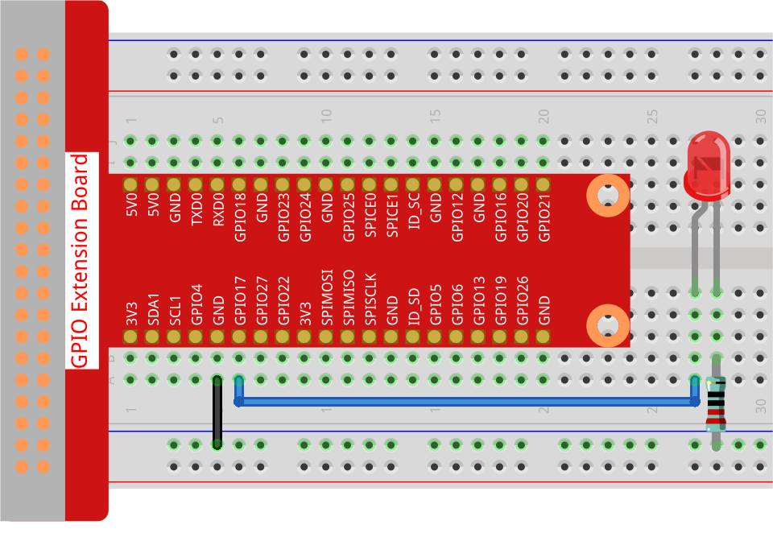

.. note::

    Hello, welcome to the SunFounder Raspberry Pi & Arduino & ESP32 Enthusiasts Community on Facebook! Dive deeper into Raspberry Pi, Arduino, and ESP32 with fellow enthusiasts.

    **Why Join?**

    - **Expert Support**: Solve post-sale issues and technical challenges with help from our community and team.
    - **Learn & Share**: Exchange tips and tutorials to enhance your skills.
    - **Exclusive Previews**: Get early access to new product announcements and sneak peeks.
    - **Special Discounts**: Enjoy exclusive discounts on our newest products.
    - **Festive Promotions and Giveaways**: Take part in giveaways and holiday promotions.

    👉 Ready to explore and create with us? Click [|link_sf_facebook|] and join today!

.. _1.1.1_py_pi5:

1.1.1 Blinking LED
=========================

Introduction
-----------------

In this project, we will learn how to make a blinking LED by programming.
Through your settings, your LED can produce a series of interesting
phenomena. Now, go for it.

Required Components
------------------------------

In this project, we need the following components. 

.. image:: ../python_pi5/img/1.1.1_blinking_led_list.png
    :width: 800
    :align: center

.. raw:: html

    

Schematic Diagram
---------------------

In this experiment, we connect the Raspberry Pi's GPIO pin 17 to the anode (long pin) of the LED, then the cathode (short pin) of the LED to a resistor, and then connect the other end of the resistor to the GND pin on the Raspberry Pi. To switch on the LED we need to set GPIO17 to high (3.3V). We can get this phenomenon by programming.

.. note::

    **Pin11** refers to the 11th pin of the Raspberry Pi from left to right, and its corresponding **BCM** pin numbers are shown in the following table.

Among the Python language related content, BCM 17 is 17 in the
BCM column of the following table. At the same time, they are the same
as the 11th pin on the Raspberry Pi, Pin 11.

============ ======== ===
T-Board Name physical BCM
GPIO17       Pin 11   17
============ ======== ===

.. image:: ../python_pi5/img/1.1.1_blinking_led_schematic.png
    :width: 800
    :align: center

Experimental Procedures
-----------------------------

**Step 1:** Build the circuit.

**Step 2:** Go to the folder of the code and run it.

1. If you use a screen, you're recommended to take the following steps.

Find `1.1.1_BlinkingLed.py` and double click it to open. Now you're in the
file.

Click **Run** ->\ **Run Module** in the window and the following
contents will appear.

To stop it from running, just click the X button on the top right to
close it and then you'll back to the code. If you modify the code,
before clicking **Run Module (F5)** you need to save it first. Then you
can see the results.

2. If you log into the Raspberry Pi remotely, type in the command:

.. raw:: html

   <run></run>

.. code-block::

   cd ~/davinci-kit-for-raspberry-pi/python-pi5

.. note::
    Change directory to the path of the code in this experiment via ``cd``.

**Step 3:** Run the code

.. raw:: html

   <run></run>

.. code-block::

   sudo python3 1.1.1_BlinkingLed.py

.. note::
    Here sudo - superuser do, and python means to run the file by Python.

After the code runs, you will see the LED flashing.

**Step 4:** If you want to edit the code file `1.1.1_BlinkingLed.py`,
press ``Ctrl + C`` to stop running the code. Then type the following
command to open `1.1.1_BlinkingLed.py`:

.. raw:: html

   <run></run>

.. code-block::

   nano 1.1.1_BlinkingLed.py

.. note::
    nano is a text editor tool. The command is used to open the
    code file `1.1.1_BlinkingLed.py` by this tool.

Press ``Ctrl+X`` to exit. If you have modified the code, there will be a
prompt asking whether to save the changes or not. Type in ``Y`` (save)
or ``N`` (don’t save).

Then press ``Enter`` to exit. Type in nano `1.1.1_BlinkingLed.py` again to
see the effect after the change.

.. warning::

    If there is an error prompt  ``RuntimeError: Cannot determine SOC peripheral base address``, please refer to :ref:`faq_soc` 

**Code**

The following is the program code:

.. note::

   You can **Modify/Reset/Copy/Run/Stop** the code below. But before that, you need to go to  source code path like ``davinci-kit-for-raspberry-pi/python-pi5``. After modifying the code, you can run it directly to see the effect.

.. raw:: html

    <run></run>

.. code-block:: python

   #!/usr/bin/env python3
   from gpiozero import LED
   from time import sleep

   # Initialize an LED connected to GPIO pin 17 using the GPIO Zero library.
   led = LED(17)

   try:
      # Start an infinite loop to toggle the LED state.
      while True:
         # Turn on the LED and print a message to the console.
         led.on()
         print('...LED ON')

         # Wait for 0.5 seconds with the LED on.
         sleep(0.5)

         # Turn off the LED and print a message to the console.
         led.off()
         print('LED OFF...')

         # Wait for 0.5 seconds with the LED off.
         sleep(0.5)

   except KeyboardInterrupt:
      # Gracefully handle a keyboard interrupt (Ctrl+C) by breaking the loop.
      # GPIO Zero handles cleanup of GPIO settings automatically on exit.
      pass

**Code Explanation**

#. When the system detects this, it will search the installation path of python in the env setting, then call the corresponding interpreter to complete the operation. It’s to prevent the user not installing the python onto the ``/usr/bin`` default path.

   .. code-block:: python

       #!/usr/bin/env python3

#. These lines import the necessary classes and functions. ``LED`` from ``gpiozero`` for LED control and ``sleep`` from ``time`` for delays.

   .. code-block:: python

       from gpiozero import LED
       from time import sleep

#. This line creates an LED object connected to GPIO pin 17. 

   .. code-block:: python

       # Initialize an LED connected to GPIO pin 17 using the GPIO Zero library.
       led = LED(17)

#. An infinite loop is started using ``while True:``.Inside the loop, the LED is turned on (``led.on()``) and a message is printed. The program then pauses for 0.5 seconds (``sleep(0.5)``). After that, the LED is turned off (``led.off()``), another message is printed, and the program pauses again for 0.5 seconds.

   .. code-block:: python

       try:
           # Start an infinite loop to toggle the LED state.
           while True:
               # Turn on the LED and print a message to the console.
               led.on()
               print('...LED ON')

               # Wait for 0.5 seconds with the LED on.
               sleep(0.5)

               # Turn off the LED and print a message to the console.
               led.off()
               print('LED OFF...')

               # Wait for 0.5 seconds with the LED off.
               sleep(0.5)

#. The ``except`` block catches a ``KeyboardInterrupt`` (like pressing Ctrl+C) and safely exits the loop. The ``pass`` statement is used here as a placeholder to indicate that no specific action is taken upon interruption.

   .. code-block:: python

       except KeyboardInterrupt:
           # Gracefully handle a keyboard interrupt (Ctrl+C) by breaking the loop.
           # GPIO Zero handles cleanup of GPIO settings automatically on exit.
           pass

