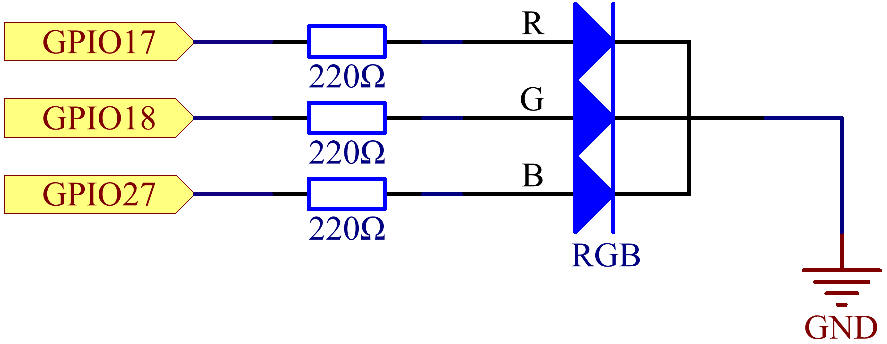
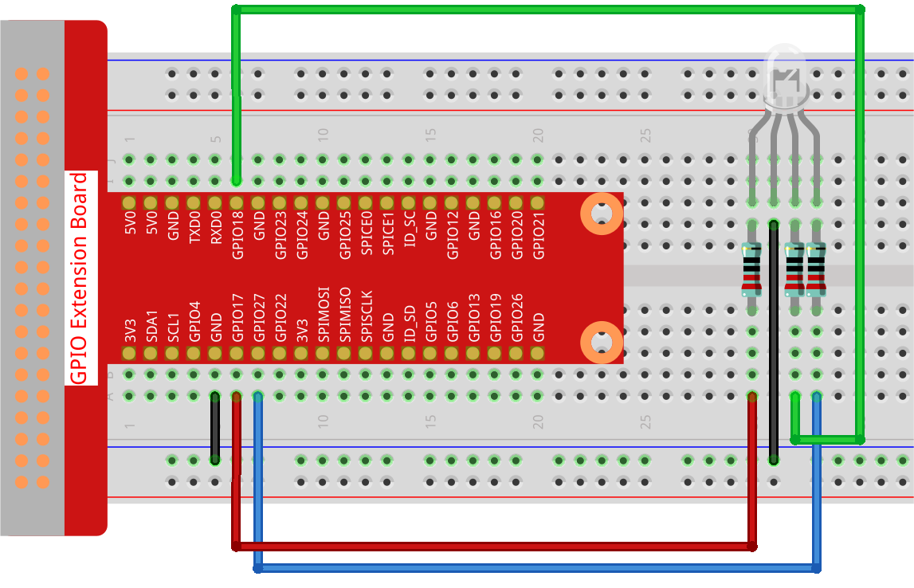

.. _1.1.2_py_pi5:

1.1.2 RGB LED
====================

Introduction
--------------

In this project, we will control an RGB LED to flash various colors.

Required Components
------------------------------

In this project, we need the following components. 

.. image:: ../python_pi5/img/1.1.2_rgb_led_list.png
    :align: center

.. raw:: html

    

Schematic Diagram
-----------------------

After connecting the pins of R, G, and B to a current limiting resistor, connect them to the GPIO17, GPIO18, and GPIO27 respectively. The longest pin (GND) of the LED connects to the GND of the Raspberry Pi. When the three pins are given different PWM values, the RGB LED will display different colors.

============ ======== ===
T-Board Name physical BCM
GPIO17       Pin 11   17
GPIO18       Pin 12   18
GPIO27       Pin 13   27
============ ======== ===

Experimental Procedures
----------------------------

**Step 1:** Build the circuit.

**Step 2:** Open the code file.

.. raw:: html

   <run></run>

.. code-block::

    cd ~/davinci-kit-for-raspberry-pi/python-pi5

**Step 3:** Run.

.. raw:: html

   <run></run>

.. code-block::

    sudo python3 1.1.2_rgbLed_zero.py

After the code runs, you will see that RGB displays red, green, blue,
yellow, pink, and cyan.

**Code**

.. note::

    You can **Modify/Reset/Copy/Run/Stop** the code below. But before that, you need to go to  source code path like ``davinci-kit-for-raspberry-pi/python-pi5``. After modifying the code, you can run it directly to see the effect.

.. raw:: html

    <run></run>

.. code-block:: python

   #!/usr/bin/env python3
   from gpiozero import RGBLED
   from time import sleep

   # Define a list of colors for the RGB LED in RGB format (Red, Green, Blue).
   # Each color component ranges from 0 (off) to 1 (full intensity).
   COLORS = [(1, 0, 0), (0, 1, 0), (0, 0, 1), (1, 1, 0), (1, 0, 1), (0, 1, 1)]

   # Initialize an RGB LED. Connect the red component to GPIO 17, green to GPIO 18, and blue to GPIO 27.
   rgb_led = RGBLED(red=17, green=18, blue=27)

   try:
       # Continuously cycle through the defined colors.
       while True:
           for color in COLORS:
               # Set the RGB LED to the current color.
               rgb_led.color = color
               # Output the current color to the console.
               print(f"Color set to: {color}")
               # Wait for 1 second before switching to the next color.
               sleep(1)

   except KeyboardInterrupt:
       # Handle a KeyboardInterrupt (Ctrl+C) to exit the loop gracefully.
       # GPIO cleanup will be managed automatically by GPIO Zero on script termination.
       pass

**Code Explanation**

#. This imports the ``RGBLED`` class from the ``gpiozero`` library for controlling an RGB LED, and the ``time`` library for implementing delays in the code.

   .. code-block:: python

       #!/usr/bin/env python3
       from gpiozero import RGBLED
       from time import sleep

       # Define a list of colors for the RGB LED in RGB format (Red, Green, Blue).
       # Each color component ranges from 0 (off) to 1 (full intensity).
    
#. The ``COLORS`` list contains tuples representing different colors in RGB format. By assigning different Pulse Width Modulation (PWM) values to each of the R, G, and B pins through the ``rgb_led.color`` attribute, the LED can produce a variety of colors. The PWM values range from 0 to 1, where 0 represents no intensity (off) and 1 represents full intensity for each color component.
#. For instance, setting ``rgb_led.color = (1, 0, 0)`` turns the LED red, as it sets full intensity for the red component while keeping green and blue off. Similarly, varying combinations of these values result in different colors. This technique of color mixing through PWM allows for the creation of a wide range of colors on the RGB LED.

   .. code-block:: python    
       
       COLORS = [(1, 0, 0), (0, 1, 0), (0, 0, 1), (1, 1, 0), (1, 0, 1), (0, 1, 1)]

#. An RGB LED is initialized with its red, green, and blue components connected to GPIO pins 17, 18, and 27, respectively.

   .. code-block:: python

       # Initialize an RGB LED. Connect the red component to GPIO 17, green to GPIO 18, and blue to GPIO 27.
       rgb_led = RGBLED(red=17, green=18, blue=27)

#. The ``while True:`` loop continuously cycles through the colors defined in ``COLORS``. For each color, ``rgb_led.color = color`` sets the LED to that color, and ``sleep(1)`` pauses for 1 second. 

   .. code-block:: python

       try:
           # Continuously cycle through the defined colors.
           while True:
               for color in COLORS:
                   # Set the RGB LED to the current color.
                   rgb_led.color = color
                   # Output the current color to the console.
                   print(f"Color set to: {color}")
                   # Wait for 1 second before switching to the next color.
                   sleep(1)

#. This section gracefully handles a ``KeyboardInterrupt`` (such as pressing Ctrl+C). The ``pass`` statement is used as a placeholder to indicate no specific action on interruption, as GPIO Zero handles GPIO cleanup automatically.

   .. code-block:: python

       except KeyboardInterrupt:
           # Handle a KeyboardInterrupt (Ctrl+C) to exit the loop gracefully.
           # GPIO cleanup will be managed automatically by GPIO Zero on script termination.
           pass

