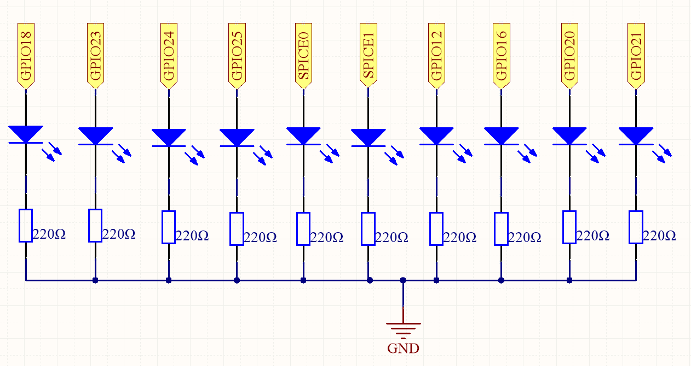
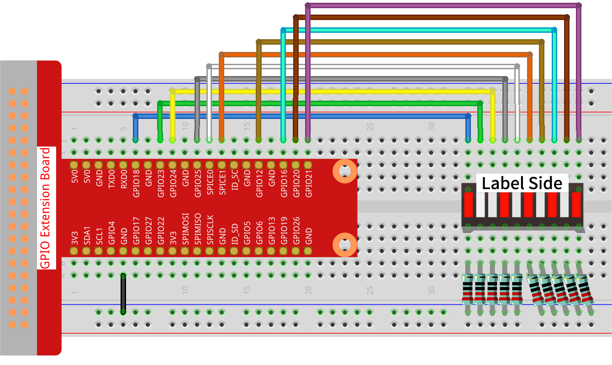

.. note::

    こんにちは、SunFounderのRaspberry Pi & Arduino & ESP32愛好家コミュニティへようこそ！Facebook上でRaspberry Pi、Arduino、ESP32についてもっと深く掘り下げ、他の愛好家と交流しましょう。

    **参加する理由は？**

    - **エキスパートサポート**：コミュニティやチームの助けを借りて、販売後の問題や技術的な課題を解決します。
    - **学び＆共有**：ヒントやチュートリアルを交換してスキルを向上させましょう。
    - **独占的なプレビュー**：新製品の発表や先行プレビューに早期アクセスしましょう。
    - **特別割引**：最新製品の独占割引をお楽しみください。
    - **祭りのプロモーションとギフト**：ギフトや祝日のプロモーションに参加しましょう。

    👉 私たちと一緒に探索し、創造する準備はできていますか？[|link_sf_facebook|]をクリックして今すぐ参加しましょう！

.. _1.1.3_py_pi5:

1.1.3 LED バーグラフ
======================

概要
-------------

このプロジェクトでは、LEDバーグラフ上のライトを順番に点灯させます。

必要なコンポーネント
------------------------------

このプロジェクトには、次のコンポーネントが必要です。 

.. image:: ../python_pi5/img/1.1.3_led_bar_list.png

.. raw:: html

    

回路図
-------------------------

============ ======== ======== ===
T-Board Name physical wiringPi BCM
GPIO18       Pin 12   1        18
GPIO23       Pin 16   4        23
GPIO24       Pin 18   5        24
GPIO25       Pin 22   6        25
SPICE0       Pin 24   10       8
SPICE1       Pin 26   11       7
GPIO12       Pin 32   26       12
GPIO16       Pin 36   27       16
GPIO20       Pin 38   28       22
GPIO21       Pin 40   29       21
============ ======== ======== ===

実験手順
------------------------------

**ステップ1**: 回路を組み立てます。

.. note::

    接続する際に方向に注意してください。逆に接続すると点灯しません。

**ステップ2:** コードのフォルダに移動します。

.. raw:: html

   <run></run>

.. code-block::

    cd ~/davinci-kit-for-raspberry-pi/python-pi5

**ステップ3**: 実行可能ファイルを実行します。

.. raw:: html

   <run></run>

.. code-block::

    sudo python3 1.1.3_LedBarGraph.py

コードを実行した後、LEDバーグラフ上のLEDが定期的に点灯および消灯するのを確認できます。

.. warning::

    エラー メッセージ ``RuntimeError: Cannot determine SOC peripheral base address`` が表示された場合は、 :ref:`faq_soc` を参照してください。

**コード**

.. note::

    以下のコードは **変更/リセット/コピー/実行/停止** することができます。ただし、それを行う前に「davinci-kit-for-raspberry-pi/python-pi5」というソースコードのパスに移動する必要があります。コードを変更した後、そのまま実行して効果を確認できます。

.. raw:: html

    <run></run>

.. code-block:: python

   #!/usr/bin/env python3
   from gpiozero import LED
   from time import sleep

   # LEDが接続されているGPIOピンを定義します
   led_pins = [18, 23, 24, 25, 8, 7, 12, 16, 20, 21]

   # 各ピンに対応するLEDオブジェクトを作成します
   leds = [LED(pin) for pin in led_pins]

   def odd_led_bar_graph():
       # 奇数番目のLED（インデックス0, 2, 4など）を順番に点灯させます。
       for i in range(5):
           j = i * 2  # 奇数のインデックスを計算
           leds[j].on()  # 奇数番目のLEDを点灯
           sleep(0.3)    # 視覚効果のための遅延
           leds[j].off() # LEDを消灯

   def even_led_bar_graph():
       # 偶数番目のLED（インデックス1, 3, 5など）を順番に点灯させます。
       for i in range(5):
           j = i * 2 + 1  # 偶数のインデックスを計算
           leds[j].on()   # 偶数番目のLEDを点灯
           sleep(0.3)     # 視覚効果のための遅延
           leds[j].off()  # LEDを消灯

   def all_led_bar_graph():
       # すべてのLEDを順番に点灯させます
       for led in leds:
           led.on()       # LEDを点灯
           sleep(0.3)     # 視覚効果のための遅延
           led.off()      # LEDを消灯

   def turn_off_all_leds():
       # すべてのLEDを一斉に消灯させます
       for led in leds:
           led.off()

   try:
       # LEDパターンをサイクルするためのメインループ
       while True:
           odd_led_bar_graph()   # 奇数番目のLEDをアクティブに
           sleep(0.3)            # パターン間の一時停止
           even_led_bar_graph()  # 偶数番目のLEDをアクティブに
           sleep(0.3)            # パターン間の一時停止
           all_led_bar_graph()   # すべてのLEDをアクティブに
           sleep(0.3)            # 再起動前の一時停止

   except KeyboardInterrupt:
       # 中断（Ctrl+C）を処理する
       turn_off_all_leds()      # 終了時にすべてのLEDが消灯するようにします
       pass

**コードの説明**

#. これらの行は必要なクラスと関数をインポートします。LED制御のための ``gpiozero`` の ``LED`` および遅延のための ``time`` の ``sleep`` です。

   .. code-block:: python

       #!/usr/bin/env python3
       from gpiozero import LED
       from time import sleep

#. ``led_pins`` リストにはGPIOピン番号が含まれており、 ``leds`` は ``led_pins`` の各ピンに対応する ``LED`` オブジェクトのリストです。

   .. code-block:: python

       # LEDが接続されているGPIOピンを定義します
       led_pins = [18, 23, 24, 25, 8, 7, 12, 16, 20, 21]

       # 各ピンに対応するLEDオブジェクトを作成します
       leds = [LED(pin) for pin in led_pins]

#. LEDバーグラフの奇数番号のLEDを順番に点灯させます。

   .. code-block:: python

       def odd_led_bar_graph():
           # 奇数番号のLED（インデックス0, 2, 4など）を順番に点灯させます
           for i in range(5):
               j = i * 2  # 奇数のインデックスを計算します
               leds[j].on()  # 奇数番号のLEDを点灯させます
               sleep(0.3)    # 視覚的な効果のための遅延
               leds[j].off() # LEDを消灯させます

#. LEDバーグラフの偶数番号のLEDを順番に点灯させます。

   .. code-block:: python

       def even_led_bar_graph():
           # 偶数番号のLED（インデックス1, 3, 5など）を順番に点灯させます
           for i in range(5):
               j = i * 2 + 1  # 偶数のインデックスを計算します
               leds[j].on()   # 偶数番号のLEDを点灯させます
               sleep(0.3)     # 視覚的な効果のための遅延
               leds[j].off()  # LEDを消灯させます

#. LEDバーグラフのLEDを1つずつ順番に点灯させます。

   .. code-block:: python

       def all_led_bar_graph():
           # すべてのLEDを順番に点灯させます
           for led in leds:
               led.on()       # LEDを点灯させます
               sleep(0.3)     # 視覚的な効果のための遅延
               led.off()      # LEDを消灯させます

#.  ``while True`` ループはLEDパターンを連続してサイクルします。 ``except`` ブロックはKeyboardInterrupt（Ctrl+C）を処理し、終了時にすべてのLEDが消灯することを確認します。

   .. code-block:: python

       try:
           # LEDパターンをサイクルするメインループ
           while True:
               odd_led_bar_graph()   # 奇数番号のLEDをアクティブにする
               sleep(0.3)            # パターン間の一時停止
               even_led_bar_graph()  # 偶数番号のLEDをアクティブにする
               sleep(0.3)            # パターン間の一時停止
               all_led_bar_graph()   # すべてのLEDをアクティブにする
               sleep(0.3)            # 再開前の一時停止

       except KeyboardInterrupt:
           # インタラプト（Ctrl+C）を処理します
           turn_off_all_leds()      # 終了時にすべてのLEDが消灯していることを確認します
           pass