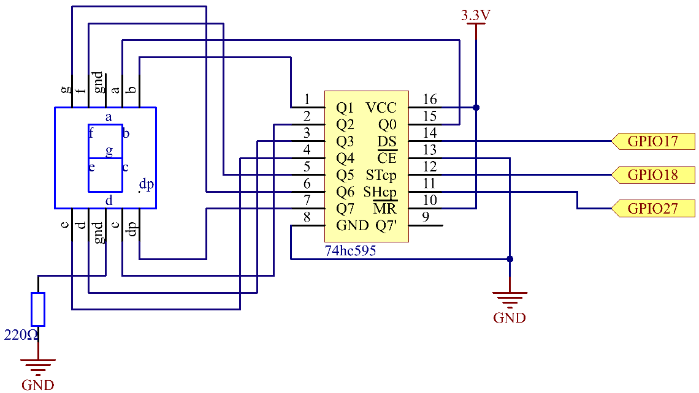
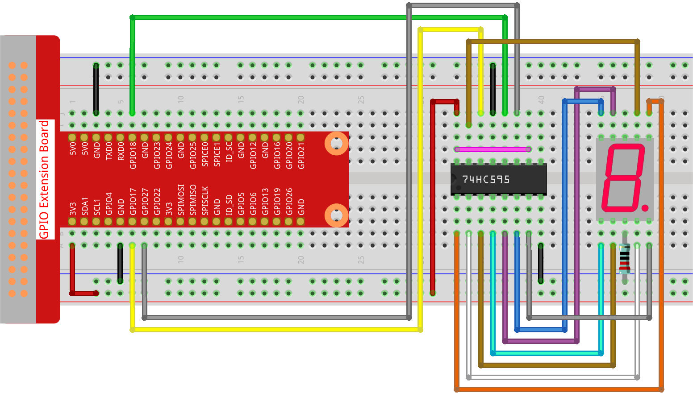

.. note::

    Hallo und willkommen in der SunFounder Raspberry Pi & Arduino & ESP32 Enthusiasten-Gemeinschaft auf Facebook! Tauchen Sie tiefer ein in die Welt von Raspberry Pi, Arduino und ESP32 mit anderen Enthusiasten.

    **Warum beitreten?**

    - **Expertenunterstützung**: Lösen Sie Nachverkaufsprobleme und technische Herausforderungen mit Hilfe unserer Gemeinschaft und unseres Teams.
    - **Lernen & Teilen**: Tauschen Sie Tipps und Anleitungen aus, um Ihre Fähigkeiten zu verbessern.
    - **Exklusive Vorschauen**: Erhalten Sie frühzeitigen Zugang zu neuen Produktankündigungen und exklusiven Einblicken.
    - **Spezialrabatte**: Genießen Sie exklusive Rabatte auf unsere neuesten Produkte.
    - **Festliche Aktionen und Gewinnspiele**: Nehmen Sie an Gewinnspielen und Feiertagsaktionen teil.

    👉 Sind Sie bereit, mit uns zu erkunden und zu erschaffen? Klicken Sie auf [|link_sf_facebook|] und treten Sie heute bei!

.. _1.1.4_py_pi5:

1.1.4 7-Segment-Anzeige
=============================

Einführung
-----------------

Lassen Sie uns versuchen, eine 7-Segment-Anzeige anzusteuern, um Ziffern von 0 bis 9 und
Buchstaben von A bis F anzuzeigen.

Benötigte Komponenten
------------------------------

Für dieses Projekt benötigen wir die folgenden Komponenten.

.. image:: ../python_pi5/img/1.1.4_7_segment_list.png

Schaltplan
---------------------

Verbinden Sie den Pin ST_CP des 74HC595 mit dem GPIO18 des Raspberry Pi, SH_CP mit GPIO27, DS
mit GPIO17, parallele Ausgangsports mit den 8 Segmenten der LED-Segment-
Anzeige.

Daten werden in den DS-Pin eingegeben und beim Anstieg von SH_CP (dem Takt-
eingang des Schieberegisters) in das Schieberegister und beim Anstieg von ST_CP (dem Takt-
eingang des Speichers) in das Speicherregister übertragen.

Dann können Sie die Zustände von SH_CP und ST_CP über die
GPIOs des Raspberry Pi steuern, um serielle Dateneingaben in parallele Daten-
ausgaben umzuwandeln, um GPIOs des Raspberry Pi zu sparen und die Anzeige anzusteuern.

============ ======== ===
T-Board Name physical BCM
GPIO17       Pin 11   17
GPIO18       Pin 12   18
GPIO27       Pin 13   27
============ ======== ===

Experimentelle Verfahren
------------------------------

**Schritt 1:** Bauen Sie den Schaltkreis auf.

**Schritt 2:** Wechseln Sie in den Ordner des Codes.

.. raw:: html

   <run></run>

.. code-block::

    cd ~/davinci-kit-for-raspberry-pi/python-pi5

**Schritt 3:** Führen Sie das Programm aus.

.. raw:: html

   <run></run>

.. code-block::

    sudo python3 1.1.4_7-Segment_zero.py

Nachdem der Code ausgeführt wurde, sehen Sie, dass die 7-Segment-Anzeige 0-9, A-F anzeigt.

.. warning::

    Wenn die Fehlermeldung ``RuntimeError: Cannot determine SOC peripheral base address`` angezeigt wird, lesen Sie bitte :ref:`faq_soc`

**Code**

.. note::
    Sie können den unten stehenden Code **Modifizieren/Zurücksetzen/Kopieren/Ausführen/Stoppen**. Aber bevor Sie das tun, müssen Sie zum Quellcode-Pfad wie ``davinci-kit-for-raspberry-pi/python-pi5`` gehen. Nachdem Sie den Code geändert haben, können Sie ihn direkt ausführen, um die Auswirkungen zu sehen. Nachdem Sie bestätigt haben, dass keine Probleme vorliegen, können Sie den geänderten Code mit der Kopieren-Schaltfläche kopieren, dann den Quellcode im Terminal über den Befehl ``nano`` öffnen und einfügen.

.. raw:: html

    <run></run>

.. code-block:: python

   #!/usr/bin/env python3
   from gpiozero import OutputDevice
   from time import sleep

   # GPIO-Pins, die mit dem 74HC595 Schieberegister verbunden sind
   SDI = OutputDevice(17)   # Serieller Dateneingang
   RCLK = OutputDevice(18)  # Speichertakteingang (Register Clock)
   SRCLK = OutputDevice(27) # Schieberegistertakt

   # Hexadezimale Zifferncodes für eine gemeinsame Kathoden-7-Segment-Anzeige
   segCode = [
       0x3f, 0x06, 0x5b, 0x4f, 0x66, 0x6d, 0x7d,
       0x07, 0x7f, 0x6f, 0x77, 0x7c, 0x39, 0x5e, 0x79, 0x71
   ]

   def hc595_shift(data):
       # 8 Bits Daten in den 74HC595 schieben
       for bit in range(8):
           # SDI auf hoch oder niedrig setzen, abhängig vom Datenbit
           SDI.value = 0x80 & (data << bit)
           # Schieberegistertakt auslösen
           SRCLK.on()
           sleep(0.001)
           SRCLK.off()
       # Daten durch Auslösen des Speichertakts in die Ausgabe übernehmen
       RCLK.on()
       sleep(0.001)
       RCLK.off()

   def display_all_on():
       # Funktion, um alle Segmente einzuschalten (für gemeinsame Kathoden-7-Segment-Anzeige)
       all_on_code = 0x3f
       hc595_shift(all_on_code)
       print("Alle Segmente eingeschaltet")

   try:
       while True:
           # Jede hexadezimale Ziffer auf der 7-Segment-Anzeige anzeigen
           for code in segCode:
               hc595_shift(code)  # Den Code in den 74HC595 schieben
               # Den angezeigten Segmentcode ausgeben
               print(f"Anzeige segCode[{segCode.index(code)}]: 0x{code:02X}")
               sleep(0.5)  # Pause zwischen der Anzeige jeder Ziffer

   except KeyboardInterrupt:
       # Skriptunterbrechung (z. B. Ctrl+C) elegant behandeln
       pass

**Code-Erklärung**

#. Dieser Ausschnitt importiert die notwendigen Klassen für das Projekt. ``OutputDevice`` aus ``gpiozero`` wird verwendet, um Hardwarekomponenten, die mit GPIO-Pins verbunden sind, zu steuern, und ``sleep`` aus ``time`` für Verzögerungen.

   .. code-block:: python

       #!/usr/bin/env python3
       from gpiozero import OutputDevice
       from time import sleep

#. SDI, RCLK und SRCLK entsprechen den Pins für den seriellen Dateneingang, den Speichertakteingang (Register Clock) und den Schieberegistertakt des 74HC595.

   .. code-block:: python

       # GPIO-Pins, die mit dem 74HC595 Schieberegister verbunden sind
       SDI = OutputDevice(17)   # Serieller Dateneingang
       RCLK = OutputDevice(18)  # Speichertakteingang (Register Clock)
       SRCLK = OutputDevice(27) # Schieberegistertakt

#. ``segCode`` ist ein Array, das hexadezimale Codes für jede auf der 7-Segment-Anzeige darzustellende Ziffer enthält.

   .. code-block:: python

       # Hexadezimale Zifferncodes für eine gemeinsame Kathoden-7-Segment-Anzeige
       segCode = [
           0x3f, 0x06, 0x5b, 0x4f, 0x66, 0x6d, 0x7d,
           0x07, 0x7f, 0x6f, 0x77, 0x7c, 0x39, 0x5e, 0x79, 0x71
       ]

#. Diese Funktion schiebt 8 Bits Daten in den 74HC595. Jedes Bit wird seriell in ``SDI`` eingegeben, ``SRCLK`` wird umgeschaltet, um das Bit zu verschieben, und ``RCLK`` wird verwendet, um die Daten an den Ausgang zu übertragen.

   .. code-block:: python

       def hc595_shift(data):
           # 8 Bits Daten in den 74HC595 schieben
           for bit in range(8):
               # SDI auf hoch oder niedrig setzen, abhängig vom Datenbit
               SDI.value = 0x80 & (data << bit)
               # Schieberegistertakt auslösen
               SRCLK.on()
               sleep(0.001)
               SRCLK.off()
           # Daten durch Auslösen des Speichertakts in die Ausgabe übernehmen
           RCLK.on()
           sleep(0.001)
           RCLK.off()

#. Diese Funktion schaltet alle Segmente der Anzeige ein, indem sie einen spezifischen Code an ``hc595_shift`` sendet.

   .. code-block:: python

       def display_all_on():
           # Funktion, um alle Segmente einzuschalten (für gemeinsame Kathoden-7-Segment-Anzeige)
           all_on_code = 0x3f
           hc595_shift(all_on_code)
           print("Alle Segmente eingeschaltet")

#. In der Hauptschleife wird jeder Code in ``segCode`` nacheinander an die Anzeige gesendet, mit einer Verzögerung zwischen jedem.

   .. code-block:: python

       try:
           while True:
               # Jede hexadezimale Ziffer auf der 7-Segment-Anzeige anzeigen
               for code in segCode:
                   hc595_shift(code)  # Den Code in den 74HC595 schieben
                   # Den angezeigten Segmentcode ausgeben
                   print(f"Anzeige segCode[{segCode.index(code)}]: 0x{code:02X}")
                   sleep(0.5)  # Pause zwischen der Anzeige jeder Ziffer

#. Dieser Teil des Codes behandelt die Unterbrechung des Skripts (wie Ctrl+C) auf elegante Weise.

   .. code-block:: python

       except KeyboardInterrupt:
           # Skriptunterbrechung (z. B. Ctrl+C) elegant behandeln
           pass
