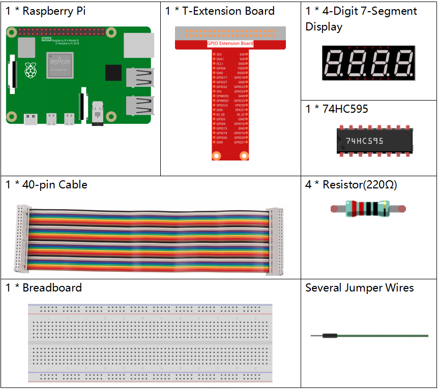
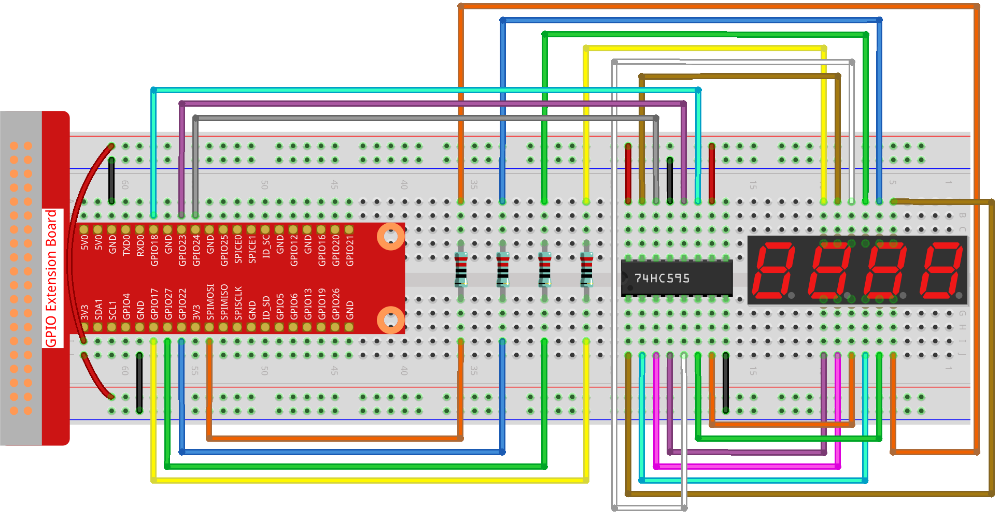

.. note::

    こんにちは、SunFounderのRaspberry Pi & Arduino & ESP32愛好家コミュニティへようこそ！Facebook上でRaspberry Pi、Arduino、ESP32についてもっと深く掘り下げ、他の愛好家と交流しましょう。

    **参加する理由は？**

    - **エキスパートサポート**：コミュニティやチームの助けを借りて、販売後の問題や技術的な課題を解決します。
    - **学び＆共有**：ヒントやチュートリアルを交換してスキルを向上させましょう。
    - **独占的なプレビュー**：新製品の発表や先行プレビューに早期アクセスしましょう。
    - **特別割引**：最新製品の独占割引をお楽しみください。
    - **祭りのプロモーションとギフト**：ギフトや祝日のプロモーションに参加しましょう。

    👉 私たちと一緒に探索し、創造する準備はできていますか？[|link_sf_facebook|]をクリックして今すぐ参加しましょう！

.. _1.1.5_py_pi5:

1.1.5 4桁 7セグメントディスプレイ
====================================

概要
-----------------

次に、4桁の7セグメントディスプレイを制御してみましょう。

必要なコンポーネント
------------------------------

このプロジェクトには、次のコンポーネントが必要です。 

.. raw:: html

    

回路図
--------------------------

============ ======== ===
T-Board Name physical BCM
GPIO17       Pin 11   17
GPIO27       Pin 13   27
GPIO22       Pin 15   22
SPIMOSI      Pin 19   10
GPIO18       Pin 12   18
GPIO23       Pin 16   23
GPIO24       Pin 18   24
============ ======== ===

.. image:: ../python_pi5/img/1.1.5_4_digit_schmatic.png

実験手順
-----------------------------------

**ステップ1:** 回路を組み立てます。

**ステップ2:** コードのフォルダに移動します。 

.. raw:: html

   <run></run>

.. code-block::

    cd ~/davinci-kit-for-raspberry-pi/python-pi5

**ステップ3:** 実行します。

.. raw:: html

   <run></run>

.. code-block::

    sudo python3 1.1.5_4-Digit.py

コードを実行した後、プログラムはカウントを1秒ごとに増やし、4桁のディスプレイにカウントを表示します。

.. warning::

    エラー メッセージ ``RuntimeError: Cannot determine SOC peripheral base address`` が表示された場合は、 :ref:`faq_soc` を参照してください。

**コード**

.. note::
    以下のコードは **変更/リセット/コピー/実行/停止** することができます。ただし、それを行う前に「davinci-kit-for-raspberry-pi/python-pi5」というソースコードのパスに移動する必要があります。コードを変更した後、そのまま実行して効果を確認できます。問題がないことを確認したら、修正されたコードをコピーするためのCopyボタンを使用し、ターミナルで「nano」コマンドを使用してソースコードを開き、コードを貼り付けることができます。

.. raw:: html

    <run></run>

.. code-block:: python

   #!/usr/bin/env python3
   from gpiozero import OutputDevice
   import time
   import threading

   # 74HC595シフトレジスタ用のGPIOピンを定義
   SDI = OutputDevice(24)   # シリアルデータ入力
   RCLK = OutputDevice(23)  # レジスタクロック
   SRCLK = OutputDevice(18) # シフトレジスタクロック

   # 7セグメントディスプレイの数字を選択するためのGPIOピンを定義
   placePin = [OutputDevice(pin) for pin in (10, 22, 27, 17)]

   # 7セグメントディスプレイに表示する0から9までの数字のセグメントコードを定義
   number = (0xc0, 0xf9, 0xa4, 0xb0, 0x99, 0x92, 0x82, 0xf8, 0x80, 0x90)

   counter = 0  # 表示用のカウンターを初期化
   timer1 = 0   # カウンターの増分用のタイマーを初期化

   def clearDisplay():
       """ 7セグメントディスプレイをクリアします。 """
       for _ in range(8):
           SDI.on()
           SRCLK.on()
           SRCLK.off()
       RCLK.on()
       RCLK.off()

   def hc595_shift(data):
       """ 1バイトのデータを74HC595シフトレジスタにシフトします。 """
       for i in range(8):
           SDI.value = 0x80 & (data << i)  # データビットに基づいてSDIを高/低に設定
           SRCLK.on()  # シフトレジスタクロックをパルス
           SRCLK.off()
       RCLK.on()  # レジスタクロックをパルスしてデータを出力にラッチ
       RCLK.off()

   def pickDigit(digit):
       """ 7セグメントディスプレイに表示する数字を選択します。 """
       for pin in placePin:
           pin.off()  # すべての数字選択ピンをオフにする
       placePin[digit].on()  # 選択された数字をオンにする

   def timer():
       """ カウンターを1秒ごとに増分するタイマー関数です。 """
       global counter, timer1
       timer1 = threading.Timer(1.0, timer)  # 次の増分のためにタイマーをリセット
       timer1.start()
       counter += 1  # カウンターを増分
       print("%d" % counter)  # 現在のカウンターの値を表示

   def setup():
       """ 初期状態を設定し、タイマーを開始します。 """
       global timer1
       timer1 = threading.Timer(1.0, timer)  # タイマーの初期化と開始
       timer1.start()

   def loop():
       """ カウンターの値で7セグメントディスプレイを更新するメインループです。 """
       global counter
       while True:
           for i in range(4):  # 各数字をループ
               clearDisplay()  # 新しい数字を設定する前にディスプレイをクリア
               pickDigit(i)    # 表示する数字を選択
               digit = (counter // (10 ** i)) % 10
               hc595_shift(number[digit])  # 数字の値を74HC595にシフト
               time.sleep(0.001)  # ディスプレイの安定性のための短い遅延

   def destroy():
       """ 終了時にGPIOリソースをクリーンアップし、タイマーを停止します。 """
       global timer1
       timer1.cancel()  # タイマーを停止
       for device in [SDI, RCLK, SRCLK] + placePin:
           device.close()  # GPIOデバイスをクローズ

   try:
       setup()  # 初期セットアップを実行
       while True:
           loop()  # メインループを開始
           
   except KeyboardInterrupt:
       # スクリプトの中断（例：Ctrl+C）
       destroy()  # 終了時にリソースをクリーンアップ

**コードの説明**

#. ``placePin`` リストは、4桁の7セグメントディスプレイの各桁を制御するための共通アノードピンを制御します。

#. 16進数で0から9までのセグメントコード（共通アノード）を含む ``number`` 配列を定義します。

#. ``setup`` 関数は、カウンタ増加用のタイマーを1秒ごとにトリガするためのセットアップを行います。

#. タイマーが1.0秒に達すると、タイマー関数が呼び出され、カウンタに1を追加し、次にタイマー自体が1秒ごとに繰り返し実行されます。

#. ``hc595_shift`` 関数は、74HC595シフトレジスタに1バイトのデータをシフトし、ディスプレイセグメントを制御します。

#. メインループ ``loop`` では、現在のカウンタ値を表示し、各桁を順番に表示します。各桁を表示する前にディスプレイをクリアします。

#. ``clearDisplay`` 関数は、次の桁を表示する前にすべてのセグメントをオフに設定してディスプレイをクリアします。

#. ``pickDigit`` 関数は、アクティブ化する7セグメントディスプレイの桁を選択します。各桁は個別のGPIOピンで制御されます。

#. プログラムが中断された場合、GPIOリソースを適切に解放し、タイマーを停止します。