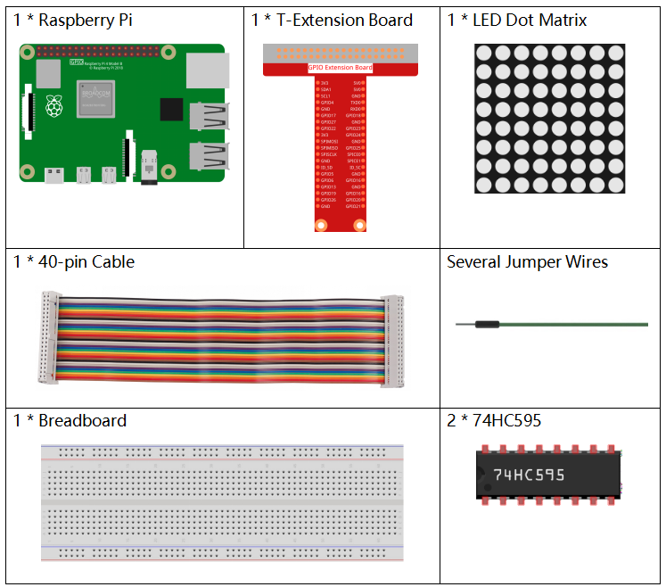
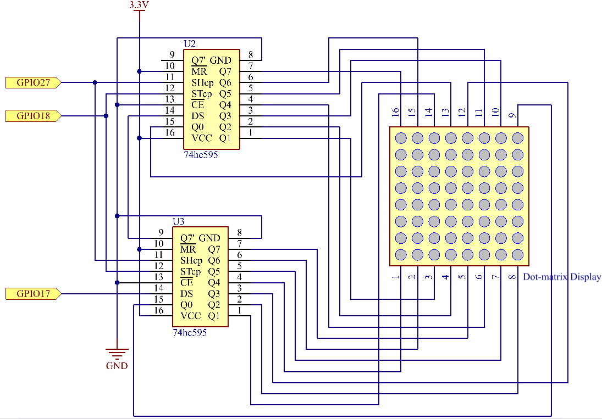
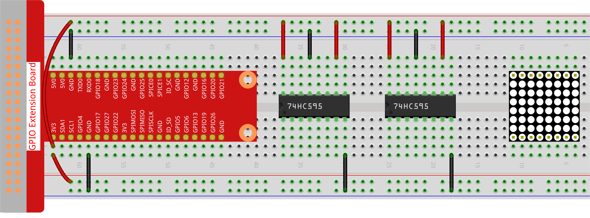
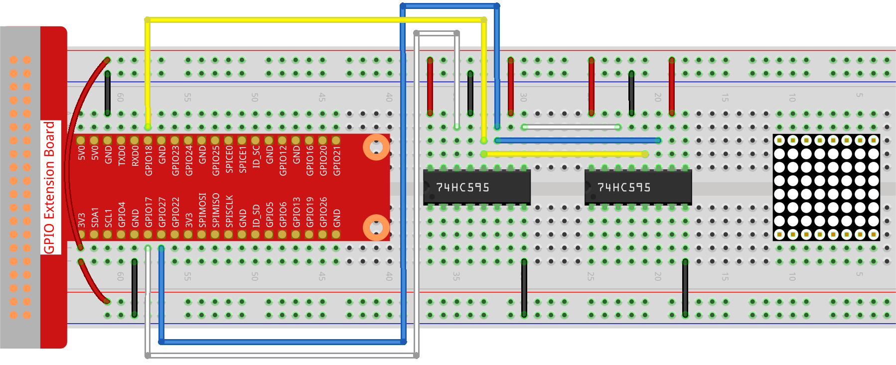
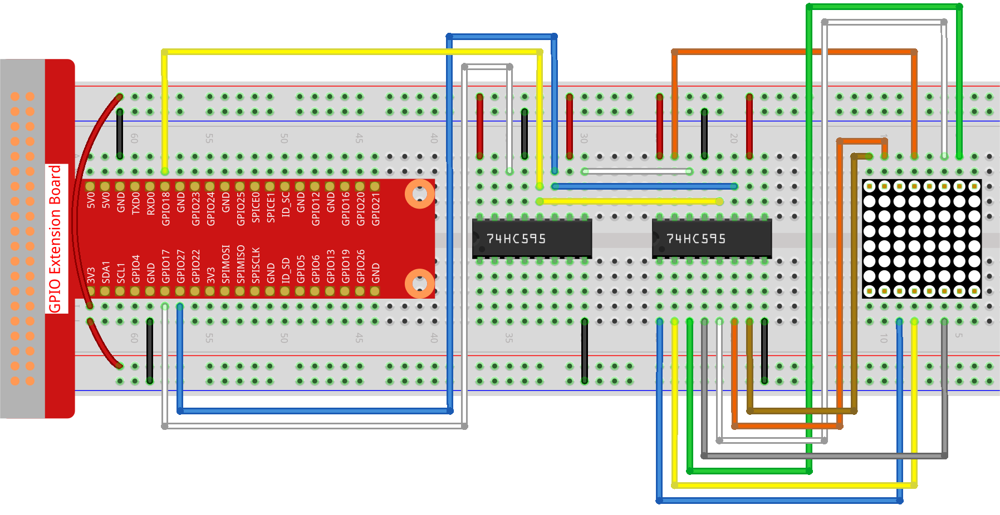
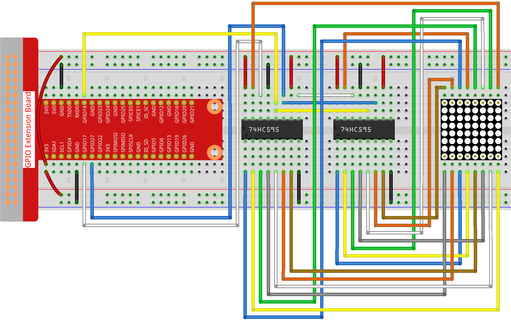

.. _1.1.6_py_pi5:

1.1.6 LEDドットマトリックス
============================================

はじめに
--------------------

その名前からも分かるように、LEDドットマトリックスはLEDで構成されたマトリックスです。
LEDの点灯と消灯によって、異なる文字やパターンを形成します。

必要なコンポーネント
------------------------------

このプロジェクトでは、以下のコンポーネントが必要です。

.. raw:: html

    

原理
----------------

**LEDドットマトリックス**

一般的に、LEDドットマトリックスは2つのタイプに分類されます：共通陰極（CC）と共通陽極（CA）。外観は似ていますが、内部に違いがあります。テストで区別できます。このキットではCAタイプが使用されています。サイドにラベル「788BS」と表示されています。

以下の図をご覧ください。ピンは背面の2つの端に配置されています。ラベル側を参照してください：この端のピンはピン1から8で、もう一方はピン9から16です。

外部ビュー：

.. image:: ../python_pi5/img/1.1.6_led_dot_matrix_1.png
   :width: 400
   :align: center

以下の図は内部構造を示しています。CA LEDドットマトリックスでは、ROWはLEDの陽極を表し、COLは陰極です。CCの場合は逆です。共通点は、両方のタイプともに、ピン13、3、4、10、6、11、15、16がすべてCOLであり、ピン9、14、8、12、1、7、2、5がすべてROWであることです。左上隅の最初のLEDを点灯させたい場合、CA LEDドットマトリックスの場合、ピン9をHighに設定してピン13をLowに、CCの場合はピン13をHighに設定してピン9をLowにします。最初の列全体を点灯させたい場合、CAの場合、ピン13をLowにし、ROW 9、14、8、12、1、7、2、5をHighに設定し、CCの場合、ピン13をHighにし、ROW 9、14、8、12、1、7、2、5をLowに設定します。理解を深めるために、以下の図を参考にしてください。

内部ビュー：

.. image:: ../python_pi5/img/1.1.6_led_dot_matrix_2.png
   :width: 400
   :align: center

上記の行と列に対応するピン番号：

=========== ====== ====== ===== ====== ===== ====== ====== ======
**COL**     **1**  **2**  **3** **4**  **5** **6**  **7**  **8**
**Pin No.** **13** **3**  **4** **10** **6** **11** **15** **16**
**ROW**     **1**  **2**  **3** **4**  **5** **6**  **7**  **8**
**Pin No.** **9**  **14** **8** **12** **1** **7**  **2**  **5**
=========== ====== ====== ===== ====== ===== ====== ====== ======

さらに、ここでは2つの74HC595チップを使用しています。1つはLEDドットマトリックスの行を制御し、もう1つは列を制御します。

回路図
-----------------------

============ ======== ======== ===
T-Board Name physical wiringPi BCM
GPIO17       Pin 11   0        17
GPIO18       Pin 12   1        18
GPIO27       Pin 13   2        27
============ ======== ======== ===

実験手順
----------------------------

**ステップ1:** 回路を組み立てます。配線が複雑なので、ステップバイステップで進めましょう。まず、T-Cobbler、LEDドットマトリックス、および2つの74HC595チップをブレッドボードに挿入します。T-Cobblerの3.3VとGNDをボードの両側の穴に接続し、次に2つの74HC595チップのピン16と10をVCCに、ピン13とピン8をGNDに接続します。

.. note::
   上記のFritzingイメージでは、ラベルが下にある側です。

**ステップ2:** 2つの74HC595のピン11を一緒に接続し、次にGPIO27に接続します。次に、2つのチップのピン12を接続し、GPIO18に接続します。その後、左側の74HC595のピン14をGPIO17に、ピン9を2番目の74HC595のピン14に接続します。

**ステップ3:** 右側の74HC595はLEDドットマトリックスの列を制御します。以下のテーブルを参照してマッピングを確認してください。したがって、74HC595のQ0-Q7ピンは、ピン13、3、4、10、6、11、15、16とそれぞれマッピングされています。

+--------------------+--------+--------+--------+--------+--------+--------+--------+--------+
| **74HC595**        | **Q0** | **Q1** | **Q2** | **Q3** | **Q4** | **Q5** | **Q6** | **Q7** |
+--------------------+--------+--------+--------+--------+--------+--------+--------+--------+
| **LED Dot Matrix** | **13** | **3**  | **4**  | **10** | **6**  | **11** | **15** | **16** |
+--------------------+--------+--------+--------+--------+--------+--------+--------+--------+

**ステップ4:** さて、LEDドットマトリックスのROWを接続します。左側の74HC595がLEDドットマトリックスのROWを制御します。以下のテーブルを参照してマッピングを確認してください。左側の74HC595のQ0-Q7は、ピン9、14、8、12、1、7、2、5とそれぞれマッピングされています。

+--------------------+--------+--------+--------+--------+--------+--------+--------+--------+
| **74HC595**        | **Q0** | **Q1** | **Q2** | **Q3** | **Q4** | **Q5** | **Q6** | **Q7** |
+--------------------+--------+--------+--------+--------+--------+--------+--------+--------+
| **LED Dot Matrix** | **9**  | **14** | **8**  | **12** | **1**  | **7**  | **2**  | **5**  |
+--------------------+--------+--------+--------+--------+--------+--------+--------+--------+

**ステップ5:** コードファイルを開きます。

.. raw:: html

   <run></run>

.. code-block::

    cd ~/davinci-kit-for-raspberry-pi/python-pi5

**ステップ6:** 実行します。

.. raw:: html

   <run></run>

.. code-block::

    sudo python3 1.1.6_led_dot_matrix_zero.py

コードを実行すると、LEDドットマトリックスが一列ずつ点灯し、列ごとに消灯します。

**コード**

.. note::
    以下のコードは **変更/リセット/コピー/実行/停止** することができます。ただし、それを行う前に「davinci-kit-for-raspberry-pi/python-pi5」というソースコードのパスに移動する必要があります。コードを変更した後、そのまま実行して効果を確認できます。問題がないことを確認したら、修正されたコードをコピーするためのCopyボタンを使用し、ターミナルで「nano」コマンドを使用してソースコードを開き、コードを貼り付けることができます。

.. raw:: html

    <run></run>

.. code-block:: python

   #!/usr/bin/env python3
   from gpiozero import OutputDevice
   from time import sleep

   # Define GPIO pins connected to the 74HC595 shift register
   SDI = OutputDevice(17)   # Serial Data Input
   RCLK = OutputDevice(18)  # Register Clock
   SRCLK = OutputDevice(27) # Shift Register Clock

   # Define patterns for matrix display; ROWs are anodes (+), COLs are cathodes (-)
   # Pattern for ROWs (anode signals)
   code_H = [0x01, 0xff, 0x80, 0xff, 0x01, 0x02, 0x04, 0x08, 0x10, 0x20, 0x40, 0x80, 0xff, 0xff, 0xff, 0xff, 0xff, 0xff, 0xff, 0xff]
   # Pattern for COLs (cathode signals)
   code_L = [0x00, 0x7f, 0x00, 0xfe, 0x00, 0x00, 0x00, 0x00, 0x00, 0x00, 0x00, 0x00, 0xfe, 0xfd, 0xfb, 0xf7, 0xef, 0xdf, 0xbf, 0x7f]

   # Shift data to 74HC595
   def hc595_shift(dat):
      """ Shift data to the 74HC595 shift register for displaying on the matrix. """
      for i in range(8):
         # Set SDI value and trigger shift register clock
         SDI.value = 0x80 & (dat << i)
         SRCLK.on()
         SRCLK.off()
      # Trigger register clock to update display
      RCLK.on()
      sleep(0.001)
      RCLK.off()

   def main():
      """ Main loop for cycling through display patterns. """
      while True:
         # Cycle through patterns in ascending order
         for i in range(len(code_H)):
               hc595_shift(code_L[i])
               hc595_shift(code_H[i])
               sleep(0.1)

         # Cycle through patterns in descending order
         for i in range(len(code_H)-1, -1, -1):
               hc595_shift(code_L[i])
               hc595_shift(code_H[i])
               sleep(0.1)

   # Run main loop, handle keyboard interrupt gracefully
   try:
      main()
   except KeyboardInterrupt:
      pass

**コードの説明**

1. このスニペットは、プロジェクトのために必要なクラスをインポートします。 ``gpiozero`` からの ``OutputDevice`` は、GPIOピンに接続されたハードウェアコンポーネントを制御するために使用され、 ``time`` からの ``sleep`` は遅延を追加するために使用されます。

   .. code-block:: python
 
      #!/usr/bin/env python3
      from gpiozero import OutputDevice
      from time import sleep

2. このセクションでは、74HC595シフトレジスタに接続されたGPIOピンを初期化します。 ``SDI`` はシリアルデータ入力、 ``RCLK`` はレジスタクロック、 ``SRCLK`` はシフトレジスタクロックです。これらのピンはデータをレジスタにシフトし、LEDマトリクスの表示を制御するために使用されます。

   .. code-block:: python

      # 74HC595シフトレジスタに接続されたGPIOピンを定義
      SDI = OutputDevice(17)   # シリアルデータ入力
      RCLK = OutputDevice(18)  # レジスタクロック
      SRCLK = OutputDevice(27) # シフトレジスタクロック

3. ``code_H`` と ``code_L`` は、LEDマトリクスの行（陽極）と列（陰極）を制御するための2進パターンを定義します。これらの配列の各要素は、マトリクス内のどのLEDがオンまたはオフになるかを制御する2進パターンを表します。

   .. code-block:: python

      # マトリクス表示のためのパターンを定義します。行は陽極（+）、列は陰極（-）です。
      # 行のパターン（陽極信号）
      code_H = [0x01, 0xff, 0x80, 0xff, 0x01, 0x02, 0x04, 0x08, 0x10, 0x20, 0x40, 0x80, 0xff, 0xff, 0xff, 0xff, 0xff, 0xff, 0xff, 0xff]
      # 列のパターン（陰極信号）
      code_L = [0x00, 0x7f, 0x00, 0xfe, 0x00, 0x00, 0x00, 0x00, 0x00, 0x00, 0x00, 0x00, 0xfe, 0xfd, 0xfb, 0xf7, 0xef, 0xdf, 0xbf, 0x7f]

4. この関数は、バイトデータ（ ``dat`` ）を74HC595シフトレジスタにシフトします。バイト内の各ビットに対して、ビット値に基づいて ``SDI`` ピンを高または低に設定し、ビットをレジスタにシフトするために ``SRCLK`` ピンをトグルさせます。すべてのビットがシフトされた後、LEDマトリクスの表示を更新するために ``RCLK`` ピンをトグルさせます。

   .. code-block:: python
 
      # データを74HC595にシフト
      def hc595_shift(dat):
         """ マトリクスに表示するためのデータを74HC595シフトレジスタにシフトします。 """
         for i in range(8):
            # SDIの値を設定してシフトレジスタクロックをトリガー
            SDI.value = 0x80 & (dat << i)
            SRCLK.on()
            SRCLK.off()
         # レジスタクロックをトリガーして表示を更新
         RCLK.on()
         sleep(0.001)
         RCLK.off()

5. メイン関数には、LEDマトリクスの事前定義されたパターンを無限ループで循環させるコードが含まれています。 ``hc595_shift`` 関数を使用してシフトレジスタに行と列のパターン（``code_H``と``code_L``）を送信し、昇順で最初に、次に降順で表示を作成します。

   .. code-block:: python

      def main():
         """ 表示パターンを循環させるためのメインループ。 """
         while True:
            # 昇順でパターンを循環させます
            for i in range(len(code_H)):
                  hc595_shift(code_L[i])
                  hc595_shift(code_H[i])
                  sleep(0.1)

            # 降順でパターンを循環させます
            for i in range(len(code_H)-1, -1, -1):
                  hc595_shift(code_L[i])
                  hc595_shift(code_H[i])
                  sleep(0.1)

6. このセグメントは、プログラムがキーボード割り込み（Ctrl+C）を使用して中断できるようにします。メインループを中断する際に急激な停止やリソースの漏洩が発生しないようにします。

   .. code-block:: python

      # メインループを実行し、キーボード割り込みを丁寧に処理します
      try:
         main()
      except KeyboardInterrupt:
         pass