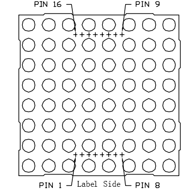

.. note::

    Hello, welcome to the SunFounder Raspberry Pi & Arduino & ESP32 Enthusiasts Community on Facebook! Dive deeper into Raspberry Pi, Arduino, and ESP32 with fellow enthusiasts.

    **Why Join?**

    - **Expert Support**: Solve post-sale issues and technical challenges with help from our community and team.
    - **Learn & Share**: Exchange tips and tutorials to enhance your skills.
    - **Exclusive Previews**: Get early access to new product announcements and sneak peeks.
    - **Special Discounts**: Enjoy exclusive discounts on our newest products.
    - **Festive Promotions and Giveaways**: Take part in giveaways and holiday promotions.

    👉 Ready to explore and create with us? Click [|link_sf_facebook|] and join today!

.. _1.1.6_py_pi5:

1.1.6 LED Dot Matrix
=====================

Introduction
--------------------

As the name suggests, an LED dot matrix is a matrix composed of LEDs.
The lighting up and dimming of the LEDs formulate different characters
and patterns.

Required Components
------------------------------

In this project, we need the following components. 

.. image:: ../python_pi5/img/1.1.6_led_dot_matrix_list.png
    :width: 800
    :align: center

.. raw:: html

    

Principle
----------------

**LED Dot Matrix**

Generally, LED dot matrix can be categorized into two types: common
cathode (CC) and common anode (CA). They look much alike, but internally
the difference lies. You can tell by test. A CA one is used in this kit.
You can see 788BS labeled at the side.

See the figure below. The pins are arranged at the two ends at the back.
Take the label side for reference: pins on this end are pin 1-8, and oh
the other are pin 9-16.

The external view:

Below the figures show their internal structure. You can see in a CA LED
dot matrix, ROW represents the anode of the LED, and COL is cathode;
it's contrary for a CC one. One thing in common: for both types, pin 13,
3, 4, 10, 6, 11, 15, and 16 are all COL, when pin 9, 14, 8, 12, 1, 7, 2,
and 5 are all ROW. If you want to turn on the first LED at the top left
corner, for a CA LED dot matrix, just set pin 9 as High and pin 13 as
Low, and for a CC one, set pin 13 as High and pin 9 as Low. If you want
to light up the whole first column, for CA, set pin 13 as Low and ROW 9,
14, 8, 12, 1, 7, 2, and 5 as High, when for CC, set pin 13 as High and
ROW 9, 14, 8, 12, 1, 7, 2, and 5 as Low. Consider the following figures
for better understanding.

The internal view:

.. image:: ../python_pi5/img/1.1.6_led_dot_matrix_2.png
   :width: 400
   :align: center

Pin numbering corresponding to the above rows and columns:

=========== ====== ====== ===== ====== ===== ====== ====== ======
**COL**     **1**  **2**  **3** **4**  **5** **6**  **7**  **8**
**Pin No.** **13** **3**  **4** **10** **6** **11** **15** **16**
**ROW**     **1**  **2**  **3** **4**  **5** **6**  **7**  **8**
**Pin No.** **9**  **14** **8** **12** **1** **7**  **2**  **5**
=========== ====== ====== ===== ====== ===== ====== ====== ======

In addition, two 74HC595 chips are used here. One is to control the rows
of the LED dot matrix while the other, the columns.

Schematic Diagram
-----------------------

============ ======== ======== ===
T-Board Name physical wiringPi BCM
GPIO17       Pin 11   0        17
GPIO18       Pin 12   1        18
GPIO27       Pin 13   2        27
============ ======== ======== ===

.. image:: ../python_pi5/img/1.1.6_led_dot_matrix_schematic.png
   :width: 800

Experimental Procedures
----------------------------

**Step 1:** Build the circuit. Since the wiring is complicated, let's
make it step by step. First, insert the T-Cobbler, the LED dot matrix
and two 74HC595 chips into breadboard. Connect the 3.3V and GND of the
T-Cobbler to holes on the two sides of the board, then hook up pin16 and
10 of the two 74HC595 chips to VCC, pin 13 and pin 8 to GND.

.. note::
   In the Fritzing image above, the side with label is at the bottom.

**Step 2:** Connect pin 11 of the two 74HC595 together, and then to
GPIO27; then pin 12 of the two chips, and to GPIO18; next, pin 14 of the
74HC595 on the left side to GPIO17 and pin 9 to pin 14 of the second
74HC595.

.. image:: ../python_pi5/img/1.1.6_LedMatrix_circuit_2.png
   :width: 800

**Step 3:** The 74HC595 on the right side is to control columns of the
LED dot matrix. See the table below for the mapping. Therefore, Q0-Q7
pins of the 74HC595 are mapped with pin 13, 3, 4, 10, 6, 11, 15, and 16
respectively.

+--------------------+--------+--------+--------+--------+--------+--------+--------+--------+
| **74HC595**        | **Q0** | **Q1** | **Q2** | **Q3** | **Q4** | **Q5** | **Q6** | **Q7** |
+--------------------+--------+--------+--------+--------+--------+--------+--------+--------+
| **LED Dot Matrix** | **13** | **3**  | **4**  | **10** | **6**  | **11** | **15** | **16** |
+--------------------+--------+--------+--------+--------+--------+--------+--------+--------+

.. image:: ../python_pi5/img/1.1.6_LedMatrix_circuit_3.png
   :width: 800

**Step 4:** Now connect the ROWs of the LED dot matrix. The 74HC595 on
the left controls ROW of the LED dot matrix. See the table below for the
mapping. We can see, Q0-Q7 of the 74HC595 on the left are mapped with
pin 9, 14, 8, 12, 1, 7, 2, and 5 respectively.

+--------------------+--------+--------+--------+--------+--------+--------+--------+--------+
| **74HC595**        | **Q0** | **Q1** | **Q2** | **Q3** | **Q4** | **Q5** | **Q6** | **Q7** |
+--------------------+--------+--------+--------+--------+--------+--------+--------+--------+
| **LED Dot Matrix** | **9**  | **14** | **8**  | **12** | **1**  | **7**  | **2**  | **5**  |
+--------------------+--------+--------+--------+--------+--------+--------+--------+--------+

.. image:: ../python_pi5/img/1.1.6_LedMatrix_circuit_4.png
   :width: 800
   

**Step 5:** Open the code file.

.. raw:: html

   <run></run>

.. code-block::

    cd ~/davinci-kit-for-raspberry-pi/python-pi5

**Step 6:** Run.

.. raw:: html

   <run></run>

.. code-block::

    sudo python3 1.1.6_led_dot_matrix_zero.py

After the code runs, the LED dot matrix lights up and out row by row and column by column.

.. warning::

    If there is an error prompt  ``RuntimeError: Cannot determine SOC peripheral base address``, please refer to :ref:`faq_soc` 

**Code**

.. note::

    You can **Modify/Reset/Copy/Run/Stop** the code below. But before that, you need to go to  source code path like ``davinci-kit-for-raspberry-pi/python-pi5``. After modifying the code, you can run it directly to see the effect.

.. raw:: html

    <run></run>

.. code-block:: python

   #!/usr/bin/env python3
   from gpiozero import OutputDevice
   from time import sleep

   # Define GPIO pins connected to the 74HC595 shift register
   SDI = OutputDevice(17)   # Serial Data Input
   RCLK = OutputDevice(18)  # Register Clock
   SRCLK = OutputDevice(27) # Shift Register Clock

   # Define patterns for matrix display; ROWs are anodes (+), COLs are cathodes (-)
   # Pattern for ROWs (anode signals)
   code_H = [0x01, 0xff, 0x80, 0xff, 0x01, 0x02, 0x04, 0x08, 0x10, 0x20, 0x40, 0x80, 0xff, 0xff, 0xff, 0xff, 0xff, 0xff, 0xff, 0xff]
   # Pattern for COLs (cathode signals)
   code_L = [0x00, 0x7f, 0x00, 0xfe, 0x00, 0x00, 0x00, 0x00, 0x00, 0x00, 0x00, 0x00, 0xfe, 0xfd, 0xfb, 0xf7, 0xef, 0xdf, 0xbf, 0x7f]

   # Shift data to 74HC595
   def hc595_shift(dat):
      """ Shift data to the 74HC595 shift register for displaying on the matrix. """
      for i in range(8):
         # Set SDI value and trigger shift register clock
         SDI.value = 0x80 & (dat << i)
         SRCLK.on()
         SRCLK.off()
      # Trigger register clock to update display
      RCLK.on()
      sleep(0.001)
      RCLK.off()

   def main():
      """ Main loop for cycling through display patterns. """
      while True:
         # Cycle through patterns in ascending order
         for i in range(len(code_H)):
               hc595_shift(code_L[i])
               hc595_shift(code_H[i])
               sleep(0.1)

         # Cycle through patterns in descending order
         for i in range(len(code_H)-1, -1, -1):
               hc595_shift(code_L[i])
               hc595_shift(code_H[i])
               sleep(0.1)

   # Run main loop, handle keyboard interrupt gracefully
   try:
      main()
   except KeyboardInterrupt:
      pass

**Code Explanation**

#. This snippet imports the necessary classes for the project. ``OutputDevice`` from ``gpiozero`` is used to control hardware components connected to GPIO pins, and ``sleep`` from ``time`` is for adding delays.

   .. code-block:: python
 
      #!/usr/bin/env python3
      from gpiozero import OutputDevice
      from time import sleep

#. This section initializes GPIO pins connected to the 74HC595 shift register. ``SDI`` is the Serial Data Input, ``RCLK`` is the Register Clock, and ``SRCLK`` is the Shift Register Clock. These pins are used to shift data into the register and control the display of the LED matrix.

   .. code-block:: python

      # Define GPIO pins connected to the 74HC595 shift register
      SDI = OutputDevice(17)   # Serial Data Input
      RCLK = OutputDevice(18)  # Register Clock
      SRCLK = OutputDevice(27) # Shift Register Clock

#. ``code_H`` and ``code_L`` define binary patterns for controlling the rows (anodes) and columns (cathodes) of the LED matrix, respectively. Each element in these arrays represents a binary pattern that controls which LEDs are turned on or off in the matrix.

   .. code-block:: python

      # Define patterns for matrix display; ROWs are anodes (+), COLs are cathodes (-)
      # Pattern for ROWs (anode signals)
      code_H = [0x01, 0xff, 0x80, 0xff, 0x01, 0x02, 0x04, 0x08, 0x10, 0x20, 0x40, 0x80, 0xff, 0xff, 0xff, 0xff, 0xff, 0xff, 0xff, 0xff]
      # Pattern for COLs (cathode signals)
      code_L = [0x00, 0x7f, 0x00, 0xfe, 0x00, 0x00, 0x00, 0x00, 0x00, 0x00, 0x00, 0x00, 0xfe, 0xfd, 0xfb, 0xf7, 0xef, 0xdf, 0xbf, 0x7f]

#. This function shifts a byte of data (``dat``) into the 74HC595 shift register. It iterates over each bit in the byte, setting the ``SDI`` pin high or low based on the bit value, and toggles the ``SRCLK`` pin to shift the bit into the register. After all bits are shifted, it toggles the ``RCLK`` pin to update the LED matrix display.

   .. code-block:: python
 
      # Shift data to 74HC595
      def hc595_shift(dat):
         """ Shift data to the 74HC595 shift register for displaying on the matrix. """
         for i in range(8):
            # Set SDI value and trigger shift register clock
            SDI.value = 0x80 & (dat << i)
            SRCLK.on()
            SRCLK.off()
         # Trigger register clock to update display
         RCLK.on()
         sleep(0.001)
         RCLK.off()

#. The main function contains an infinite loop that cycles through predefined patterns for the LED matrix. It uses the ``hc595_shift`` function to send row and column patterns (``code_H`` and ``code_L``) to the shift register, first in ascending order and then in descending order, creating a dynamic display.

   .. code-block:: python

      def main():
         """ Main loop for cycling through display patterns. """
         while True:
            # Cycle through patterns in ascending order
            for i in range(len(code_H)):
                  hc595_shift(code_L[i])
                  hc595_shift(code_H[i])
                  sleep(0.1)

            # Cycle through patterns in descending order
            for i in range(len(code_H)-1, -1, -1):
                  hc595_shift(code_L[i])
                  hc595_shift(code_H[i])
                  sleep(0.1)

#. This segment ensures the program can be interrupted using a keyboard interrupt (Ctrl+C). It gracefully exits the main loop without any abrupt stoppage or resource leakage.

   .. code-block:: python

      # Run main loop, handle keyboard interrupt gracefully
      try:
         main()
      except KeyboardInterrupt:
         pass
