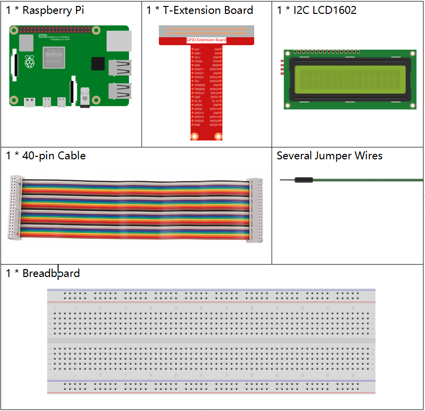
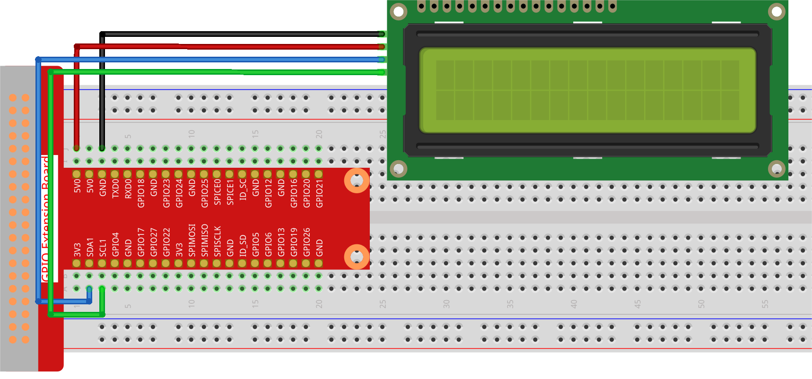

.. note::

    Ciao e benvenuto nella Community di Appassionati di SunFounder per Raspberry Pi, Arduino ed ESP32 su Facebook! Immergiti nel mondo di Raspberry Pi, Arduino ed ESP32 insieme a tanti altri appassionati.

    **Perché Unirsi?**

    - **Supporto da Esperti**: Risolvi problemi post-vendita e sfide tecniche con l’aiuto della nostra community e del nostro team.
    - **Impara e Condividi**: Scambia consigli e tutorial per migliorare le tue competenze.
    - **Anteprime Esclusive**: Ottieni accesso anticipato agli annunci dei nuovi prodotti e a contenuti inediti.
    - **Sconti Speciali**: Approfitta di sconti esclusivi sui nostri prodotti più recenti.
    - **Promozioni Festive e Giveaway**: Partecipa a giveaway e promozioni festive.

    👉 Pronto a esplorare e creare con noi? Clicca su [|link_sf_facebook|] e unisciti oggi stesso!

.. _1.1.7_py_pi5:

1.1.7 LCD1602 I2C
======================

Introduzione
------------------

L’LCD1602 è un display LCD a caratteri, capace di visualizzare 32 caratteri 
(16*2) contemporaneamente.

Componenti Necessari
------------------------------

In questo progetto, abbiamo bisogno dei seguenti componenti.

.. raw:: html

    

Schema Elettrico
---------------------

============ ========
T-Board Name physical
SDA1         Pin 3
SCL1         Pin 5
============ ========

.. image:: ../python_pi5/img/1.1.7_i2c_lcd_schematic.png

Procedure Sperimentali
-----------------------------

**Passo 1:** Assembla il circuito.

**Passo 2**: Configura l’I2C (consulta :ref:`i2c_config`. Se l’I2C è già configurato, salta questo passaggio.)

**Passo 3:** Cambia la directory.

.. raw:: html

   <run></run>

.. code-block::

    cd ~/davinci-kit-for-raspberry-pi/python-pi5

**Passo 4:** Esegui.

.. raw:: html

   <run></run>

.. code-block::

    sudo python3 1.1.7_Lcd1602_zero.py

Dopo l’esecuzione del codice, vedrai il messaggio ``Saluti!, Da SunFounder`` visualizzato sul display LCD.

.. note::

    * Se appare l'errore ``FileNotFoundError: [Errno 2] No such file or directory: '/dev/i2c-1'``, consulta :ref:`i2c_config` per abilitare l’I2C.
    * Se si verifica l'errore ``ModuleNotFoundError: No module named 'smbus2'``, esegui ``sudo pip3 install smbus2``.
    * Se appare l’errore ``OSError: [Errno 121] Remote I/O error``, significa che il modulo è collegato in modo errato o è danneggiato.
    * Se il codice e il cablaggio sono corretti, ma l’LCD non mostra ancora contenuti, regola il potenziometro sul retro per aumentare il contrasto.

.. warning::

    Se compare l'errore ``RuntimeError: Cannot determine SOC peripheral base address``, consulta :ref:`faq_soc`

**Codice** 

.. note::

    Puoi **Modificare/Reimpostare/Copiare/Eseguire/Interrompere** il codice qui sotto. Prima di farlo, però, vai al percorso del codice sorgente, come ``davinci-kit-for-raspberry-pi/python-pi5``. Dopo aver modificato il codice, potrai eseguirlo direttamente per vedere il risultato.

.. raw:: html

    <run></run>

.. code-block:: python

   #!/usr/bin/env python3
   import LCD1602  # Importa il modulo per interfacciarsi con LCD1602
   import time     # Importa il modulo per le funzioni di temporizzazione

   def setup():
       # Inizializza LCD con indirizzo I2C 0x27 e abilita la retroilluminazione
       LCD1602.init(0x27, 1) 
       # Mostra il messaggio 'Saluti!' nell'angolo in alto a sinistra (riga 0, colonna 0)
       LCD1602.write(0, 0, 'Greetings!') 
       # Mostra il messaggio 'Da SunFounder' sulla seconda linea (riga 1, colonna 1)
       LCD1602.write(1, 1, 'From SunFounder') 
       time.sleep(2)  # Visualizza i messaggi per 2 secondi

   try:
       setup()  # Esegui la funzione setup per inizializzare l’LCD e visualizzare i messaggi
       
   except KeyboardInterrupt:
       # Cancella il display LCD se si verifica un'interruzione da tastiera (es. Ctrl+C)
       LCD1602.clear()
       pass  # Procedi senza ulteriori azioni

**Spiegazione del Codice**

1. Questo file è open source per il controllo dell’I2C LCD1602. Consente un utilizzo semplice dell’LCD1602 tramite I2C.

   .. code-block:: python

       import LCD1602  # Importa il modulo per interfacciarsi con LCD1602

2. La funzione inizializza il sistema I2C con il simbolo del dispositivo specificato. Il primo parametro è l’indirizzo del dispositivo I2C, rilevabile tramite il comando i2cdetect (vedi Appendice per dettagli). L’indirizzo di LCD1602 I2C è generalmente 0x27.

   .. code-block:: python

       # Inizializza LCD con indirizzo I2C 0x27 e abilita la retroilluminazione
       LCD1602.init(0x27, 1) 

3. ``LCD1602.write`` viene utilizzato per visualizzare messaggi su LCD. I primi due parametri sono posizione di riga e colonna, e il terzo è il messaggio. Ora puoi vedere “Saluti! Da SunFounder” visualizzato su LCD.

   .. code-block:: python

       # Mostra il messaggio 'Saluti!' nell'angolo in alto a sinistra (riga 0, colonna 0)
       LCD1602.write(0, 0, 'Greetings!') 
       # Mostra il messaggio 'Da SunFounder' sulla seconda linea (riga 1, colonna 1)
       LCD1602.write(1, 1, 'From SunFounder') 

