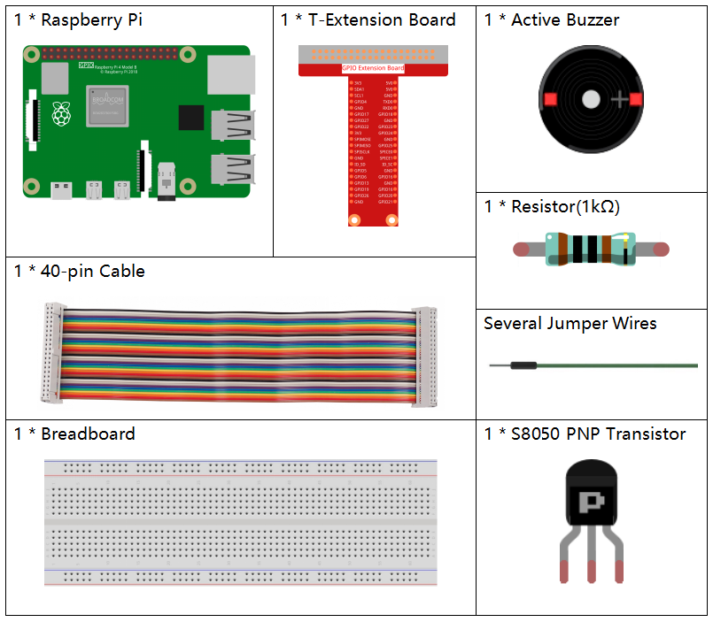
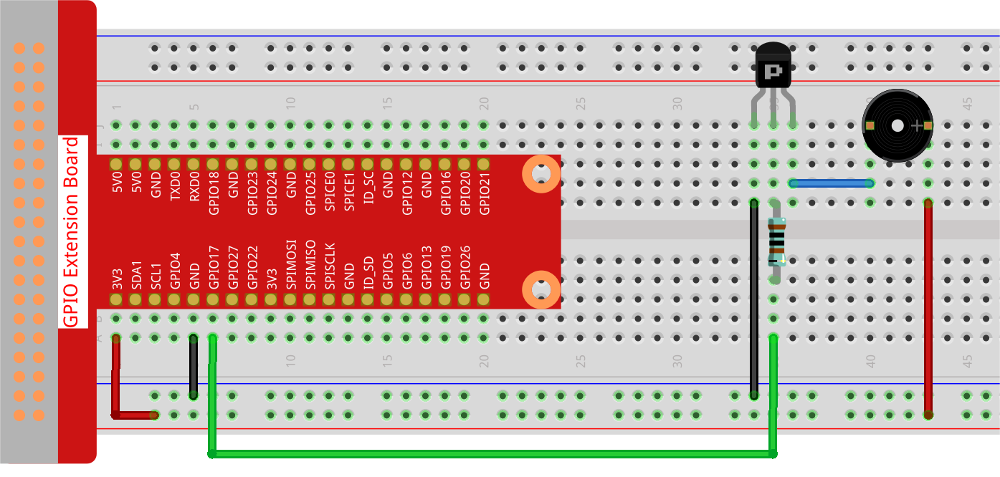

.. _1.2.1_py_pi5:

1.2.1 Active Buzzer
===================

Introduction
------------

In this project, we will learn how to drive an active buzzer to beep with
a PNP transistor.

Required Components
------------------------------

In this project, we need the following components. 

.. raw:: html

    

Schematic Diagram
-----------------

In this experiment, an active buzzer, a PNP transistor and a 1k resistor
are used between the base of the transistor and GPIO to protect the
transistor. When the GPIO17 of Raspberry Pi output is supplied with high
level (3.3V) by programming, the transistor will conduct because of
current saturation and the buzzer will make sounds. But when low level
is supplied to the IO of Raspberry Pi, the transistor will be cut off
and the buzzer will not make sounds.

============ ======== ======== ===
T-Board Name physical wiringPi BCM
GPIO17       Pin 11   0        17
============ ======== ======== ===

.. image:: ../python_pi5/img/1.2.1_active_buzzer_schematic.png

Experimental Procedures
-----------------------

**Step 1:** Build the circuit. (The active buzzer has a white table sticker on the surface and a black back.)

**Step 2**: Open the code file.

.. raw:: html

   <run></run>

.. code-block::

    cd ~/davinci-kit-for-raspberry-pi/python-pi5

**Step 3**: Run.

.. raw:: html

   <run></run>

.. code-block::

    sudo python3 1.2.1_ActiveBuzzer_zero.py

The code run, the buzzer beeps.

**Code**

.. note::

    You can **Modify/Reset/Copy/Run/Stop** the code below. But before that, you need to go to  source code path like ``davinci-kit-for-raspberry-pi/python-pi5``. After modifying the code, you can run it directly to see the effect.

.. raw:: html

    <run></run>

.. code-block:: python

   #!/usr/bin/env python3
   from gpiozero import Buzzer
   from time import sleep

   # Initialize a Buzzer object on GPIO pin 17
   buzzer = Buzzer(17)

   try:
       while True:
           # Turn on the buzzer
           print('Buzzer On')
           buzzer.on()
           sleep(0.1)  # Keep the buzzer on for 0.1 seconds

           # Turn off the buzzer
           print('Buzzer Off')
           buzzer.off()
           sleep(0.1)  # Keep the buzzer off for 0.1 seconds

   except KeyboardInterrupt:
       # Handle KeyboardInterrupt (Ctrl+C) for clean script termination
       pass

**Code Explanation**

#. These statements import the ``Buzzer`` class from the ``gpiozero`` library and the ``sleep`` function from the ``time`` module.

   .. code-block:: python
       
       #!/usr/bin/env python3
       from gpiozero import Buzzer
       from time import sleep

#. This line creates a ``Buzzer`` object connected to GPIO pin 17 on the Raspberry Pi.
    
   .. code-block:: python
       
       # Initialize a Buzzer object on GPIO pin 17
       buzzer = Buzzer(17)
        
      

#. In an infinite loop (``while True``), the buzzer is turned on and off every 0.1 seconds. ``print`` statements provide a console output for each action.
      
   .. code-block:: python
       
       try:
           while True:
               # Turn on the buzzer
               print('Buzzer On')
               buzzer.on()
               sleep(0.1)  # Keep the buzzer on for 0.1 seconds

               # Turn off the buzzer
               print('Buzzer Off')
               buzzer.off()
               sleep(0.1)  # Keep the buzzer off for 0.1 seconds

#. This segment ensures the program can be terminated safely using a keyboard interrupt (Ctrl+C) without throwing an error.
      
   .. code-block:: python
       
       except KeyboardInterrupt:
       # Handle KeyboardInterrupt (Ctrl+C) for clean script termination
       pass
      
