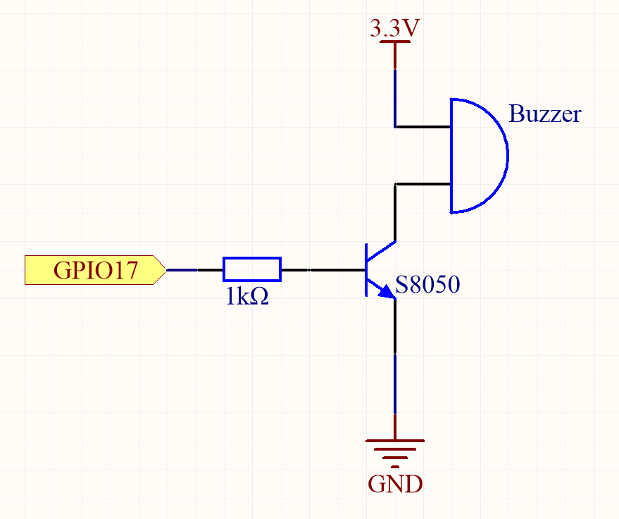

.. note::

    ¡Hola! Bienvenido a la Comunidad de Entusiastas de SunFounder para Raspberry Pi, Arduino y ESP32 en Facebook. Sumérgete en el mundo de Raspberry Pi, Arduino y ESP32 junto a otros entusiastas.

    **¿Por qué unirse?**

    - **Soporte Experto**: Resuelve problemas postventa y desafíos técnicos con la ayuda de nuestra comunidad y equipo.
    - **Aprende y Comparte**: Intercambia consejos y tutoriales para mejorar tus habilidades.
    - **Avances Exclusivos**: Accede anticipadamente a anuncios de nuevos productos y adelantos exclusivos.
    - **Descuentos Especiales**: Aprovecha descuentos exclusivos en nuestros productos más recientes.
    - **Promociones Festivas y Sorteos**: Participa en sorteos y promociones especiales.

     👉 ¿Listo para explorar y crear con nosotros? Haz clic en [|link_sf_facebook|] y únete hoy mismo.

.. _1.2.1_py_pi5:

1.2.1 Zumbador Activo
=========================

Introducción
---------------

En este proyecto, aprenderemos a activar un zumbador activo para que emita 
sonidos usando un transistor PNP.

Componentes Necesarios
------------------------

Para este proyecto, necesitamos los siguientes componentes. 

.. image:: ../python_pi5/img/1.2.1_active_buzzer_list.png

.. raw:: html

    

Diagrama de Conexiones
--------------------------

En este experimento, se utiliza un zumbador activo, un transistor PNP y una 
resistencia de 1k entre la base del transistor y el GPIO para proteger el 
transistor. Cuando el GPIO17 de la Raspberry Pi emite un nivel alto (3.3V) 
mediante programación, el transistor conducirá debido a la saturación de 
corriente y el zumbador emitirá sonido. Sin embargo, cuando se suministra 
un nivel bajo al GPIO de la Raspberry Pi, el transistor se desconectará y el 
zumbador permanecerá en silencio.

============ ======== ======== ===
T-Board Name physical wiringPi BCM
GPIO17       Pin 11   0        17
============ ======== ======== ===

Procedimientos del Experimento
----------------------------------

**Paso 1:** Construye el circuito. (El zumbador activo tiene una etiqueta blanca en la superficie y una parte trasera negra).

.. image:: ../python_pi5/img/1.2.1_ActiveBuzzer_circuit.png

**Paso 2:** Abre el archivo de código.

.. raw:: html

   <run></run>

.. code-block::

    cd ~/davinci-kit-for-raspberry-pi/python-pi5

**Paso 3:** Ejecuta el código.

.. raw:: html

   <run></run>

.. code-block::

    sudo python3 1.2.1_ActiveBuzzer.py

Después de ejecutar el código, el zumbador emitirá un pitido.

.. warning::

    Si aparece el mensaje de error ``RuntimeError: Cannot determine SOC peripheral base address``, consulta :ref:`faq_soc` 

**Código**

.. note::

    Puedes **Modificar/Restablecer/Copiar/Ejecutar/Detener** el código a continuación. Antes de eso, asegúrate de estar en la ruta del código fuente, como ``davinci-kit-for-raspberry-pi/python-pi5``. Después de modificar el código, puedes ejecutarlo directamente para ver el efecto.

.. raw:: html

    <run></run>

.. code-block:: python

   #!/usr/bin/env python3
   from gpiozero import Buzzer
   from time import sleep

   # Inicializa un objeto Buzzer en el pin GPIO 17
   buzzer = Buzzer(17)

   try:
       while True:
           # Enciende el zumbador
           print('Buzzer On')
           buzzer.on()
           sleep(0.1)  # Mantén el zumbador encendido por 0.1 segundos

           # Apaga el zumbador
           print('Buzzer Off')
           buzzer.off()
           sleep(0.1)  # Mantén el zumbador apagado por 0.1 segundos

   except KeyboardInterrupt:
       # Maneja la interrupción de teclado (Ctrl+C) para terminar el script limpiamente
       pass

**Explicación del Código**

#. Estas líneas importan la clase ``Buzzer`` de la librería ``gpiozero`` y la función ``sleep`` del módulo ``time``.

   .. code-block:: python
       
       #!/usr/bin/env python3
       from gpiozero import Buzzer
       from time import sleep

#. Esta línea crea un objeto ``Buzzer`` conectado al pin GPIO 17 en la Raspberry Pi.
    
   .. code-block:: python
       
       # Inicializa un objeto Buzzer en el pin GPIO 17
       buzzer = Buzzer(17)

#. En un bucle infinito (``while True``), el zumbador se enciende y apaga cada 0.1 segundos. Las sentencias ``print`` proporcionan una salida en consola para cada acción.
      
   .. code-block:: python
       
       try:
           while True:
               # Enciende el zumbador
               print('Buzzer On')
               buzzer.on()
               sleep(0.1)  # Mantén el zumbador encendido por 0.1 segundos

               # Apaga el zumbador
               print('Buzzer Off')
               buzzer.off()
               sleep(0.1)  # Mantén el zumbador apagado por 0.1 segundos

#. Este segmento asegura que el programa pueda terminarse de forma segura usando una interrupción de teclado (Ctrl+C) sin generar un error.
      
   .. code-block:: python
       
       except KeyboardInterrupt:
       # Maneja la interrupción de teclado (Ctrl+C) para terminar el script limpiamente
       pass
      
