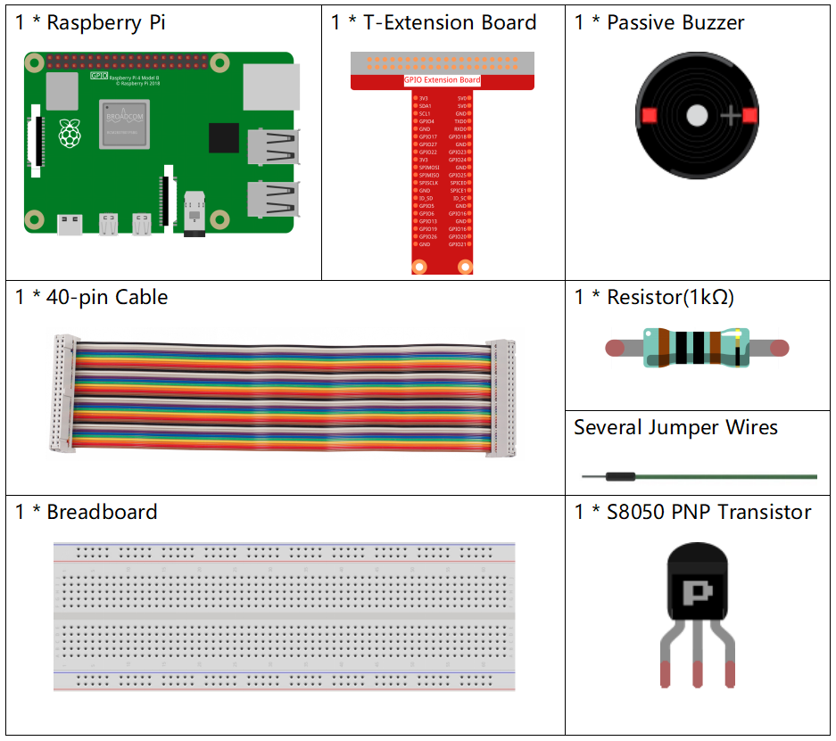
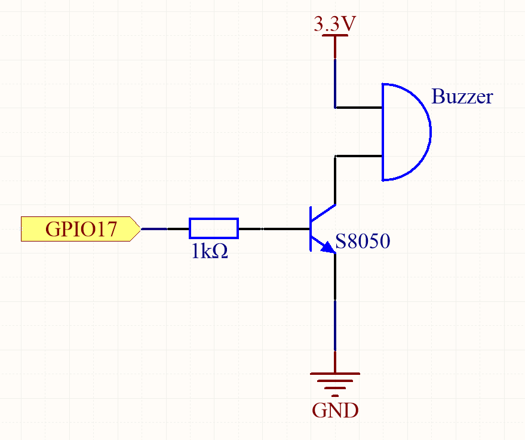
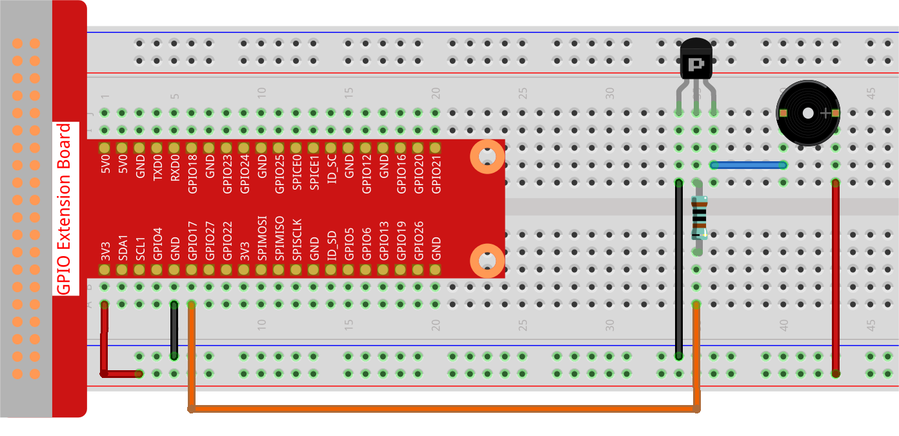

.. note::

    Hello, welcome to the SunFounder Raspberry Pi & Arduino & ESP32 Enthusiasts Community on Facebook! Dive deeper into Raspberry Pi, Arduino, and ESP32 with fellow enthusiasts.

    **Why Join?**

    - **Expert Support**: Solve post-sale issues and technical challenges with help from our community and team.
    - **Learn & Share**: Exchange tips and tutorials to enhance your skills.
    - **Exclusive Previews**: Get early access to new product announcements and sneak peeks.
    - **Special Discounts**: Enjoy exclusive discounts on our newest products.
    - **Festive Promotions and Giveaways**: Take part in giveaways and holiday promotions.

    👉 Ready to explore and create with us? Click [|link_sf_facebook|] and join today!

.. _1.2.2_py_pi5:

1.2.2 Passive Buzzer
=====================

Introduction
------------

In this project, we will learn how to make a passive buzzer play music.

Required Components
------------------------------

In this project, we need the following components. 

.. raw:: html

    

Schematic Diagram
-----------------

In this experiment, a passive buzzer, a PNP transistor and a 1k resistor
are used between the base of the transistor and GPIO to protect the
transistor.

When GPIO17 is given different frequencies, the passive buzzer will emit
different sounds; in this way, the buzzer plays music.

============ ======== ======== ===
T-Board Name physical wiringPi BCM
GPIO17       Pin 11   0        17
============ ======== ======== ===

Experimental Procedures
-----------------------

**Step 1**: Build the circuit. (The Passive buzzer with green circuit board on the back.)

**Step 2: Change directory.**

.. raw:: html

   <run></run>

.. code-block::

    cd ~/davinci-kit-for-raspberry-pi/python-pi5

**Step 3: Run.**

.. raw:: html

   <run></run>

.. code-block::

    sudo python3 1.2.2_PassiveBuzzer_zero.py

The code run, the buzzer plays a piece of music.

**Code**

.. note::

    You can **Modify/Reset/Copy/Run/Stop** the code below. But before that, you need to go to  source code path like ``davinci-kit-for-raspberry-pi/python-pi5``. After modifying the code, you can run it directly to see the effect.

.. raw:: html

    <run></run>

.. code-block:: python

   #!/usr/bin/env python3
   from gpiozero import TonalBuzzer
   from time import sleep

   # Initialize a TonalBuzzer connected to GPIO pin 17
   tb = TonalBuzzer(17)  # Update this pin number based on your setup

   def play(tune):
       """
       Play a musical tune using the buzzer.
       :param tune: List of tuples (note, duration), where each tuple represents a note and its duration.
       """
       for note, duration in tune:
           print(note)  # Output the current note being played
           tb.play(note)  # Play the note on the buzzer
           sleep(float(duration))  # Delay for the duration of the note
       tb.stop()  # Stop playing after the tune is complete

   # Define a musical tune as a sequence of notes and durations
   tune = [('C#4', 0.2), ('D4', 0.2), (None, 0.2),
       ('Eb4', 0.2), ('E4', 0.2), (None, 0.6),
       ('F#4', 0.2), ('G4', 0.2), (None, 0.6),
       ('Eb4', 0.2), ('E4', 0.2), (None, 0.2),
       ('F#4', 0.2), ('G4', 0.2), (None, 0.2),
       ('C4', 0.2), ('B4', 0.2), (None, 0.2),
       ('F#4', 0.2), ('G4', 0.2), (None, 0.2),
       ('B4', 0.2), ('Bb4', 0.5), (None, 0.6),
       ('A4', 0.2), ('G4', 0.2), ('E4', 0.2), 
       ('D4', 0.2), ('E4', 0.2)]

   try:
       play(tune)  # Execute the play function to start playing the tune

   except KeyboardInterrupt:
       # Handle KeyboardInterrupt for graceful termination
       pass

**Code Explanation**

#. These lines import the ``TonalBuzzer`` class from the ``gpiozero`` library for buzzer control and the ``sleep`` function from the ``time`` module for creating delays.
    
   .. code-block:: python  

       #!/usr/bin/env python3
       from gpiozero import TonalBuzzer
       from time import sleep
      

#. This line initializes a ``TonalBuzzer`` object on GPIO pin 17.
    
   .. code-block:: python
       
       # Initialize a TonalBuzzer connected to GPIO pin 17
       tb = TonalBuzzer(17)  # Update this pin number based on your setup
      

#. The ``play`` function iterates over a list of tuples representing musical notes and their durations. Each note is played for its specified duration, and the buzzer stops after completing the tune.
    
   .. code-block:: python  

       def play(tune):
           """
           Play a musical tune using the buzzer.
           :param tune: List of tuples (note, duration), where each tuple represents a note and its duration.
           """
           for note, duration in tune:
               print(note)  # Output the current note being played
               tb.play(note)  # Play the note on the buzzer
               sleep(float(duration))  # Delay for the duration of the note
           tb.stop()  # Stop playing after the tune is complete

#. The tune is defined as a sequence of notes (frequency) and durations (seconds).
    
   .. code-block:: python

       # Define a musical tune as a sequence of notes and durations
       tune = [('C#4', 0.2), ('D4', 0.2), (None, 0.2),
           ('Eb4', 0.2), ('E4', 0.2), (None, 0.6),
           ('F#4', 0.2), ('G4', 0.2), (None, 0.6),
           ('Eb4', 0.2), ('E4', 0.2), (None, 0.2),
           ('F#4', 0.2), ('G4', 0.2), (None, 0.2),
           ('C4', 0.2), ('B4', 0.2), (None, 0.2),
           ('F#4', 0.2), ('G4', 0.2), (None, 0.2),
           ('B4', 0.2), ('Bb4', 0.5), (None, 0.6),
           ('A4', 0.2), ('G4', 0.2), ('E4', 0.2), 
           ('D4', 0.2), ('E4', 0.2)]  

#. The ``play(tune)`` function is called inside a ``try`` block. A ``KeyboardInterrupt`` (like Ctrl+C) will stop the program gracefully.
    
   .. code-block:: python  
       
       try:
           play(tune)  # Execute the play function to start playing the tune

       except KeyboardInterrupt:
           # Handle KeyboardInterrupt for graceful termination
           pass
