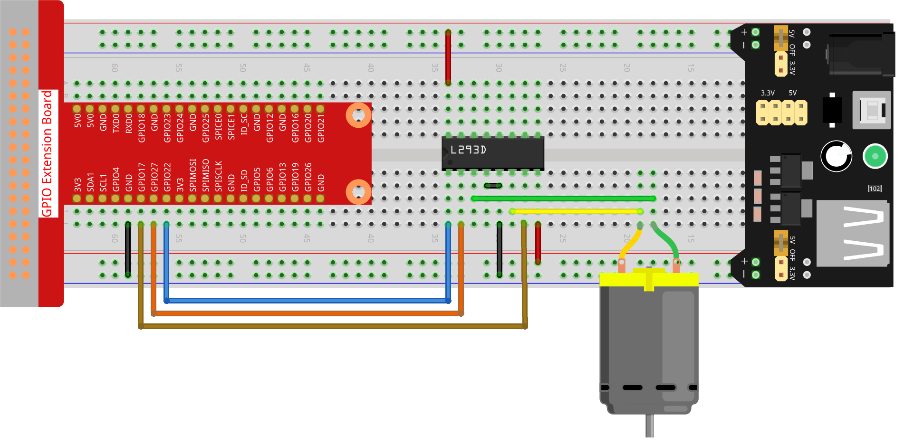

.. note::

    Bonjour et bienvenue dans la communauté SunFounder dédiée aux passionnés de Raspberry Pi, Arduino et ESP32 sur Facebook ! Plongez dans l'univers du Raspberry Pi, d'Arduino et d'ESP32 avec d'autres passionnés.

    **Pourquoi nous rejoindre ?**

    - **Support d'experts** : Résolvez vos problèmes après-vente et les défis techniques avec l'aide de notre communauté et de notre équipe.
    - **Apprendre & Partager** : Échangez des astuces et des tutoriels pour améliorer vos compétences.
    - **Aperçus exclusifs** : Accédez en avant-première aux nouvelles annonces de produits et aux avant-premières.
    - **Réductions spéciales** : Profitez de remises exclusives sur nos nouveaux produits.
    - **Promotions festives et cadeaux** : Participez à des tirages au sort et à des promotions spéciales pendant les fêtes.

    👉 Prêt à explorer et créer avec nous ? Cliquez sur [|link_sf_facebook|] et rejoignez-nous dès aujourd'hui !

.. _1.3.1_py_pi5:

1.3.1 Moteur
================

Introduction
----------------

Dans ce projet, nous allons apprendre à utiliser le L293D pour piloter un moteur 
à courant continu et le faire tourner dans le sens horaire et antihoraire. Comme 
le moteur à courant continu nécessite un courant plus élevé, nous utilisons un module 
d'alimentation pour alimenter les moteurs en toute sécurité.

Composants requis
--------------------

Pour ce projet, nous avons besoin des composants suivants :

.. image:: ../python_pi5/img/1.3.1_motor_list.png

Schéma de câblage
-------------------

.. image:: ../python_pi5/img/1.3.1_motor_schematic.png

Procédures expérimentales
---------------------------

**Étape 1 :** Construisez le circuit.

.. note::
    Le module d'alimentation peut être alimenté par une pile de 9V avec 
    le connecteur de pile 9V fourni dans le kit. Insérez le cavalier du 
    module d'alimentation dans les bandes de bus 5V de la plaque de montage.

.. image:: ../python_pi5/img/1.3.1_motor_battery.jpeg

**Étape 2 :** Accédez au répertoire contenant le code.
.. raw:: html

   <run></run>

.. code-block::

    cd ~/davinci-kit-for-raspberry-pi/python-pi5

**Étape 3 :** Exécutez le script.
.. raw:: html

   <run></run>

.. code-block::

    sudo python3 1.3.1_Motor_zero.py

Lorsque le script s'exécute, le moteur tourne d'abord dans le sens 
horaire pendant 5 secondes, puis s'arrête pendant 5 secondes, avant 
de tourner dans le sens antihoraire pendant 5 secondes. Ensuite, il 
s'arrête à nouveau pendant 5 secondes. Cette séquence est répétée indéfiniment.

.. warning::

    Si le message d'erreur ``RuntimeError: Cannot determine SOC peripheral base address`` apparaît, consultez :ref:`faq_soc`.

**Code**

.. note::

    Vous pouvez **modifier/réinitialiser/copier/exécuter/arrêter** le code ci-dessous. Mais avant cela, assurez-vous de vous rendre 
    dans le répertoire source comme ``davinci-kit-for-raspberry-pi/python-pi5``. Après modification du code, vous pouvez l'exécuter 
    directement pour observer le résultat.
.. raw:: html

    <run></run>
.. code-block:: python

   #!/usr/bin/env python3
   from gpiozero import Motor
   from time import sleep

   # Initialiser le moteur avec GPIO Zero, en spécifiant les GPIO pour avancer (17), reculer (27) et activer (22)
   motor = Motor(forward=17, backward=27, enable=22)

   try:
       # Fonction principale pour contrôler la direction et le mouvement du moteur.
       # Alterne entre la rotation horaire et antihoraire avec des pauses entre chaque mouvement.
       actions = {'CW': motor.forward, 'CCW': motor.backward, 'STOP': motor.stop}  # Définir les actions du moteur pour plus de lisibilité
       
       while True:
           # Parcourt les actions définies pour contrôler la direction du moteur
           for action in ['CW', 'STOP', 'CCW', 'STOP']:
               actions[action]()  # Exécuter l'action actuelle (avancer, s'arrêter, reculer, s'arrêter)
               print(f"{action}")  # Affiche l'action en cours dans la console
               sleep(5)  # Pause de 5 secondes avant de passer à l'action suivante

   except KeyboardInterrupt:
       # Gérer une interruption clavier (par exemple, Ctrl+C) pour arrêter le programme proprement
       pass

**Explication du code**

1. Ces instructions importent la classe ``Motor`` de la bibliothèque ``gpiozero`` et la fonction ``sleep`` du module ``time``.

   .. code-block:: python  

       #!/usr/bin/env python3
       from gpiozero import Motor
       from time import sleep

2. Cette ligne initialise un objet ``Motor``, en spécifiant les GPIO pour avancer (17), reculer (27) et activer (22).

   .. code-block:: python

       # Initialiser le moteur avec GPIO Zero, en spécifiant les GPIO pour avancer (17), reculer (27) et activer (22)
       motor = Motor(forward=17, backward=27, enable=22)

3. Les actions pour contrôler le moteur sont définies dans un dictionnaire pour plus de clarté. Une boucle infinie (`while True`) parcourt ces actions, les exécutant chacune pendant 5 secondes.

   .. code-block:: python

       try:
           # Fonction principale pour contrôler la direction et le mouvement du moteur.
           # Alterne entre la rotation horaire et antihoraire avec des pauses entre chaque mouvement.
           actions = {'CW': motor.forward, 'CCW': motor.backward, 'STOP': motor.stop}  # Définir les actions du moteur pour plus de lisibilité
           
           while True:
               # Parcourt les actions définies pour contrôler la direction du moteur
               for action in ['CW', 'STOP', 'CCW', 'STOP']:
                   actions[action]()  # Exécuter l'action actuelle (avancer, s'arrêter, reculer, s'arrêter)
                   print(f"{action}")  # Affiche l'action en cours dans la console
                   sleep(5)  # Pause de 5 secondes avant de passer à l'action suivante

4. Ce segment permet de terminer le programme en toute sécurité en utilisant une interruption clavier (Ctrl+C) sans provoquer d'erreurs.

   .. code-block:: python

       except KeyboardInterrupt:
       # Gérer une interruption clavier (par exemple, Ctrl+C) pour arrêter le programme proprement
       pass
      

