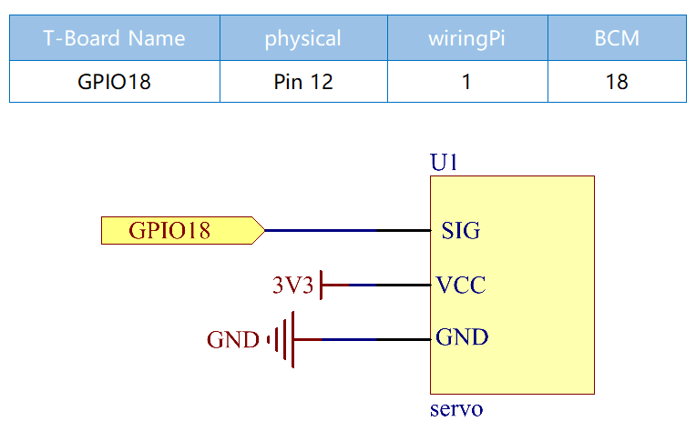
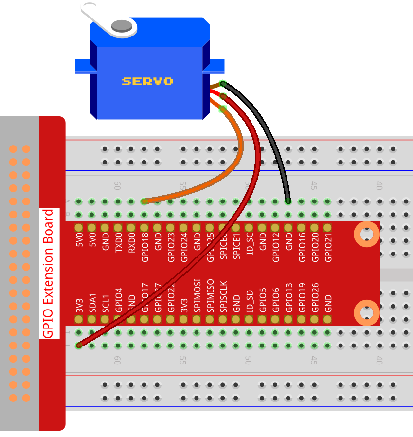

.. _1.3.2_py_pi5:

1.3.2 Servo
============

Introduction
--------------

In this project, we will learn how to make the servo rotate.

Required Components
------------------------------

In this project, we need the following components. 

.. image:: ../python_pi5/img/1.3.2_servo_list.png

Schematic Diagram
--------------------

Experimental Procedures
-----------------------

**Step 1:** Build the circuit.

**Step 2**: Go to the folder of the code.

.. raw:: html

   <run></run>

.. code-block::

    cd ~/davinci-kit-for-raspberry-pi/python-pi5

**Step 3**: Run the executable file.

.. raw:: html

   <run></run>

.. code-block::

    sudo python3 1.3.2_Servo_zero.py

After the program is executed, the servo will rotate from 0 degrees to 90 to 180 degrees, and then from 180 degrees to 90 to 0 degrees, in a circle.

**Code**

.. note::

    You can **Modify/Reset/Copy/Run/Stop** the code below. But before that, you need to go to  source code path like ``davinci-kit-for-raspberry-pi/python-pi5``. After modifying the code, you can run it directly to see the effect.

.. raw:: html

    <run></run>

.. code-block:: python

   #!/usr/bin/env python3
   from gpiozero import Servo
   from time import sleep

   # Set the GPIO pin number where the servo motor is connected
   myGPIO = 18

   # Define a correction factor to fine-tune servo pulse width
   myCorrection = 0.45
   maxPW = (2.0 + myCorrection) / 1000  # Calculate maximum pulse width
   minPW = (1.0 - myCorrection) / 1000  # Calculate minimum pulse width

   # Initialize the Servo object with custom pulse widths
   servo = Servo(myGPIO, min_pulse_width=minPW, max_pulse_width=maxPW)

   try:
       while True:
           # Position the servo at the middle and wait
           servo.mid()
           print("mid")  # Indicate current position
           sleep(0.5)    # Brief pause for 0.5 seconds

           # Move the servo to its minimum position and wait
           servo.min()
           print("min")  # Indicate current position
           sleep(1)      # Hold position for 1 second

           # Return the servo to the middle position and wait
           servo.mid()
           print("mid")  # Indicate current position
           sleep(0.5)    # Brief pause for 0.5 seconds

           # Move the servo to its maximum position and wait
           servo.max()
           print("max")  # Indicate current position
           sleep(1)      # Hold position for 1 second

   except KeyboardInterrupt:
       # Gracefully terminate the script on a keyboard interrupt (Ctrl+C)
       pass
    

**Code Explanation**

#. These import statements bring in the ``Servo`` class for servo control and the ``sleep`` function for timing.

   .. code-block:: python

       #!/usr/bin/env python3
       from gpiozero import Servo
       from time import sleep

#. Sets the GPIO pin number 18 for connecting the servo motor.

   .. code-block:: python

       # Set the GPIO pin number where the servo motor is connected
       myGPIO = 18

#. These lines define a correction factor and use it to calculate the maximum and minimum pulse widths for the servo, fine-tuning its movement range.

   .. code-block:: python

       # Define a correction factor to fine-tune servo pulse width
       myCorrection = 0.45
       maxPW = (2.0 + myCorrection) / 1000  # Calculate maximum pulse width
       minPW = (1.0 - myCorrection) / 1000  # Calculate minimum pulse width

#. Initializes the Servo object with the specified GPIO pin and custom pulse widths.

   .. code-block:: python

       # Initialize the Servo object with custom pulse widths
       servo = Servo(myGPIO, min_pulse_width=minPW, max_pulse_width=maxPW)

#. The `try` block contains a `while True` loop to continuously move the servo. The servo is positioned at mid, min, and max points, with each position printed and held for a specified duration.

   .. code-block:: python

       try:
           while True:
               # Position the servo at the middle and wait
               servo.mid()
               print("mid")  # Indicate current position
               sleep(0.5)    # Brief pause for 0.5 seconds

               # Move the servo to its minimum position and wait
               servo.min()
               print("min")  # Indicate current position
               sleep(1)      # Hold position for 1 second

               # Return the servo to the middle position and wait
               servo.mid()
               print("mid")  # Indicate current position
               sleep(0.5)    # Brief pause for 0.5 seconds

               # Move the servo to its maximum position and wait
               servo.max()
               print("max")  # Indicate current position
               sleep(1)      # Hold position for 1 second

       except KeyboardInterrupt:
           # Gracefully terminate the script on a keyboard interrupt (Ctrl+C)
           pass

