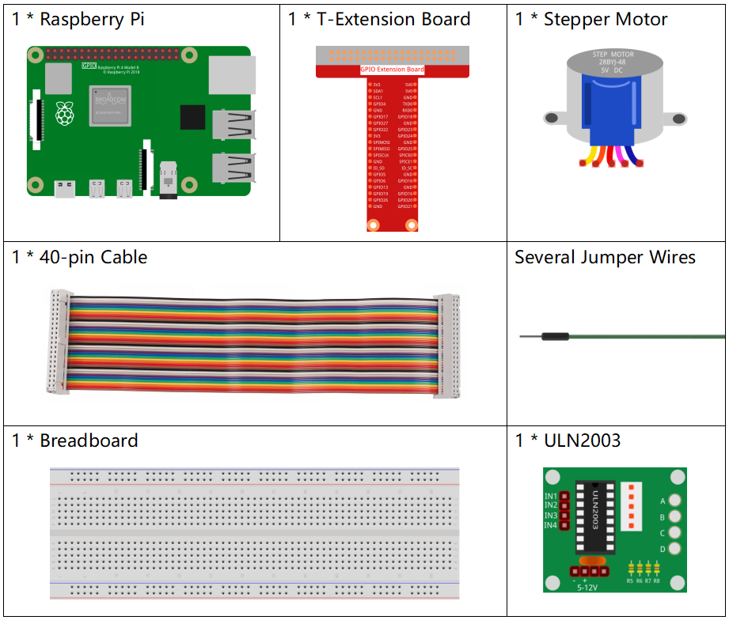
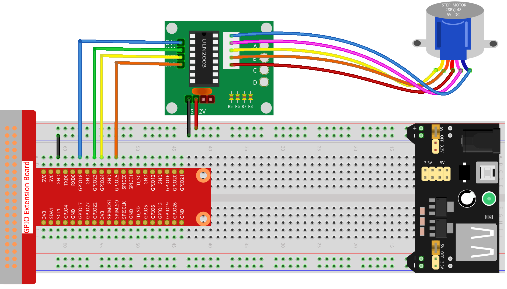

.. note::

    ¡Hola! Bienvenido a la Comunidad de Entusiastas de SunFounder para Raspberry Pi, Arduino y ESP32 en Facebook. Sumérgete en el mundo de Raspberry Pi, Arduino y ESP32 junto a otros entusiastas.

    **¿Por qué unirse?**

    - **Soporte Experto**: Resuelve problemas postventa y desafíos técnicos con la ayuda de nuestra comunidad y equipo.
    - **Aprende y Comparte**: Intercambia consejos y tutoriales para mejorar tus habilidades.
    - **Avances Exclusivos**: Accede anticipadamente a anuncios de nuevos productos y adelantos exclusivos.
    - **Descuentos Especiales**: Aprovecha descuentos exclusivos en nuestros productos más recientes.
    - **Promociones Festivas y Sorteos**: Participa en sorteos y promociones especiales.

    👉 ¿Listo para explorar y crear con nosotros? Haz clic en [|link_sf_facebook|] y únete hoy mismo.

.. _1.3.3_py_pi5:

1.3.3 Motor a Pasos
======================

Introducción
----------------

Los motores a pasos, debido a su diseño único, pueden ser controlados con 
un alto grado de precisión sin necesidad de mecanismos de retroalimentación. 
El eje de un motor a pasos, equipado con una serie de imanes, es controlado 
por una secuencia específica de bobinas electromagnéticas que se cargan positiva y 
negativamente, moviéndolo hacia adelante o hacia atrás en pequeños \"pasos\".

Componentes Necesarios
--------------------------

En este proyecto, necesitamos los siguientes componentes. 

.. raw:: html

    

Diagrama de Conexiones
--------------------------

.. image:: /python_pi5/img/1.3.3_stepper_motor_schematic.png

Procedimientos del Experimento
---------------------------------

**Paso 1:** Construye el circuito.

**Paso 2:** Abre el archivo de código.

.. raw:: html

   <run></run>

.. code-block::

    cd ~/davinci-kit-for-raspberry-pi/python-pi5

**Paso 3:** Ejecuta el código.

.. raw:: html

   <run></run>

.. code-block::

    sudo python3 1.3.3_StepperMotor.py

Al ejecutar el código, el motor a pasos girará en sentido horario o antihorario, dependiendo de la entrada \'a\' o \'c\'.

.. warning::

    Si aparece el mensaje de error ``RuntimeError: Cannot determine SOC peripheral base address``, consulta :ref:`faq_soc` 

**Código**

.. note::

    Puedes **Modificar/Restablecer/Copiar/Ejecutar/Detener** el código a continuación. Antes de eso, asegúrate de estar en la ruta del código fuente, como ``davinci-kit-for-raspberry-pi/python-pi5``. Después de modificar el código, puedes ejecutarlo directamente para ver el efecto.

.. raw:: html

    <run></run>

.. code-block:: python

   #!/usr/bin/env python3
   from gpiozero import OutputDevice
   from time import sleep

   # Inicializa los pines del motor a los GPIO 18, 23, 24, 25
   motorPin = [OutputDevice(pin) for pin in (18, 23, 24, 25)]

   # Define parámetros de velocidad de rotación del motor
   rotationPerMinute = 15
   stepsPerRevolution = 2048
   # Calcula el tiempo de espera entre cada paso para un funcionamiento suave
   stepSpeed = (60 / rotationPerMinute) / stepsPerRevolution

   def rotary(direction):
       """
       Controls the rotation of the motor based on the specified direction.
       
       :param direction: 'c' for clockwise, 'a' for anti-clockwise
       """
       if direction == 'c':
           # Ejecuta la secuencia de pasos para rotación en sentido horario
           for j in range(4):
               for i in range(4):
                   if 0x99 << j & (0x08 >> i):
                       motorPin[i].on()
                   else:
                       motorPin[i].off()
                   sleep(stepSpeed)
       elif direction == 'a':
           # Ejecuta la secuencia de pasos para rotación en sentido antihorario
           for j in range(4):
               for i in range(4):
                   if 0x99 >> j & (0x08 >> i):
                       motorPin[i].on()
                   else:
                       motorPin[i].off()
                   sleep(stepSpeed)

   def loop():
       """
       Continuously prompts the user to select the motor rotation direction
       and controls the motor based on this input.
       """
       while True:
           direction = input('Select motor direction a=anticlockwise, c=clockwise: ')
           if direction == 'c':
               print('Motor running clockwise\n')
               break
           elif direction == 'a':
               print('Motor running anti-clockwise\n')
               break
           else:
               print('Input error, please try again!')

       # Mantiene el motor girando en la dirección seleccionada
       while True:
           rotary(direction)

   def destroy():
       """
       Safely turns off all motor pins, used for clean shutdown.
       """
       for pin in motorPin:
           pin.off()

   # Ejecución principal del programa
   try:
       loop()
   except KeyboardInterrupt:
       destroy()  # Maneja la interrupción de teclado para apagar el motor de manera segura

**Explicación del Código**

#. Esta sección importa las bibliotecas necesarias. ``gpiozero`` para controlar los pines GPIO y ``time`` para la función sleep utilizada en el control de temporización.

   .. code-block:: python

       #!/usr/bin/env python3
       from gpiozero import OutputDevice
       from time import sleep

#. Inicializa los pines GPIO 18, 23, 24 y 25 como dispositivos de salida para controlar el motor a pasos.

   .. code-block:: python

       # Inicializa los pines del motor a los GPIO 18, 23, 24, 25
       motorPin = [OutputDevice(pin) for pin in (18, 23, 24, 25)]

#. Configura la velocidad de rotación del motor y calcula el intervalo de tiempo entre cada paso para un funcionamiento suave.

   .. code-block:: python

       # Define parámetros de velocidad de rotación del motor
       rotationPerMinute = 15
       stepsPerRevolution = 2048
       # Calcula el tiempo de espera entre cada paso para un funcionamiento suave
       stepSpeed = (60 / rotationPerMinute) / stepsPerRevolution

#. La función ``rotary`` controla la rotación del motor usando manipulación de bits y una secuencia de pasos para activar los pines en el orden correcto para la rotación en sentido horario o antihorario.

   .. code-block:: python

       def rotary(direction):
           """
           Controls the rotation of the motor based on the specified direction.
           
           :param direction: 'c' for clockwise, 'a' for anti-clockwise
           """
           if direction == 'c':
               # Ejecuta la secuencia de pasos para rotación en sentido horario
               for j in range(4):
                   for i in range(4):
                       if 0x99 << j & (0x08 >> i):
                           motorPin[i].on()
                       else:
                           motorPin[i].off()
                       sleep(stepSpeed)
           elif direction == 'a':
               # Ejecuta la secuencia de pasos para rotación en sentido antihorario
               for j in range(4):
                   for i in range(4):
                       if 0x99 >> j & (0x08 >> i):
                           motorPin[i].on()
                       else:
                           motorPin[i].off()
                       sleep(stepSpeed)

#. Esta función solicita continuamente al usuario que elija la dirección de rotación del motor y controla el motor en función de la entrada.

   .. code-block:: python

       def loop():
           """
           Continuously prompts the user to select the motor rotation direction
           and controls the motor based on this input.
           """
           while True:
               direction = input('Select motor direction a=anticlockwise, c=clockwise: ')
               if direction == 'c':
                   print('Motor running clockwise\n')
                   break
               elif direction == 'a':
                   print('Motor running anti-clockwise\n')
                   break
               else:
                   print('Input error, please try again!')

           # Mantiene el motor girando en la dirección seleccionada
           while True:
               rotary(direction)

#. La función ``destroy`` apaga todos los pines del motor. Es utilizada para un apagado seguro, asegurando que el motor se detenga al finalizar el programa.

   .. code-block:: python

       def destroy():
           """
           Safely turns off all motor pins, used for clean shutdown.
           """
           for pin in motorPin:
               pin.off()

#. El programa principal llama a ``loop`` y maneja interrupciones de teclado (como Ctrl+C) para apagar el motor de manera segura usando ``destroy``.

   .. code-block:: python

       # Ejecución principal del programa
       try:
           loop()
       except KeyboardInterrupt:
           destroy()  # Maneja la interrupción de teclado para apagar el motor de manera segura

