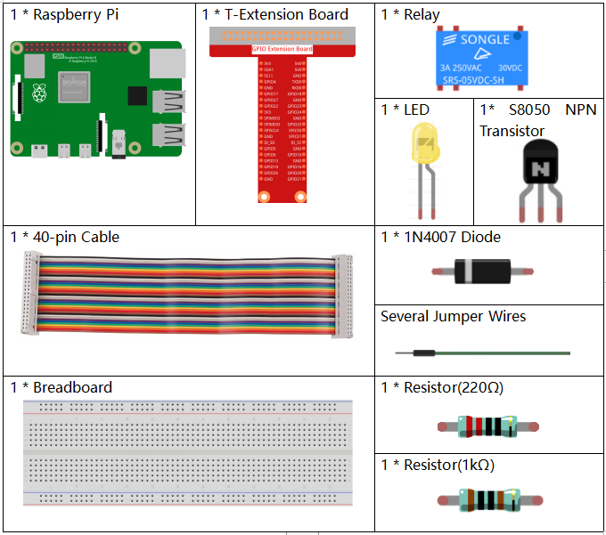

.. note::

    Bonjour et bienvenue dans la communauté SunFounder Raspberry Pi, Arduino & ESP32 Enthusiasts sur Facebook ! Plongez plus profondément dans le monde du Raspberry Pi, de l'Arduino et de l'ESP32 avec d'autres passionnés.

    **Pourquoi nous rejoindre ?**

    - **Assistance d'experts** : Résolvez les problèmes après-vente et les défis techniques grâce à l'aide de notre communauté et de notre équipe.
    - **Apprendre et partager** : Échangez des astuces et des tutoriels pour perfectionner vos compétences.
    - **Aperçus exclusifs** : Accédez en avant-première aux nouvelles annonces de produits et aux avant-goûts des nouveautés.
    - **Réductions spéciales** : Profitez de réductions exclusives sur nos derniers produits.
    - **Promotions festives et concours** : Participez à des concours et à des promotions spéciales pour les fêtes.

    👉 Prêt à explorer et créer avec nous ? Cliquez sur [|link_sf_facebook|] et rejoignez-nous dès aujourd'hui !

.. _1.3.4_py_pi5:

1.3.4 Relais
==============

Introduction
---------------

Dans ce projet, nous allons apprendre à utiliser un relais. C'est l'un des 
composants les plus couramment utilisés dans les systèmes de contrôle automatique. 
Lorsque la tension, le courant, la température, la pression, etc., atteignent, dépassent 
ou sont inférieurs à une valeur prédéterminée, le relais va connecter ou interrompre 
le circuit pour contrôler et protéger l'équipement.

Composants nécessaires
--------------------------

Pour ce projet, nous aurons besoin des composants suivants.

.. raw:: html

    

Schéma de circuit
------------------

.. image:: ../python_pi5/img/1.3.4_relay_schematic.png

Procédure expérimentale
---------------------------

**Étape 1 :** Construire le circuit.

.. image:: ../python_pi5/img/1.3.4_relay_circuit.png

**Étape 2 :** Ouvrir le fichier de code.

.. raw:: html

   <run></run>

.. code-block::

    cd ~/davinci-kit-for-raspberry-pi/python-pi5

**Étape 3 :** Exécuter.

.. raw:: html

   <run></run>

.. code-block::

    sudo python3 1.3.4_Relay_zero.py

Pendant l'exécution du code, la LED s'allume. De plus, vous entendrez un 
bruit de "tic-tac" provoqué par l'ouverture et la fermeture des contacts du relais.

.. warning::

    En cas d'erreur « RuntimeError: Cannot determine SOC peripheral base address », veuillez consulter :ref:`faq_soc`

**Code**

.. note::

    Vous pouvez **modifier/réinitialiser/copier/exécuter/arrêter** le code ci-dessous. Mais avant cela, assurez-vous de vous rendre dans le répertoire source, par exemple ``davinci-kit-for-raspberry-pi/python-pi5``. Après avoir modifié le code, vous pouvez l'exécuter directement pour observer le résultat.

.. raw:: html

    <run></run>

.. code-block:: python

   #!/usr/bin/env python3
   from gpiozero import OutputDevice  # Importer la classe pour contrôler les broches GPIO
   from time import sleep  # Importer la fonction sleep pour les temporisations

   # Initialiser le relais connecté à la broche GPIO 17
   relais = OutputDevice(17)

   try:
       # Boucle pour basculer continuellement l'état du relais toutes les secondes
       while True:
           print('Relay open...')  # Indiquer que le relais est activé
           relais.on()  # Allumer le relais (configuration active low présumée)
           sleep(1)   # Maintenir le relais en position allumée pendant 1 seconde

           print('...Relay close')  # Indiquer que le relais est désactivé
           relais.off()  # Éteindre le relais
           sleep(1)   # Maintenir le relais en position éteinte pendant 1 seconde

   except KeyboardInterrupt:
       # Gérer une interruption clavier (Ctrl+C) pour quitter la boucle
       relais.off()  # S'assurer que le relais est éteint avant de quitter
       pass

**Explication du code**

#. Cela importe ``OutputDevice`` de la bibliothèque ``gpiozero`` pour contrôler les broches GPIO et ``sleep`` de la bibliothèque ``time`` pour ajouter des temporisations.

   .. code-block:: python

       #!/usr/bin/env python3
       from gpiozero import OutputDevice  # Importer la classe pour contrôler les broches GPIO
       from time import sleep  # Importer la fonction sleep pour les temporisations

#. Initialise un objet ``OutputDevice`` pour le relais connecté à la broche GPIO 17.

   .. code-block:: python

       # Initialiser le relais connecté à la broche GPIO 17
       relais = OutputDevice(17)

#. À l'intérieur du bloc ``try``, une boucle ``while True`` bascule continuellement l'état du relais. Le relais est allumé et éteint avec un délai de 1 seconde entre chaque état, accompagné de messages imprimés dans la console.

   .. code-block:: python

       try:
           # Boucle pour basculer continuellement l'état du relais toutes les secondes
           while True:
               print('Relay open...')  # Indiquer que le relais est activé
               relais.on()  # Allumer le relais (configuration active low présumée)
               sleep(1)   # Maintenir le relais en position allumée pendant 1 seconde

               print('...Relay close')  # Indiquer que le relais est désactivé
               relais.off()  # Éteindre le relais
               sleep(1)   # Maintenir le relais en position éteinte pendant 1 seconde

#. Capture une interruption clavier (comme Ctrl+C) pour permettre une terminaison propre du script. Le relais est éteint avant de quitter le script.

   .. code-block:: python
       
       except KeyboardInterrupt:
       # Gérer une interruption clavier (Ctrl+C) pour quitter la boucle
       relais.off()  # S'assurer que le relais est éteint avant de quitter
       pass

