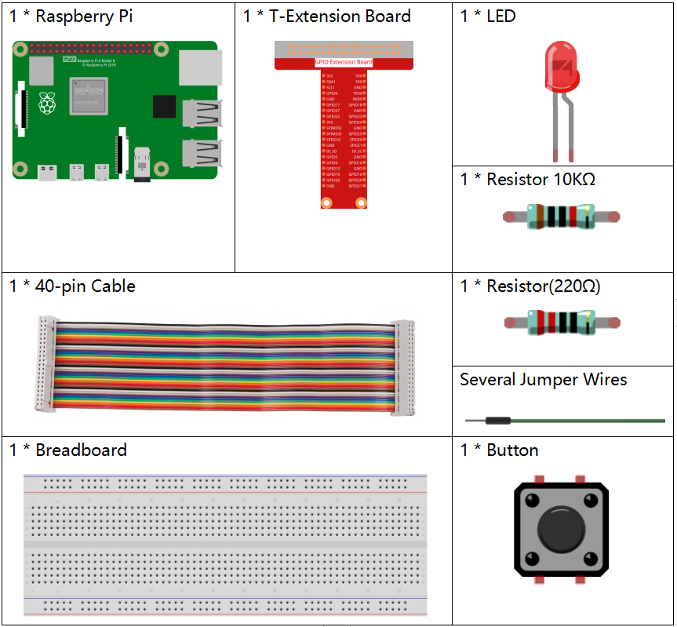
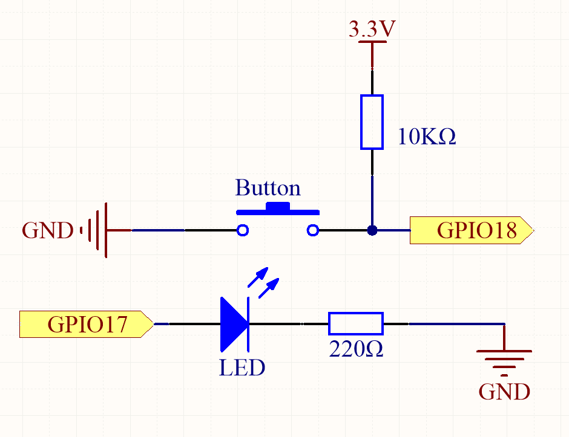
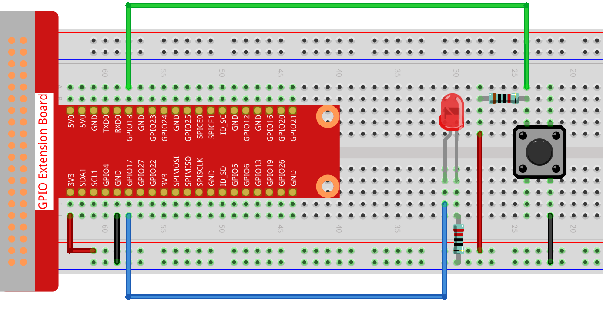

.. note::

    Hallo und willkommen in der SunFounder Raspberry Pi & Arduino & ESP32 Enthusiasten-Gemeinschaft auf Facebook! Tauchen Sie tiefer ein in die Welt von Raspberry Pi, Arduino und ESP32 mit anderen Enthusiasten.

    **Warum beitreten?**

    - **Expertenunterstützung**: Lösen Sie Nachverkaufsprobleme und technische Herausforderungen mit Hilfe unserer Gemeinschaft und unseres Teams.
    - **Lernen & Teilen**: Tauschen Sie Tipps und Anleitungen aus, um Ihre Fähigkeiten zu verbessern.
    - **Exklusive Vorschauen**: Erhalten Sie frühzeitigen Zugang zu neuen Produktankündigungen und exklusiven Einblicken.
    - **Spezialrabatte**: Genießen Sie exklusive Rabatte auf unsere neuesten Produkte.
    - **Festliche Aktionen und Gewinnspiele**: Nehmen Sie an Gewinnspielen und Feiertagsaktionen teil.

    👉 Sind Sie bereit, mit uns zu erkunden und zu erschaffen? Klicken Sie auf [|link_sf_facebook|] und treten Sie heute bei!

.. _2.1.1_py_pi5:

2.1.1 Taste
===============

Einführung
-----------------

In diesem Projekt lernen wir, wie man eine LED mithilfe einer Taste ein- oder ausschaltet.

Erforderliche Komponenten
------------------------------

Für dieses Projekt benötigen wir folgende Komponenten. 

.. raw:: html

    

Schaltplan
---------------------

Verwenden Sie eine normalerweise offene Taste als Eingang für den Raspberry Pi, die Verbindung ist im folgenden Schaltplan dargestellt. Wenn die Taste gedrückt wird, wird der GPIO18 auf ein hohes Niveau (3,3 V) geschaltet. Wir können den Zustand des GPIO18 durch Programmierung erkennen. Das bedeutet, wenn der GPIO18 auf ein hohes Niveau geschaltet wird, bedeutet dies, dass die Taste gedrückt ist. Sie können den entsprechenden Code ausführen, wenn die Taste gedrückt wird, und dann leuchtet die LED auf.

.. note::
    Der längere Pin der LED ist die Anode und der kürzere ist die
    Kathode.

.. image:: ../python_pi5/img/2.1.1_Button_schematic_1.png

Versuchsdurchführung
---------------------------

**Schritt 1**: Bauen Sie die Schaltung.

**Schritt 2**: Öffnen Sie die Code-Datei.

.. raw:: html

   <run></run>

.. code-block:: 

    cd ~/davinci-kit-for-raspberry-pi/python-pi5

**Schritt 3**: Führen Sie den Code aus.

.. raw:: html

   <run></run>

.. code-block:: 

    sudo python3 2.1.1_Button_zero.py

Drücken Sie jetzt die Taste und die LED leuchtet auf; lassen Sie die Taste los und die LED erlischt.

**Code**

.. note::

    Sie können den folgenden Code **Ändern/Zurücksetzen/Kopieren/Ausführen/Stoppen**. Bevor Sie das tun, müssen Sie jedoch zum Quellcodepfad wie ``davinci-kit-for-raspberry-pi/python-pi5`` gehen. Nach der Änderung des Codes können Sie ihn direkt ausführen, um die Wirkung zu sehen.

.. raw:: html

    <run></run>

.. code-block:: python

   #!/usr/bin/env python3
   from gpiozero import LED, Button  # Importieren Sie die Klassen LED und Button aus gpiozero
   from signal import pause  # Importieren Sie die Funktion pause aus dem Modul signal

   # Initialisieren Sie ein LED-Objekt am GPIO-Pin 17
   led = LED(17)
   # Initialisieren Sie ein Button-Objekt am GPIO-Pin 18
   button = Button(18)

   # Verknüpfen Sie das "when_pressed"-Ereignis der Taste mit der Methode on() der LED
   button.when_pressed = led.on
   # Verknüpfen Sie das "when_released"-Ereignis der Taste mit der Methode off() der LED
   button.when_released = led.off

   # Führen Sie eine Ereignisschleife aus, die auf Tastenereignisse wartet und das Skript am Laufen hält
   pause()

**Code-Erklärung**

#. Das Skript ist in Python3 geschrieben und importiert die Klassen ``LED`` und ``Button`` aus der Bibliothek ``gpiozero`` sowie ``pause`` aus dem Modul ``signal``.

   .. code-block:: python

       #!/usr/bin/env python3
       from gpiozero import LED, Button  # Importieren Sie die Klassen LED und Button aus gpiozero
       from signal import pause  # Importieren Sie die Funktion pause aus dem Modul signal

#. Initialisiert ein ``LED``-Objekt am GPIO-Pin 17 und ein ``Button``-Objekt am GPIO-Pin 18.

   .. code-block:: python

       # Initialisieren Sie ein LED-Objekt am GPIO-Pin 17
       led = LED(17)
       # Initialisieren Sie ein Button-Objekt am GPIO-Pin 18
       button = Button(18)

#. Richtet Ereignishandler ein, damit die LED eingeschaltet wird, wenn die Taste gedrückt wird, und ausgeschaltet wird, wenn die Taste losgelassen wird.

   .. code-block:: python

       # Verknüpfen Sie das "when_pressed"-Ereignis der Taste mit der Methode on() der LED
       button.when_pressed = led.on
       # Verknüpfen Sie das "when_released"-Ereignis der Taste mit der Methode off() der LED
       button.when_released = led.off

#. Dies hält das Skript in einer Ereignisschleife, die auf Tasten-Druck- und Loslassen-Ereignisse wartet.

   .. code-block:: python
       
       # Führen Sie eine Ereignisschleife aus, die auf Tastenereignisse wartet und das Skript am Laufen hält
       pause()
