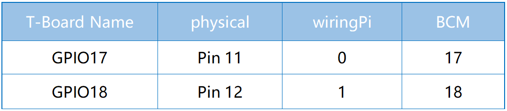

.. note::

    Ciao e benvenuto nella Community di Appassionati di SunFounder per Raspberry Pi, Arduino ed ESP32 su Facebook! Esplora a fondo il mondo di Raspberry Pi, Arduino ed ESP32 insieme a tanti altri appassionati.

    **Perché Unirsi?**

    - **Supporto da Esperti**: Risolvi problemi post-vendita e sfide tecniche con l’aiuto della nostra community e del nostro team.
    - **Impara e Condividi**: Scambia consigli e tutorial per migliorare le tue competenze.
    - **Anteprime Esclusive**: Ottieni accesso anticipato agli annunci dei nuovi prodotti e a contenuti inediti.
    - **Sconti Speciali**: Approfitta di sconti esclusivi sui nostri prodotti più recenti.
    - **Promozioni Festive e Giveaway**: Partecipa a concorsi e promozioni festive.

    👉 Pronto a esplorare e creare con noi? Clicca su [|link_sf_facebook|] e unisciti oggi stesso!

.. _2.1.1_py_pi5:

2.1.1 Pulsante
=================

Introduzione
------------------

In questo progetto impareremo a accendere o spegnere il LED utilizzando un 
pulsante.

Componenti Necessari
------------------------------

In questo progetto, abbiamo bisogno dei seguenti componenti.

.. image:: ../python_pi5/img/2.1.1_Button_list.png

.. raw:: html

    

Schema Elettrico
---------------------

Usiamo un pulsante normalmente aperto come input per il Raspberry Pi. La connessione è mostrata nello schema seguente. Quando il pulsante viene premuto, il GPIO18 raggiungerà un livello alto (3,3V). Possiamo rilevare lo stato del GPIO18 tramite programmazione: se il GPIO18 raggiunge un livello alto, significa che il pulsante è stato premuto. È possibile eseguire il codice corrispondente quando il pulsante viene premuto, e così il LED si accenderà.

.. note::
    Il pin più lungo del LED è l'anodo, mentre quello più corto è il catodo.

.. image:: ../python_pi5/img/2.1.1_Button_schematic_2.png

Procedure Sperimentali
---------------------------

**Passo 1**: Costruisci il circuito.

**Passo 2**: Apri il file del codice.

.. raw:: html

   <run></run>

.. code-block:: 

    cd ~/davinci-kit-for-raspberry-pi/python-pi5

**Passo 3**: Esegui il codice.

.. raw:: html

   <run></run>

.. code-block:: 

    sudo python3 2.1.1_Button_zero.py

Ora, premi il pulsante e il LED si accenderà; rilascia il pulsante e il LED si spegnerà.

.. warning::

    Se compare l'errore ``RuntimeError: Cannot determine SOC peripheral base address``, consulta :ref:`faq_soc` 

**Codice**

.. note::

    Puoi **Modificare/Reimpostare/Copiare/Eseguire/Interrompere** il codice qui sotto. Prima di farlo, però, vai al percorso del codice sorgente, come ``davinci-kit-for-raspberry-pi/python-pi5``. Dopo aver modificato il codice, potrai eseguirlo direttamente per vedere il risultato.

.. raw:: html

    <run></run>

.. code-block:: python

   #!/usr/bin/env python3
   from gpiozero import LED, Button  # Importa le classi LED e Button da gpiozero
   from signal import pause  # Importa la funzione pause dal modulo signal

   # Inizializza un oggetto LED sul pin GPIO 17
   led = LED(17)
   # Inizializza un oggetto Button sul pin GPIO 18
   button = Button(18)

   # Collega l'evento "when_pressed" del pulsante al metodo on() del LED
   button.when_pressed = led.on
   # Collega l'evento "when_released" del pulsante al metodo off() del LED
   button.when_released = led.off

   # Avvia un ciclo di eventi che attende eventi del pulsante e mantiene attivo lo script
   pause()

**Spiegazione del Codice**

#. Lo script è scritto in Python3 e importa le classi ``LED`` e ``Button`` dalla libreria ``gpiozero``, e ``pause`` dal modulo ``signal``.

   .. code-block:: python

       #!/usr/bin/env python3
       from gpiozero import LED, Button  # Importa le classi LED e Button da gpiozero
       from signal import pause  # Importa la funzione pause dal modulo signal

#. Inizializza un oggetto ``LED`` sul pin GPIO 17 e un oggetto ``Button`` sul pin GPIO 18.

   .. code-block:: python

       # Inizializza un oggetto LED sul pin GPIO 17
       led = LED(17)
       # Inizializza un oggetto Button sul pin GPIO 18
       button = Button(18)

#. Configura i gestori di eventi in modo che il LED si accenda quando il pulsante è premuto e si spenga quando il pulsante è rilasciato.

   .. code-block:: python

       # Collega l'evento "when_pressed" del pulsante al metodo on() del LED
       button.when_pressed = led.on
       # Collega l'evento "when_released" del pulsante al metodo off() del LED
       button.when_released = led.off

#. Mantiene lo script attivo in un ciclo di eventi, in attesa degli eventi di pressione e rilascio del pulsante.

   .. code-block:: python
       
       # Avvia un ciclo di eventi che attende eventi del pulsante e mantiene attivo lo script
       pause()

