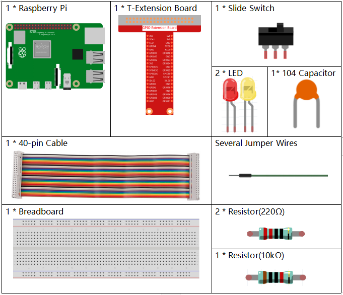
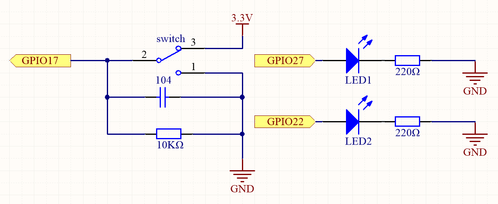
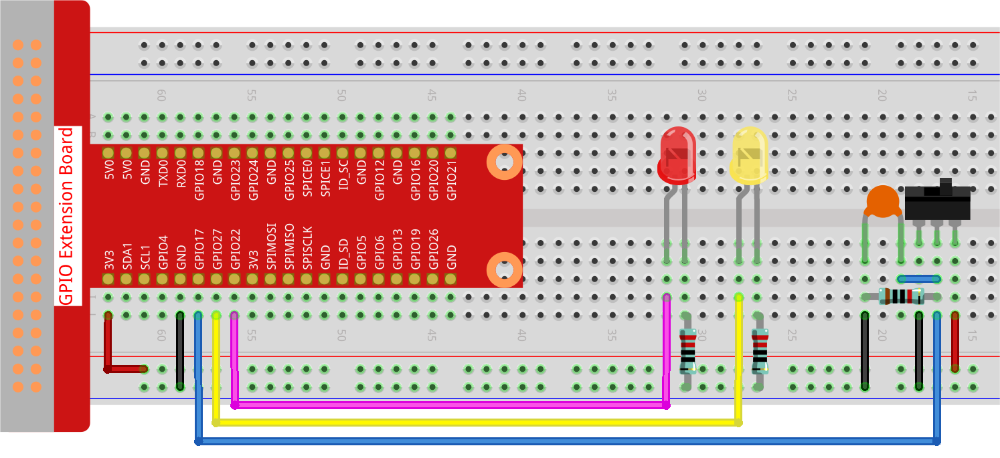

.. note::

    こんにちは、SunFounderのRaspberry Pi & Arduino & ESP32愛好家コミュニティへようこそ！Facebook上でRaspberry Pi、Arduino、ESP32についてもっと深く掘り下げ、他の愛好家と交流しましょう。

    **参加する理由は？**

    - **エキスパートサポート**：コミュニティやチームの助けを借りて、販売後の問題や技術的な課題を解決します。
    - **学び＆共有**：ヒントやチュートリアルを交換してスキルを向上させましょう。
    - **独占的なプレビュー**：新製品の発表や先行プレビューに早期アクセスしましょう。
    - **特別割引**：最新製品の独占割引をお楽しみください。
    - **祭りのプロモーションとギフト**：ギフトや祝日のプロモーションに参加しましょう。

    👉 私たちと一緒に探索し、創造する準備はできていますか？[|link_sf_facebook|]をクリックして今すぐ参加しましょう！

.. _2.1.2_py_pi5:

2.1.2 スライドスイッチ
======================================================

はじめに
------------

このプロジェクトでは、スライドスイッチの使用方法を学びます。通常、スライドスイッチは基板上にはんだ付けされて電源スイッチとして使用されますが、ここではそれをブレッドボードに挿入して使用し、しっかり固定されない場合があります。また、スライドスイッチをブレッドボードに取り付けてその機能を示します。

必要な部品
------------------------------

このプロジェクトには、以下の部品が必要です。

.. raw:: html

    

回路図
-----------------

スライドスイッチの中央のピンをGPIO17に接続し、2つのLEDをそれぞれGPIO22とGPIO27のピンに接続します。そして、スライドを引くと2つのLEDが交互に点灯するのを確認できます。

.. image:: ../python_pi5/img/2.1.2_slide_switch_schematic_1.png

実験手順
-----------------------

**ステップ1**: 回路を組み立てます。

**ステップ2**: コードのフォルダに移動します。

.. raw:: html

   <run></run>

.. code-block::

    cd ~/davinci-kit-for-raspberry-pi/python-pi5

**ステップ3**: 実行します。

.. raw:: html

   <run></run>

.. code-block::

    sudo python3 2.1.2_Slider.py

コードが実行されている間、スイッチを左に接続すると黄色のLEDが点灯し、右に接続すると赤いLEDが点灯します。

.. warning::

    エラー メッセージ ``RuntimeError: Cannot determine SOC peripheral base address`` が表示された場合は、 :ref:`faq_soc` を参照してください。

**コード**

.. note::

    以下のコードを **変更/リセット/コピー/実行/停止** できます。ただし、それに先立ち、 ``davinci-kit-for-raspberry-pi/python-pi5`` のようなソースコードのパスに移動する必要があります。コードを変更した後、効果を直接確認するために実行できます。

.. raw:: html

    <run></run>

.. code-block:: python

   #!/usr/bin/env python3
   from gpiozero import LED, Button  # GPIOデバイスを制御するためにLEDとButtonクラスをインポート
   from time import sleep  # 遅延を追加するためにsleep関数をインポート

   # プルアップ抵抗を無効にしてGPIOピン17に接続されたマイクロスイッチを初期化
   micro_switch = Button(17, pull_up=False)
   # GPIOピン22に接続されたLED1を初期化
   led1 = LED(22)
   # GPIOピン27に接続されたLED2を初期化
   led2 = LED(27)

   try:
       # マイクロスイッチの状態に基づいてLEDの状態を制御するメインループ
       while True:
           if micro_switch.is_pressed:  # マイクロスイッチが押されているかどうかを確認
               print('    LED1 ON    ')  # ステータスメッセージを表示
               led1.on()   # LED1を点灯
               led2.off()  # LED2を消灯
           else:  # マイクロスイッチが押されていない場合
               print('    LED2 ON    ')  # ステータスメッセージを表示
               led1.off()  # LED1を消灯
               led2.on()   # LED2を点灯

           sleep(0.5)  # スイッチの状態を再確認する前に0.5秒待機

   except KeyboardInterrupt:
       # キーボード割り込み（Ctrl+Cなど）を処理してループからきれいに終了する
       pass
 

**コードの説明**

#. この行はスクリプトをPython 3で実行するように設定します。 ``gpiozero`` からGPIOデバイスを制御するために ``LED`` および ``Button`` をインポートし、遅延のために ``time`` から ``sleep`` をインポートします。

   .. code-block:: python

       #!/usr/bin/env python3
       from gpiozero import LED, Button  # GPIOデバイスを制御するためにLEDとButtonクラスをインポート
       from time import sleep  # 遅延を追加するためにsleep関数をインポート

#. プルアップ抵抗を無効にしてGPIOピン17に接続されたマイクロスイッチ、GPIOピン22と27に接続された2つのLEDを初期化します。

   .. code-block:: python

       # プルアップ抵抗を無効にしてGPIOピン17に接続されたマイクロスイッチを初期化
       micro_switch = Button(17, pull_up=False)
       # GPIOピン22に接続されたLED1を初期化
       led1 = LED(22)
       # GPIOピン27に接続されたLED2を初期化
       led2 = LED(27)

#. メインループはマイクロスイッチの状態を確認します。押されている場合、LED1が点灯し、LED2が消灯します。押されていない場合、LED1が消灯し、LED2が点灯します。ループは0.5秒ごとに繰り返されます。キーボード割り込み（Ctrl+Cなど）をキャッチしてスクリプトのきれいな終了を許可します。

   .. code-block:: python

       try:
       # マイクロスイッチの状態に基づいてLEDの状態を制御するメインループ
       while True:
           if micro_switch.is_pressed:  # マイクロスイッチが押されているかどうかを確認
               print('    LED1 ON    ')  # ステータスメッセージを表示
               led1.on()   # LED1を点灯
               led2.off()  # LED2を消灯
           else:  # マイクロスイッチが押されていない場合
               print('    LED2 ON    ')  # ステータスメッセージを表示
               led1.off()  # LED1を消灯
               led2.on()   # LED2を点灯

           sleep(0.5)  # スイッチの状態を再確認する前に0.5秒待機

       except KeyboardInterrupt:
           # キーボード割り込み（Ctrl+Cなど）を処理してループからきれいに終了する
           pass
