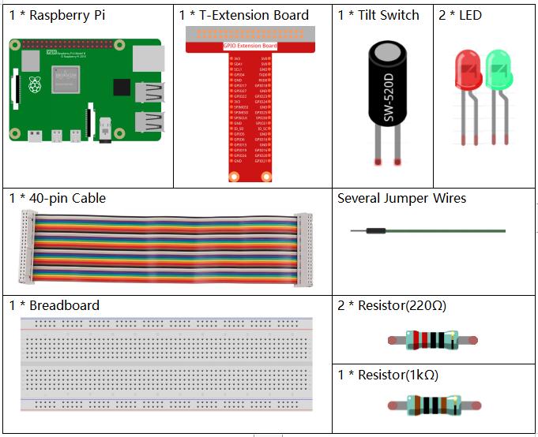
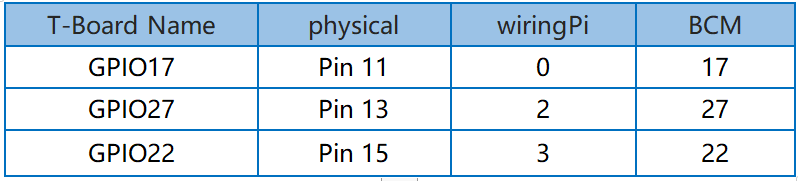
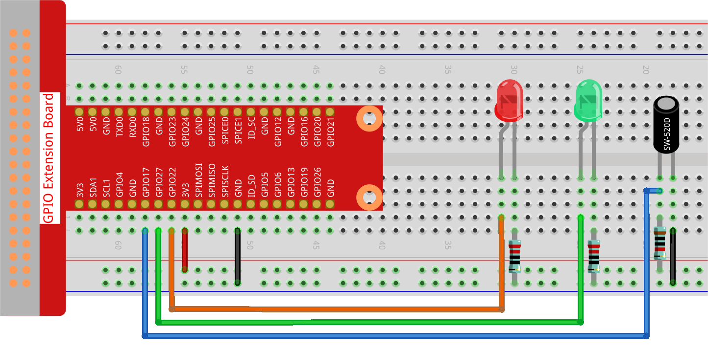

.. note::

    Hello, welcome to the SunFounder Raspberry Pi & Arduino & ESP32 Enthusiasts Community on Facebook! Dive deeper into Raspberry Pi, Arduino, and ESP32 with fellow enthusiasts.

    **Why Join?**

    - **Expert Support**: Solve post-sale issues and technical challenges with help from our community and team.
    - **Learn & Share**: Exchange tips and tutorials to enhance your skills.
    - **Exclusive Previews**: Get early access to new product announcements and sneak peeks.
    - **Special Discounts**: Enjoy exclusive discounts on our newest products.
    - **Festive Promotions and Giveaways**: Take part in giveaways and holiday promotions.

    👉 Ready to explore and create with us? Click [|link_sf_facebook|] and join today!

.. _2.1.3_py_pi5:

2.1.3 Tilt Switch
=================

Introduction
------------

This is a ball tilt-switch with a metal ball inside. It is used to
detect inclinations of a small angle.

Required Components
------------------------------

In this project, we need the following components. 

.. raw:: html

    

Schematic Diagram
-----------------

.. image:: ../python_pi5/img/2.1.3_tilt_switch_schematic_2.png

Experimental Procedures
-----------------------

**Step 1:** Build the circuit.

**Step 2:** Change directory.

.. raw:: html

   <run></run>

.. code-block:: 

    cd ~/davinci-kit-for-raspberry-pi/python-pi5

**Step 3:** Run.

.. raw:: html

   <run></run>

.. code-block:: 

    sudo python3 2.1.3_Tilt.py

Place the tilt vertically, and the green LED will turns on. If you
tilt it, "Tilt!" will be printed on the screen and the red LED will
turns on. Place it vertically again, and the green LED will lights on.

.. warning::

    If there is an error prompt  ``RuntimeError: Cannot determine SOC peripheral base address``, please refer to :ref:`faq_soc` 

**Code**

.. note::

    You can **Modify/Reset/Copy/Run/Stop** the code below. But before that, you need to go to  source code path like ``davinci-kit-for-raspberry-pi/python-pi5``. After modifying the code, you can run it directly to see the effect.

.. raw:: html

    <run></run>

.. code-block:: python

   #!/usr/bin/env python3
   from gpiozero import LED, Button

   # Initialize the Button for the tilt sensor and LEDs using GPIO Zero
   TiltPin = Button(17, pull_up=False)  # Tilt sensor connected to GPIO pin 17, pull-up resistor disabled
   green_led = LED(27)  # Green LED connected to GPIO pin 27
   red_led = LED(22)   # Red LED connected to GPIO pin 22

   def detect():
       """
       Detect the tilt sensor state and control the LEDs.
       Turns on the red LED and turns off the green LED when tilted.
       Turns off the red LED and turns on the green LED when not tilted.
       """
       if TiltPin.is_pressed:  # Check if the sensor is tilted
           print('    *************')
           print('    *   Tilt!   *')
           print('    *************')
           red_led.on()   # Turn on red LED
           green_led.off()  # Turn off green LED
       else:  # If the sensor is not tilted
           red_led.off()  # Turn off red LED
           green_led.on()  # Turn on green LED

   try:
       while True:
           # Continuously check the tilt sensor state and update LEDs
           TiltPin.when_pressed = detect
           TiltPin.when_released = detect

   except KeyboardInterrupt:
       # Handle KeyboardInterrupt (Ctrl+C) to exit the loop gracefully
       pass

**Code Explanation**

#. This line sets the script to run with Python 3 and imports ``LED`` and ``Button`` from ``gpiozero`` for controlling GPIO devices.

   .. code-block:: python

       #!/usr/bin/env python3
       from gpiozero import LED, Button

#. Initializes the tilt sensor connected to GPIO pin 17 (with pull-up resistor disabled) and two LEDs connected to GPIO pins 27 and 22.

   .. code-block:: python

       # Initialize the Button for the tilt sensor and LEDs using GPIO Zero
       TiltPin = Button(17, pull_up=False)  # Tilt sensor connected to GPIO pin 17, pull-up resistor disabled
       green_led = LED(27)  # Green LED connected to GPIO pin 27
       red_led = LED(22)   # Red LED connected to GPIO pin 22

#. Defines the ``detect`` function, which checks the state of the tilt sensor. If tilted, it turns on the red LED and off the green LED. If not tilted, it does the opposite.

   .. code-block:: python

       def detect():
           """
           Detect the tilt sensor state and control the LEDs.
           Turns on the red LED and turns off the green LED when tilted.
           Turns off the red LED and turns on the green LED when not tilted.
           """
           if TiltPin.is_pressed:  # Check if the sensor is tilted
               print('    *************')
               print('    *   Tilt!   *')
               print('    *************')
               red_led.on()   # Turn on red LED
               green_led.off()  # Turn off green LED
           else:  # If the sensor is not tilted
               red_led.off()  # Turn off red LED
               green_led.on()  # Turn on green LED

#. The main loop assigns the ``detect`` function to both ``when_pressed`` and ``when_released`` events of the tilt sensor. The ``try-except`` block handles a KeyboardInterrupt for graceful termination.

   .. code-block:: python

       try:
           while True:
               # Continuously check the tilt sensor state and update LEDs
               TiltPin.when_pressed = detect
               TiltPin.when_released = detect

       except KeyboardInterrupt:
           # Handle KeyboardInterrupt (Ctrl+C) to exit the loop gracefully
           pass

