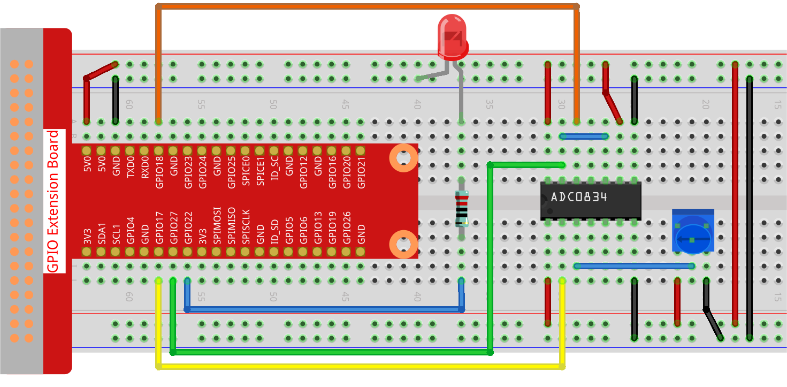

.. note::

    Hello, welcome to the SunFounder Raspberry Pi & Arduino & ESP32 Enthusiasts Community on Facebook! Dive deeper into Raspberry Pi, Arduino, and ESP32 with fellow enthusiasts.

    **Why Join?**

    - **Expert Support**: Solve post-sale issues and technical challenges with help from our community and team.
    - **Learn & Share**: Exchange tips and tutorials to enhance your skills.
    - **Exclusive Previews**: Get early access to new product announcements and sneak peeks.
    - **Special Discounts**: Enjoy exclusive discounts on our newest products.
    - **Festive Promotions and Giveaways**: Take part in giveaways and holiday promotions.

    👉 Ready to explore and create with us? Click [|link_sf_facebook|] and join today!

.. _2.1.4_py_pi5:

2.1.4 Potentiometer
===================

Introduction
------------

The ADC function can be used to convert analog signals to digital
signals, and in this experiment, ADC0834 is used to get the function
involving ADC. Here, we implement this process by using potentiometer.
Potentiometer changes the physical quantity -- voltage, which is
converted by the ADC function.

Required Components
------------------------------

In this project, we need the following components. 

.. image:: ../python_pi5/img/2.1.7_potentiometer_list.png

.. It's definitely convenient to buy a whole kit, here's the link: 

.. .. list-table::
..     :widths: 20 20 20
..     :header-rows: 1

..     *   - Name	
..         - ITEMS IN THIS KIT
..         - LINK
..     *   - Raphael Kit
..         - 337
..         - |link_Raphael_kit|

.. You can also buy them separately from the links below.

.. .. list-table::
..     :widths: 30 20
..     :header-rows: 1

..     *   - COMPONENT INTRODUCTION
..         - PURCHASE LINK

..     *   - :ref:`gpio_extension_board`
..         - |link_gpio_board_buy|
..     *   - :ref:`breadboard`
..         - |link_breadboard_buy|
..     *   - :ref:`wires`
..         - |link_wires_buy|
..     *   - :ref:`resistor`
..         - |link_resistor_buy|
..     *   - :ref:`led`
..         - |link_led_buy|
..     *   - :ref:`potentiometer`
..         - |link_potentiometer_buy|
..     *   - :ref:`adc0834`
..         - \-

Schematic Diagram
-----------------

.. image:: ../python_pi5/img/2.1.7_potentiometer_second_1.png

.. image:: ../python_pi5/img/2.1.7_potentiometer_second_2.png

Experimental Procedures
-----------------------

**Step 1:** Build the circuit.

.. note::
    Please place the chip by referring to the corresponding position
    depicted in the picture. Note that the grooves on the chip should be on
    the left when it is placed.

**Step 2:** Open the code file

.. raw:: html

   <run></run>

.. code-block::

    cd ~/davinci-kit-for-raspberry-pi/python-pi5

**Step 3:** Run.

.. raw:: html

   <run></run>

.. code-block::

    sudo python3 2.1.4_Potentiometer_zero.py

After the code runs, rotate the knob on the potentiometer, the intensity
of LED will change accordingly.

.. warning::

    If there is an error prompt  ``RuntimeError: Cannot determine SOC peripheral base address``, please refer to :ref:`faq_soc` 

**Code**

.. note::

    You can **Modify/Reset/Copy/Run/Stop** the code below. But before that, you need to go to  source code path like ``raphael-kit/python-pi5``. After modifying the code, you can run it directly to see the effect.

.. raw:: html

    <run></run>

.. code-block:: python

   #!/usr/bin/env python3

   from gpiozero import PWMLED
   import ADC0834
   import time

   # Initialize a PWM LED on GPIO pin 22
   led = PWMLED(22)

   # Set up the ADC0834 module
   ADC0834.setup()

   def MAP(x, in_min, in_max, out_min, out_max):
       """
       Map a value from one range to another.
       :param x: The value to be mapped.
       :param in_min: The lower bound of the value's current range.
       :param in_max: The upper bound of the value's current range.
       :param out_min: The lower bound of the value's target range.
       :param out_max: The upper bound of the value's target range.
       :return: The mapped value.
       """
       return (x - in_min) * (out_max - out_min) / (in_max - in_min) + out_min

   try:
       while True:
           # Get the current reading from the ADC0834 module
           res = ADC0834.getResult()
           print('res = %d' % res)

           # Map the ADC value to a range suitable for setting LED brightness
           R_val = MAP(res, 0, 255, 0, 100)

           # Set the LED brightness
           led.value = float(R_val / 100)

           # Wait for 0.2 seconds before reading again
           time.sleep(0.2)

   # Graceful exit when 'Ctrl+C' is pressed
   except KeyboardInterrupt: 
       led.value = 0  # Turn off the LED

**Code Explanation**

#. ``gpiozero`` for PWM LED control, ``ADC0834`` for analog-to-digital conversion, and ``time`` for implementing delays.

   .. code-block:: python

       #!/usr/bin/env python3

       from gpiozero import PWMLED
       import ADC0834
       import time

#. Initialize a PWMLED object connected to GPIO pin 22 and set up the ADC0834 converter.

   .. code-block:: python

       # Initialize a PWM LED on GPIO pin 22
       led = PWMLED(22)

       # Set up the ADC0834 module
       ADC0834.setup()

#. Define a function named ``MAP`` to convert one range of values to another, useful for mapping ADC values to appropriate LED brightness levels.

   .. code-block:: python

       def MAP(x, in_min, in_max, out_min, out_max):
           return (x - in_min) * (out_max - out_min) / (in_max - in_min) + out_min

#. Continuously read the ADC value in a loop, mapping the ADC reading (0-255) to a brightness level (0-100) for the LED. Adjust the LED's brightness based on this mapped value. Implement a delay of 0.2 seconds for better readability and stability.

   .. code-block:: python

       try:
           while True:
               # Get the current reading from the ADC0834 module
               res = ADC0834.getResult()
               print('res = %d' % res)

               # Map the ADC value to a range suitable for setting LED brightness
               R_val = MAP(res, 0, 255, 0, 100)

               # Set the LED brightness
               led.value = float(R_val / 100)

               # Wait for 0.2 seconds before reading again
               time.sleep(0.2)

       # Graceful exit when 'Ctrl+C' is pressed
       except KeyboardInterrupt: 
           led.value = 0  # Turn off the LED