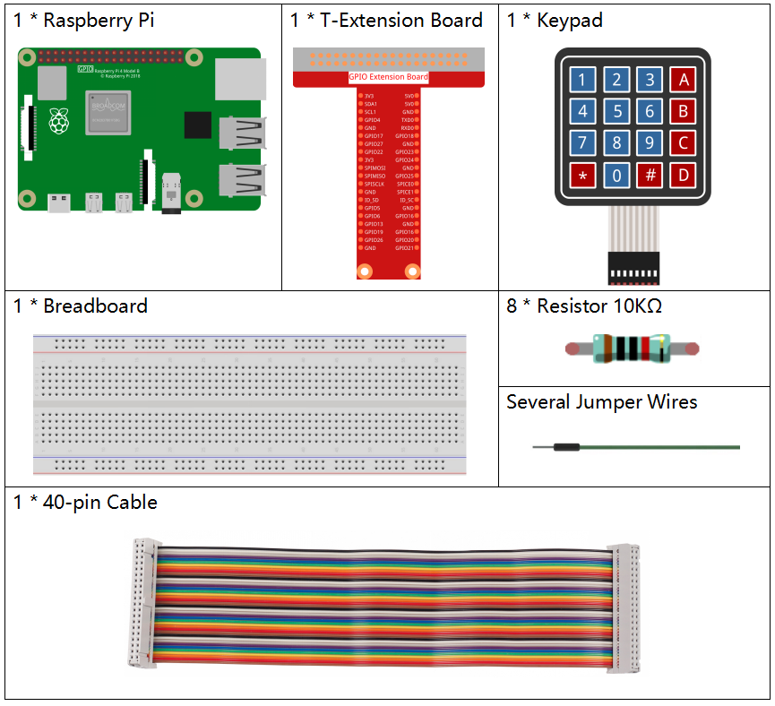
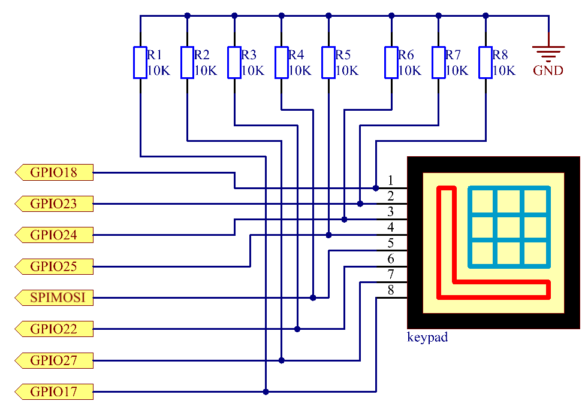
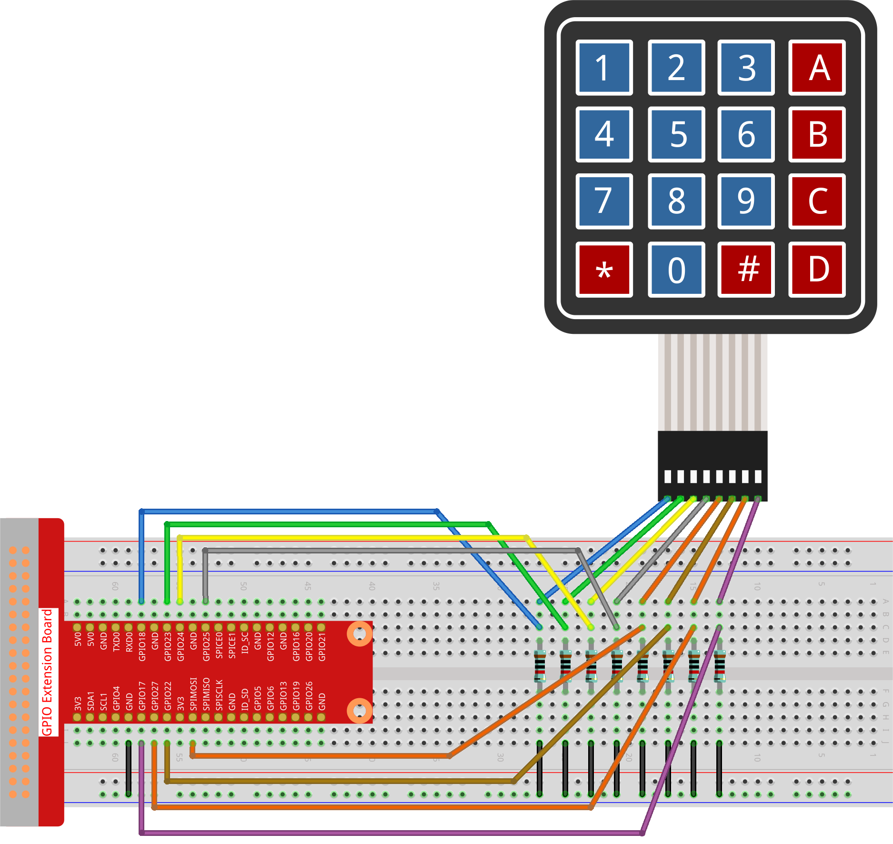

.. note::

    こんにちは、SunFounderのRaspberry Pi & Arduino & ESP32愛好家コミュニティへようこそ！Facebook上でRaspberry Pi、Arduino、ESP32についてもっと深く掘り下げ、他の愛好家と交流しましょう。

    **参加する理由は？**

    - **エキスパートサポート**：コミュニティやチームの助けを借りて、販売後の問題や技術的な課題を解決します。
    - **学び＆共有**：ヒントやチュートリアルを交換してスキルを向上させましょう。
    - **独占的なプレビュー**：新製品の発表や先行プレビューに早期アクセスしましょう。
    - **特別割引**：最新製品の独占割引をお楽しみください。
    - **祭りのプロモーションとギフト**：ギフトや祝日のプロモーションに参加しましょう。

    👉 私たちと一緒に探索し、創造する準備はできていますか？[|link_sf_facebook|]をクリックして今すぐ参加しましょう！

.. _py_pi5_keypad:

2.1.5 キーパッド
================

はじめに
------------

キーパッドはボタンの長方形の配列です。このプロジェクトでは、
キーパッドを文字の入力に使用します。

必要なコンポーネント
------------------------------

このプロジェクトでは、以下のコンポーネントが必要です。

.. raw:: html

    

回路図
-----------------

.. image:: ../python_pi5/img/2.1.5_keypad_chematic_1.png

実験手順
-----------------------

**ステップ 1:** 回路を組み立てます。

**ステップ 2:** コードファイルを開きます。

.. raw:: html

   <run></run>

.. code-block:: 

    cd ~/davinci-kit-for-raspberry-pi/python-pi5

**ステップ 3:** 実行します。

.. raw:: html

   <run></run>

.. code-block:: 

    sudo python3 2.1.5_Keypad.py

コードを実行すると、キーパッドのボタンの押下値（ボタンの値）が画面に表示されます。

.. warning::

    エラー メッセージ ``RuntimeError: Cannot determine SOC peripheral base address`` が表示された場合は、 :ref:`faq_soc` を参照してください。

**コード**

.. note::

    以下のコードを **変更/リセット/コピー/実行/停止** することができます。ただし、その前に ``davinci-kit-for-raspberry-pi/python-pi5`` のソースコードパスに移動する必要があります。コードを変更した後、効果を確認するために直接実行できます。

.. raw:: html

    <run></run>

.. code-block:: python

   #!/usr/bin/env python3
   from gpiozero import DigitalOutputDevice, Button
   from time import sleep

   class Keypad:
       def __init__(self, rows_pins, cols_pins, keys):
           """
           指定された行と列のピン、およびキーパッドのレイアウトでキーパッドを初期化します。
           :param rows_pins: 行のGPIOピンのリスト。
           :param cols_pins: 列のGPIOピンのリスト。
           :param keys: キーパッドのレイアウトのキーリスト。
           """
           # 行のピンをDigitalOutputDeviceとして初期化
           self.rows = [DigitalOutputDevice(pin) for pin in rows_pins]
           # 列のピンをButtonとして初期化
           self.cols = [Button(pin, pull_up=False) for pin in cols_pins]
           self.keys = keys  # キーパッドのレイアウトを設定

       def read(self):
           """
           キーパッドで現在押されているキーを読み取ります。
           :return: 押されたキーのリスト。
           """
           pressed_keys = []
           # 押されたキーを識別するために各行と列をスキャン
           for i, row in enumerate(self.rows):
               row.on()  # 現在の行を有効にする
               for j, col in enumerate(self.cols):
                   if col.is_pressed:  # 列のボタンが押されているか確認
                       # 行と列に基づいてキーのインデックスを計算
                       index = i * len(self.cols) + j
                       pressed_keys.append(self.keys[index])
               row.off()  # 現在の行を無効にする
           return pressed_keys

   try:
       # 行、列、およびキーパッドのレイアウトを設定
       rows_pins = [18, 23, 24, 25]
       cols_pins = [10, 22, 27, 17]
       keys = ["1", "2", "3", "A",
               "4", "5", "6", "B",
               "7", "8", "9", "C",
               "*", "0", "#", "D"]

       # Keypadクラスのインスタンスを作成
       keypad = Keypad(rows_pins, cols_pins, keys)
       last_key_pressed = []

       # キーパッドを連続的に読み取り、新たに押されたキーを表示
       while True:
           pressed_keys = keypad.read()
           if pressed_keys and pressed_keys != last_key_pressed:
               print(pressed_keys)  # 押されたキーのリストを表示
               last_key_pressed = pressed_keys
           sleep(0.1)  # CPU負荷を軽減するための短い遅延

   except KeyboardInterrupt:
       # キーボード割り込み（Ctrl+Cなど）を処理してスクリプトを正常に終了
       pass

**コードの説明**

1. ``gpiozero`` ライブラリから ``DigitalOutputDevice`` および ``Button`` クラス、遅延のための ``sleep`` 関数をインポートします。

   .. code-block:: python

       #!/usr/bin/env python3
       from gpiozero import DigitalOutputDevice, Button
       from time import sleep

2. ``Keypad`` クラスを定義します。 ``__init__`` メソッドは、指定された行と列のピンとキーパッドのキーレイアウトでキーパッドを初期化します。 ``read`` メソッドはキーパッドをスキャンし、押されたキーのリストを返します。

   .. code-block:: python

       class Keypad:
           def __init__(self, rows_pins, cols_pins, keys):
               """
               指定された行と列のピン、およびキーパッドのレイアウトでキーパッドを初期化します。
               :param rows_pins: 行のGPIOピンのリスト。
               :param cols_pins: 列のGPIOピンのリスト。
               :param keys: キーパッドのレイアウトのキーリスト。
               """
               # 行のピンをDigitalOutputDeviceとして初期化
               self.rows = [DigitalOutputDevice(pin) for pin in rows_pins]
               # 列のピンをButtonとして初期化
               self.cols = [Button(pin, pull_up=False) for pin in cols_pins]
               self.keys = keys  # キーパッドのレイアウトを設定

           def read(self):
               """
               キーパッドで現在押されているキーを読み取ります。
               :return: 押されたキーのリスト。
               """
               pressed_keys = []
               # 押されたキーを識別するために各行と列をスキャン
               for i, row in enumerate(self.rows):
                   row.on()  # 現在の行を有効にする
                   for j, col in enumerate(self.cols):
                       if col.is_pressed:  # 列のボタンが押されているか確認
                           # 行と列に基づいてキーのインデックスを計算
                           index = i * len(self.cols) + j
                           pressed_keys.append(self.keys[index])
                   row.off()  # 現在の行を無効にする
               return pressed_keys

3. GPIOピンの行と列を設定し、キーパッドのレイアウトを定義します。

   .. code-block:: python

       try:
           # 行、列、およびキーパッドのレイアウトを設定
           rows_pins = [18, 23, 24, 25]
           cols_pins = [10, 22, 27, 17]
           keys = ["1", "2", "3", "A",
                   "4", "5", "6", "B",
                   "7", "8", "9", "C",
                   "*", "0", "#", "D"]

4. 指定された設定で ``Keypad`` クラスのインスタンスを作成します。

   .. code-block:: python

       try:
           ...

           # Keypadクラスのインスタンスを作成
           keypad = Keypad(rows_pins, cols_pins, keys)
           last_key_pressed = []

5. キーパッドを連続的に読み取り、キーの状態に変更があればそれを表示し、CPU負荷を軽減するために短い遅延を導入します。キーボード割り込み（Ctrl+Cなど）が発生した場合、スクリプトをきれいに終了するために処理します。

   .. code-block:: python

       try:
           ...

           # キーパッドを連続的に読み取り、新たに押されたキーを表示
           while True:
               pressed_keys = keypad.read()
               if pressed_keys and pressed_keys != last_key_pressed:
                   print(pressed_keys)  # 押されたキーのリストを表示
                   last_key_pressed = pressed_keys
               sleep(0.1)  # CPU負荷を軽減するための短い遅延

       except KeyboardInterrupt:
           # キーボード割り込み（Ctrl+Cなど）を処理してスクリプトを正常に終了
           pass
