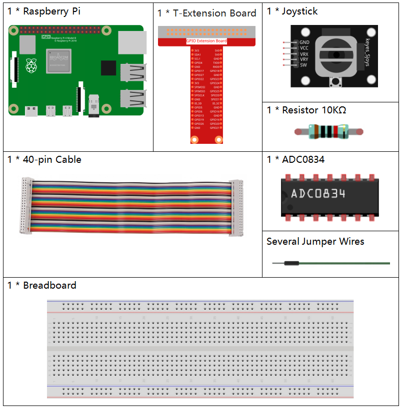
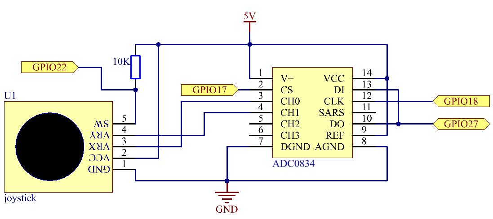
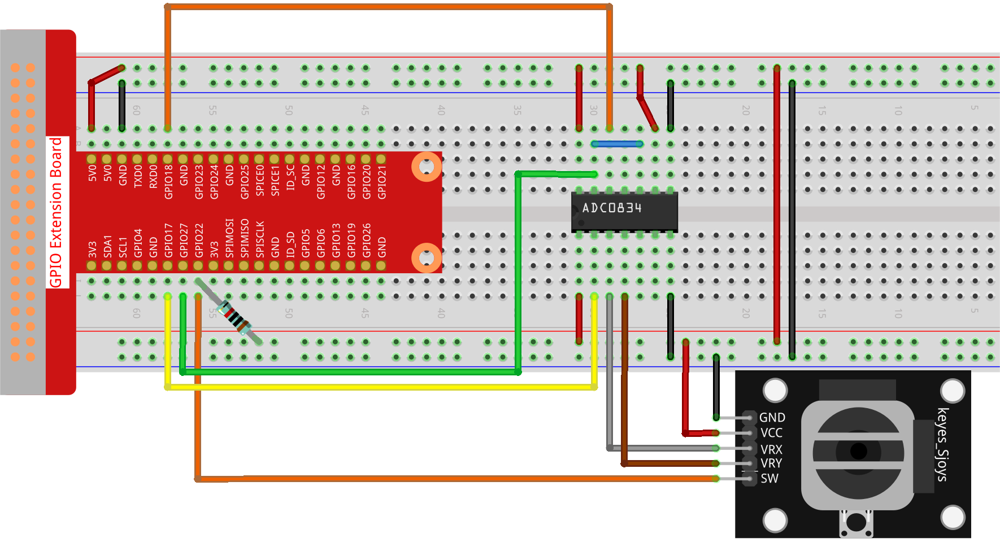

.. note::

    こんにちは、SunFounderのRaspberry Pi & Arduino & ESP32愛好家コミュニティへようこそ！Facebook上でRaspberry Pi、Arduino、ESP32についてもっと深く掘り下げ、他の愛好家と交流しましょう。

    **参加する理由は？**

    - **エキスパートサポート**：コミュニティやチームの助けを借りて、販売後の問題や技術的な課題を解決します。
    - **学び＆共有**：ヒントやチュートリアルを交換してスキルを向上させましょう。
    - **独占的なプレビュー**：新製品の発表や先行プレビューに早期アクセスしましょう。
    - **特別割引**：最新製品の独占割引をお楽しみください。
    - **祭りのプロモーションとギフト**：ギフトや祝日のプロモーションに参加しましょう。

    👉 私たちと一緒に探索し、創造する準備はできていますか？[|link_sf_facebook|]をクリックして今すぐ参加しましょう！

.. _py_pi5_joystick:

2.1.6 ジョイスティック
=====================================

はじめに
------------

このプロジェクトでは、ジョイスティックの動作を学びます。ジョイスティックを操作し、その結果を画面に表示します。

必要なコンポーネント
------------------------------

このプロジェクトでは、以下のコンポーネントが必要です。

回路図
-----------------

ジョイスティックのデータを読み取る際、軸ごとにいくつかの違いがあります。X軸およびY軸のデータはアナログで、アナログ値をデジタル値に変換するにはADC0834を使用する必要があります。Z軸のデータはデジタルですので、GPIOを直接読み取ることもできますし、ADCを使用しても読み取ることができます。

.. image:: ../python_pi5/img/2.1.9_joystick_schematic_1.png

実験手順
-----------------------

**ステップ 1:** 回路を組み立てます。

**ステップ 2:** コードのフォルダに移動します。

.. raw:: html

   <run></run>

.. code-block::

    cd ~/davinci-kit-for-raspberry-pi/python-pi5

**ステップ 3:** 実行します。

.. raw:: html

   <run></run>

.. code-block::

    sudo python3 2.1.6_Joystick.py

コードを実行した後、ジョイスティックを動かし、対応するx、y、Btnの値が画面に表示されます。

.. warning::

    エラー メッセージ ``RuntimeError: Cannot determine SOC peripheral base address`` が表示された場合は、 :ref:`faq_soc` を参照してください。

**コード**

.. note::

    以下のコードを **変更/リセット/コピー/実行/停止** することができます。ただし、その前に ``davinci-kit-for-raspberry-pi/python-pi5`` のソースコードパスに移動する必要があります。コードを変更した後、効果を確認するために直接実行できます。

.. raw:: html

    <run></run>

.. code-block:: python

   #!/usr/bin/env python3
   from gpiozero import Button
   import ADC0834
   import time

   # GPIOピン22に接続されたボタンを初期化
   BtnPin = Button(22)

   # ADC0834 ADCのセットアップ
   ADC0834.setup()

   try:
       # ADC値とボタンの状態を読み取り、表示するメインループ
       while True:
           # ADCチャンネル0と1からXとYの値を読み取ります
           x_val = ADC0834.getResult(0)
           y_val = ADC0834.getResult(1)

           # ボタンの状態（押されているかどうか）を読み取ります
           Btn_val = BtnPin.value

           # X、Y、およびボタンの値を表示します
           print('X: %d  Y: %d  Btn: %d' % (x_val, y_val, Btn_val))

           # 次の読み取り前に0.2秒の遅延
           time.sleep(0.2)

   # スクリプトの正常な終了を確実に処理します（たとえば、キーボード割り込みを介して）
   except KeyboardInterrupt:
       pass

**コードの説明**

1. このセクションでは、 ``gpiozero`` ライブラリから ``Button`` クラスをインポートして、GPIOピンに接続されたボタンを管理します。また、ADC0834 ADC（アナログ-デジタルコンバータ）モジュールとのインタフェースのために ``ADC0834`` ライブラリもインポートします。

   .. code-block:: python

       #!/usr/bin/env python3
       from gpiozero import Button
       import ADC0834
       import time

2. GPIOピン22に接続されたボタンを初期化し、ADC0834モジュールを使用するためのセットアップを行います。

   .. code-block:: python

       # GPIOピン22に接続されたボタンを初期化
       BtnPin = Button(22)

       # ADC0834 ADCのセットアップ
       ADC0834.setup()

3. ジョイスティックのVRXおよびVRY接続はそれぞれADC0834のCH0およびCH1に接続されています。これにより、CH0およびCH1から値を読み取ることが容易になり、それらの値は ``x_val`` および ``y_val`` 変数に保存されます。さらに、ジョイスティックのSW値が読み取られ、 ``Btn_val`` 変数に割り当てられます。取得した ``x_val``、 ``y_val``、および ``Btn_val`` の値は、 ``print()`` 関数を使用して表示されます。

   .. code-block:: python

       try:
           # ADC値とボタンの状態を読み取り、表示するメインループ
           while True:
               # ADCチャンネル0と1からXとYの値を読み取ります
               x_val = ADC0834.getResult(0)
               y_val = ADC0834.getResult(1)

               # ボタンの状態（押されているかどうか）を読み取ります
               Btn_val = BtnPin.value

               # X、Y、およびボタンの値を表示します
               print('X: %d  Y: %d  Btn: %d' % (x_val, y_val, Btn_val))

               # 次の読み取り前に0.2秒の遅延
               time.sleep(0.2)

       # スクリプトの正常な終了を確実に処理します（たとえば、キーボード割り込みを介して）
       except KeyboardInterrupt:
           pass
