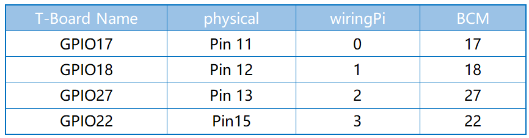

.. note::

    Ciao e benvenuto nella Community di Appassionati di SunFounder per Raspberry Pi, Arduino ed ESP32 su Facebook! Esplora a fondo il mondo di Raspberry Pi, Arduino ed ESP32 insieme a tanti altri appassionati.

    **Perché Unirsi?**

    - **Supporto da Esperti**: Risolvi problemi post-vendita e sfide tecniche con l’aiuto della nostra community e del nostro team.
    - **Impara e Condividi**: Scambia consigli e tutorial per migliorare le tue competenze.
    - **Anteprime Esclusive**: Ottieni accesso anticipato agli annunci dei nuovi prodotti e a contenuti inediti.
    - **Sconti Speciali**: Approfitta di sconti esclusivi sui nostri prodotti più recenti.
    - **Promozioni Festive e Giveaway**: Partecipa a concorsi e promozioni festive.

    👉 Pronto a esplorare e creare con noi? Clicca su [|link_sf_facebook|] e unisciti oggi stesso!

.. _py_pi5_joystick:

2.1.6 Joystick
================

Introduzione
---------------

In questo progetto, impareremo come funziona lo joystick. Manovriamo il 
Joystick e visualizziamo i risultati sullo schermo.

Componenti Necessari
------------------------------

In questo progetto, abbiamo bisogno dei seguenti componenti. 

.. image:: ../python_pi5/img/2.1.9_joystick_list.png

.. È sicuramente conveniente acquistare un kit completo, ecco il link:

.. .. list-table::
..     :widths: 20 20 20
..     :header-rows: 1

..     *   - Nome	
..         - ELEMENTI IN QUESTO KIT
..         - LINK
..     *   - Kit Raphael
..         - 337
..         - |link_Raphael_kit|

.. Puoi anche acquistare i componenti separatamente dai link qui sotto.

.. .. list-table::
..     :widths: 30 20
..     :header-rows: 1

..     *   - INTRODUZIONE AI COMPONENTI
..         - LINK DI ACQUISTO

..     *   - :ref:`gpio_extension_board`
..         - |link_gpio_board_buy|
..     *   - :ref:`breadboard`
..         - |link_breadboard_buy|
..     *   - :ref:`wires`
..         - |link_wires_buy|
..     *   - :ref:`resistor`
..         - |link_resistor_buy|
..     *   - :ref:`joystick`
..         - \-
..     *   - :ref:`adc0834`
..         - \-

Schema Elettrico
--------------------

Quando si leggono i dati del joystick, ci sono alcune differenze tra gli assi: 
i dati degli assi X e Y sono analogici e richiedono l'uso dell'ADC0834 per 
convertirli in valori digitali. I dati dell'asse Z sono digitali, quindi è 
possibile leggerli direttamente tramite GPIO, oppure utilizzare anche l'ADC.

.. image:: ../python_pi5/img/2.1.9_joystick_schematic_2.png

Procedure Sperimentali
---------------------------

**Passo 1:** Costruisci il circuito.

.. image:: ../python_pi5/img/2.1.9_Joystick_circuit.png

**Passo 2:** Vai nella cartella del codice.

.. raw:: html

   <run></run>

.. code-block::

    cd ~/raphael-kit/python-pi5

**Passo 3:** Esegui.

.. raw:: html

   <run></run>

.. code-block::

    sudo python3 2.1.6_Joystick_zero.py

Dopo l'esecuzione del codice, muovi il Joystick e i valori corrispondenti 
di x, y e Btn verranno visualizzati sullo schermo.

.. warning::

    Se compare l'errore ``RuntimeError: Cannot determine SOC peripheral base address``, consulta :ref:`faq_soc` 

**Codice**

.. note::

    Puoi **Modificare/Reimpostare/Copiare/Eseguire/Interrompere** il codice qui sotto. Prima di farlo, però, vai al percorso del codice sorgente, come ``raphael-kit/python-pi5``. Dopo aver modificato il codice, potrai eseguirlo direttamente per vedere il risultato.

.. raw:: html

    <run></run>

.. code-block:: python

   #!/usr/bin/env python3
   from gpiozero import Button
   import ADC0834
   import time

   # Inizializza il pulsante collegato al pin GPIO 22
   BtnPin = Button(22)

   # Configura l'ADC0834 ADC
   ADC0834.setup()

   try:
       # Ciclo principale per leggere e stampare i valori ADC e lo stato del pulsante
       while True:
           # Leggi i valori X e Y dai canali ADC 0 e 1
           x_val = ADC0834.getResult(0)
           y_val = ADC0834.getResult(1)

           # Leggi lo stato del pulsante (premuto o no)
           Btn_val = BtnPin.value

           # Stampa i valori di X, Y e del pulsante
           print('X: %d  Y: %d  Btn: %d' % (x_val, y_val, Btn_val))

           # Ritardo di 0,2 secondi prima della prossima lettura
           time.sleep(0.2)

   # Gestisce con grazia la terminazione dello script (ad es., tramite KeyboardInterrupt)
   except KeyboardInterrupt: 
       pass

**Spiegazione del Codice**

#. Questa sezione importa la classe Button dalla libreria ``gpiozero`` per gestire un pulsante collegato a un pin GPIO. Importa anche la libreria ``ADC0834`` per interfacciarsi con il modulo ADC0834 (Convertitore Analogico-Digitale).

   .. code-block:: python

       #!/usr/bin/env python3
       from gpiozero import Button
       import ADC0834
       import time

#. Inizializza un pulsante collegato al pin GPIO 22 e configura il modulo ADC0834 per l'uso.

   .. code-block:: python

       # Inizializza il pulsante collegato al pin GPIO 22
       BtnPin = Button(22)

       # Configura l'ADC0834 ADC
       ADC0834.setup()

#. I collegamenti VRX e VRY del joystick sono collegati rispettivamente ai canali CH0 e CH1 dell'ADC0834. Questa configurazione consente di leggere i valori da CH0 e CH1, salvandoli poi nelle variabili ``x_val`` e ``y_val``. Inoltre, il valore SW del joystick viene letto e assegnato alla variabile ``Btn_val``. I valori ottenuti di ``x_val``, ``y_val`` e ``Btn_val`` vengono poi visualizzati utilizzando la funzione ``print()``.

   .. code-block:: python

       try:
           # Ciclo principale per leggere e stampare i valori ADC e lo stato del pulsante
           while True:
               # Leggi i valori X e Y dai canali ADC 0 e 1
               x_val = ADC0834.getResult(0)
               y_val = ADC0834.getResult(1)

               # Leggi lo stato del pulsante (premuto o no)
               Btn_val = BtnPin.value

               # Stampa i valori di X, Y e del pulsante
               print('X: %d  Y: %d  Btn: %d' % (x_val, y_val, Btn_val))

               # Ritardo di 0,2 secondi prima della prossima lettura
               time.sleep(0.2)

       # Gestisce con grazia la terminazione dello script (ad es., tramite KeyboardInterrupt)
       except KeyboardInterrupt: 
           pass

