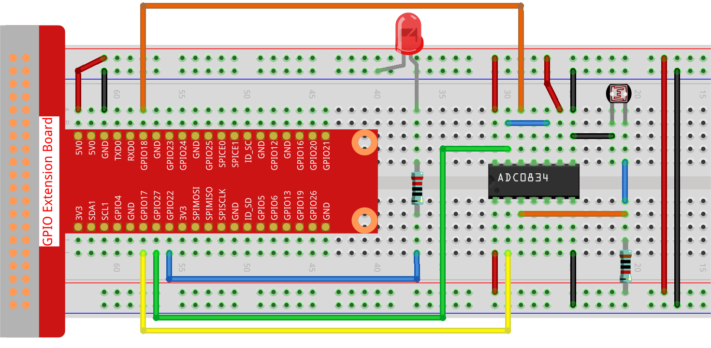

.. note::

    Hello, welcome to the SunFounder Raspberry Pi & Arduino & ESP32 Enthusiasts Community on Facebook! Dive deeper into Raspberry Pi, Arduino, and ESP32 with fellow enthusiasts.

    **Why Join?**

    - **Expert Support**: Solve post-sale issues and technical challenges with help from our community and team.
    - **Learn & Share**: Exchange tips and tutorials to enhance your skills.
    - **Exclusive Previews**: Get early access to new product announcements and sneak peeks.
    - **Special Discounts**: Enjoy exclusive discounts on our newest products.
    - **Festive Promotions and Giveaways**: Take part in giveaways and holiday promotions.

    👉 Ready to explore and create with us? Click [|link_sf_facebook|] and join today!

.. _2.2.1_py_pi5:

2.2.1 Photoresistor
===================

Introduction
------------

Photoresistor is a commonly used component of ambient light intensity in
life. It helps the controller to recognize day and night and realize
light control functions such as night lamp. This project is very similar
to potentiometer, and you might think it changing the voltage to sensing
light.

Required Components
------------------------------

In this project, we need the following components. 

.. image:: ../python_pi5/img/2.2.1_photoresistor_list.png

.. It's definitely convenient to buy a whole kit, here's the link: 

.. .. list-table::
..     :widths: 20 20 20
..     :header-rows: 1

..     *   - Name	
..         - ITEMS IN THIS KIT
..         - LINK
..     *   - Raphael Kit
..         - 337
..         - |link_Raphael_kit|

.. You can also buy them separately from the links below.

.. .. list-table::
..     :widths: 30 20
..     :header-rows: 1

..     *   - COMPONENT INTRODUCTION
..         - PURCHASE LINK

..     *   - :ref:`gpio_extension_board`
..         - |link_gpio_board_buy|
..     *   - :ref:`breadboard`
..         - |link_breadboard_buy|
..     *   - :ref:`wires`
..         - |link_wires_buy|
..     *   - :ref:`resistor`
..         - |link_resistor_buy|
..     *   - :ref:`led`
..         - |link_led_buy|
..     *   - :ref:`adc0834`
..         - \-
..     *   - :ref:`photoresistor`
..         - |link_photoresistor_buy|

Schematic Diagram
-----------------

.. image:: ../python_pi5/img/2.2.1_photoresistor_schematic_1.png

.. image:: ../python_pi5/img/2.2.1_photoresistor_schematic_2.png

Experimental Procedures
-----------------------

**Step 1:** Build the circuit.

**Step 2:** Go to the folder of the code.

.. raw:: html

   <run></run>

.. code-block::

    cd ~/davinci-kit-for-raspberry-pi/python-pi5

**Step 3:** Run the executable file.

.. raw:: html

   <run></run>

.. code-block::

    sudo python3 2.2.1_Photoresistor_zero.py

When the code is running, the brightness of the LED will change according to the light intensity sensed by the photoresistor.

.. warning::

    If there is an error prompt  ``RuntimeError: Cannot determine SOC peripheral base address``, please refer to :ref:`faq_soc` 

**Code**

.. note::

    You can **Modify/Reset/Copy/Run/Stop** the code below. But before that, you need to go to  source code path like ``raphael-kit/python-pi5``. After modifying the code, you can run it directly to see the effect.

.. raw:: html

    <run></run>

.. code-block:: python

   #!/usr/bin/env python3
   from gpiozero import PWMLED
   import ADC0834
   import time

   # Initialize a PWM LED on GPIO pin 22
   led = PWMLED(22)

   # Set up the ADC0834 module
   ADC0834.setup()

   # Define a function for mapping values from one range to another
   def MAP(x, in_min, in_max, out_min, out_max):
       return (x - in_min) * (out_max - out_min) / (in_max - in_min) + out_min

   # Main loop for reading ADC value and controlling LED brightness
   def loop():
       while True:
           # Read analog value from ADC
           analogVal = ADC0834.getResult()
           print('value = %d' % analogVal)

           # Map the ADC value to a PWM value and set LED brightness
           led.value = float(analogVal/255)

           # Wait for 0.2 seconds
           time.sleep(0.2)

   # Run the main loop and handle KeyboardInterrupt for graceful shutdown
   try:
       loop()
   except KeyboardInterrupt: 
       # Turn off LED before exiting
       led.value = 0

**Code Explanation**

#. This segment imports the PWMLED class from the gpiozero library, necessary for controlling PWM LEDs. It also includes the ADC0834 module for interfacing with the analog-to-digital converter, and the time module for executing time-based functions such as sleep.

   .. code-block:: python

       #!/usr/bin/env python3
       from gpiozero import PWMLED
       import ADC0834
       import time

#. Initializes a PWM LED connected to GPIO pin 22 and sets up the ADC0834 module, preparing it for use in the project.

   .. code-block:: python

       # Initialize a PWM LED on GPIO pin 22
       led = PWMLED(22)

       # Set up the ADC0834 module
       ADC0834.setup()

#. Defines a function to map an input value from one range to another. This function is crucial for translating the ADC readings into a suitable range for PWM control.

   .. code-block:: python

       # Define a function for mapping values from one range to another
       def MAP(x, in_min, in_max, out_min, out_max):
           return (x - in_min) * (out_max - out_min) / (in_max - in_min) + out_min

#. This section contains a loop that continuously reads the analog value from the ADC0834, maps it to a corresponding PWM value, and adjusts the LED brightness. A brief delay (`time.sleep(0.2)`) is included to make the changes visible and to avoid overburdening the CPU.

   .. code-block:: python

       # Main loop for reading ADC value and controlling LED brightness
       def loop():
           while True:
               # Read analog value from ADC
               analogVal = ADC0834.getResult()
               print('value = %d' % analogVal)

               # Map the ADC value to a PWM value and set LED brightness
               led.value = float(analogVal/255)

               # Wait for 0.2 seconds
               time.sleep(0.2)

#. Executes the loop function and includes error handling for a graceful shutdown on KeyboardInterrupt. It ensures the LED is turned off when the program is stopped.

   .. code-block:: python

       # Run the main loop and handle KeyboardInterrupt for graceful shutdown
       try:
           loop()
       except KeyboardInterrupt: 
           # Turn off LED before exiting
           led.value = 0

