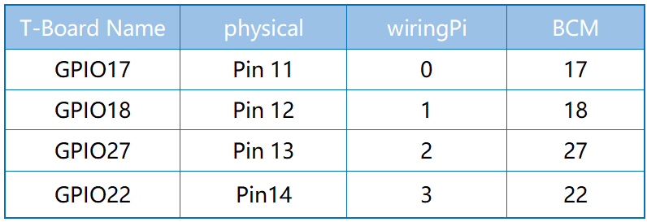

.. _2.2.1_py_pi5:

2.2.1 Fotowiderstand
================================

Einführung
------------

Ein Fotowiderstand ist eine häufig verwendete Komponente zur Messung der Umgebungslichtintensität
im Alltag. Er hilft dem Controller, Tag und Nacht zu erkennen und Lichtsteuerungsfunktionen wie
Nachtlicht zu realisieren. Dieses Projekt ist dem Potentiometer sehr ähnlich, und Sie könnten denken,
dass es die Spannung ändert, um Licht zu erkennen.

Benötigte Komponenten
------------------------------

Für dieses Projekt benötigen wir die folgenden Komponenten.

.. image:: ../python_pi5/img/2.2.1_photoresistor_list.png

Schaltplan
-----------------

.. image:: ../python_pi5/img/2.2.1_photoresistor_schematic_2.png

Experimentelle Verfahren
----------------------------------------

**Schritt 1:** Bauen Sie den Schaltkreis auf.

.. image:: ../python_pi5/img/2.2.1_photoresistor_circuit.png

**Schritt 2:** Wechseln Sie in den Ordner des Codes.

.. raw:: html

   <run></run>

.. code-block::

    cd ~/raphael-kit/python-pi5

**Schritt 3:** Führen Sie die ausführbare Datei aus.

.. raw:: html

   <run></run>

.. code-block::

    sudo python3 2.2.1_Photoresistor_zero.py

Wenn der Code ausgeführt wird, ändert sich die Helligkeit der LED entsprechend der Lichtintensität, die vom Fotowiderstand erfasst wird.

**Code**

.. note::

    Sie können den unten stehenden Code **Modifizieren/Zurücksetzen/Kopieren/Ausführen/Stoppen**. Aber bevor Sie das tun, müssen Sie zum Quellcode-Pfad wie ``raphael-kit/python-pi5`` gehen. Nachdem Sie den Code geändert haben, können Sie ihn direkt ausführen, um die Auswirkungen zu sehen.

.. raw:: html

    <run></run>

.. code-block:: python

   #!/usr/bin/env python3
   from gpiozero import PWMLED
   import ADC0834
   import time

   # Initialisieren Sie eine PWM-LED am GPIO-Pin 22
   led = PWMLED(22)

   # Richten Sie das ADC0834-Modul ein
   ADC0834.setup()

   # Definieren Sie eine Funktion zum Abbilden von Werten von einem Bereich in einen anderen
   def MAP(x, in_min, in_max, out_min, out_max):
       return (x - in_min) * (out_max - out_min) / (in_max - in_min) + out_min

   # Hauptschleife zum Lesen des ADC-Werts und Steuern der LED-Helligkeit
   def loop():
       while True:
           # Analogen Wert vom ADC lesen
           analogVal = ADC0834.getResult()
           print('value = %d' % analogVal)

           # Abbilden des ADC-Werts auf einen PWM-Wert und Einstellen der LED-Helligkeit
           led.value = float(analogVal/255)

           # Warten Sie 0,2 Sekunden
           time.sleep(0.2)

   # Führen Sie die Hauptschleife aus und behandeln Sie KeyboardInterrupt für einen eleganten Abschluss
   try:
       loop()
   except KeyboardInterrupt: 
       # LED ausschalten, bevor Sie das Programm beenden
       led.value = 0

**Code-Erklärung**

#. Dieser Abschnitt importiert die PWMLED-Klasse aus der gpiozero-Bibliothek, die für die Steuerung von PWM-LEDs erforderlich ist. Er enthält auch das ADC0834-Modul für die Schnittstelle mit dem Analog-Digital-Wandler und das time-Modul für zeitbasierte Funktionen wie Schlaf.

   .. code-block:: python

       #!/usr/bin/env python3
       from gpiozero import PWMLED
       import ADC0834
       import time

#. Initialisiert eine PWM-LED, die mit GPIO-Pin 22 verbunden ist, und richtet das ADC0834-Modul ein, um es für das Projekt vorzubereiten.

   .. code-block:: python

       # Initialisieren Sie eine PWM-LED am GPIO-Pin 22
       led = PWMLED(22)

       # Richten Sie das ADC0834-Modul ein
       ADC0834.setup()

#. Definiert eine Funktion zur Abbildung eines Eingabewerts von einem Bereich in einen anderen. Diese Funktion ist entscheidend für die Übersetzung der ADC-Lesungen in einen geeigneten Bereich für die PWM-Steuerung.

   .. code-block:: python

       # Definieren Sie eine Funktion zum Abbilden von Werten von einem Bereich in einen anderen
       def MAP(x, in_min, in_max, out_min, out_max):
           return (x - in_min) * (out_max - out_min) / (in_max - in_min) + out_min

#. Dieser Abschnitt enthält eine Schleife, die kontinuierlich den analogen Wert vom ADC0834 liest, ihn in einen entsprechenden PWM-Wert abbildet und die LED-Helligkeit anpasst. Eine kurze Verzögerung (`time.sleep(0.2)`) ist enthalten, um die Änderungen sichtbar zu machen und eine Überlastung der CPU zu vermeiden.

   .. code-block:: python

       # Hauptschleife zum Lesen des ADC-Werts und Steuern der LED-Helligkeit
       def loop():
           while True:
               # Analogen Wert vom ADC lesen
               analogVal = ADC0834.getResult()
               print('value = %d' % analogVal)

               # Abbilden des ADC-Werts auf einen PWM-Wert und Einstellen der LED-Helligkeit
               led.value = float(analogVal/255)

               # Warten Sie 0,2 Sekunden
               time.sleep(0.2)

#. Führt die Loop-Funktion aus und enthält Fehlerbehandlung für einen eleganten Abschluss bei KeyboardInterrupt. Es stellt sicher, dass die LED ausgeschaltet wird, wenn das Programm gestoppt wird.

   .. code-block:: python

       # Führen Sie die Hauptschleife aus und behandeln Sie KeyboardInterrupt für einen eleganten Abschluss
       try:
           loop()
       except KeyboardInterrupt: 
           # LED ausschalten, bevor Sie das Programm beenden
           led.value = 0
