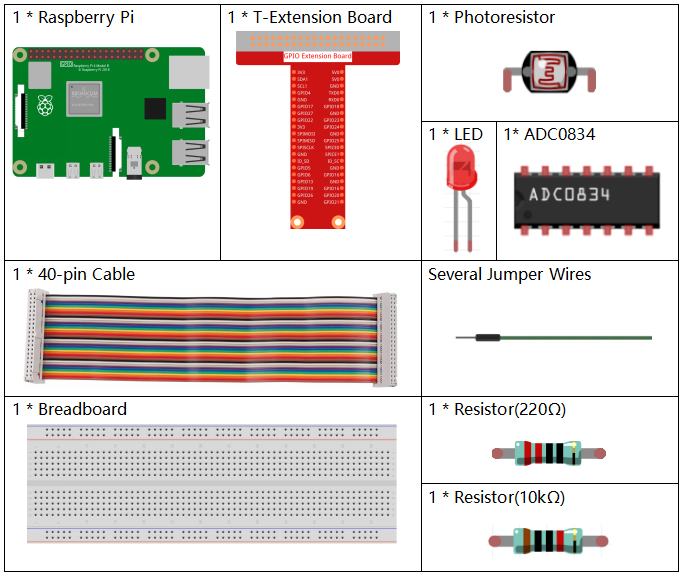

.. note::

    ¡Hola! Bienvenidos a la Comunidad de Entusiastas de SunFounder para Raspberry Pi, Arduino y ESP32 en Facebook. Explora en profundidad Raspberry Pi, Arduino y ESP32 junto a otros apasionados.

    **¿Por qué unirse?**

    - **Soporte Experto**: Resuelve problemas postventa y desafíos técnicos con ayuda de nuestra comunidad y equipo.
    - **Aprende y Comparte**: Intercambia consejos y tutoriales para mejorar tus habilidades.
    - **Acceso Exclusivo**: Sé el primero en conocer los nuevos productos y obtener una vista previa.
    - **Descuentos Especiales**: Disfruta de descuentos exclusivos en nuestros productos más recientes.
    - **Promociones y Sorteos Festivos**: Participa en sorteos y promociones durante las festividades.

     👉 ¿Listo para explorar y crear con nosotros? Haz clic en [|link_sf_facebook|] y únete hoy.

.. _2.2.1_py_pi5:

2.2.1 Fotoresistor
======================

Introducción
--------------

El fotoresistor es un componente comúnmente utilizado para medir la 
intensidad de la luz ambiental. Ayuda al controlador a distinguir 
entre día y noche, y permite funciones de control de luz, como lámparas 
nocturnas. Este proyecto es muy similar al del potenciómetro, y podrás 
notar que la variación en el voltaje permite detectar la intensidad de la luz.

Componentes Necesarios
--------------------------

En este proyecto, necesitaremos los siguientes componentes.

.. It's definitely convenient to buy a whole kit, here's the link: 

.. .. list-table::
..     :widths: 20 20 20
..     :header-rows: 1

..     *   - Name	
..         - ITEMS IN THIS KIT
..         - LINK
..     *   - Raphael Kit
..         - 337
..         - |link_Raphael_kit|

.. You can also buy them separately from the links below.

.. .. list-table::
..     :widths: 30 20
..     :header-rows: 1

..     *   - COMPONENT INTRODUCTION
..         - PURCHASE LINK

..     *   - :ref:`gpio_extension_board`
..         - |link_gpio_board_buy|
..     *   - :ref:`breadboard`
..         - |link_breadboard_buy|
..     *   - :ref:`wires`
..         - |link_wires_buy|
..     *   - :ref:`resistor`
..         - |link_resistor_buy|
..     *   - :ref:`led`
..         - |link_led_buy|
..     *   - :ref:`adc0834`
..         - \-
..     *   - :ref:`photoresistor`
..         - |link_photoresistor_buy|

Diagrama Esquemático
-----------------------

.. image:: ../python_pi5/img/2.2.1_photoresistor_schematic_1.png

.. image:: ../python_pi5/img/2.2.1_photoresistor_schematic_2.png

Procedimientos Experimentales
-------------------------------

**Paso 1:** Monta el circuito.

.. image:: ../python_pi5/img/2.2.1_photoresistor_circuit.png

**Paso 2:** Accede a la carpeta del código.

.. raw:: html

   <run></run>

.. code-block::

    cd ~/davinci-kit-for-raspberry-pi/python-pi5

**Paso 3:** Ejecuta el archivo.

.. raw:: html

   <run></run>

.. code-block::

    sudo python3 2.2.1_Photoresistor.py

Cuando el código esté en ejecución, la intensidad del LED cambiará en función de la luz detectada por el fotoresistor.

.. warning::

    Si aparece el error ``RuntimeError: Cannot determine SOC peripheral base address``, consulta :ref:`faq_soc` 

**Código**

.. note::

    Puedes **Modificar/Restablecer/Copiar/Ejecutar/Detener** el código a continuación. Antes de eso, asegúrate de estar en la ruta de origen ``raphael-kit/python-pi5``. Una vez modificado el código, puedes ejecutarlo para ver el efecto.

.. raw:: html

    <run></run>

.. code-block:: python

   #!/usr/bin/env python3
   from gpiozero import PWMLED
   import ADC0834
   import time

   # Inicializar un LED PWM en el pin GPIO 22
   led = PWMLED(22)

   # Configurar el módulo ADC0834
   ADC0834.setup()

   # Definir una función para mapear valores de un rango a otro
   def MAP(x, in_min, in_max, out_min, out_max):
       return (x - in_min) * (out_max - out_min) / (in_max - in_min) + out_min

   # Bucle principal para leer el valor ADC y controlar el brillo del LED
   def loop():
       while True:
           # Leer valor analógico del ADC
           analogVal = ADC0834.getResult()
           print('value = %d' % analogVal)

           # Mapear el valor ADC a un valor PWM y ajustar el brillo del LED
           led.value = float(analogVal / 255)

           # Esperar 0.2 segundos
           time.sleep(0.2)

   # Ejecutar el bucle principal y manejar la interrupción del teclado para una salida ordenada
   try:
       loop()
   except KeyboardInterrupt: 
       # Apagar el LED antes de salir
       led.value = 0

**Explicación del Código**

#. Este segmento importa la clase PWMLED de la biblioteca gpiozero, necesaria para controlar LEDs PWM. También incluye el módulo ADC0834 para interactuar con el convertidor analógico-digital y el módulo de tiempo para ejecutar funciones basadas en tiempo como sleep.

   .. code-block:: python

       #!/usr/bin/env python3
       from gpiozero import PWMLED
       import ADC0834
       import time

#. Inicializa un LED PWM conectado al pin GPIO 22 y configura el módulo ADC0834, preparándolo para su uso en el proyecto.

   .. code-block:: python

       # Inicializar un LED PWM en el pin GPIO 22
       led = PWMLED(22)

       # Configurar el módulo ADC0834
       ADC0834.setup()

#. Define una función para mapear un valor de un rango a otro, crucial para convertir las lecturas del ADC a un rango adecuado para el control PWM.

   .. code-block:: python

       # Definir una función para mapear valores de un rango a otro
       def MAP(x, in_min, in_max, out_min, out_max):
           return (x - in_min) * (out_max - out_min) / (in_max - in_min) + out_min

#. Esta sección contiene un bucle que lee continuamente el valor analógico del ADC0834, lo mapea a un valor PWM correspondiente y ajusta el brillo del LED. Se incluye una breve demora (`time.sleep(0.2)`) para hacer visibles los cambios y evitar sobrecargar la CPU.

   .. code-block:: python

       # Bucle principal para leer el valor ADC y controlar el brillo del LED
       def loop():
           while True:
               # Leer valor analógico del ADC
               analogVal = ADC0834.getResult()
               print('value = %d' % analogVal)

               # Mapear el valor ADC a un valor PWM y ajustar el brillo del LED
               led.value = float(analogVal / 255)

               # Esperar 0.2 segundos
               time.sleep(0.2)

#. Ejecuta la función loop y maneja errores para una finalización ordenada con KeyboardInterrupt. Asegura que el LED se apague cuando el programa se detenga.

   .. code-block:: python

       # Ejecutar el bucle principal y manejar la interrupción del teclado para una salida ordenada
       try:
           loop()
       except KeyboardInterrupt: 
           # Apagar el LED antes de salir
           led.value = 0

