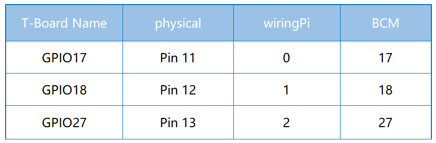
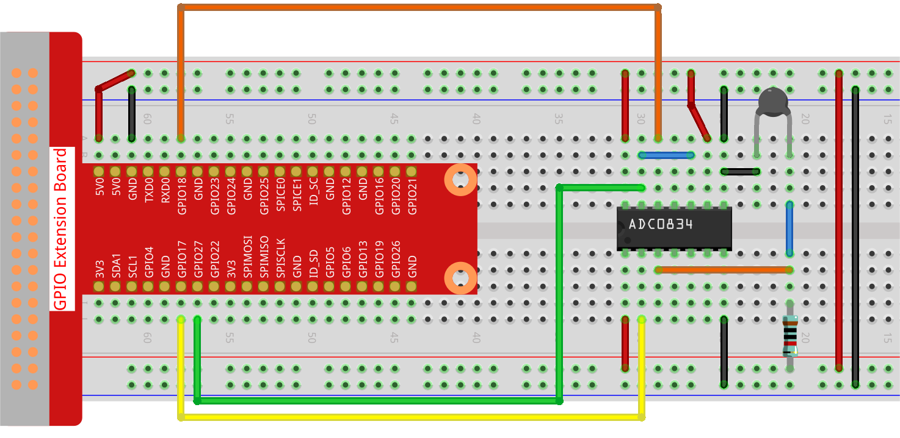

.. note::

    Bonjour et bienvenue dans la communauté des passionnés de Raspberry Pi, Arduino et ESP32 de SunFounder sur Facebook ! Plongez plus profondément dans l'univers du Raspberry Pi, d'Arduino et de l'ESP32 avec d'autres passionnés.

    **Pourquoi nous rejoindre ?**

    - **Support d'experts** : Résolvez vos problèmes après-vente et relevez les défis techniques grâce à l'aide de notre communauté et de notre équipe.
    - **Apprendre & Partager** : Échangez des conseils et des tutoriels pour enrichir vos compétences.
    - **Aperçus exclusifs** : Soyez les premiers informés des nouvelles annonces de produits.
    - **Réductions spéciales** : Profitez de remises exclusives sur nos derniers produits.
    - **Promotions festives et concours** : Participez à des concours et bénéficiez d'offres spéciales lors d'événements festifs.

    👉 Prêt à explorer et créer avec nous ? Cliquez sur [|link_sf_facebook|] et rejoignez-nous dès aujourd'hui !

.. _2.2.2_py_pi5:

2.2.2 Thermistance
====================

Introduction
--------------

Tout comme une photorésistance peut détecter la lumière, une thermistance est un 
dispositif électronique sensible à la température. Elle peut être utilisée pour 
réaliser des fonctions de contrôle de la température, comme la création d'une alarme thermique.

Composants nécessaires
----------------------

Pour ce projet, nous aurons besoin des composants suivants :

.. image:: ../python_pi5/img/2.2.2_thermistor_list.png

.. It's definitely convenient to buy a whole kit, here's the link: 

.. .. list-table::
..     :widths: 20 20 20
..     :header-rows: 1

..     *   - Name	
..         - ITEMS IN THIS KIT
..         - LINK
..     *   - Raphael Kit
..         - 337
..         - |link_Raphael_kit|

.. You can also buy them separately from the links below.

.. .. list-table::
..     :widths: 30 20
..     :header-rows: 1

..     *   - COMPONENT INTRODUCTION
..         - PURCHASE LINK

..     *   - :ref:`gpio_extension_board`
..         - |link_gpio_board_buy|
..     *   - :ref:`breadboard`
..         - |link_breadboard_buy|
..     *   - :ref:`wires`
..         - |link_wires_buy|
..     *   - :ref:`resistor`
..         - |link_resistor_buy|
..     *   - :ref:`thermistor`
..         - |link_thermistor_buy|
..     *   - :ref:`adc0834`
..         - \-

Schéma de circuit
--------------------

.. image:: ../python_pi5/img/2.2.2_thermistor_schematic_2.png

Procédure expérimentale
---------------------------

**Étape 1 :** Construisez le circuit.

**Étape 2 :** Accédez au dossier du code.

.. raw:: html

   <run></run>

.. code-block:: 

    cd ~/davinci-kit-for-raspberry-pi/python-pi5

**Étape 3 :** Exécutez le fichier.

.. raw:: html

   <run></run>

.. code-block:: 

    sudo python3 2.2.2_Thermistor.py

Une fois le code lancé, la thermistance détectera la température ambiante, 
qui sera affichée à l'écran après le calcul effectué par le programme.

.. warning::

    Si une erreur ``RuntimeError: Cannot determine SOC peripheral base address`` apparaît, veuillez consulter :ref:`faq_soc`.

**Code**

.. note::

    Vous pouvez **modifier/réinitialiser/copier/exécuter/arrêter** le code ci-dessous. Mais avant cela, assurez-vous de vous rendre dans le chemin source du code, comme ``davinci-kit-for-raspberry-pi/python-pi5``. Après avoir modifié le code, vous pouvez l'exécuter directement pour voir l'effet.

.. raw:: html

    <run></run>

.. code-block:: python

   #!/usr/bin/env python3
   # -*- coding: utf-8 -*-

   import ADC0834
   import time
   import math

   # Initialisation du module ADC0834
   ADC0834.setup()

   # Exécution du processus dans un bloc try-except
   try:
       while True:
           # Lecture de la valeur analogique du capteur
           analogVal = ADC0834.getResult()

           # Conversion de la valeur analogique en tension
           Vr = 5 * float(analogVal) / 255

           # Calcul de la résistance de la thermistance
           Rt = 10000 * Vr / (5 - Vr)

           # Calcul de la température en Kelvin
           temp = 1 / (((math.log(Rt / 10000)) / 3950) + (1 / (273,15 + 25)))

           # Conversion de Kelvin en Celsius
           Cel = temp - 273,15

           # Conversion de Celsius en Fahrenheit
           Fah = Cel * 1,8 + 32

           # Affichage de la température en Celsius et en Fahrenheit
           print('Celsius: %.2f C  Fahrenheit: %.2f F' % (Cel, Fah))

           # Attente de 0,2 seconde avant la prochaine lecture
           time.sleep(0.2)

   # Gestion de l'interruption clavier pour une terminaison propre
   except KeyboardInterrupt:
       # Libération des ressources de l'ADC0834
       ADC0834.destroy()

**Explication du code**

#. Cette section importe la bibliothèque ADC0834 pour la conversion analogique-numérique, la bibliothèque ``time`` pour implémenter des délais, et la bibliothèque ``math`` pour effectuer des opérations mathématiques.

   .. code-block:: python

       #!/usr/bin/env python3
       # -*- coding: utf-8 -*-

       import ADC0834
       import time
       import math

#. Initialisation du module ADC0834 pour permettre la lecture des valeurs analogiques.

   .. code-block:: python

       # Initialisation du module ADC0834
       ADC0834.setup()

#. Implémentation d'une boucle infinie pour la lecture continue des données. La boucle lit la valeur analogique de la thermistance, la convertit en tension, calcule la résistance de la thermistance, puis la traduit en mesures de température en Kelvin, Celsius et Fahrenheit. Elle affiche ensuite les températures en Celsius et en Fahrenheit avec une pause de 0,2 seconde entre chaque lecture.

   .. code-block:: python

       # Exécution du processus dans un bloc try-except
       try:
           while True:
               # Lecture de la valeur analogique du capteur
               analogVal = ADC0834.getResult()

               # Conversion de la valeur analogique en tension
               Vr = 5 * float(analogVal) / 255

               # Calcul de la résistance de la thermistance
               Rt = 10000 * Vr / (5 - Vr)

               # Calcul de la température en Kelvin
               temp = 1 / (((math.log(Rt / 10000)) / 3950) + (1 / (273,15 + 25)))

               # Conversion de Kelvin en Celsius
               Cel = temp - 273,15

               # Conversion de Celsius en Fahrenheit
               Fah = Cel * 1,8 + 32

               # Affichage de la température en Celsius et en Fahrenheit
               print('Celsius: %.2f C  Fahrenheit: %.2f F' % (Cel, Fah))

               # Attente de 0,2 seconde avant la prochaine lecture
               time.sleep(0.2)

#. Capture de l'exception ``KeyboardInterrupt`` pour terminer proprement le programme et libérer les ressources du module ADC0834.

   .. code-block:: python

       # Gestion de l'interruption clavier pour une terminaison propre
       except KeyboardInterrupt:
           # Libération des ressources de l'ADC0834
           ADC0834.destroy()
