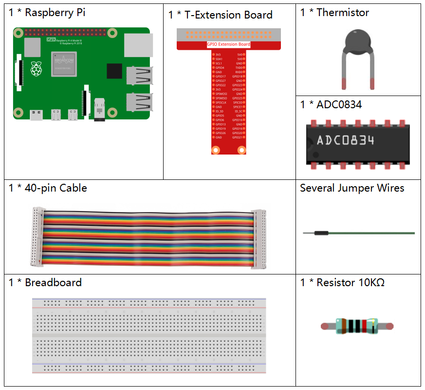

.. note::

    こんにちは、SunFounderのRaspberry Pi & Arduino & ESP32愛好家コミュニティへようこそ！Facebook上でRaspberry Pi、Arduino、ESP32についてもっと深く掘り下げ、他の愛好家と交流しましょう。

    **参加する理由は？**

    - **エキスパートサポート**：コミュニティやチームの助けを借りて、販売後の問題や技術的な課題を解決します。
    - **学び＆共有**：ヒントやチュートリアルを交換してスキルを向上させましょう。
    - **独占的なプレビュー**：新製品の発表や先行プレビューに早期アクセスしましょう。
    - **特別割引**：最新製品の独占割引をお楽しみください。
    - **祭りのプロモーションとギフト**：ギフトや祝日のプロモーションに参加しましょう。

    👉 私たちと一緒に探索し、創造する準備はできていますか？[|link_sf_facebook|]をクリックして今すぐ参加しましょう！

.. _2.2.2_py_pi5:

2.2.2 サーミスタ
================

はじめに
------------

フォトレジスタが光を感知するように、サーミスタは温度に感応する電子デバイスで、温度制御などの機能を実現するために使用できます。たとえば、ヒートアラームを作成することができます。

必要なコンポーネント
------------------------------

このプロジェクトでは、以下のコンポーネントが必要です。

回路図
-----------------

.. image:: ../python_pi5/img/2.2.2_thermistor_schematic_1.png

.. image:: ../python_pi5/img/2.2.2_thermistor_schematic_2.png

実験手順
-----------------------

**ステップ 1:** 回路を組み立てます。

.. image:: ../python_pi5/img/2.2.2_thermistor_circuit.png

**ステップ 2:** コードのフォルダに移動します。

.. raw:: html

   <run></run>

.. code-block:: 

    cd ~/raphael-kit/python-pi5

**ステップ 3:** 実行可能ファイルを実行します。

.. raw:: html

   <run></run>

.. code-block:: 

    sudo python3 2.2.2_Thermistor_zero.py

コードを実行すると、サーミスタが周囲の温度を検出し、プログラムの計算が終了すると温度が画面に表示されます。

**コード**

.. note::

    以下のコードを **変更/リセット/コピー/実行/停止** することができます。ただし、その前に ``raphael-kit/python-pi5`` のソースコードパスに移動する必要があります。コードを変更した後、効果を確認するために直接実行できます。

.. raw:: html

    <run></run>

.. code-block:: python

   #!/usr/bin/env python3
   # -*- coding: utf-8 -*-

   import ADC0834
   import time
   import math

   # ADC0834モジュールを初期化
   ADC0834.setup()

   # try-exceptブロック内でプロセスを実行
   try:
       while True:
           # センサーからアナログ値を読み取る
           analogVal = ADC0834.getResult()

           # アナログ値を電圧に変換
           Vr = 5 * float(analogVal) / 255

           # サーミスタの抵抗を計算
           Rt = 10000 * Vr / (5 - Vr)

           # ケルビンで温度を計算
           temp = 1 / (((math.log(Rt / 10000)) / 3950) + (1 / (273.15 + 25)))

           # ケルビンを摂氏に変換
           Cel = temp - 273.15

           # 摂氏を華氏に変換
           Fah = Cel * 1.8 + 32

           # 摂氏と華氏の両方で温度を表示
           print('Celsius: %.2f C  Fahrenheit: %.2f F' % (Cel, Fah))

           # 次の読み取り前に0.2秒待つ
           time.sleep(0.2)

   # graceful terminationのためにKeyboardInterruptを処理
   except KeyboardInterrupt:
       # ADC0834のリソースをクリーンアップ
       ADC0834.destroy()

**コードの説明**

1. このセクションでは、アナログ-デジタル変換用のADC0834ライブラリ、遅延を実装するためのtimeライブラリ、数学的操作を行うためのmathライブラリをインポートしています。

   .. code-block:: python

       #!/usr/bin/env python3
       # -*- coding: utf-8 -*-

       import ADC0834
       import time
       import math

2. アナログ値の読み取りを可能にするためにADC0834モジュールを初期化します。

   .. code-block:: python

       # ADC0834モジュールを初期化
       ADC0834.setup()

3. 無限ループを実装してデータの連続読み取りを行います。ループはサーミスタからアナログ値を読み取り、この値を電圧に変換し、サーミスタの抵抗を計算し、その抵抗をケルビン、摂氏、華氏の温度測定に変換します。温度の読み取りを摂氏と華氏の両方で出力し、各読み取りの間に0.2秒の待機を挿入します。

   .. code-block:: python

       # try-exceptブロック内でプロセスを実行
       try:
           while True:
               # センサーからアナログ値を読み取る
               analogVal = ADC0834.getResult()

               # アナログ値を電圧に変換
               Vr = 5 * float(analogVal) / 255

               # サーミスタの抵抗を計算
               Rt = 10000 * Vr / (5 - Vr)

               # ケルビンで温度を計算
               temp = 1 / (((math.log(Rt / 10000)) / 3950) + (1 / (273.15 + 25)))

               # ケルビンを摂氏に変換
               Cel = temp - 273.15

               # 摂氏を華氏に変換
               Fah = Cel * 1.8 + 32

               # 摂氏と華氏の両方で温度を表示
               print('Celsius: %.2f C  Fahrenheit: %.2f F' % (Cel, Fah))

               # 次の読み取り前に0.2秒待つ
               time.sleep(0.2)

4. プログラムを正常に終了するためのKeyboardInterrupt例外をキャッチし、終了時にADC0834のリソースをクリーンアップする命令を含めています。

   .. code-block:: python

       # graceful terminationのためにKeyboardInterruptを処理
       except KeyboardInterrupt:
           # ADC0834のリソースをクリーンアップ
           ADC0834.destroy()
