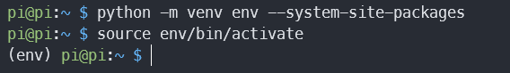
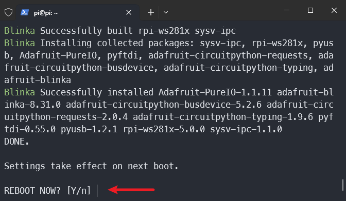

.. note::

    Hello, welcome to the SunFounder Raspberry Pi & Arduino & ESP32 Enthusiasts Community on Facebook! Dive deeper into Raspberry Pi, Arduino, and ESP32 with fellow enthusiasts.

    **Why Join?**

    - **Expert Support**: Solve post-sale issues and technical challenges with help from our community and team.
    - **Learn & Share**: Exchange tips and tutorials to enhance your skills.
    - **Exclusive Previews**: Get early access to new product announcements and sneak peeks.
    - **Special Discounts**: Enjoy exclusive discounts on our newest products.
    - **Festive Promotions and Giveaways**: Take part in giveaways and holiday promotions.

    👉 Ready to explore and create with us? Click [|link_sf_facebook|] and join today!

.. _2.2.3_py_pi5:

2.2.3 DHT-11
============

Introduction
--------------

In this lesson, you will learn how to connect and read data from a DHT11 temperature and humidity sensor using a Raspberry Pi. You will learn how to set up the sensor, read temperature in both Celsius and Fahrenheit, and obtain humidity readings. This project introduces you to working with external sensors, handling real-time data, and basic exception handling in Python.

Required Components
------------------------------

In this project, we need the following components. 

.. image:: ../img/list_2.2.3_dht-11.png

Schematic Diagram
-----------------

.. image:: ../img/image326.png

Insatll ``Adafruit_Blinka`` (CircuitPython)
----------------------------------------------------------------

The adafruit-circuitpython-dht library relies on Blinka, 
so please install Blinka first. 

The unique feature of Blinka is its ability to enable code written for CircuitPython to run seamlessly and effortlessly on Linux computers like the Raspberry Pi.

This library makes it simpler to use complex modules like BMP280, VL53L0X, and OLED, streamlining your project development process. With CircuitPython, programming becomes more accessible, allowing you to focus on creating robust applications without needing extensive hardware knowledge.

Additionally, you’ll gain the benefit of a large support community and a variety of resources to aid your learning and development.

We will guide you through the straightforward process of installing Adafruit_Blinka, setting the stage for you to quickly start working on your projects.

**Update your Raspberry Pi and Python**

Before installing Blinka, please use the following commands to ensure that your Raspberry Pi and Python versions are up to date:

.. code-block:: bash

   sudo apt-get update
   sudo apt-get upgrade

**Setup Virtual Environment**

Starting from Bookworm (OS version), packages installed using ``pip`` must be installed into a Python virtual environment using ``venv``. A virtual environment is a secure container where you can install third-party modules without affecting or disrupting your system's Python.

The following command will create an "env" directory in your user directory (``~``) for the virtual Python environment.

.. code-block:: bash
   
   cd ~
   python -m venv env --system-site-packages

You will need to activate the virtual environment every time the Pi is rebooted. To activate it:

.. code-block:: bash

   source ~/env/bin/activate

You’ll see that your prompt is now prepended with (env) to indicate that you’re no longer using the system Python. Instead, you’re using the version of Python contained inside your virtual environment. Any changes you make here won’t cause problems for your system Python; nor will any new modules you install into your environment.

To deactivate, you can use ``deactivate``, but leave it active for now.

**Automatic Installation**

When activated in the virtual environment (you will see ``(env)`` at the beginning of the terminal command), run the following code in order. This code will execute the installation script provided by adafruit and automatically complete the remaining installation steps.

.. code-block:: bash

   pip3 install --upgrade adafruit-python-shell

.. code-block:: bash
   
   wget https://raw.githubusercontent.com/adafruit/Raspberry-Pi-Installer-Scripts/master/raspi-blinka.py

.. code-block:: bash
   
   sudo -E env PATH=$PATH python3 raspi-blinka.py

It may take a few minutes to run. When it finishes, it will ask you if you would like to reboot. Press Enter directly to reboot, or if you want to reboot later, enter "n" and then press Enter. When you are ready, manually reboot your raspberry pi.

Once it reboots, the connection will close. After a couple of minutes, you can reconnect.

Install Library
---------------------------

Before installing the library, please make sure that the virtual Python environment is activated.

.. code-block:: bash

   source ~/env/bin/activate

Install adafruit-circuitpython-dht library:

.. code-block:: bash

   pip install adafruit-circuitpython-dht

Experimental Procedures
-----------------------

**Step 1:** Build the circuit.

.. image:: ../img/image207.png

**Step 2:** Go to the folder of the code.

.. raw:: html

   <run></run>

.. code-block::

    cd ~/davinci-kit-for-raspberry-pi/python-pi5

**Step 3:** Before running the code, please make sure that you have activated the virtual Python environment with blinka installed. 

.. raw:: html

   <run></run>

.. code-block::

    source ~/env/bin/activate

**Step 4:** Run the executable file.

.. raw:: html

   <run></run>

.. code-block::

    sudo python3 2.2.3_DHT.py

After the code runs, the program will print the temperature and humidity
detected by DHT11 on the computer screen.

**Code**

.. note::

    You can **Modify/Reset/Copy/Run/Stop** the code below. But before that, you need to go to  source code path like ``davinci-kit-for-raspberry-pi/python-pi5``. After modifying the code, you can run it directly to see the effect.

.. code-block:: python

    import time
    import board
    import adafruit_dht

    # Initial the dht device, with data pin connected to:
    dhtDevice = adafruit_dht.DHT11(board.D17)

    while True:
        try:
            # Print the values to the serial port
            temperature_c = dhtDevice.temperature
            temperature_f = temperature_c * (9 / 5) + 32
            humidity = dhtDevice.humidity
            print(
                "Temp: {:.1f} F / {:.1f} C    Humidity: {}% ".format(
                    temperature_f, temperature_c, humidity
                )
            )

        except RuntimeError as error:
            # Errors happen fairly often, DHT's are hard to read, just keep going
            print(error.args[0])
            time.sleep(2.0)
            continue
        except Exception as error:
            dhtDevice.exit()
            raise error

        time.sleep(2.0)

**Code Explanation**

#. Importing Libraries:

   The code begins by importing necessary libraries. ``time`` for handling delays, ``board`` for accessing Raspberry Pi GPIO pins, and ``adafruit_dht`` for interacting with the DHT11 sensor. For more detail about the ``adafruit_dht`` library, please refer to |Adafruit_CircuitPython_DHT|.

   .. code-block:: python
    
      import time
      import board
      import adafruit_dht

#. Initializing the Sensor:

   The DHT11 sensor is initialized with the data pin connected to GPIO 17 of the Raspberry Pi. This setup is crucial for the sensor to communicate with the Raspberry Pi.

   .. code-block:: python

      dhtDevice = adafruit_dht.DHT11(board.D17)

#. Reading Sensor Data in a Loop:

   The ``while True`` loop allows the program to continuously check the sensor for new data. 

   .. code-block:: python

      while True:

#. Try-Except Blocks:

   Within the loop, a try-except block is used to handle potential runtime errors. Reading from DHT sensors can often result in errors due to timing issues or sensor quirks.

   .. code-block:: python

      try:
          # Sensor data reading code here
      except RuntimeError as error:
          # Handling common sensor reading errors
          print(error.args[0])
          time.sleep(2.0)
          continue
      except Exception as error:
          # Handling other exceptions and exiting
          dhtDevice.exit()
          raise error

#. Reading and Printing Sensor Data:

   The temperature and humidity are read from the sensor and converted into human-readable formats. The temperature is also converted from Celsius to Fahrenheit.

   .. code-block:: python

      temperature_c = dhtDevice.temperature
      temperature_f = temperature_c * (9 / 5) + 32
      humidity = dhtDevice.humidity
      print("Temp: {:.1f} F / {:.1f} C    Humidity: {}% ".format(temperature_f, temperature_c, humidity))

#. Handling Read Errors:

   The DHT11 sensor can often return errors, so the code uses a try-except block to handle these. If an error occurs, the program waits for 2 seconds before attempting to read from the sensor again.

   .. code-block:: python

      except RuntimeError as error:
          print(error.args[0])
          time.sleep(2.0)
          continue

#. General Exception Handling:

   Any other exceptions that might occur are handled by safely exiting the sensor and re-raising the error. This ensures the program doesn't continue in an unstable state.

   .. code-block:: python

      except Exception as error:
          dhtDevice.exit()
          raise error

#. Delay Between Readings:

   A 2-second delay is added at the end of the loop to avoid constant polling of the sensor, which can lead to erroneous readings.

   .. code-block:: python

      time.sleep(2.0)

