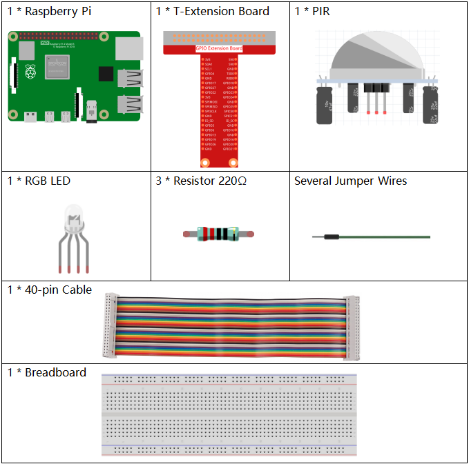
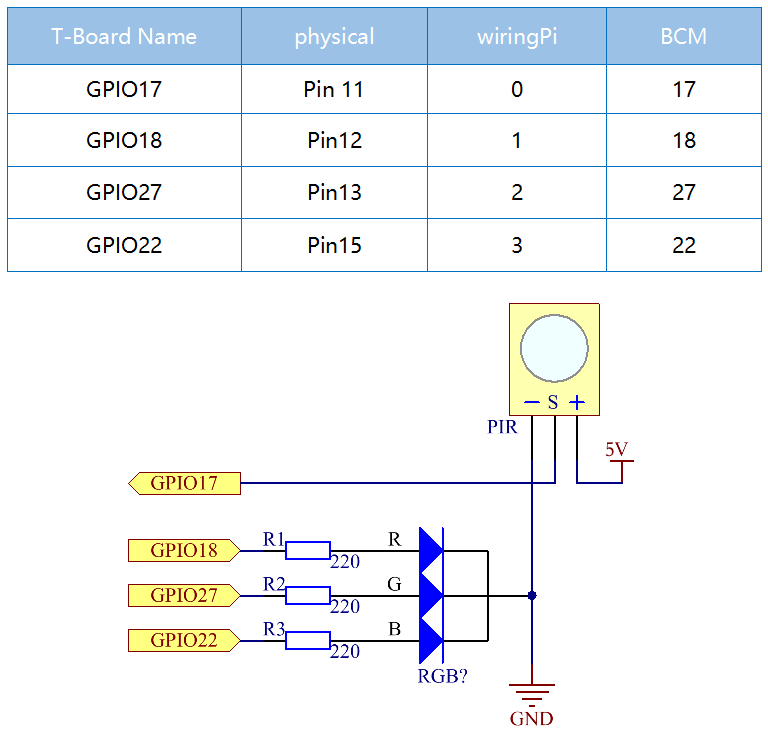
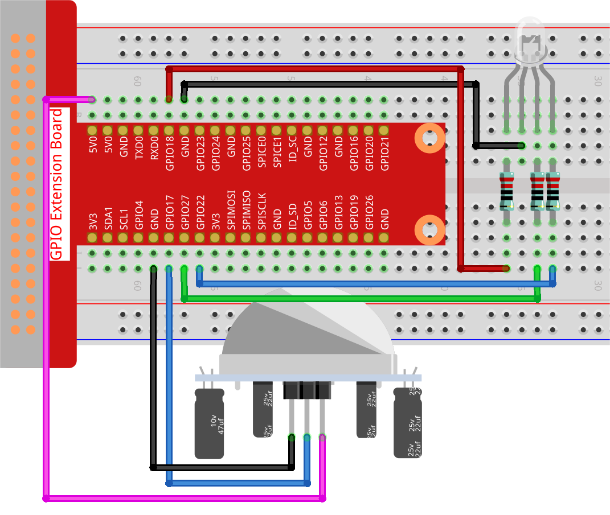

.. note::

    こんにちは、SunFounderのRaspberry Pi & Arduino & ESP32愛好家コミュニティへようこそ！Facebook上でRaspberry Pi、Arduino、ESP32についてもっと深く掘り下げ、他の愛好家と交流しましょう。

    **参加する理由は？**

    - **エキスパートサポート**：コミュニティやチームの助けを借りて、販売後の問題や技術的な課題を解決します。
    - **学び＆共有**：ヒントやチュートリアルを交換してスキルを向上させましょう。
    - **独占的なプレビュー**：新製品の発表や先行プレビューに早期アクセスしましょう。
    - **特別割引**：最新製品の独占割引をお楽しみください。
    - **祭りのプロモーションとギフト**：ギフトや祝日のプロモーションに参加しましょう。

    👉 私たちと一緒に探索し、創造する準備はできていますか？[|link_sf_facebook|]をクリックして今すぐ参加しましょう！

.. _py_pi5_pir:

2.2.4 PIR（人体赤外線センサー）
===============================================

はじめに
------------

このプロジェクトでは、人体赤外線センサーを使用してデバイスを作成します。誰かがLEDに近づくと、LEDが自動で点灯します。そうでない場合、光は消えます。この赤外線モーションセンサーは、人間や動物から放射される赤外線を検出できるセンサーの一種です。

必要なコンポーネント
------------------------------

このプロジェクトでは、以下のコンポーネントが必要です。 

.. raw:: html

    

回路図
-----------------

実験手順
-----------------------

**ステップ 1:** 回路を組み立てます。

**ステップ 2:** コードのフォルダに移動します。

.. raw:: html

   <run></run>

.. code-block::

    cd ~/davinci-kit-for-raspberry-pi/python-pi5

**ステップ 3:** 実行可能ファイルを実行します。

.. raw:: html

   <run></run>

.. code-block::

    sudo python3 2.2.4_PIR_zero.py

コードを実行すると、PIRが周囲を検出し、誰かが通り過ぎるのを感知するとRGB LEDが黄色に光ります。

PIRモジュールには2つのポテンショメーターがあります：感度を調整するためのものと検出距離を調整するためのものです。 PIRモジュールをより良く動作させるには、両方を反時計回りに回して最後まで回す必要があります。

.. image:: ../python_pi5/img/2.2.4_PIR_TTE.png
    :width: 400
    :align: center

.. warning::

    エラー メッセージ ``RuntimeError: Cannot determine SOC peripheral base address`` が表示された場合は、 :ref:`faq_soc` を参照してください。

**コード**

.. note::

    以下のコードを **変更/リセット/コピー/実行/停止** することができます。ただし、その前に ``davinci-kit-for-raspberry-pi/python-pi5`` のソースコードパスに移動する必要があります。コードを変更した後、効果を確認するために直接実行できます。

.. raw:: html

    <run></run>

.. code-block:: python

   #!/usr/bin/env python3
   from gpiozero import RGBLED, MotionSensor
   from time import sleep

   # GPIO Zeroライブラリを使用してRGB LEDとPIRモーションセンサーを初期化
   led = RGBLED(red=18, green=27, blue=22)  # RGB LEDはGPIOピン18（赤）、27（緑）、22（青）に接続されています
   pir = MotionSensor(17)  # PIRセンサーはGPIOピン17に接続されています

   try:
       # モーションを監視し、LEDの色を更新し続けます
       while True:
           if pir.motion_detected:  # PIRセンサーによるモーションの検出を確認
               led.color = (1, 1, 0)  # LEDの色を黄色に設定します（赤 + 緑）
           else:
               led.color = (0, 0, 1)  # LEDの色を青に設定します（青のみ）
           sleep(0.1)  # CPU負荷を軽減するための短い遅延

   except KeyboardInterrupt:
       # KeyboardInterrupt（Ctrl+C）を処理してループを gracefully に終了します
       pass

**コードの説明**

1. GPIO ZeroライブラリからRGB LEDを制御するための ``RGBLED`` クラスと、モーション検出用の ``MotionSensor`` クラスをインポートします。また、遅延を作成するために ``sleep`` 関数をインポートします。

   .. code-block:: python

       #!/usr/bin/env python3
       from gpiozero import RGBLED, MotionSensor
       from time import sleep

2. 赤、緑、青のコンポーネントを持つRGB LEDを初期化し、それぞれのコンポーネントをGPIOピン18、27、22に接続します。また、GPIOピン17にPIRセンサーを初期化します。

   .. code-block:: python

       # GPIO Zeroライブラリを使用してRGB LEDとPIRモーションセンサーを初期化
       led = RGBLED(red=18, green=27, blue=22)  # RGB LEDはGPIOピン18（赤）、27（緑）、22（青）に接続されています
       pir = MotionSensor(17)  # PIRセンサーはGPIOピン17に接続されています

3. プログラムは無限ループに入り、PIRセンサーを使用してモーションを連続的に確認します。モーションが検出された場合、LEDは黄色に設定されます（赤と緑の組み合わせ）。モーションが検出されない場合、LEDは青に変わります。短い0.1秒の遅延がCPU負荷を軽減します。

   .. code-block:: python

       try:
           # モーションを監視し、LEDの色を更新し続けます
           while True:
               if pir.motion_detected:  # PIRセンサーによるモーションの検出を確認
                   led.color = (1, 1, 0)  # LEDの色を黄色に設定します（赤 + 緑）
               else:
                   led.color = (0, 0, 1)  # LEDの色を青に設定します（青のみ）
               sleep(0.1)  # CPU負荷を軽減するための短い遅延

       except KeyboardInterrupt:
           # KeyboardInterrupt（Ctrl+C）を処理してループを gracefully に終了します
           pass

