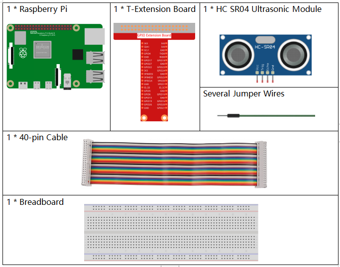
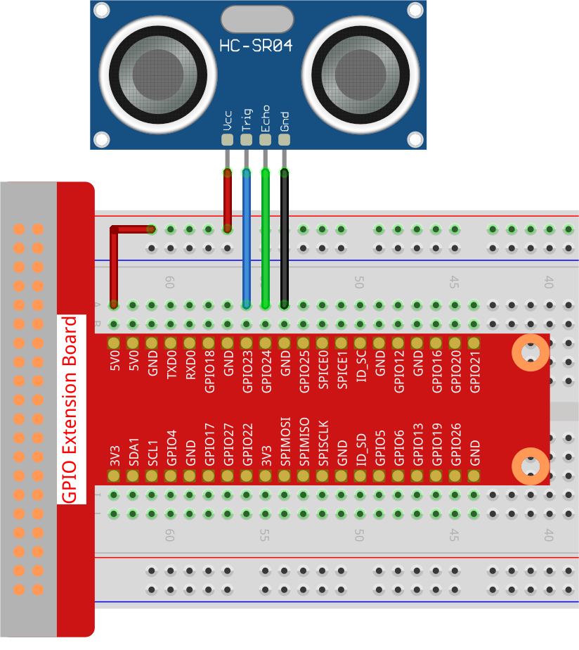

.. _py_pi5_ultrasonic:

2.2.4 超音波センサーモジュール
==============================

はじめに
--------------

超音波センサーは、物体を正確に検出し、距離を測定するために超音波を使用します。それは超音波を発信し、それらを電子信号に変換します。

必要なコンポーネント
------------------------------

このプロジェクトでは、以下のコンポーネントが必要です。 

.. raw:: html

    

回路図
-----------------

.. image:: ../python_pi5/img/2.2.5_ultrasonic_schematic.png

実験手順
-----------------------

**ステップ 1:** 回路を組み立てます。

**ステップ 2:** コードのフォルダに移動します。

.. raw:: html

   <run></run>

.. code-block::

    cd ~/davinci-kit-for-raspberry-pi/python-pi5

**ステップ 3:** 実行可能ファイルを実行します。

.. raw:: html

   <run></run>

.. code-block::

    sudo python3 2.2.5_Ultrasonic_zero.py

コードを実行すると、超音波センサーモジュールが前方の障害物とモジュール自体の距離を検出し、その距離値が画面に表示されます。

**コード**

.. note::

    以下のコードを**変更/リセット/コピー/実行/停止**することができます。ただし、その前に ``davinci-kit-for-raspberry-pi/python-pi5`` のソースコードパスに移動する必要があります。コードを変更した後、効果を確認するために直接実行できます。

.. raw:: html

    <run></run>

.. code-block:: python

   #!/usr/bin/env python3
   from gpiozero import DistanceSensor
   from time import sleep

   # GPIO Zeroライブラリを使用してDistanceSensorを初期化
   # トリガーピンはGPIO 23に接続、エコーピンはGPIO 24に接続
   sensor = DistanceSensor(echo=24, trigger=23)

   try:
       # 距離を連続的に測定および報告するためのメインループ
       while True:
           dis = sensor.distance * 100  # 距離を測定し、メートルからセンチメートルに変換
           print('Distance: {:.2f} cm'.format(dis)) # 距離を小数点以下2桁の精度で表示
           sleep(0.3)  # 次の測定前に0.3秒待機

   except KeyboardInterrupt:
       # KeyboardInterrupt（Ctrl+C）を処理してループを gracefully に終了します
       pass

**コードの説明**

1. 遅延用に ``time`` モジュールから ``sleep`` 関数を含む、距離測定用の ``gpiozero`` ライブラリから ``DistanceSensor`` クラスをインポートします。

   .. code-block:: python

       #!/usr/bin/env python3
       from gpiozero import DistanceSensor
       from time import sleep

2. エコーピンをGPIO 24に、トリガーピンをGPIO 23に接続した超音波距離センサーを初期化します。

   .. code-block:: python

       # GPIO Zeroライブラリを使用してDistanceSensorを初期化
       # トリガーピンはGPIO 23に接続、エコーピンはGPIO 24に接続
       sensor = DistanceSensor(echo=24, trigger=23)

3. メインループは距離を連続して測定し、メートルからセンチメートルに変換し、小数点以下2桁の精度で表示します。その後、0.3秒待ってから距離を再測定します。 ``KeyboardInterrupt`` （Ctrl+Cのような）をキャッチしてスクリプトから gracefully に終了できるようにします。

   .. code-block:: python

       try:
           # 距離を連続的に測定および報告するためのメインループ
           while True:
               dis = sensor.distance * 100  # 距離を測定し、メートルからセンチメートルに変換
               print('Distance: {:.2f} cm'.format(dis))   # 距離を小数点以下2桁の精度で表示
               sleep(0.3)  # 次の測定前に0.3秒待機

       except KeyboardInterrupt:
           # KeyboardInterrupt（Ctrl+C）を処理してループを gracefully に終了します
           pass
