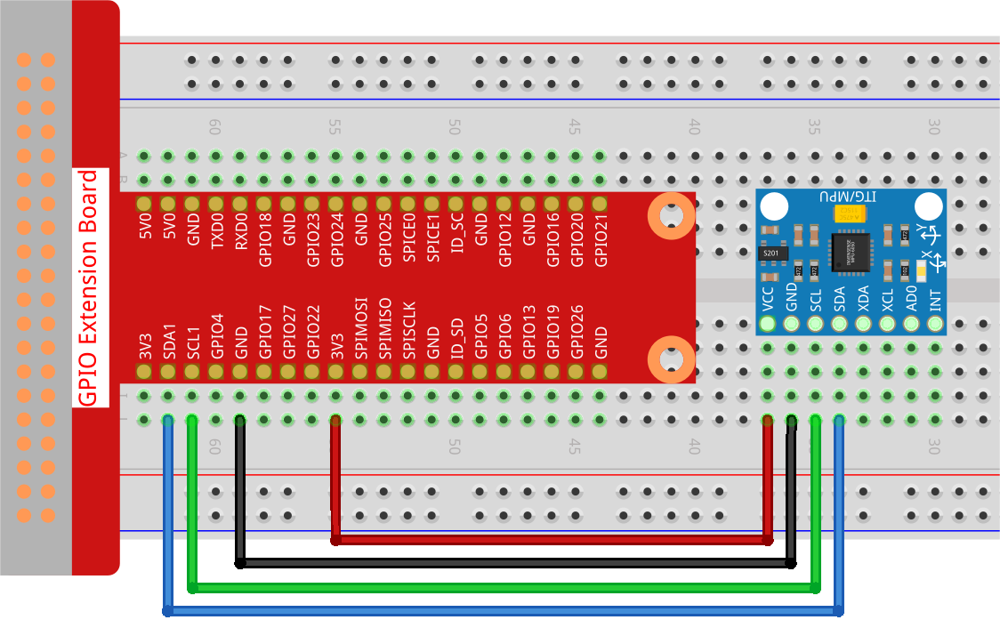

.. note::

    Hello, welcome to the SunFounder Raspberry Pi & Arduino & ESP32 Enthusiasts Community on Facebook! Dive deeper into Raspberry Pi, Arduino, and ESP32 with fellow enthusiasts.

    **Why Join?**

    - **Expert Support**: Solve post-sale issues and technical challenges with help from our community and team.
    - **Learn & Share**: Exchange tips and tutorials to enhance your skills.
    - **Exclusive Previews**: Get early access to new product announcements and sneak peeks.
    - **Special Discounts**: Enjoy exclusive discounts on our newest products.
    - **Festive Promotions and Giveaways**: Take part in giveaways and holiday promotions.

    👉 Ready to explore and create with us? Click [|link_sf_facebook|] and join today!

.. _2.2.6_py_pi5:

2.2.5 MPU6050 Module
====================

Introduction
------------

The MPU-6050 is the world’s first and only 6-axis motion tracking
devices (3-axis Gyroscope and 3-axis Accelerometer) designed for
smartphones, tablets and wearable sensors that have these features,
including the low power, low cost, and high performance requirements.

In this experiment, use I2C to obtain the values of the three-axis
acceleration sensor and three-axis gyroscope for MPU6050 and display
them on the screen.

Required Components
------------------------------

In this project, we need the following components. 

.. image:: ../python_pi5/img/2.2.6_mpu6050_list.png

.. raw:: html

    

Schematic Diagram
-----------------

MPU6050 communicates with the microcontroller through the I2C bus
interface. The SDA1 and SCL1 need to be connected to the corresponding
pin.

.. image:: ../python_pi5/img/2.2.6_mpu6050_schematic.png

Experimental Procedures
-------------------------------

**Step 1:** Build the circuit.

**Step 2**: Setup I2C (see Appendix :ref:`i2c_config`. If you have set I2C, skip this
step.)

**Step 3:** Go to the folder of the code.

.. raw:: html

   <run></run>

.. code-block::

    cd ~/davinci-kit-for-raspberry-pi/python-pi5

**Step 4:** Run the executable file.

.. raw:: html

   <run></run>

.. code-block::

    sudo python3 2.2.6_mpu6050_zero.py

With the code run, the angle of deflection of the x-axis and y-axis and
the acceleration, angular velocity on each axis read by MPU6050 will be
printed on the screen after being calculating.

.. note::

    * If you get the error ``FileNotFoundError: [Errno 2] No such file or directory: '/dev/i2c-1'``, you need to refer to :ref:`i2c_config` to enable the I2C.
    * If you get ``ModuleNotFoundError: No module named 'smbus2'`` error, please run ``sudo pip3 install smbus2``.
    * If the error ``OSError: [Errno 121] Remote I/O error`` appears, it means the module is miswired or the module is broken.

.. warning::

    If there is an error prompt  ``RuntimeError: Cannot determine SOC peripheral base address``, please refer to :ref:`faq_soc` 

**Code**

.. note::

    You can **Modify/Reset/Copy/Run/Stop** the code below. But before that, you need to go to  source code path like ``davinci-kit-for-raspberry-pi/python-pi5``. After modifying the code, you can run it directly to see the effect.

.. raw:: html

    <run></run>

.. code-block:: python

   import smbus
   import math
   import time

   # Power management registers
   power_mgmt_1 = 0x6b
   power_mgmt_2 = 0x6c

   def read_byte(adr):
       return bus.read_byte_data(address, adr)

   def read_word(adr):
       high = bus.read_byte_data(address, adr)
       low = bus.read_byte_data(address, adr+1)
       val = (high << 8) + low
       return val

   def read_word_2c(adr):
       val = read_word(adr)
       if (val >= 0x8000):
           return -((65535 - val) + 1)
       else:
           return val

   def dist(a,b):
       return math.sqrt((a*a)+(b*b))

   def get_y_rotation(x,y,z):
       radians = math.atan2(x, dist(y,z))
       return -math.degrees(radians)

   def get_x_rotation(x,y,z):
       radians = math.atan2(y, dist(x,z))
       return math.degrees(radians)

   bus = smbus.SMBus(1) # or bus = smbus.SMBus(1) for Revision 2 boards
   address = 0x68       # This is the address value read via the i2cdetect command

   # Now wake the 6050 up as it starts in sleep mode
   bus.write_byte_data(address, power_mgmt_1, 0)

   while True:
       time.sleep(0.1)
       gyro_xout = read_word_2c(0x43)
       gyro_yout = read_word_2c(0x45)
       gyro_zout = read_word_2c(0x47)

       print ("gyro_xout : ", gyro_xout, " scaled: ", (gyro_xout / 131))
       print ("gyro_yout : ", gyro_yout, " scaled: ", (gyro_yout / 131))
       print ("gyro_zout : ", gyro_zout, " scaled: ", (gyro_zout / 131))

       accel_xout = read_word_2c(0x3b)
       accel_yout = read_word_2c(0x3d)
       accel_zout = read_word_2c(0x3f)

       accel_xout_scaled = accel_xout / 16384.0
       accel_yout_scaled = accel_yout / 16384.0
       accel_zout_scaled = accel_zout / 16384.0

       print ("accel_xout: ", accel_xout, " scaled: ", accel_xout_scaled)
       print ("accel_yout: ", accel_yout, " scaled: ", accel_yout_scaled)
       print ("accel_zout: ", accel_zout, " scaled: ", accel_zout_scaled)

       print ("x rotation: " , get_x_rotation(accel_xout_scaled, accel_yout_scaled, accel_zout_scaled))
       print ("y rotation: " , get_y_rotation(accel_xout_scaled, accel_yout_scaled, accel_zout_scaled))

       time.sleep(1)

**Code Explanation**

#. Read sensor data sent from MPU6050.

   .. code-block:: python

       def read_word(adr):
           high = bus.read_byte_data(address, adr)
           low = bus.read_byte_data(address, adr+1)
           val = (high << 8) + low
           return val

       def read_word_2c(adr):
           val = read_word(adr)
           if (val >= 0x8000):
               return -((65535 - val) + 1)
           else:
               return val

#. Calculate the deflection angle of the y-axis.

   .. code-block:: python

       def get_y_rotation(x,y,z):
           radians = math.atan2(x, dist(y,z))
           return -math.degrees(radians)

#. Calculate the deflection angle of the x-axis.

   .. code-block:: python

       def get_x_rotation(x,y,z):
           radians = math.atan2(y, dist(x,z))
           return math.degrees(radians)

#. Read the values of the x axis, y axis and z axis on the gyroscope sensor, convert the metadata to angular velocity values, and then print them.

   .. code-block:: python

       gyro_xout = read_word_2c(0x43)
       gyro_yout = read_word_2c(0x45)
       gyro_zout = read_word_2c(0x47)

       print ("gyro_xout : ", gyro_xout, " scaled: ", (gyro_xout / 131))
       print ("gyro_yout : ", gyro_yout, " scaled: ", (gyro_yout / 131))
       print ("gyro_zout : ", gyro_zout, " scaled: ", (gyro_zout / 131))

#. Read the values of the x axis, y axis and z axis on the acceleration sensor, convert the elements to accelerated speed value (gravity unit), and print them.

   .. code-block:: python

       accel_xout = read_word_2c(0x3b)
       accel_yout = read_word_2c(0x3d)
       accel_zout = read_word_2c(0x3f)

       accel_xout_scaled = accel_xout / 16384.0
       accel_yout_scaled = accel_yout / 16384.0
       accel_zout_scaled = accel_zout / 16384.0

       print ("accel_xout: ", accel_xout, " scaled: ", accel_xout_scaled)
       print ("accel_yout: ", accel_yout, " scaled: ", accel_yout_scaled)
       print ("accel_zout: ", accel_zout, " scaled: ", accel_zout_scaled)

#. Print the deflection angles of the x-axis and y-axis.

   .. code-block:: python

       print ("x rotation: " , get_x_rotation(accel_xout_scaled, accel_yout_scaled, accel_zout_scaled))
       print ("y rotation: " , get_y_rotation(accel_xout_scaled, accel_yout_scaled, accel_zout_scaled))

