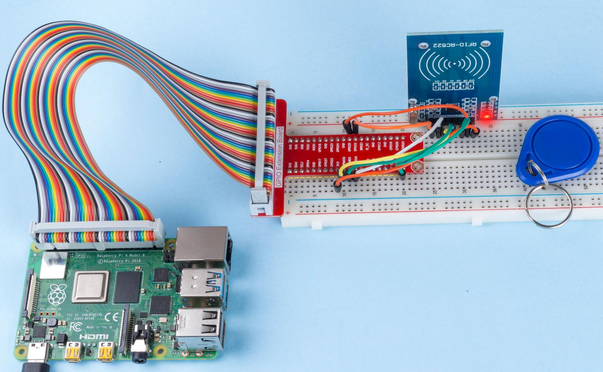

.. note::

    ¡Hola, bienvenido a la Comunidad de Entusiastas de SunFounder Raspberry Pi, Arduino y ESP32 en Facebook! Profundiza en Raspberry Pi, Arduino y ESP32 con otros entusiastas.

    **¿Por qué unirse?**

    - **Soporte experto**: Resuelve problemas postventa y desafíos técnicos con la ayuda de nuestra comunidad y equipo.
    - **Aprende y comparte**: Intercambia consejos y tutoriales para mejorar tus habilidades.
    - **Previews exclusivos**: Accede anticipadamente a anuncios de nuevos productos y adelantos exclusivos.
    - **Descuentos especiales**: Disfruta de descuentos exclusivos en nuestros productos más recientes.
    - **Promociones y sorteos festivos**: Participa en sorteos y promociones de temporada.

    👉 ¿Listo para explorar y crear con nosotros? Haz clic en [|link_sf_facebook|] y únete hoy mismo.

.. _2.2.7_rfid_py_pi5:

2.2.7 Módulo RFID MFRC522
==============================

Introducción
-------------------

La Identificación por Radiofrecuencia (RFID) se refiere a tecnologías que utilizan 
comunicación inalámbrica entre un objeto (o etiqueta) y un dispositivo interrogador 
(o lector) para rastrear e identificar automáticamente dichos objetos.

Algunas de las aplicaciones más comunes de esta tecnología incluyen cadenas de suministro 
al por menor, cadenas de suministro militares, métodos de pago automatizados, 
seguimiento y gestión de equipaje, seguimiento de documentos y gestión farmacéutica, 
por nombrar algunas.

En este proyecto, utilizaremos RFID para lectura y escritura.

Componentes necesarios
-------------------------------

En este proyecto, necesitamos los siguientes componentes. 

.. image:: ../img/list_2.2.7.png

Diagrama esquemático
----------------------------

.. image:: ../img/image331.png

Procedimientos experimentales
------------------------------------

**Paso 1:** Construye el circuito.

.. image:: ../img/image232.png

**Paso 2:** Active el SPI antes de comenzar el experimento; consulte :ref:`spi_configuration` para más detalles.

**Paso 3:** Ve a la carpeta del código.

.. raw:: html

   <run></run>

.. code-block::

    cd ~/davinci-kit-for-raspberry-pi/python-pi5

**Paso 4:** Después de ejecutar ``2.2.10_write.py``. Necesitas escribir un mensaje primero, presiona ``Enter`` para confirmar, luego coloca la tarjeta en el módulo MFRC522, espera a que aparezca "La escritura de datos está completa" y retira la tarjeta, o reescribe el mensaje en otra tarjeta y sal con ``Ctrl+C``.

.. raw:: html

    <run></run>

.. code-block::

    sudo python3 2.2.10_write.py

**Paso 5:** Después de ejecutar el programa, introduce el texto que deseas escribir (hasta 16 caracteres), como "welcome", y presiona Enter para confirmar. Luego, aparecerá el mensaje "Los datos se han escrito en la tarjeta". Finalmente, presiona ``Ctrl+C`` para detener la ejecución del código.

.. code-block::

    Por favor, coloca tu tarjeta RFID en el lector...
    Presiona Ctrl-C para detener.
    ¡Tarjeta RFID detectada!
    UID de la tarjeta: 9BF6210B
    Por favor, introduce los datos a escribir en la tarjeta (hasta 16 caracteres): welcome
    Autenticación del bloque 8 exitosa
    4 backdata &0x0F == 0x0A 10
    Datos escritos
    Los datos se han escrito en la tarjeta
    Leyendo datos del bloque 8:
    Sector 8 [119, 101, 108, 99, 111, 109, 101, 0, 0, 0, 0, 0, 0, 0, 0, 0]

**Paso 6:** Ahora ejecuta ``2.2.10_read.py`` para leer la información de la etiqueta o tarjeta que has escrito.

.. raw:: html

    <run></run>

.. code-block::

    sudo python3 2.2.10_read.py

**Paso 7:** Después de ejecutar, obtendrás la siguiente información.

.. code-block::

    Por favor, coloca tu tarjeta RFID en el lector...
    Presiona Ctrl-C para detener.
    ¡Tarjeta RFID detectada!
    UID de la tarjeta: 9BF6210B
    Autenticación del bloque 8 exitosa
    Sector 8 [119, 101, 108, 99, 111, 109, 101, 0, 0, 0, 0, 0, 0, 0, 0, 0]
    MFRC522_Read tipo de retorno: <class 'int'>, Datos: [119, 101, 108, 99, 111, 109, 101, 0, 0, 0, 0, 0, 0, 0, 0, 0]
    Sector 8 [119, 101, 108, 99, 111, 109, 101, 0, 0, 0, 0, 0, 0, 0, 0, 0]
    Datos leídos: welcome

Análisis de Código para ``2.2.10_write.py``
---------------------------------------------

Este script de Python escribe datos proporcionados por el usuario en una tarjeta RFID usando el lector RFID MFRC522. El script revisa continuamente si hay una tarjeta, pide al usuario que introduzca los datos para escribir y confirma las operaciones de escritura y lectura exitosas.

#. Importaciones

   * ``MFRC522``: Importa funciones y clases necesarias para las operaciones del lector RFID.
   * ``signal`` y ``time``: ``signal`` se usa para manejar la terminación controlada con SIGINT (Ctrl+C), y ``time`` se usa para agregar pausas en el bucle principal.

#. Variable Global

   * ``continue_reading``: Controla el bucle principal, permitiendo que el script se termine correctamente cuando se establece en ``False``.

   .. code-block:: python

        continue_reading = True

#. Manejo de Señales:

   * Función ``end_read``: Esta función se activa cuando se detecta ``Ctrl+C`` (SIGINT). Establece ``continue_reading`` en ``False``, permitiendo que el script salga correctamente.
   * ``signal.signal(signal.SIGINT, end_read)``: Asocia la señal SIGINT (Ctrl+C) con ``end_read``, por lo que, cuando se interrumpe, el script mostrará un mensaje y se cerrará de manera controlada.

   .. code-block:: python

        signal.signal(signal.SIGINT, end_read)

#. Configuración del Lector RFID:

   * ``rfid_reader``: Una instancia de la clase ``MFRC522``, usada para controlar las operaciones del lector RFID.
   * ``default_key``: Una lista de 6 bytes, típicamente ``0xFF`` para cada byte. Esta es la clave de autenticación predeterminada para la mayoría de las tarjetas RFID.

   .. code-block:: python

        # Crear una instancia de la clase MFRC522
        rfid_reader = MFRC522.MFRC522()

        # Definir la clave predeterminada (6 bytes, por defecto todos son 0xFF)
        default_key = [0xFF, 0xFF, 0xFF, 0xFF, 0xFF, 0xFF]

#. Instrucciones para el Usuario

   El script imprime instrucciones en la consola, informando al usuario que coloque su tarjeta RFID en el lector y que use ``Ctrl+C`` para salir.

   .. code-block:: python

        print("Por favor, coloca tu tarjeta RFID en el lector...")
        print("Presiona Ctrl-C para detener.")

#. Bucle Principal: Detección, Escritura y Lectura de Datos

   * **Detección de la Tarjeta**: El script llama continuamente a ``MFRC522_Request`` para detectar tarjetas RFID. Si se detecta una tarjeta (``status == rfid_reader.MI_OK``), procede al siguiente paso.
   
   .. code-block:: python

        (status, TagType) = rfid_reader.MFRC522_Request(rfid_reader.PICC_REQIDL)

        # Si se detecta una tarjeta
        if status == rfid_reader.MI_OK:
            print("¡Tarjeta RFID detectada!")
            ...
        else:
            # Espera un momento antes de intentarlo de nuevo
            time.sleep(0.5)

   * **Recuperación del UID de la Tarjeta**: Llama a ``MFRC522_SelectTagSN`` para obtener el identificador único (UID) de la tarjeta. Si tiene éxito, el UID se convierte en una cadena hexadecimal y se imprime. El UID es necesario para la autenticación.
   
   .. code-block:: python

        (status, uid) = rfid_reader.MFRC522_SelectTagSN()

        # Si tenemos el UID, continuamos
        if status == rfid_reader.MI_OK:
            # Imprimir UID
            uid_str = ''.join(['%02X' % i for i in uid])
            print("UID de la tarjeta: %s" % uid_str)
            ...       
        else:
            print("No se puede obtener el UID de la tarjeta")

   * **Preparación de los Datos**:

     * **Solicitar Entrada**: Se le solicita al usuario que introduzca los datos para escribir en la tarjeta (hasta 16 caracteres).
     * **Truncamiento de Datos**: Los datos se limitan a 16 caracteres si el usuario introduce más.
     * **Conversión de Cadena a Bytes**: La entrada del usuario en forma de cadena se convierte en una lista de bytes y se rellena hasta 16 bytes, como requiere el formato de almacenamiento de la tarjeta RFID.

   .. code-block:: python

        write_data = input("Por favor, introduce los datos para escribir en la tarjeta (hasta 16 caracteres): ")
        # Asegurarse de que los datos no superen los 16 caracteres
        write_data = write_data[:16]
        # Convertir cadena a lista de bytes, rellenar hasta 16 bytes
        data_to_write = [0x00]*16
        string_bytes = write_data.encode('utf-8')
        for i in range(len(string_bytes)):
            data_to_write[i] = string_bytes[i]

   * **Especificación del Número de Bloque**: El script especifica el bloque 8 para escribir los datos. Nota: Los números de bloque deben evitar los bloques de trailer de sector, típicamente el último bloque de cada sector, ya que se usan para información de control.

   .. code-block:: python

        block_num = 8  # Por ejemplo, elige el bloque 8

   * **Autenticación de la Tarjeta**: ``MFRC522_Auth`` autentica el bloque especificado usando la clave predeterminada y el UID. Si la autenticación es exitosa, el script procede a escribir los datos. Si falla, se imprime un mensaje de error y se detiene la encriptación.
   
   .. code-block:: python

        status = rfid_reader.MFRC522_Auth(rfid_reader.PICC_AUTHENT1A, block_num, default_key, uid)

        if status == rfid_reader.MI_OK:
            print("Autenticación del bloque %d exitosa" % block_num)
            ...
        else:
            print("Autenticación fallida")
            rfid_reader.MFRC522_StopCrypto1()

   * **Escritura de Datos en la Tarjeta**: ``MFRC522_Write`` escribe los datos preparados en el bloque especificado de la tarjeta RFID. Después de escribir, un mensaje confirma que los datos se han escrito correctamente en la tarjeta.

   .. code-block:: python
                
        rfid_reader.MFRC522_Write(block_num, data_to_write)
        print("Los datos se han escrito en la tarjeta")

   * **Lectura de los Datos**: Para verificar la operación de escritura, el script lee los datos del mismo bloque usando ``MFRC522_Read``. Los datos recuperados se imprimen para que el usuario pueda verificar los datos.
   
   .. code-block:: python

        print("Leyendo datos del bloque %d:" % block_num)
        rfid_reader.MFRC522_Read(block_num)

   * **Detener Encriptación**: ``MFRC522_StopCrypto1`` detiene el proceso de encriptación después de completar las operaciones. Este paso es necesario para restablecer el estado de comunicación de la tarjeta.
   
   .. code-block:: python

        # Detener encriptación
        rfid_reader.MFRC522_StopCrypto1()

   * **Salir del Bucle**: Después de escribir y verificar los datos, ``continue_reading`` se establece en ``False`` para salir del bucle y terminar el script.

                continue_reading = False

**Puntos Clave**

   * **Terminación Controlada**: El script captura SIGINT (Ctrl+C) para terminar de manera segura e imprime un mensaje, permitiendo que cualquier operación en curso se complete antes de salir.
   * **Interacción con el Usuario**: Solicita la entrada del usuario, permitiendo que los datos se personalicen cada vez que se escribe en la tarjeta.
   * **Autenticación**: Garantiza que el acceso al bloque especificado se gestione de manera segura, manejando los fallos de autenticación de forma controlada.
   * **Formateo de Datos**: Convierte los datos de cadena a un formato de lista de bytes compatible con la estructura de almacenamiento de la tarjeta, rellenando según sea necesario.
   * **Verificación**: Lee los datos de la tarjeta para confirmar una escritura exitosa, mejorando la confiabilidad.
   * **Modularidad**: El script está bien organizado con una funcionalidad clara para detectar, escribir y leer, lo que facilita el seguimiento y mantenimiento.

Este script es adecuado para aplicaciones que requieren capacidades de lectura y escritura con tarjetas RFID, como el control de acceso o la identificación de usuarios.

Explicación del Código para ``2.2.10_read.py``
-----------------------------------------------

Este script de Python utiliza un **lector RFID (MFRC522)** para leer datos de tarjetas RFID. El script está estructurado para revisar continuamente si hay tarjetas, recuperar sus datos y gestionar las solicitudes de salida de manera controlada mediante el manejo de señales.

#. Importaciones:

   * ``MFRC522``: Este módulo proporciona métodos para interactuar con el lector RFID MFRC522.
   * ``signal`` y ``time``: Se utilizan para manejar la terminación del script (por ejemplo, ``Ctrl+C``) y controlar el tiempo de ciertas operaciones.

#. Variables Globales:

   * ``continue_reading``: Un indicador booleano que controla el bucle principal de lectura, permitiendo que el script se detenga de forma controlada cuando se presiona ``Ctrl+C``.

   .. code-block:: python

        continue_reading = True

#. Manejo de Señales:

   * Función ``end_read``: Esta función se activa cuando se detecta ``Ctrl+C`` (SIGINT). Establece ``continue_reading`` en ``False``, permitiendo que el script salga de manera controlada.
   * ``signal.signal(signal.SIGINT, end_read)``: Asocia la señal SIGINT (Ctrl+C) con ``end_read``, por lo que, al interrumpir, el script mostrará un mensaje y se cerrará de manera controlada.

   .. code-block:: python

        signal.signal(signal.SIGINT, end_read)

#. Configuración del Lector RFID:

   * ``rfid_reader``: Una instancia de la clase ``MFRC522``, usada para controlar las operaciones del lector RFID.
   * ``default_key``: Una lista de 6 bytes, típicamente ``0xFF`` para cada byte. Esta es la clave de autenticación predeterminada para la mayoría de las tarjetas RFID.
   * ``block_num``: Especifica el número de bloque que se leerá de la tarjeta RFID, aquí establecido en el bloque ``8``. El número de bloque debe coincidir con el utilizado cuando se escribieron datos en la tarjeta.

   .. code-block:: python

        # Crear una instancia de la clase MFRC522
        rfid_reader = MFRC522.MFRC522()

        # Definir la clave predeterminada (6 bytes, por defecto todos son 0xFF)
        default_key = [0xFF, 0xFF, 0xFF, 0xFF, 0xFF, 0xFF]

        # Definir el número de bloque a leer (debe coincidir con el bloque usado al escribir)
        block_num = 8  # Por ejemplo, el bloque 8

#. Instrucciones para el Usuario

   El script imprime instrucciones en la consola, informando al usuario que coloque su tarjeta RFID en el lector y que use ``Ctrl+C`` para salir.

   .. code-block:: python

        print("Por favor, coloca tu tarjeta RFID en el lector...")
        print("Presiona Ctrl-C para detener.")

#. Bucle Principal: Detección de Tarjetas RFID y Lectura de Datos.

   * **Escaneo de Tarjetas**: El bucle principal llama continuamente a ``MFRC522_Request`` para escanear tarjetas RFID. Si se detecta una tarjeta, procede a los siguientes pasos.
   
     .. code-block:: python

        (status, TagType) = rfid_reader.MFRC522_Request(rfid_reader.PICC_REQIDL)

        if status == rfid_reader.MI_OK:
            print("¡Tarjeta RFID detectada!")
            ...
        else:
            # Si no se detecta ninguna tarjeta, espera un breve período antes de volver a intentar
            time.sleep(0.5)

   * **Recuperación del UID de la Tarjeta**: Utiliza ``MFRC522_SelectTagSN`` para obtener el identificador único (UID) de la tarjeta. Si tiene éxito, convierte el UID en una cadena hexadecimal y lo imprime. Este UID es necesario para autenticar la tarjeta.

     .. code-block:: python
        
        (status, uid) = rfid_reader.MFRC522_SelectTagSN()

        # Si el UID se recuperó correctamente, continuar
        if status == rfid_reader.MI_OK:
            # Convertir la lista UID a una cadena hexadecimal
            uid_str = ''.join(['%02X' % i for i in uid])
            print("UID de la tarjeta: %s" % uid_str)
            ...
        else:
            print("No se puede obtener el UID de la tarjeta")

   * **Autenticación de la Tarjeta**: ``MFRC522_Auth`` autentica el acceso al bloque especificado usando la clave predeterminada y el UID de la tarjeta. Si la autenticación tiene éxito, el script pasa a leer datos del bloque.

     .. code-block:: python

        status = rfid_reader.MFRC522_Auth(rfid_reader.PICC_AUTHENT1A, block_num, default_key, uid)

        if status == rfid_reader.MI_OK:
            print("Autenticación del bloque %d exitosa" % block_num)
            ...
        else:
            print("Autenticación fallida, código de estado: %s" % status)
            rfid_reader.MFRC522_StopCrypto1()
    
   * **Lectura de Datos**:
     
     * ``MFRC522_Read`` lee datos del bloque especificado.
     * ``data``: Esta variable contiene los datos en bruto del bloque si la operación de lectura es exitosa.
     * El script convierte cada byte en ``data`` a caracteres y elimina cualquier byte nulo de relleno (``\x00``). Los datos procesados se imprimen.

     .. code-block:: python

        read_status, data = rfid_reader.MFRC522_Read(block_num)
        print(f"MFRC522_Read tipo de retorno: {type(read_status)}, Datos: {data}")

        if read_status == rfid_reader.MI_OK and data:
            print(f"Sector {block_num} {data}")
            # Convertir los datos en bytes a cadena y eliminar los bytes nulos de relleno
            read_data = ''.join([chr(byte) for byte in data]).rstrip('\x00')
            print("Datos leídos: %s" % read_data)
        else:
            print("Lectura de datos fallida, código de estado: %s" % read_status)

   * ``MFRC522_StopCrypto1`` se llama para detener la encriptación y restablecer la comunicación de la tarjeta.

     .. code-block:: python

        # Detener la encriptación en la tarjeta
        rfid_reader.MFRC522_StopCrypto1()

   * **Espera entre Lecturas**: Si no se detecta ninguna tarjeta, el bucle se pausa durante 0.5 segundos antes de volver a intentar.

     .. code-block:: python

        else:
            # Si no se detecta ninguna tarjeta, espera un breve período antes de volver a intentar
            time.sleep(0.5)

**Puntos Clave**

* **Salida Controlada**: El script captura la señal ``SIGINT`` para una terminación controlada, permitiendo que el lector RFID complete cualquier operación en curso.
* **Gestión de Bloques y UID**: Utiliza el bloque y el UID como componentes clave en la lectura de datos de una tarjeta RFID, con un manejo adecuado de la autenticación y los errores de lectura.
* **Diseño Modular**: El uso de funciones dedicadas del módulo ``MFRC522`` hace que el script sea legible y modular, simplificando las operaciones de RFID como la autenticación y la lectura de datos.

Imagen del fenómeno
-----------------------

