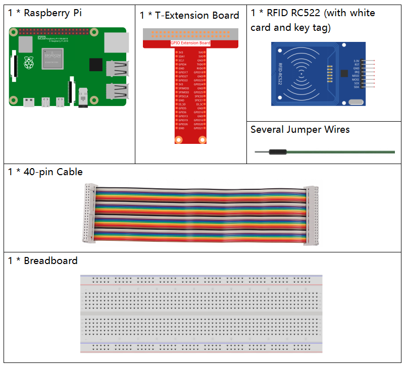

.. note::

    Ciao, benvenuto nella SunFounder Raspberry Pi & Arduino & ESP32 Enthusiasts Community su Facebook! Approfondisci l'esplorazione del Raspberry Pi, Arduino ed ESP32 con altri appassionati.

    **Perché unirti a noi?**

    - **Supporto esperto**: Risolvi i problemi post-vendita e le sfide tecniche con l'aiuto della nostra comunità e del nostro team.
    - **Impara e condividi**: Scambia consigli e tutorial per migliorare le tue competenze.
    - **Anteprime esclusive**: Accedi in anteprima agli annunci di nuovi prodotti e alle anticipazioni esclusive.
    - **Sconti speciali**: Approfitta di sconti esclusivi sui nostri prodotti più recenti.
    - **Promozioni e omaggi festivi**: Partecipa a omaggi e promozioni speciali durante le festività.

    👉 Sei pronto a esplorare e creare con noi? Clicca su [|link_sf_facebook|] e unisciti oggi stesso!

.. _2.2.7_rfid_py:

2.2.7 Modulo RFID MFRC522
==============================

Introduzione
-------------------

La Radio Frequency Identification (RFID) si riferisce a tecnologie che utilizzano 
la comunicazione wireless tra un oggetto (o tag) e un dispositivo di interrogazione 
(o lettore) per tracciare e identificare automaticamente tali oggetti.

Alcune delle applicazioni più comuni di questa tecnologia includono catene di fornitura 
al dettaglio, catene di fornitura militari, metodi di pagamento automatizzati, tracciamento 
e gestione dei bagagli, monitoraggio dei documenti e gestione farmaceutica, solo per citarne alcuni.

In questo progetto, utilizzeremo RFID per leggere e scrivere informazioni.

Componenti necessari
------------------------------

In questo progetto avremo bisogno dei seguenti componenti.

Schema elettrico
--------------------

.. image:: ../img/image331.png

Procedura sperimentale
--------------------------

**Passo 1:** Costruisci il circuito.

.. image:: ../img/image232.png

**Passo 2:** Attivare SPI prima di iniziare l'esperimento, vedere :ref:`spi_configuration` per i dettagli.

**Passo 3:** Andare nella cartella del codice.

.. raw:: html

   <run></run>

.. code-block::

    cd ~/davinci-kit-for-raspberry-pi/python-pi5

**Passo 4:** Eseguire ``2.2.10_write.py``.

.. raw:: html

    <run></run>

.. code-block::

    sudo python3 2.2.10_write.py

**Passo 5:** Dopo aver eseguito il programma, inserire il testo che si desidera scrivere (fino a 16 caratteri), come "welcome", e premere Invio per confermare. Dopo di ciò, il programma mostrerà "Data has been written to the card". Infine, premere ``Ctrl+C`` per interrompere l'esecuzione del codice.

.. code-block::

    Please place your RFID card on the reader...
    Press Ctrl-C to stop.
    RFID card detected!
    Card UID: 9BF6210B
    Please enter data to write to the card (up to 16 characters): welcome
    Block 8 authentication successful
    4 backdata &0x0F == 0x0A 10
    Data written
    Data has been written to the card
    Reading data from block 8:
    Sector 8 [119, 101, 108, 99, 111, 109, 101, 0, 0, 0, 0, 0, 0, 0, 0, 0]

**Passo 6:** Ora eseguire ``2.2.10_read.py`` per leggere le informazioni sul tag o la scheda che è stata scritta.

.. raw:: html

    <run></run>

.. code-block::

    sudo python3 2.2.10_read.py

**Passo 7:** Dopo l'esecuzione, verranno visualizzate le seguenti informazioni.

.. code-block::

    Please place your RFID card on the reader...
    Press Ctrl-C to stop.
    RFID card detected!
    Card UID: 9BF6210B
    Block 8 authentication successful
    Sector 8 [119, 101, 108, 99, 111, 109, 101, 0, 0, 0, 0, 0, 0, 0, 0, 0]
    MFRC522_Read return type: <class 'int'>, Data: [119, 101, 108, 99, 111, 109, 101, 0, 0, 0, 0, 0, 0, 0, 0, 0]
    Sector 8 [119, 101, 108, 99, 111, 109, 101, 0, 0, 0, 0, 0, 0, 0, 0, 0]
    Read data: welcome

Analisi del codice di ``2.2.10_write.py``
---------------------------------------------

Questo script Python scrive dati forniti dall'utente su una scheda RFID usando il lettore RFID MFRC522. Lo script verifica continuamente la presenza di una scheda, richiede all'utente di inserire i dati da scrivere e conferma le operazioni di scrittura e lettura riuscite.

#. Importazione dei moduli

   * ``MFRC522``: Importa le funzioni e le classi necessarie per le operazioni del lettore RFID.
   * ``signal`` e ``time``: ``signal`` è usato per gestire la terminazione tramite SIGINT (Ctrl+C), e ``time`` per aggiungere ritardi nel ciclo principale.

#. Variabile globale

   * ``continue_reading``: Controlla il ciclo principale, permettendo di terminare il programma impostando il valore a ``False``.

   .. code-block:: python

        continue_reading = True

#. Gestione del segnale:

   * Funzione ``end_read``: Questa funzione viene attivata quando viene rilevato ``Ctrl+C`` (SIGINT). Imposta ``continue_reading`` su ``False``, permettendo di terminare il programma.
   * ``signal.signal(signal.SIGINT, end_read)``: Associa il segnale SIGINT (Ctrl+C) a ``end_read``, così, se interrotto, il programma mostrerà un messaggio e si chiuderà in modo ordinato.

   .. code-block:: python

        signal.signal(signal.SIGINT, end_read)

#. Configurazione del lettore RFID:

   * ``rfid_reader``: Un'istanza della classe ``MFRC522``, utilizzata per controllare le operazioni del lettore RFID.
   * ``default_key``: Un elenco di 6 byte, di solito ``0xFF`` per ogni byte. Questa è la chiave di autenticazione predefinita per la maggior parte delle schede RFID.

   .. code-block:: python

        # Creare un'istanza della classe MFRC522
        rfid_reader = MFRC522.MFRC522()

        # Definire la chiave predefinita (6 byte, di default tutti 0xFF)
        default_key = [0xFF, 0xFF, 0xFF, 0xFF, 0xFF, 0xFF]

#. Istruzioni per l'utente

   Lo script stampa istruzioni nella console, informando l'utente di posizionare la scheda RFID sul lettore e utilizzare ``Ctrl+C`` per uscire.

   .. code-block:: python

        print("Please place your RFID card on the reader...")
        print("Press Ctrl-C to stop.")

#. Ciclo principale: Rilevamento, Scrittura e Lettura dei Dati

   * **Rilevamento della Scheda**: Lo script chiama continuamente ``MFRC522_Request`` per rilevare le schede RFID. Se una scheda viene rilevata (``status == rfid_reader.MI_OK``), procede al passaggio successivo.

   .. code-block:: python

        (status, TagType) = rfid_reader.MFRC522_Request(rfid_reader.PICC_REQIDL)

        # Se una scheda viene rilevata
        if status == rfid_reader.MI_OK:
            print("RFID card detected!")
            ...
        else:
            # Attendere un po' prima di riprovare
            time.sleep(0.5)

   * **Recupero dell'UID della Scheda**: Chiama ``MFRC522_SelectTagSN`` per recuperare l'identificatore unico (UID) della scheda. Se riuscito, l'UID viene convertito in una stringa esadecimale e stampato. L'UID è necessario per l'autenticazione.

   .. code-block:: python

        (status, uid) = rfid_reader.MFRC522_SelectTagSN()

        # Se l'UID è stato recuperato, continuare
        if status == rfid_reader.MI_OK:
            # Stampare l'UID
            uid_str = ''.join(['%02X' % i for i in uid])
            print("Card UID: %s" % uid_str)
            ...
        else:
            print("Unable to get card UID")

   * **Preparazione dei Dati**:

     * **Richiesta di Inserimento**: All'utente viene richiesto di inserire i dati da scrivere sulla scheda (fino a 16 caratteri).
     * **Troncamento dei Dati**: I dati vengono troncati a 16 caratteri se l'utente inserisce di più.
     * **Conversione da Stringa a Byte**: L'input dell'utente viene convertito in una lista di byte, riempita fino a 16 byte, come richiesto dal formato di archiviazione della scheda RFID.

   .. code-block:: python

        write_data = input("Please enter data to write to the card (up to 16 characters): ")
        # Assicurarsi che i dati non superino i 16 caratteri
        write_data = write_data[:16]
        # Convertire la stringa in una lista di byte, riempire fino a 16 byte
        data_to_write = [0x00]*16
        string_bytes = write_data.encode('utf-8')
        for i in range(len(string_bytes)):
            data_to_write[i] = string_bytes[i]

   * **Specificare il Numero di Blocco**: Lo script specifica il blocco 8 per scrivere i dati. Nota: i numeri di blocco devono evitare i blocchi di intestazione del settore, generalmente l'ultimo blocco in ogni settore, poiché sono usati per informazioni di controllo.

   .. code-block:: python

        block_num = 8  # Per esempio, scegliere il blocco 8

   * **Autenticazione della Scheda**: ``MFRC522_Auth`` autentica il blocco specificato usando la chiave predefinita e l'UID. Se l'autenticazione è riuscita, lo script procede con la scrittura dei dati.

   .. code-block:: python

        status = rfid_reader.MFRC522_Auth(rfid_reader.PICC_AUTHENT1A, block_num, default_key, uid)

        if status == rfid_reader.MI_OK:
            print("Autenticazione del blocco %d riuscita" % block_num)
            ...
        else:
            print("Autenticazione fallita")
            rfid_reader.MFRC522_StopCrypto1()

   * **Scrittura dei Dati sulla Scheda**: ``MFRC522_Write`` scrive i dati preparati sul blocco specificato della scheda RFID. Dopo la scrittura, un messaggio conferma che i dati sono stati scritti correttamente sulla scheda.

   .. code-block:: python
                
        rfid_reader.MFRC522_Write(block_num, data_to_write)
        print("Data has been written to the card")

**Punti Chiave**

   * **Terminazione Ordinata**: Lo script cattura SIGINT (Ctrl+C) per terminare in modo sicuro e stampare un messaggio, consentendo il completamento di qualsiasi operazione in corso prima di uscire.
   * **Interazione con l'Utente**: Richiede all'utente di inserire dati, consentendo la personalizzazione dei dati ogni volta che la scheda viene scritta.
   * **Autenticazione**: Garantisce che l'accesso al blocco specificato sia gestito in modo sicuro.
   * **Formattazione dei Dati**: Converte i dati della stringa in un formato di lista di byte compatibile.

Spiegazione del Codice per ``2.2.10_read.py``
-----------------------------------------------

Questo script Python utilizza un **lettore RFID (MFRC522)** per leggere dati dalle schede RFID. Lo script è strutturato per controllare continuamente la presenza di schede, recuperare i dati e gestire in modo ordinato le richieste di uscita tramite gestione dei segnali.

#. Importazione dei Moduli:

   * ``MFRC522``: Questo modulo fornisce metodi per interagire con il lettore RFID MFRC522.
   * ``signal`` e ``time``: Utilizzati per gestire la terminazione dello script (es. ``Ctrl+C``) e controllare i tempi di alcune operazioni.

#. Variabili Globali:

   * ``continue_reading``: Una variabile booleana che controlla il ciclo principale di lettura, permettendo allo script di interrompersi in modo ordinato quando si preme ``Ctrl+C``.

   .. code-block:: python

        continue_reading = True

#. Gestione dei Segnali:

   * Funzione ``end_read``: Questa funzione viene attivata quando viene rilevato ``Ctrl+C`` (SIGINT). Imposta ``continue_reading`` su ``False``, permettendo allo script di uscire in modo ordinato.
   * ``signal.signal(signal.SIGINT, end_read)``: Collega il segnale SIGINT (Ctrl+C) a ``end_read``, in modo che, se interrotto, lo script mostri un messaggio e si chiuda ordinatamente.

   .. code-block:: python

        signal.signal(signal.SIGINT, end_read)

#. Configurazione del Lettore RFID:

   * ``rfid_reader``: Un'istanza della classe ``MFRC522``, utilizzata per le operazioni del lettore RFID.
   * ``default_key``: Una lista di 6 byte, tipicamente ``0xFF`` per ogni byte. Questa è la chiave di autenticazione predefinita per la maggior parte delle schede RFID.
   * ``block_num``: Specifica il numero di blocco da leggere dalla scheda RFID, qui impostato al blocco ``8``. Il numero di blocco deve corrispondere a quello utilizzato durante la scrittura dei dati.

   .. code-block:: python

        # Creare un'istanza della classe MFRC522
        rfid_reader = MFRC522.MFRC522()

        # Definire la chiave predefinita (6 byte, di default tutti 0xFF)
        default_key = [0xFF, 0xFF, 0xFF, 0xFF, 0xFF, 0xFF]

        # Definire il numero di blocco da leggere (deve corrispondere al blocco utilizzato durante la scrittura)
        block_num = 8  # Per esempio, blocco 8

#. Istruzioni per l'Utente

   Lo script stampa istruzioni nella console, informando l'utente di posizionare la scheda RFID sul lettore e di utilizzare ``Ctrl+C`` per uscire.

   .. code-block:: python

        print("Please place your RFID card on the reader...")
        print("Press Ctrl-C to stop.")

#. Ciclo Principale: Rilevamento della Scheda RFID e Lettura dei Dati.

   * **Scansione delle Schede**: Il ciclo principale chiama continuamente ``MFRC522_Request`` per rilevare le schede RFID. Se una scheda viene rilevata, procede ai passaggi successivi.
   
     .. code-block:: python

        (status, TagType) = rfid_reader.MFRC522_Request(rfid_reader.PICC_REQIDL)

        if status == rfid_reader.MI_OK:
            print("RFID card detected!")
            ...
        else:
            # Se non viene rilevata nessuna scheda, attendere un breve periodo prima di riprovare
            time.sleep(0.5)

   * **Recupero dell'UID della Scheda**: Usa ``MFRC522_SelectTagSN`` per ottenere l'identificatore unico (UID) della scheda. Se riuscito, converte l'UID in una stringa esadecimale e lo stampa. Questo UID è necessario per autenticare la scheda.

     .. code-block:: python
        
        (status, uid) = rfid_reader.MFRC522_SelectTagSN()

        # Se l'UID è stato recuperato con successo, procedere
        if status == rfid_reader.MI_OK:
            # Convertire la lista UID in una stringa esadecimale
            uid_str = ''.join(['%02X' % i for i in uid])
            print("Card UID: %s" % uid_str)
            ...
        else:
            print("Unable to get card UID")

   * **Autenticazione della Scheda**: ``MFRC522_Auth`` autentica l'accesso al blocco specificato usando la chiave predefinita e l'UID della scheda. Se l'autenticazione riesce, lo script passa alla lettura dei dati dal blocco.

     .. code-block:: python

        status = rfid_reader.MFRC522_Auth(rfid_reader.PICC_AUTHENT1A, block_num, default_key, uid)

        if status == rfid_reader.MI_OK:
            print("Autenticazione del blocco %d riuscita" % block_num)
            ...
        else:
            print("Autenticazione fallita, codice di stato: %s" % status)
            rfid_reader.MFRC522_StopCrypto1()
    
   * **Lettura dei Dati**:
     
     * ``MFRC522_Read`` legge i dati dal blocco specificato.
     * ``data``: Questa variabile contiene i dati grezzi del blocco se l'operazione di lettura ha successo.
     * Lo script converte ogni byte in ``data`` in caratteri e rimuove eventuali byte nulli di padding (``\x00``). I dati elaborati vengono quindi stampati.
     
     .. code-block:: python

        read_status, data = rfid_reader.MFRC522_Read(block_num)
        print(f"MFRC522_Read return type: {type(read_status)}, Data: {data}")

        if read_status == rfid_reader.MI_OK and data:
            print(f"Settore {block_num} {data}")
            # Convertire i dati in byte a stringa e rimuovere eventuali byte nulli di padding
            read_data = ''.join([chr(byte) for byte in data]).rstrip('\x00')
            print("Dati letti: %s" % read_data)
        else:
            print("Lettura dei dati fallita, codice di stato: %s" % read_status)

   * ``MFRC522_StopCrypto1`` viene chiamato per fermare la crittografia e reimpostare la comunicazione della scheda.

     .. code-block:: python

        # Fermare la crittografia sulla scheda
        rfid_reader.MFRC522_StopCrypto1()

   * **Attesa tra le Letture**: Se non viene rilevata alcuna scheda, il ciclo si interrompe per 0,5 secondi prima di riprovare.

     .. code-block:: python

        else:
            # Se non viene rilevata nessuna scheda, attendere un breve periodo prima di riprovare
            time.sleep(0.5)

**Punti Chiave**

* **Uscita Ordinata**: Lo script cattura il segnale ``SIGINT`` per una terminazione ordinata, consentendo al lettore RFID di completare qualsiasi operazione in corso.
* **Gestione del Blocco e dell'UID**: Usa il blocco e l'UID come componenti chiave nella lettura dei dati da una scheda RFID, con una corretta gestione di autenticazione e errori di lettura.
* **Design Modulare**: L'uso di funzioni dedicate dal modulo ``MFRC522`` rende lo script leggibile e modulare, semplificando operazioni RFID come autenticazione e lettura dei dati.

Immagine del fenomeno
------------------------------

.. image:: ../img/image233.jpeg