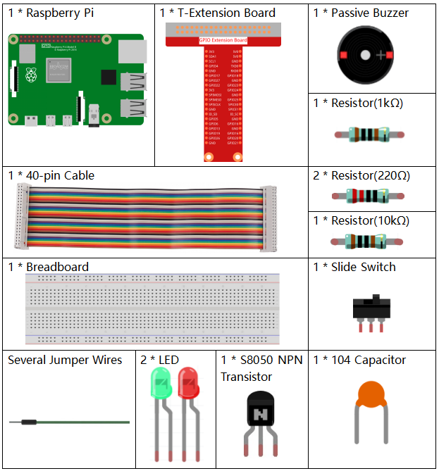
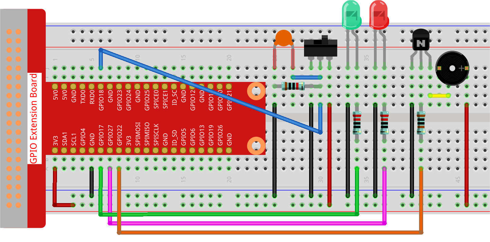

.. note::

    Hello, welcome to the SunFounder Raspberry Pi & Arduino & ESP32 Enthusiasts Community on Facebook! Dive deeper into Raspberry Pi, Arduino, and ESP32 with fellow enthusiasts.

    **Why Join?**

    - **Expert Support**: Solve post-sale issues and technical challenges with help from our community and team.
    - **Learn & Share**: Exchange tips and tutorials to enhance your skills.
    - **Exclusive Previews**: Get early access to new product announcements and sneak peeks.
    - **Special Discounts**: Enjoy exclusive discounts on our newest products.
    - **Festive Promotions and Giveaways**: Take part in giveaways and holiday promotions.

    👉 Ready to explore and create with us? Click [|link_sf_facebook|] and join today!

.. _py_pi5_bell:

3.1.10 Alarm Bell
===================

Introduction
-----------------

In this project, we will make a manual alarm device. You can replace the
toggle switch with a thermistor or a photosensitive sensor to make a
temperature alarm or a light alarm.

Required Components
------------------------------

In this project, we need the following components.

.. It's definitely convenient to buy a whole kit, here's the link: 

.. .. list-table::
..     :widths: 20 20 20
..     :header-rows: 1

..     *   - Name	
..         - ITEMS IN THIS KIT
..         - LINK
..     *   - Raphael Kit
..         - 337
..         - |link_Raphael_kit|

.. You can also buy them separately from the links below.

.. .. list-table::
..     :widths: 30 20
..     :header-rows: 1

..     *   - COMPONENT INTRODUCTION
..         - PURCHASE LINK

..     *   - :ref:`gpio_extension_board`
..         - |link_gpio_board_buy|
..     *   - :ref:`breadboard`
..         - |link_breadboard_buy|
..     *   - :ref:`wires`
..         - |link_wires_buy|
..     *   - :ref:`resistor`
..         - |link_resistor_buy|
..     *   - :ref:`led`
..         - |link_led_buy|
..     *   - :ref:`Buzzer`
..         - |link_passive_buzzer_buy|
..     *   - :ref:`slide_switch`
..         - |link_slide_switch_buy|
..     *   - :ref:`transistor`
..         - |link_transistor_buy|
..     *   - :ref:`capacitor`
..         - |link_capacitor_buy|

Schematic Diagram
-------------------------

============ ======== ======== ===
T-Board Name physical wiringPi BCM
GPIO17       Pin 11   0        17
GPIO18       Pin 12   1        18
GPIO27       Pin 13   2        27
GPIO22       Pin 15   3        22
============ ======== ======== ===

.. image:: ../python_pi5/img/4.1.15_alarm_bell_schematic.png
    :width: 600
    :align: center

Experimental Procedures
-----------------------------

**Step 1**: Build the circuit.

**Step 2:** Change directory.

.. raw:: html

   <run></run>

.. code-block::

    cd ~/raphael-kit/python-pi5

**Step 3:** Run.

.. raw:: html

   <run></run>

.. code-block::

    sudo python3 3.1.10_AlarmBell.py

After the program starts, the toggle switch will be toggled to the
right, and the buzzer will give out alarm sounds. At the same time, the
red and green LEDs will flash at a certain frequency.

.. warning::

    If there is an error prompt  ``RuntimeError: Cannot determine SOC peripheral base address``, please refer to :ref:`faq_soc` 

**Code**

.. note::
    You can **Modify/Reset/Copy/Run/Stop** the code below. But before that, you need to go to  source code path like ``raphael-kit/python-pi5``.

.. raw:: html

    <run></run>

.. code-block:: python

    #!/usr/bin/env python3

    from gpiozero import LED, Button, TonalBuzzer
    import time
    import threading

    # Initialize TonalBuzzer on GPIO pin 22
    BeepPin = TonalBuzzer(22)

    # Initialize LEDs on GPIO pins 17 and 27
    ALedPin = LED(17)
    BLedPin = LED(27)

    # Initialize Button on GPIO pin 18
    switchPin = Button(18)

    # Global flag to control the buzzer and LED states
    flag = 0

    def ledWork():
        """
        Control LED blinking pattern based on the flag state.
        When flag is set, alternately blink ALedPin and BLedPin.
        """
        while True:
            if flag:
                # Alternate blinking of LEDs
                ALedPin.on()
                time.sleep(0.5)
                ALedPin.off()
                BLedPin.on()
                time.sleep(0.5)
                BLedPin.off()
            else:
                # Turn off both LEDs if flag is not set
                ALedPin.off()
                BLedPin.off()

    # Define the musical tune as a list of notes and their durations
    tune = [
        ('C4', 0.1), ('E4', 0.1), ('G4', 0.1), 
        (None, 0.1), 
        ('E4', 0.1), ('G4', 0.1), ('C5', 0.1), 
        (None, 0.1), 
        ('C5', 0.1), ('G4', 0.1), ('E4', 0.1), 
        (None, 0.1), 
        ('G4', 0.1), ('E4', 0.1), ('C4', 0.1), 
        (None, 0.1)
    ]

    def buzzerWork():
        """
        Play a tune using the buzzer based on the flag state.
        The tune is played only when the flag is set.
        """
        while True:
            for note, duration in tune:
                if flag == 0:
                    break
                print(note)  # Output the current note to the console
                BeepPin.play(note)  # Play the current note
                time.sleep(duration)  # Pause for the duration of the note
            BeepPin.stop()  # Stop the buzzer after playing the tune

    def main():
        """
        Monitor button press to update the flag state.
        Sets the flag when the button is pressed.
        """
        global flag
        while True:
            flag = 1 if switchPin.is_pressed else 0

    try:
        # Initialize and start threads for buzzer and LED control
        tBuzz = threading.Thread(target=buzzerWork)
        tBuzz.start()
        tLed = threading.Thread(target=ledWork)
        tLed.start()
        main()

    except KeyboardInterrupt:
        # Stop the buzzer and turn off LEDs on program interruption
        BeepPin.stop()
        ALedPin.off()    
        BLedPin.off()

**Code Explanation**

#. This segment includes the import of essential libraries for implementing delays and threading. It also imports the LED, Button, and TonalBuzzer classes from the gpiozero library, crucial for controlling GPIO devices on a Raspberry Pi.

   .. code-block:: python

       #!/usr/bin/env python3

       from gpiozero import LED, Button, TonalBuzzer
       import time
       import threading

#. Sets up a buzzer on GPIO pin 22, two LEDs on GPIO pins 17 and 27, and initializes a button on GPIO pin 18. A global flag is also defined to manage the state of the buzzer and LEDs.

   .. code-block:: python

       # Initialize TonalBuzzer on GPIO pin 22
       BeepPin = TonalBuzzer(22)

       # Initialize LEDs on GPIO pins 17 and 27
       ALedPin = LED(17)
       BLedPin = LED(27)

       # Initialize Button on GPIO pin 18
       switchPin = Button(18)

       # Global flag to control the buzzer and LED states
       flag = 0

#. This function controls the blinking of the LEDs based on the flag's state. If the flag is set (1), it alternates between turning on and off each LED. If not set (0), both LEDs are turned off.

   .. code-block:: python

       def ledWork():
           """
           Control LED blinking pattern based on the flag state.
           When flag is set, alternately blink ALedPin and BLedPin.
           """
           while True:
               if flag:
                   # Alternate blinking of LEDs
                   ALedPin.on()
                   time.sleep(0.5)
                   ALedPin.off()
                   BLedPin.on()
                   time.sleep(0.5)
                   BLedPin.off()
               else:
                   # Turn off both LEDs if flag is not set
                   ALedPin.off()
                   BLedPin.off()

#. The tune is defined as a sequence of notes (frequency) and durations (seconds).

   .. code-block:: python

       # Define the musical tune as a list of notes and their durations
       tune = [
           ('C4', 0.1), ('E4', 0.1), ('G4', 0.1), 
           (None, 0.1), 
           ('E4', 0.1), ('G4', 0.1), ('C5', 0.1), 
           (None, 0.1), 
           ('C5', 0.1), ('G4', 0.1), ('E4', 0.1), 
           (None, 0.1), 
           ('G4', 0.1), ('E4', 0.1), ('C4', 0.1), 
           (None, 0.1)
       ]

#. Plays a predefined tune when the flag is set. The tune stops if the flag is unset during its play.

   .. code-block:: python

       def buzzerWork():
           """
           Play a tune using the buzzer based on the flag state.
           The tune is played only when the flag is set.
           """
           while True:
               for note, duration in tune:
                   if flag == 0:
                       break
                   print(note)  # Output the current note to the console
                   BeepPin.play(note)  # Play the current note
                   time.sleep(duration)  # Pause for the duration of the note
               BeepPin.stop()  # Stop the buzzer after playing the tune

#. Continuously checks the state of the button to set or unset the flag.

   .. code-block:: python

       def main():
           """
           Monitor button press to update the flag state.
           Sets the flag when the button is pressed.
           """
           global flag
           while True:
               flag = 1 if switchPin.is_pressed else 0

#. Threads for ``buzzerWork`` and ``ledWork`` are started, allowing them to run concurrently with the main function.

   .. code-block:: python

       try:
           # Initialize and start threads for buzzer and LED control
           tBuzz = threading.Thread(target=buzzerWork)
           tBuzz.start()
           tLed = threading.Thread(target=ledWork)
           tLed.start()
           main()

#. Stops the buzzer and turns off LEDs when the program is interrupted, ensuring a clean exit.

   .. code-block:: python

       except KeyboardInterrupt:
           # Stop the buzzer and turn off LEDs on program interruption
           BeepPin.stop()
           ALedPin.off()    
           BLedPin.off()