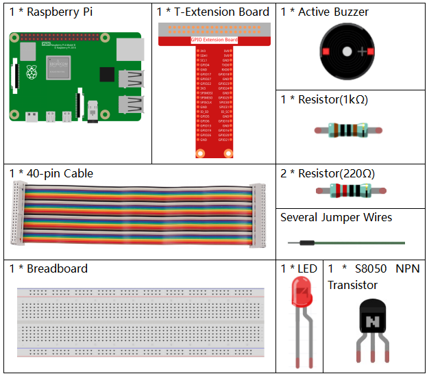
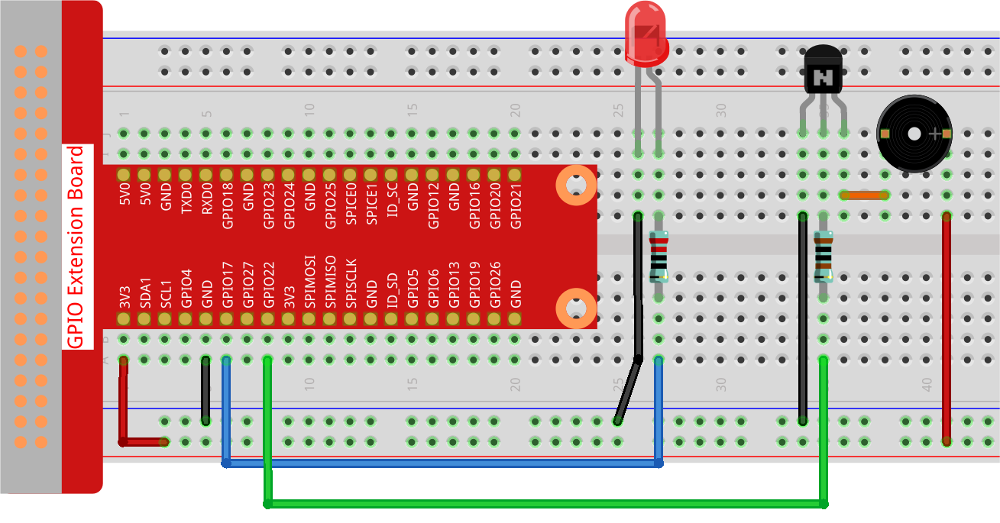

.. note::

    Hallo und willkommen in der SunFounder Raspberry Pi & Arduino & ESP32 Enthusiasten-Gemeinschaft auf Facebook! Tauchen Sie tiefer ein in die Welt von Raspberry Pi, Arduino und ESP32 mit anderen Enthusiasten.

    **Warum beitreten?**

    - **Expertenunterstützung**: Lösen Sie Nachverkaufsprobleme und technische Herausforderungen mit Hilfe unserer Gemeinschaft und unseres Teams.
    - **Lernen & Teilen**: Tauschen Sie Tipps und Anleitungen aus, um Ihre Fähigkeiten zu verbessern.
    - **Exklusive Vorschauen**: Erhalten Sie frühzeitigen Zugang zu neuen Produktankündigungen und exklusiven Einblicken.
    - **Spezialrabatte**: Genießen Sie exklusive Rabatte auf unsere neuesten Produkte.
    - **Festliche Aktionen und Gewinnspiele**: Nehmen Sie an Gewinnspielen und Feiertagsaktionen teil.

    👉 Sind Sie bereit, mit uns zu erkunden und zu erschaffen? Klicken Sie auf [|link_sf_facebook|] und treten Sie heute bei!

.. _py_pi5_morse_code:

3.1.11 Morsecode-Generator
==============================

Einführung
-----------------

In diesem Projekt werden wir einen Morsecode-Generator erstellen, bei dem Sie eine Reihe von englischen Buchstaben in den Raspberry Pi eingeben, um diese als Morsecode darzustellen.

Benötigte Komponenten
------------------------------

Für dieses Projekt benötigen wir folgende Komponenten.

Schaltplan
-----------------------

============ ======== ======== ===
T-Board Name physisch wiringPi BCM
GPIO17       Pin 11   0        17
GPIO22       Pin 15   3        22
============ ======== ======== ===

.. image:: ../python_pi5/img/4.1.16_morse_code_generator_schematic.png
   :align: center

Experimentelle Verfahren
----------------------------

**Schritt 1:** Bauen Sie den Schaltkreis. (Achten Sie auf die Pole des Buzzers:
Der mit + markierte ist der positive Pol, der andere der negative.)

**Schritt 2**: Öffnen Sie die Code-Datei.

.. raw:: html

   <run></run>

.. code-block::

    cd ~/raphael-kit/python-pi5

**Schritt 3**: Ausführen.

.. raw:: html

   <run></run>

.. code-block::

    sudo python3 3.1.11_MorseCodeGenerator_zero.py

Nachdem das Programm gestartet wurde, geben Sie eine Reihe von Zeichen ein, und der Summer sowie die LED senden die entsprechenden Morsecode-Signale.

.. warning::

    Wenn die Fehlermeldung ``RuntimeError: Cannot determine SOC peripheral base address`` angezeigt wird, lesen Sie bitte :ref:`faq_soc`

**Code**

.. code-block:: python

   #!/usr/bin/env python3
   from gpiozero import Buzzer, LED
   import time

   # Initialisierung des Buzzers und der LED an GPIO-Pins
   BeepPin = Buzzer(22)
   ALedPin = LED(17)

   # Morsecode-Darstellung für Zeichen
   MORSECODE = {
       'A': '01', 'B': '1000', 'C': '1010', 'D': '100', 'E': '0', 'F': '0010', 'G': '110',
       'H': '0000', 'I': '00', 'J': '0111', 'K': '101', 'L': '0100', 'M': '11', 'N': '10',
       'O': '111', 'P': '0110', 'Q': '1101', 'R': '010', 'S': '000', 'T': '1',
       'U': '001', 'V': '0001', 'W': '011', 'X': '1001', 'Y': '1011', 'Z': '1100',
       '1': '01111', '2': '00111', '3': '00011', '4': '00001', '5': '00000',
       '6': '10000', '7': '11000', '8': '11100', '9': '11110', '0': '11111',
       '?': '001100', '/': '10010', ',': '110011', '.': '010101', ';': '101010',
       '!': '101011', '@': '011010', ':': '111000',
   }

   def on():
       """ Schaltet den Summer und die LED ein. """
       BeepPin.on()
       ALedPin.on()

   def off():
       """ Schaltet den Summer und die LED aus. """
       BeepPin.off()
       ALedPin.off()

   def beep(dt):  # dt für Verzögerungszeit.
       """
       Erzeugt einen Piepton und ein LED-Blinken für die angegebene Dauer.
       :param dt: Dauer für den Piepton und das Blinken.
       """
       on()
       time.sleep(dt)
       off()
       time.sleep(dt)

   def morsecode(code):
       """
       Konvertiert den eingegebenen Code in Morsecode und signalisiert ihn mit dem Summer und der LED.
       :param code: Der in Morsecode umzuwandelnde Text.
       """
       pause = 0.25
       for letter in code:
           for tap in MORSECODE[letter]:
               if tap == '0':
                   beep(pause / 2)  # Kurzer Piepton für Punkt
               if tap == '1':
                   beep(pause)      # Langer Piepton für Strich
           time.sleep(pause)  # Pause zwischen Buchstaben

   def destroy():
       """ Ressourcen bei Skriptbeendigung aufräumen. """
       print("")
       BeepPin.off()
       ALedPin.off()

   try:
       while True:
           code = input("Bitte geben Sie die Nachricht ein:")
           code = code.upper()  # Umwandlung in Großbuchstaben für Morsecode-Suche
           print(code)
           morsecode(code)
   except KeyboardInterrupt:
       destroy()

**Code-Erklärung**

#. Dieser Code importiert die Klassen Buzzer und LED aus der gpiozero-Bibliothek. Diese Klassen sind wesentlich für die Steuerung der entsprechenden GPIO-Geräte auf dem Raspberry Pi.

   .. code-block:: python

       #!/usr/bin/env python3
       from gpiozero import Buzzer, LED
       import time

#. Initialisiert den Summer an GPIO-Pin 22 und die LED an GPIO-Pin 17 und erleichtert so die Steuerung dieser Komponenten.

   .. code-block:: python

       # Initialisierung des Buzzers und der LED an GPIO-Pins
       BeepPin = Buzzer(22)
       ALedPin = LED(17)

#. Definiert die Struktur „MORSE“, ein Wörterbuch, das Morsecode-Darstellungen für die Buchstaben A-Z, Zahlen 0-9 und Symbole wie „?“, „/“, „:“, „,“, „.“, „;“, „!“, „@“ enthält, wobei „0“ einen Punkt und „1“ einen Strich bedeutet.

   .. code-block:: python

       # Morsecode-Darstellung für Zeichen
       MORSECODE = {
           'A': '01', 'B': '1000', 'C': '1010', 'D': '100', 'E': '0', 'F': '0010', 'G': '110',
           'H': '0000', 'I': '00', 'J': '0111', 'K': '101', 'L': '0100', 'M': '11', 'N': '10',
           'O': '111', 'P': '0110', 'Q': '1101', 'R': '010', 'S': '000', 'T': '1',
           'U': '001', 'V': '0001', 'W': '011', 'X': '1001', 'Y': '1011', 'Z': '1100',
           '1': '01111', '2': '00111', '3': '00011', '4': '00001', '5': '00000',
           '6': '10000', '7': '11000', '8': '11100', '9': '11110', '0': '11111',
           '?': '001100', '/': '10010', ',': '110011', '.': '010101', ';': '101010',
           '!': '101011', '@': '011010', ':': '111000',
       }

#. Die Funktion „on()“ startet den Summer und die LED. Die Funktion „off()“ wird verwendet, um den Summer und die LED auszuschalten.

   .. code-block:: python

       def on():
           """ Schaltet den Summer und die LED ein. """
           BeepPin.on()
           ALedPin.on()

       def off():
           """ Schaltet den Summer und die LED aus. """
           BeepPin.off()
           ALedPin.off()

#. Definiert eine Funktion „beep()“, um den Summer und die LED in einem bestimmten Intervall von „dt“ Töne abzugeben und zu blinken.

   .. code-block:: python

       def beep(dt):  # dt für Verzögerungszeit.
           """
           Erzeugt einen Piepton und ein LED-Blinken für die angegebene Dauer.
           :param dt: Dauer für den Piepton und das Blinken.
           """
           on()
           time.sleep(dt)
           off()
           time.sleep(dt)

#. Die Funktion „morsecode()“ wird verwendet, um den Morsecode der eingegebenen Zeichen zu verarbeiten, indem das „1“ des Codes weiterhin Töne oder Lichter abgibt und das „0“ kurz Töne oder Lichter abgibt, z.B. Eingabe „SOS“, und es wird ein Signal mit drei kurzen, drei langen und dann drei kurzen Segmenten „ · · · - - - · · · “ erzeugt.

   .. code-block:: python

       def morsecode(code):
           """
           Konvertiert den eingegebenen Code in Morsecode und signalisiert ihn mit dem Summer und der LED.
           :param code: Der in Morsecode umzuwandelnde Text.
           """
           pause = 0.25
           for letter in code:
               for tap in MORSECODE[letter]:
                   if tap == '0':
                       beep(pause / 2)  # Kurzer Piepton für Punkt
                   if tap == '1':
                       beep(pause)      # Langer Piepton für Strich
               time.sleep(pause)  # Pause zwischen Buchstaben

#. Definiert eine Funktion namens „destroy“, die sowohl den Summer als auch die LED ausschaltet. Diese Funktion soll aufgerufen werden, wenn das Skript beendet wird, um sicherzustellen, dass die GPIO-Pins nicht in einem aktiven Zustand belassen werden.

   .. code-block:: python

       def destroy():
           """ Ressourcen bei Skriptbeendigung aufräumen. """
           print("")
           BeepPin.off()
           ALedPin.off()

#. Wenn Sie die relevanten Zeichen mit der Tastatur eingeben, konvertiert „upper()“ die eingegebenen Buchstaben in ihre Großbuchstabenform. „printf()“ druckt dann den Klartext auf dem Computerbildschirm aus, und die Funktion „morsecod()“ veranlasst den Summer und die LED, Morsecode auszusenden.

   .. code-block:: python

       try:
           while True:
               code = input("Bitte geben Sie die Nachricht ein:")
               code = code.upper()  # Umwandlung in Großbuchstaben für Morsecode-Suche
               print(code)
               morsecode(code)
       except KeyboardInterrupt:
           destroy()
