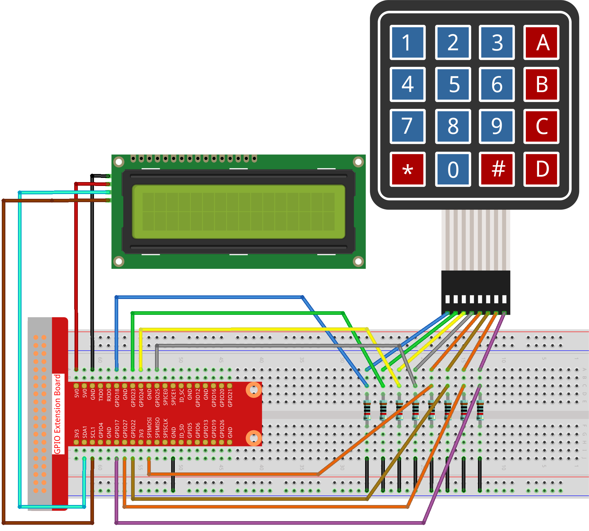

.. note::

    ¡Hola! Bienvenido a la Comunidad de Entusiastas de SunFounder para Raspberry Pi, Arduino y ESP32 en Facebook. Sumérgete en el mundo de Raspberry Pi, Arduino y ESP32 junto a otros entusiastas.

    **¿Por qué unirse?**

    - **Soporte Experto**: Resuelve problemas postventa y desafíos técnicos con la ayuda de nuestra comunidad y equipo.
    - **Aprende y Comparte**: Intercambia consejos y tutoriales para mejorar tus habilidades.
    - **Previews Exclusivos**: Acceso anticipado a anuncios y adelantos de nuevos productos.
    - **Descuentos Especiales**: Disfruta de descuentos exclusivos en nuestros productos más recientes.
    - **Promociones Festivas y Sorteos**: Participa en sorteos y promociones durante las festividades.

    👉 ¿Listo para explorar y crear con nosotros? Haz clic en [|link_sf_facebook|] y ¡únete hoy!

.. _py_pi5_guess_num:

3.1.12 JUEGO - Adivina el Número
=================================

Introducción
------------------

Adivina el Número es un divertido juego para fiestas en el que tú y 
tus amigos se turnan para ingresar un número (0~99). El rango se irá 
reduciendo con cada número ingresado hasta que uno de los jugadores 
adivine el número correcto. Entonces, este jugador será el perdedor y 
deberá recibir un castigo. Por ejemplo, si el número secreto es 51 (oculto 
para los jugadores), y el jugador ① ingresa 50, el rango cambiará a 50~99; 
si el jugador ② ingresa 70, el rango se ajustará a 50~70; si el jugador ③ 
ingresa 51, este jugador es el desafortunado. Aquí, usaremos un teclado para 
ingresar números y una pantalla LCD para mostrar los resultados.

Componentes Necesarios
---------------------------

En este proyecto, necesitamos los siguientes componentes.

.. image:: ../python_pi5/img/4.1.17_game_guess_number_list.png
    :width: 800
    :align: center

.. Es muy conveniente comprar un kit completo, aquí está el enlace:

.. .. list-table::
..     :widths: 20 20 20
..     :header-rows: 1

..     *   - Nombre
..         - ÍTEM EN ESTE KIT
..         - ENLACE
..     *   - Kit Raphael
..         - 337
..         - |link_Raphael_kit|

.. También puedes comprarlos por separado desde los enlaces de abajo.

.. .. list-table::
..     :widths: 30 20
..     :header-rows: 1

..     *   - INTRODUCCIÓN DEL COMPONENTE
..         - ENLACE DE COMPRA

..     *   - :ref:`gpio_extension_board`
..         - |link_gpio_board_buy|
..     *   - :ref:`breadboard`
..         - |link_breadboard_buy|
..     *   - :ref:`wires`
..         - |link_wires_buy|
..     *   - :ref:`resistor`
..         - |link_resistor_buy|
..     *   - :ref:`keypad`
..         - \-
..     *   - :ref:`i2c_lcd1602`
..         - |link_i2clcd1602_buy|

Diagrama de Conexión
------------------------

============ ======== ======== =======
T-Board Name physical wiringPi BCM
GPIO18       Pin 12   1        18
GPIO23       Pin 16   4        23
GPIO24       Pin 18   5        24
GPIO25       Pin 22   6        25
SPIMOSI      Pin 19   12       10
GPIO22       Pin 15   3        22
GPIO27       Pin 13   2        27
GPIO17       Pin 11   0        17
SDA1         Pin 3    SDA1(8)  SDA1(2)
SCL1         Pin 5    SCL1(9)  SDA1(3)
============ ======== ======== =======

.. image:: ../python_pi5/img/4.1.17_game_guess_number_schematic.png
   :align: center

Procedimientos Experimentales
---------------------------------

**Paso 1:** Monta el circuito.

**Paso 2**: Configura I2C (consulta :ref:`i2c_config`.)

**Paso 3**: Cambia el directorio.

.. raw:: html

   <run></run>

.. code-block:: 

    cd ~/raphael-kit/python-pi5

**Paso 4**: Ejecuta el programa.

.. raw:: html

   <run></run>

.. code-block:: 

    sudo python3 3.1.12_GAME_GuessNumber_zero.py

Después de iniciar el programa, en la pantalla LCD se mostrará la página de inicio:

.. code-block:: 

   Welcome!
   Press A to go!

Presiona ‘A’ y el juego comenzará, apareciendo la página de juego en la LCD.

.. code-block:: 

   Enter number:
   0 ‹point‹ 99

Al comenzar el juego, se genera un número aleatorio ‘\ **point**\ ’ que no 
se muestra en la LCD, y debes intentar adivinarlo. El número que ingreses 
aparecerá al final de la primera línea hasta que se realice el cálculo final. 
(Presiona ‘D’ para iniciar la comparación, y si el número ingresado es mayor 
que **10**, la comparación comenzará automáticamente.)

El rango del número ‘point’ se muestra en la segunda línea. Debes ingresar un 
número dentro de ese rango. Cuando ingreses un número, el rango se reducirá; 
si logras acertar con el número afortunado, aparecerá “¡Lo has conseguido!”

.. note::

    * Si aparece el error ``FileNotFoundError: [Errno 2] No such file or directory: '/dev/i2c-1'``, consulta :ref:`i2c_config` para habilitar I2C.
    * Si obtienes el error ``ModuleNotFoundError: No module named 'smbus2'``, ejecuta ``sudo pip3 install smbus2``.
    * Si aparece el error ``OSError: [Errno 121] Remote I/O error``, esto indica que el módulo está mal conectado o dañado.
    * Si el código y el cableado están correctos pero la pantalla LCD aún no muestra contenido, ajusta el potenciómetro en la parte posterior para aumentar el contraste.

.. warning::

    Si aparece el mensaje de error ``RuntimeError: Cannot determine SOC peripheral base address``, consulta :ref:`faq_soc` 

**Código**

.. note::
    Puedes **Modificar/Restablecer/Copiar/Ejecutar/Detener** el código a continuación. Pero antes, debes ir a la ruta de código fuente como ``raphael-kit/python-pi5``. Después de modificar el código, puedes ejecutarlo directamente para ver el efecto.

.. raw:: html

    <run></run>

.. code-block:: python

   #!/usr/bin/env python3

   from gpiozero import DigitalOutputDevice, Button
   from time import sleep
   import LCD1602
   import random

   class Keypad:
      def __init__(self, rows_pins, cols_pins, keys):
         """
         Initialize the keypad with specified row and column pins and key layout.
         :param rows_pins: List of GPIO pins for the rows.
         :param cols_pins: List of GPIO pins for the columns.
         :param keys: Layout of keys on the keypad.
         """
         self.rows = [DigitalOutputDevice(pin) for pin in rows_pins]  # Configuración de pines de fila
         self.cols = [Button(pin, pull_up=False) for pin in cols_pins]  # Configuración de pines de columna
         self.keys = keys  # Definir diseño del teclado

      def read(self):
         """
         Read and return the currently pressed keys.
         :return: List of pressed keys.
         """
         pressed_keys = []
         for i, row in enumerate(self.rows):
               row.on()  # Activa la fila actual
               for j, col in enumerate(self.cols):
                  if col.is_pressed:
                     index = i * len(self.cols) + j
                     pressed_keys.append(self.keys[index])  # Agrega la tecla presionada
               row.off()  # Desactiva la fila
         return pressed_keys

   # Variables relacionadas con el juego
   count = 0
   pointValue = 0
   upper = 99
   lower = 0

   def setup():
      """
      Setup function for initializing the keypad and LCD display.
      """
      global keypad, last_key_pressed, keys
      rowsPins = [18, 23, 24, 25]
      colsPins = [10, 22, 27, 17]
      keys = ["1", "2", "3", "A",
               "4", "5", "6", "B",
               "7", "8", "9", "C",
               "*", "0", "#", "D"]
      keypad = Keypad(rowsPins, colsPins, keys)
      last_key_pressed = []
      LCD1602.init(0x27, 1)  # Inicializa la LCD
      LCD1602.clear()
      LCD1602.write(0, 0, 'Welcome!')
      LCD1602.write(0, 1, 'Press A to Start!')

   def init_new_value():
      """
      Initialize a new target value and reset game parameters.
      """
      global pointValue, upper, lower, count
      pointValue = random.randint(0, 99)
      upper = 99
      lower = 0
      count = 0
      print('point is %d' % pointValue)

   def detect_point():
      """
      Check if the guessed number is the target, too high, or too low.
      :return: 1 if correct guess, 0 otherwise.
      """
      global count, upper, lower
      if count > pointValue and count < upper:
         upper = count
      elif count < pointValue and count > lower:
         lower = count
      elif count == pointValue:
         count = 0
         return 1
      count = 0
      return 0

   def lcd_show_input(result):
      """
      Display the current game state and results on the LCD.
      :param result: Result of the last guess (0 or 1).
      """
      LCD1602.clear()
      if result == 1:
         LCD1602.write(0, 1, 'You have got it!')
         sleep(5)
         init_new_value()
         lcd_show_input(0)
      else:
         LCD1602.write(0, 0, 'Enter number:')
         LCD1602.write(13, 0, str(count))
         LCD1602.write(0, 1, str(lower))
         LCD1602.write(3, 1, ' < Point < ')
         LCD1602.write(13, 1, str(upper))

   def loop():
      """
      Main game loop for handling keypad input and updating game state.
      """
      global keypad, last_key_pressed, count
      while True:
         result = 0
         pressed_keys = keypad.read()
         if pressed_keys and pressed_keys != last_key_pressed:
               if pressed_keys == ["A"]:
                  init_new_value()
                  lcd_show_input(0)
               elif pressed_keys == ["D"]:
                  result = detect_point()
                  lcd_show_input(result)
               elif pressed_keys[0] in keys:
                  if pressed_keys[0] in ["A", "B", "C", "D", "#", "*"]:
                     continue
                  count = count * 10 + int(pressed_keys[0])
                  if count >= 10:
                     result = detect_point()
                  lcd_show_input(result)
               print(pressed_keys)
         last_key_pressed = pressed_keys
         sleep(0.1)

   try:
      setup()
      loop()
   except KeyboardInterrupt:
      LCD1602.clear()  # Borra la LCD al interrumpir el programa

**Explicación del Código**

#. Esta sección importa las clases esenciales de la biblioteca GPIO Zero para gestionar dispositivos de salida digital y botones. También incluye la función sleep del módulo time para introducir pausas en el script. Se importa la biblioteca LCD1602 para operar la pantalla LCD, útil para mostrar texto o datos. Además, se incorpora la biblioteca random, que proporciona funciones para generar números aleatorios, lo cual es útil para varios aspectos del proyecto.

   .. code-block:: python

      #!/usr/bin/env python3

      from gpiozero import DigitalOutputDevice, Button
      from time import sleep
      import LCD1602
      import random

#. Define una clase para el teclado, inicializándolo con pines de fila y columna y definiendo un método para leer las teclas presionadas.

   .. code-block:: python

      class Keypad:
         def __init__(self, rows_pins, cols_pins, keys):
            """
            Initialize the keypad with specified row and column pins and key layout.
            :param rows_pins: List of GPIO pins for the rows.
            :param cols_pins: List of GPIO pins for the columns.
            :param keys: Layout of keys on the keypad.
            """
            self.rows = [DigitalOutputDevice(pin) for pin in rows_pins]  # Configura los pines de fila
            self.cols = [Button(pin, pull_up=False) for pin in cols_pins]  # Configura los pines de columna
            self.keys = keys  # Define el diseño del teclado

         def read(self):
            """
            Read and return the currently pressed keys.
            :return: List of pressed keys.
            """
            pressed_keys = []
            for i, row in enumerate(self.rows):
                  row.on()  # Activa la fila actual
                  for j, col in enumerate(self.cols):
                     if col.is_pressed:
                        index = i * len(self.cols) + j
                        pressed_keys.append(self.keys[index])  # Añade la tecla presionada
                  row.off()  # Desactiva la fila
            return pressed_keys

#. Inicializa una variable ``count`` en cero, potencialmente utilizada para rastrear intentos o valores específicos en el juego. Configura el teclado y la pantalla LCD con un mensaje de bienvenida e instrucciones. Inicializa la variable ``pointValue`` en cero, posiblemente representando un valor o puntuación objetivo en el juego. Define un límite superior ``upper`` para el juego, inicialmente configurado en 99, que podría ser el máximo en un juego de adivinanza de números. Configura el límite inferior ``lower`` comenzando desde cero, probablemente usado como el límite mínimo en el juego.

   .. code-block:: python

      # Variables relacionadas con el juego
      count = 0
      pointValue = 0
      upper = 99
      lower = 0

#. Configura el teclado y la pantalla LCD, mostrando un mensaje de bienvenida e instrucciones.

   .. code-block:: python

      def setup():
         """
         Setup function for initializing the keypad and LCD display.
         """
         global keypad, last_key_pressed, keys
         rowsPins = [18, 23, 24, 25]
         colsPins = [10, 22, 27, 17]
         keys = ["1", "2", "3", "A",
                  "4", "5", "6", "B",
                  "7", "8", "9", "C",
                  "*", "0", "#", "D"]
         keypad = Keypad(rowsPins, colsPins, keys)
         last_key_pressed = []
         LCD1602.init(0x27, 1)  # Inicializa la LCD
         LCD1602.clear()
         LCD1602.write(0, 0, 'Welcome!')
         LCD1602.write(0, 1, 'Press A to Start!')

#. Inicializa un nuevo valor objetivo para el juego y restablece los parámetros del juego.

   .. code-block:: python

      def init_new_value():
         """
         Initialize a new target value and reset game parameters.
         """
         global pointValue, upper, lower, count
         pointValue = random.randint(0, 99)
         upper = 99
         lower = 0
         count = 0
         print('point is %d' % pointValue)

#. Verifica si el número adivinado coincide con el objetivo y actualiza el rango de adivinanza en consecuencia.

   .. code-block:: python

      def detect_point():
         """
         Check if the guessed number is the target, too high, or too low.
         :return: 1 if correct guess, 0 otherwise.
         """
         global count, upper, lower
         if count > pointValue and count < upper:
            upper = count
         elif count < pointValue and count > lower:
            lower = count
         elif count == pointValue:
            count = 0
            return 1
         count = 0
         return 0

#. Muestra el estado del juego en la pantalla LCD, mostrando la adivinanza actual, el rango y el resultado.

   .. code-block:: python

      def lcd_show_input(result):
         """
         Display the current game state and results on the LCD.
         :param result: Result of the last guess (0 or 1).
         """
         LCD1602.clear()
         if result == 1:
            LCD1602.write(0, 1, 'You have got it!')
            sleep(5)
            init_new_value()
            lcd_show_input(0)
         else:
            LCD1602.write(0, 0, 'Enter number:')
            LCD1602.write(13, 0, str(count))
            LCD1602.write(0, 1, str(lower))
            LCD1602.write(3, 1, ' < Point < ')
            LCD1602.write(13, 1, str(upper))

#. El bucle principal para manejar la entrada del teclado, actualizar el estado del juego y mostrar los resultados en la pantalla LCD.

   .. code-block:: python

      def loop():
         """
         Main game loop for handling keypad input and updating game state.
         """
         global keypad, last_key_pressed, count
         while True:
            result = 0
            pressed_keys = keypad.read()
            if pressed_keys and pressed_keys != last_key_pressed:
                  if pressed_keys == ["A"]:
                     init_new_value()
                     lcd_show_input(0)
                  elif pressed_keys == ["D"]:
                     result = detect_point()
                     lcd_show_input(result)
                  elif pressed_keys[0] in keys:
                     if pressed_keys[0] in ["A", "B", "C", "D", "#", "*"]:
                        continue
                     count = count * 10 + int(pressed_keys[0])
                     if count >= 10:
                        result = detect_point()
                     lcd_show_input(result)
                  print(pressed_keys)
            last_key_pressed = pressed_keys
            sleep(0.1)

#. Ejecuta la configuración y entra en el bucle principal del juego, permitiendo una salida limpia mediante una interrupción del teclado.

   .. code-block:: python

      try:
         setup()
         loop()
      except KeyboardInterrupt:
         LCD1602.clear()  # Borra la LCD al interrumpir el programa

