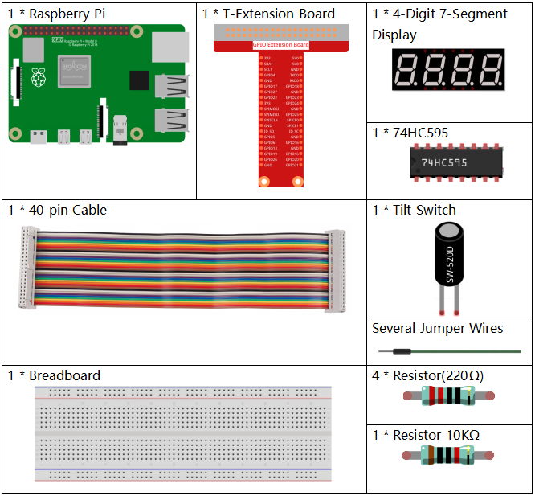
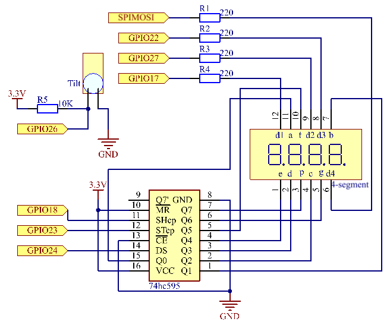
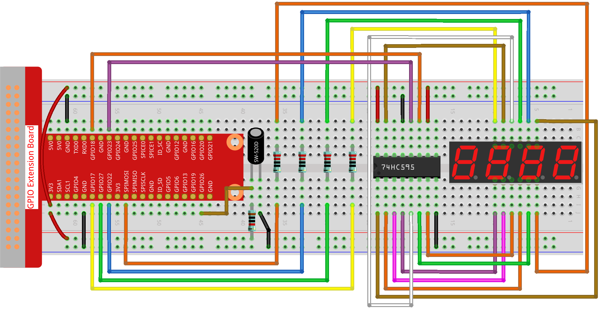

.. note::

    Hallo und willkommen in der SunFounder Raspberry Pi & Arduino & ESP32 Enthusiasten-Gemeinschaft auf Facebook! Tauchen Sie tiefer ein in die Welt von Raspberry Pi, Arduino und ESP32 mit anderen Enthusiasten.

    **Warum beitreten?**

    - **Expertenunterstützung**: Lösen Sie Nachverkaufsprobleme und technische Herausforderungen mit Hilfe unserer Gemeinschaft und unseres Teams.
    - **Lernen & Teilen**: Tauschen Sie Tipps und Anleitungen aus, um Ihre Fähigkeiten zu verbessern.
    - **Exklusive Vorschauen**: Erhalten Sie frühzeitigen Zugang zu neuen Produktankündigungen und exklusiven Einblicken.
    - **Spezialrabatte**: Genießen Sie exklusive Rabatte auf unsere neuesten Produkte.
    - **Festliche Aktionen und Gewinnspiele**: Nehmen Sie an Gewinnspielen und Feiertagsaktionen teil.

    👉 Sind Sie bereit, mit uns zu erkunden und zu erschaffen? Klicken Sie auf [|link_sf_facebook|] und treten Sie heute bei!

.. _py_pi5_10s:

3.1.13 SPIEL - 10 Sekunden
============================

Einführung
-------------------

Als Nächstes machen wir ein Spielgerät, um Ihre Konzentration herauszufordern. Binden Sie den Kippschalter an einen Stab, um einen Zauberstab zu machen. Schütteln Sie den Zauberstab, die 4-stellige Segmentanzeige beginnt zu zählen, ein erneutes Schütteln stoppt die Zählung. Wenn es Ihnen gelingt, den angezeigten Zähler auf **10.00** zu halten, dann haben Sie gewonnen. Sie können das Spiel mit Ihren Freunden spielen, um zu sehen, wer der Zeitmagier ist.

Benötigte Komponenten
------------------------------

Für dieses Projekt benötigen wir folgende Komponenten.

Schaltplan
------------------------

============ ======== ======== ===
T-Board Name physisch wiringPi BCM
GPIO17       Pin 11   0        17
GPIO27       Pin 13   2        27
GPIO22       Pin 15   3        22
SPIMOSI      Pin 19   12       10
GPIO18       Pin 12   1        18
GPIO23       Pin 16   4        23
GPIO24       Pin 18   5        24
GPIO26       Pin 37   25       26
============ ======== ======== ===

Experimentelle Verfahren
---------------------------------

**Schritt 1**: Bauen Sie den Schaltkreis.

**Schritt 2**: Gehen Sie zum Ordner mit dem Code.

.. raw:: html

   <run></run>

.. code-block::

    cd ~/raphael-kit/python-pi5

**Schritt 3**: Führen Sie die ausführbare Datei aus.

.. raw:: html

   <run></run>

.. code-block::

    sudo python3 3.1.13_GAME_10Second_zero.py

Schütteln Sie den Zauberstab, die 4-stellige Segmentanzeige beginnt zu zählen, ein weiteres Schütteln stoppt die Zählung. Wenn Sie es schaffen, den angezeigten Zähler bei **10.00** zu halten, dann haben Sie gewonnen. Schütteln Sie es ein weiteres Mal, um die nächste Runde des Spiels zu starten.

**Code**

.. note::
    Sie können den untenstehenden Code **modifizieren/zurücksetzen/kopieren/ausführen/stoppen**. Bevor Sie dies tun, sollten Sie jedoch zum Quellcodepfad wie ``raphael-kit/python-pi5`` wechseln. Nachdem Sie den Code geändert haben, können Sie ihn direkt ausführen, um das Ergebnis zu sehen.

.. raw:: html

    <run></run>

.. code-block:: python

    #!/usr/bin/env python3

    from gpiozero import OutputDevice, Button
    import time
    import threading

    # Initialisierung des Knopfes, verbunden mit GPIO 26
    sensorPin = Button(26)

    # Definition der GPIO-Pins, verbunden mit dem 74HC595 Schieberegister
    SDI = OutputDevice(24)   # Serieller Dateneingang
    RCLK = OutputDevice(23)  # Registeruhr
    SRCLK = OutputDevice(18) # Schieberegisteruhr

    # Definition der GPIO-Pins für die Ziffernauswahl auf der 7-Segment-Anzeige
    placePin = [OutputDevice(pin) for pin in (10, 22, 27, 17)]

    # Definition der Segmentcodes für Zahlen 0 bis 9 auf der 7-Segment-Anzeige
    number = (0xc0, 0xf9, 0xa4, 0xb0, 0x99, 0x92, 0x82, 0xf8, 0x80, 0x90)

    # Zähler und Timer-Variablen
    counter = 0
    timer1 = None
    gameState = 0

    def clearDisplay():
        """ Alle Segmente auf der 7-Segment-Anzeige löschen. """
        for _ in range(8):
            SDI.on()
            SRCLK.on()
            SRCLK.off()
        RCLK.on()
        RCLK.off()

    def hc595_shift(data):
        """ Verschiebt Daten in das 74HC595 Schieberegister, um eine Ziffer anzuzeigen. """
        for i in range(8):
            SDI.value = 0x80 & (data << i)
            SRCLK.on()
            SRCLK.off()
        RCLK.on()
        RCLK.off()

    def pickDigit(digit):
        """ Wählt aus, welche Ziffer auf der 7-Segment-Anzeige angezeigt werden soll. """
        for pin in placePin:
            pin.off()
        placePin[digit].on()

    def display():
        """ Den aktuellen Zählerwert auf der 7-Segment-Anzeige anzeigen. """
        global counter
        clearDisplay()
        pickDigit(0)
        hc595_shift(number[counter % 10])

        clearDisplay()
        pickDigit(1)
        hc595_shift(number[counter % 100 // 10])

        clearDisplay()
        pickDigit(2)
        hc595_shift(number[counter % 1000 // 100] - 0x80)

        clearDisplay()
        pickDigit(3)
        hc595_shift(number[counter % 10000 // 1000])

    def stateChange():
        """ Behandelt Zustandsänderungen des Zählers aufgrund von Knopfdrücken. """
        global gameState, counter, timer1
        if gameState == 0:
            counter = 0
            time.sleep(1)
            timer()
        elif gameState == 1 und timer1 ist nicht None:
            timer1.cancel()
            time.sleep(1)
        gameState = (gameState + 1) % 2

    def loop():
        """ Hauptloop, um Knopfdrücke zu prüfen und die Anzeige zu aktualisieren. """
        global counter
        currentState = 0
        lastState = 0
        while True:
            display()
            currentState = sensorPin.value
            if (currentState == 0) und (lastState == 1):
                stateChange()
            lastState = currentState

    def timer():
        """ Timer-Funktion, die den Zähler alle 0,01 Sekunden erhöht. """
        global counter, timer1
        timer1 = threading.Timer(0.01, timer)
        timer1.start()
        counter += 1

    try:
        loop()
    except KeyboardInterrupt:
        if timer1:
            timer1.cancel()

**Code-Erklärung**

#. Dieser Abschnitt importiert notwendige Module. Die Bibliothek „gpiozero“ wird verwendet, um mit GPIO-Geräten wie Tasten zu interagieren, und die Module „time“ und „threading“ können für zeitbezogene Aufgaben oder gleichzeitige Operationen verwendet werden.

   .. code-block:: python

       #!/usr/bin/env python3

       from gpiozero import OutputDevice, Button
       import time
       import threading

#. Initialisiert ein „Button“-Objekt aus der GPIO Zero-Bibliothek und verbindet es mit GPIO-Pin 26. Diese Konfiguration ermöglicht die Erkennung von Tastendrücken.

   .. code-block:: python

       # Initialize the button connected to GPIO 26
       sensorPin = Button(26)

#. Initialisiert GPIO-Pins, die mit den Eingängen für die serielle Dateneingabe (SDI), Registeruhr (RCLK) und Schieberegisteruhr (SRCLK) des Schieberegisters verbunden sind.

   .. code-block:: python

       # Define GPIO pins connected to the 74HC595 shift register
       SDI = OutputDevice(24)   # Serial Data Input
       RCLK = OutputDevice(23)  # Register Clock
       SRCLK = OutputDevice(18) # Shift Register Clock

#. Initialisiert die Pins für jede Ziffer der 7-Segment-Anzeige und definiert die Binärcodes für die Anzeige der Zahlen 0-9.

   .. code-block:: python

       # Define GPIO pins for digit selection on the 7-segment display
       placePin = [OutputDevice(pin) for pin in (10, 22, 27, 17)]

       # Define segment codes for numbers 0 to 9 on the 7-segment display
       number = (0xc0, 0xf9, 0xa4, 0xb0, 0x99, 0x92, 0x82, 0xf8, 0x80, 0x90)

#. Funktionen zur Steuerung der 7-Segment-Anzeige. „clearDisplay“ schaltet alle Segmente aus, „hc595_shift“ verschiebt Daten in das Schieberegister und „pickDigit“ aktiviert eine bestimmte Ziffer auf der Anzeige.

   .. code-block:: python

       def clearDisplay():
           """ Clear all segments on the 7-segment display. """
           for _ in range(8):
               SDI.on()
               SRCLK.on()
               SRCLK.off()
           RCLK.on()
           RCLK.off()

       def hc595_shift(data):
           """ Shift data to the 74HC595 shift register to display a digit. """
           for i in range(8):
               SDI.value = 0x80 & (data << i)
               SRCLK.on()
               SRCLK.off()
           RCLK.on()
           RCLK.off()

       def pickDigit(digit):
           """ Select which digit to display on the 7-segment display. """
           for pin in placePin:
               pin.off()
           placePin[digit].on()

#. Funktion zur Anzeige des aktuellen Zählerwerts auf der 7-Segment-Anzeige.

   .. code-block:: python

       def display():
           """ Display the current counter value on the 7-segment display. """
           global counter
           clearDisplay()
           pickDigit(0)
           hc595_shift(number[counter % 10])

           clearDisplay()
           pickDigit(1)
           hc595_shift(number[counter % 100 // 10])

           clearDisplay()
           pickDigit(2)
           hc595_shift(number[counter % 1000 // 100] - 0x80)

           clearDisplay()
           pickDigit(3)
           hc595_shift(number[counter % 10000 // 1000])

#. Funktion zur Behandlung von Zustandsänderungen (Start/Stop) des Zählers basierend auf Tastendrücken.

   .. code-block:: python

       def stateChange():
           """ Handle state changes for the counter based on button presses. """
           global gameState, counter, timer1
           if gameState == 0:
               counter = 0
               time.sleep(1)
               timer()
           elif gameState == 1 and timer1 is not None:
               timer1.cancel()
               time.sleep(1)
           gameState = (gameState + 1) % 2

#. Hauptschleife, die kontinuierlich den Tastenzustand überprüft und die Anzeige aktualisiert. Sie ruft „stateChange“ auf, wenn sich der Tastenzustand ändert.

   .. code-block:: python

       def loop():
           """ Main loop to check for button presses and update the display. """
           global counter
           currentState = 0
           lastState = 0
           while True:
               display()
               currentState = sensorPin.value
               if (currentState == 0) and (lastState == 1):
                   stateChange()
               lastState = currentState

#. Timer-Funktion, die den Zähler in regelmäßigen Abständen (alle 0,01 Sekunden) erhöht.

   .. code-block:: python

       def timer():
           """ Timer function that increments the counter every 0.01 second. """
           global counter, timer1
           timer1 = threading.Timer(0.01, timer)
           timer1.start()
           counter += 1

#. Führt die Hauptschleife aus und ermöglicht einen sauberen Ausstieg aus dem Programm mit einem Tastaturinterrupt (Strg+C).

   .. code-block:: python

       try:
           loop()
       except KeyboardInterrupt:
           if timer1:
               timer1.cancel()
