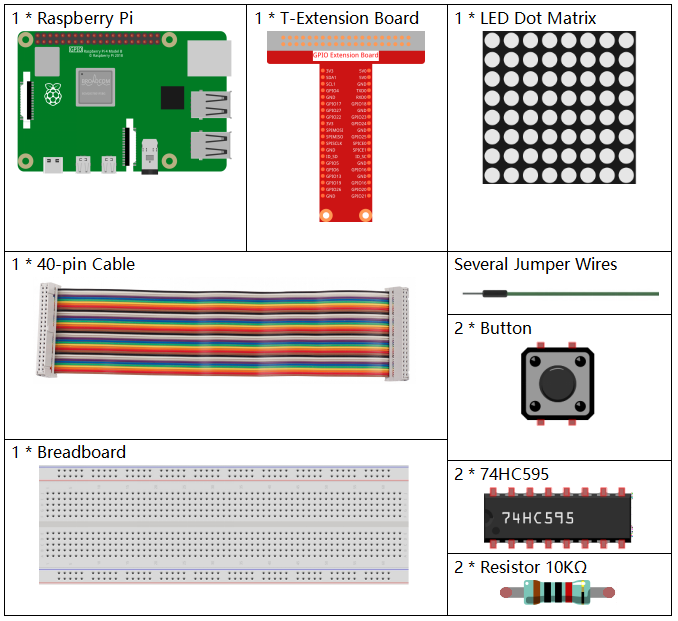
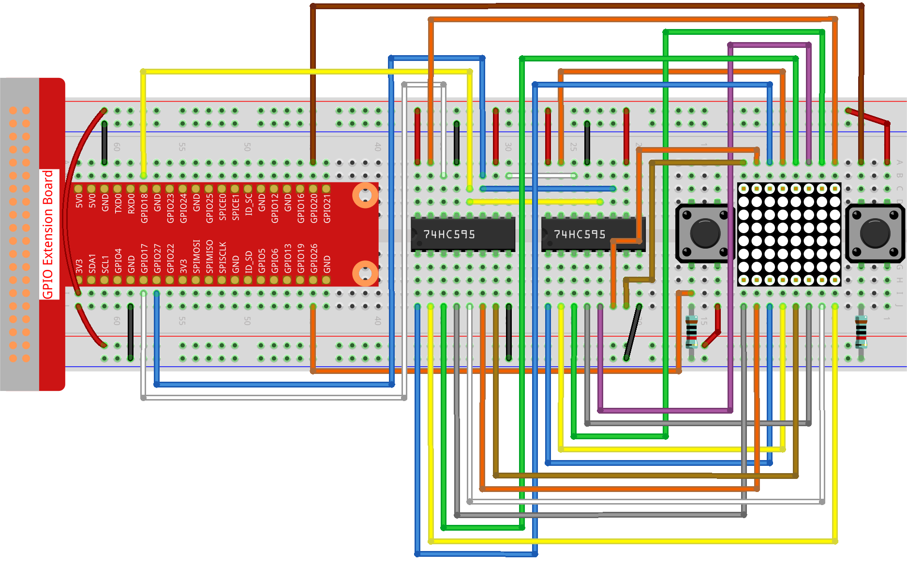

.. note::

    Bonjour et bienvenue dans la communauté Facebook des passionnés de SunFounder Raspberry Pi, Arduino et ESP32 ! Plongez plus profondément dans l'univers du Raspberry Pi, de l'Arduino et de l'ESP32 avec d'autres passionnés.

    **Pourquoi nous rejoindre ?**

    - **Support d'experts** : Résolvez les problèmes post-achat et les défis techniques grâce à l'aide de notre communauté et de notre équipe.
    - **Apprenez & Partagez** : Échangez des astuces et des tutoriels pour améliorer vos compétences.
    - **Aperçus exclusifs** : Accédez en avant-première aux nouvelles annonces de produits et aux avant-goûts.
    - **Réductions spéciales** : Profitez de remises exclusives sur nos derniers produits.
    - **Promotions festives et cadeaux** : Participez à nos tirages au sort et à nos promotions de saison.

    👉 Prêt à explorer et à créer avec nous ? Cliquez sur [|link_sf_facebook|] et rejoignez-nous dès aujourd'hui !

.. _3.1.14_py_pi5:

3.1.14 JEU – Not Not
========================

Introduction
---------------

Dans cette leçon, nous allons créer un dispositif de jeu amusant, que nous appelons « Not Not ».

Pendant le jeu, la matrice de points affichera aléatoirement une flèche. Votre objectif est d'appuyer sur le bouton opposé à la direction de la flèche dans un temps limité. Si le temps est écoulé, ou si vous appuyez sur le bouton correspondant à la même direction que la flèche, vous perdez.

Ce jeu est idéal pour entraîner votre pensée inversée. Alors, on essaie ?

Composants nécessaires
--------------------------

Pour ce projet, nous aurons besoin des composants suivants :

Schéma de câblage
--------------------

============ ======== ======== ===
T-Board Name physical wiringPi BCM
GPIO17       Pin 11   0        17
GPIO18       Pin 12   1        18
GPIO27       Pin 13   2        27
GPIO20       Pin 38   28       20
GPIO26       Pin 37   25       26
============ ======== ======== ===

.. image:: ../python_pi5/img/3.1.14_game_not_not_schematic.png
   :align: center

Procédures expérimentales
-----------------------------

**Étape 1 :** Construisez le circuit.

**Étape 2 :** Ouvrez le fichier du code.

.. raw:: html

   <run></run>

.. code-block::

    cd ~/davinci-kit-for-raspberry-pi/python-pi5

**Étape 3 :** Exécutez le programme.

.. raw:: html

   <run></run>

.. code-block::

    sudo python3 3.1.14_MotionControl.py

Après le démarrage du programme, une flèche pointant vers la gauche ou la droite 
apparaît sur la matrice de points. Vous devez appuyer sur le bouton dans la direction 
opposée à la flèche dans un temps limité. Ensuite, le symbole \"**√**\" s'affichera sur 
la matrice de points. Si le temps est écoulé ou si vous appuyez sur le bouton correspondant 
à la même direction que la flèche, vous êtes éliminé et la matrice affichera \"x\". Vous 
pouvez également ajouter deux nouveaux boutons ou les remplacer par des touches de joystick 
pour les directions haut, bas, gauche et droite afin d'augmenter la difficulté du jeu.

.. warning::

    Si vous recevez le message d'erreur ``RuntimeError: Cannot determine SOC peripheral base address``, veuillez vous référer à :ref:`faq_soc`

**Code**

.. note::

    Vous pouvez **Modifier/Réinitialiser/Copier/Exécuter/Arrêter** le code ci-dessous. Mais avant cela, vous devez vous rendre dans le chemin source, tel que ``davinci-kit-for-raspberry-pi/python-pi5``. Après avoir modifié le code, vous pouvez l'exécuter directement pour voir le résultat.

.. raw:: html

    <run></run>

.. code-block:: python

   #!/usr/bin/env python3
   from gpiozero import OutputDevice, Button
   import time
   import threading
   import random

   # Broches GPIO pour le registre à décalage 74HC595
   SDI = OutputDevice(17)   # Entrée de données série
   RCLK = OutputDevice(18)  # Horloge du registre
   SRCLK = OutputDevice(27) # Horloge du registre à décalage

   # Broches GPIO pour les boutons
   AButtonPin = Button(20)  # Bouton A
   BButtonPin = Button(26)  # Bouton B

   # Initialisation des variables de jeu
   timerPlay = 0
   timerCheck = 0
   waypoint = "NULL"
   stage = "NULL"

   # Glyphes des flèches pour l'affichage sur la matrice LED
   arrow = {
       "right": [0xFF, 0xEF, 0xDF, 0x81, 0xDF, 0xEF, 0xFF, 0xFF],
       "left": [0xFF, 0xF7, 0xFB, 0x81, 0xFB, 0xF7, 0xFF, 0xFF]
   }

   # Glyphes de retour pour les réponses correctes/incorrectes
   check = {
       "wrong": [0xFF, 0xBB, 0xD7, 0xEF, 0xD7, 0xBB, 0xFF, 0xFF],
       "right": [0xFF, 0xFF, 0xF7, 0xEB, 0xDF, 0xBF, 0xFF, 0xFF]
   }

   def hc595_shift(dat):
       """ Shift data to the 74HC595 shift register. """
       for i in range(8):
           SDI.value = 0x80 & (dat << i)
           SRCLK.on()
           SRCLK.off()

   def display(glyphCode):
       """ Display a glyph on the LED matrix. """
       for i in range(0, 8):
           hc595_shift(glyphCode[i])
           hc595_shift(0x80 >> i)
           RCLK.on()
           RCLK.off()

   def creatGlyph():
       """ Create a new glyph for the game and start the play timer. """
       global waypoint, stage, timerPlay
       waypoint = random.choice(list(arrow.keys()))
       stage = "PLAY"
       timerPlay = threading.Timer(2.0, timeOut)
       timerPlay.start()

   def checkPoint(inputKey):
       """ Check player's input and update game state. """
       global waypoint, stage, timerCheck
       if inputKey == "empty" or inputKey == waypoint:
           waypoint = "wrong"
       else:
           waypoint = "right"
       timerPlay.cancel()
       stage = "CHECK"
       timerCheck = threading.Timer(1.0, creatGlyph)
       timerCheck.start()

   def timeOut():
       """ Handle game timeout scenario. """
       checkPoint("empty")

   def getKey():
       """ Detect button press and trigger checkpoint. """
       if AButtonPin.is_pressed and not BButtonPin.is_pressed:
           checkPoint("right")
       elif not AButtonPin.is_pressed and BButtonPin.is_pressed:
           checkPoint("left")

   def main():
       """ Main game loop. """
       creatGlyph()
       while True:
           if stage == "PLAY":
               display(arrow[waypoint])
               getKey()
           elif stage == "CHECK":
               display(check[waypoint])

   def destroy():
       """ Clean up resources on program exit. """
       global timerPlay, timerCheck
       timerPlay.cancel()  # Annule le minuteur de jeu
       timerCheck.cancel()  # Annule le minuteur de vérification

   # Exécute le jeu et gère l'interruption clavier pour une sortie propre
   try:
       main()
   except KeyboardInterrupt:
       destroy()

**Explication du Code**

Basé sur la leçon **1.1.6 Matrice LED**, cette activité ajoute **2** boutons pour créer un dispositif de jeu amusant. Si vous n'êtes pas encore très familier avec la matrice LED, veuillez vous référer à :ref:`1.1.6_py_pi5`.

#. Le code commence par importer les bibliothèques nécessaires. ``gpiozero`` est utilisé pour interagir avec les broches GPIO, comme les boutons et les dispositifs de sortie. ``time`` permet d'ajouter des délais, ``threading`` permet d'exécuter plusieurs tâches simultanément, et ``random`` est utile pour introduire de l'aléatoire dans le projet.

   .. code-block:: python

       #!/usr/bin/env python3
       from gpiozero import OutputDevice, Button
       import time
       import threading
       import random

#. Initialisation des broches GPIO pour le registre à décalage (``SDI``, ``RCLK``, ``SRCLK``) et pour les boutons (``AButtonPin``, ``BButtonPin``). Le registre à décalage permet de contrôler plusieurs LED avec moins de broches GPIO, ce qui est essentiel pour l'affichage sur la matrice LED.

   .. code-block:: python

       # Broches GPIO pour le registre à décalage 74HC595
       SDI = OutputDevice(17)   # Entrée de données série
       RCLK = OutputDevice(18)  # Horloge du registre
       SRCLK = OutputDevice(27) # Horloge du registre à décalage

       # Broches GPIO pour les boutons
       AButtonPin = Button(20)  # Bouton A
       BButtonPin = Button(26)  # Bouton B

#. Initialisation des variables utilisées dans la logique du jeu, telles que les minuteurs et les indicateurs d'état du jeu.

   .. code-block:: python

       # Initialisation des variables de jeu
       timerPlay = 0
       timerCheck = 0
       waypoint = "NULL"
       stage = "NULL"

#. Définit les motifs binaires pour afficher les flèches et les retours (correct/incorrect) sur la matrice LED. Chaque élément du tableau représente une ligne de la matrice LED, où ``1`` et ``0`` correspondent respectivement à une LED allumée ou éteinte.

   .. code-block:: python

       # Glyphes de flèches pour l'affichage sur la matrice LED
       arrow = {
           "right": [0xFF, 0xEF, 0xDF, 0x81, 0xDF, 0xEF, 0xFF, 0xFF],
           "left": [0xFF, 0xF7, 0xFB, 0x81, 0xFB, 0xF7, 0xFF, 0xFF]
       }

       # Glyphes de retour pour les réponses correctes/incorrectes
       check = {
           "wrong": [0xFF, 0xBB, 0xD7, 0xEF, 0xD7, 0xBB, 0xFF, 0xFF],
           "right": [0xFF, 0xFF, 0xF7, 0xEB, 0xDF, 0xBF, 0xFF, 0xFF]
       }

#. Cette fonction transfère un octet de données vers le registre à décalage 74HC595. Elle parcourt chaque bit de l'octet ``dat``, règle la broche ``SDI`` sur haut ou bas en conséquence, et bascule la broche ``SRCLK`` pour déplacer le bit dans le registre.

   .. code-block:: python

       def hc595_shift(dat):
           """ Shift data to the 74HC595 shift register. """
           for i in range(8):
               SDI.value = 0x80 & (dat << i)
               SRCLK.on()
               SRCLK.off()

#. Cette fonction affiche un glyphe sur la matrice LED. Elle envoie chaque ligne du glyphe (représentée par ``glyphCode``) et l'adresse de la ligne au registre à décalage en utilisant ``hc595_shift``, puis bascule la broche ``RCLK`` pour mettre à jour l'affichage.

   .. code-block:: python

       def display(glyphCode):
           """ Display a glyph on the LED matrix. """
           for i in range(0, 8):
               hc595_shift(glyphCode[i])
               hc595_shift(0x80 >> i)
               RCLK.on()
               RCLK.off()

#. Cette fonction sélectionne aléatoirement un glyphe du dictionnaire ``arrow``, démarre le minuteur de jeu et définit l'état du jeu à "PLAY". ``threading.Timer`` est utilisé pour le contrôle du temps dans le jeu.

   .. code-block:: python

       def creatGlyph():
           """ Create a new glyph for the game and start the play timer. """
           global waypoint, stage, timerPlay
           waypoint = random.choice(list(arrow.keys()))
           stage = "PLAY"
           timerPlay = threading.Timer(2.0, timeOut)
           timerPlay.start()

#. Cette fonction vérifie l'entrée du joueur par rapport au glyphe actuel. Si l'entrée est correcte, elle règle le waypoint sur "right", sinon sur "wrong". Elle annule ensuite le minuteur de jeu actuel et démarre un nouveau minuteur pour le prochain glyphe.

   .. code-block:: python

       def checkPoint(inputKey):
           """ Check player's input and update game state. """
           global waypoint, stage, timerCheck
           if inputKey == "empty" or inputKey == waypoint:
               waypoint = "wrong"
           else:
               waypoint = "right"
           timerPlay.cancel()
           stage = "CHECK"
           timerCheck = threading.Timer(1.0, creatGlyph)
           timerCheck.start()

#. Cette fonction est appelée lorsque le temps imparti est écoulé. Elle invoque ``checkPoint`` avec "empty" pour indiquer qu'aucun bouton n'a été pressé à temps.

   .. code-block:: python

       def timeOut():
           """ Handle game timeout scenario. """
           checkPoint("empty")

#. Cette fonction vérifie l'état des boutons. Si ``AButtonPin`` est pressé (et ``BButtonPin`` ne l'est pas), elle appelle ``checkPoint`` avec "right". Si ``BButtonPin`` est pressé (et ``AButtonPin`` ne l'est pas), elle appelle ``checkPoint`` avec "left".

   .. code-block:: python

       def getKey():
           """ Detect button press and trigger checkpoint. """
           if AButtonPin.is_pressed and not BButtonPin.is_pressed:
               checkPoint("right")
           elif not AButtonPin.is_pressed and BButtonPin.is_pressed:
               checkPoint("left")

#. La fonction ``main`` contrôle le déroulement du jeu. Elle commence par créer un glyphe, puis vérifie continuellement l'état du jeu. Si l'état est "PLAY", elle affiche le glyphe actuel et vérifie les pressions de bouton. Si l'état est "CHECK", elle affiche le retour d'information en fonction de l'action du joueur.

   .. code-block:: python

       def main():
           """ Main game loop. """
           creatGlyph()
           while True:
               if stage == "PLAY":
                   display(arrow[waypoint])
                   getKey()
               elif stage == "CHECK":
                   display(check[waypoint])

#. Cette fonction annule tous les minuteurs en cours lors de la sortie du programme, assurant ainsi une fermeture propre.

   .. code-block:: python

       def destroy():
           """ Clean up resources on program exit. """
           global timerPlay, timerCheck
           timerPlay.cancel()  # Annule le minuteur de jeu
           timerCheck.cancel()  # Annule le minuteur de vérification

#. Le jeu est exécuté dans un bloc ``try``. Si une ``KeyboardInterrupt`` (comme en appuyant sur Ctrl+C) se produit, l'exception est interceptée et ``destroy`` est appelé pour nettoyer avant de quitter.

   .. code-block:: python

       # Exécute le jeu et gère l'interruption clavier pour une sortie propre
       try:
           main()
       except KeyboardInterrupt:
           destroy()

