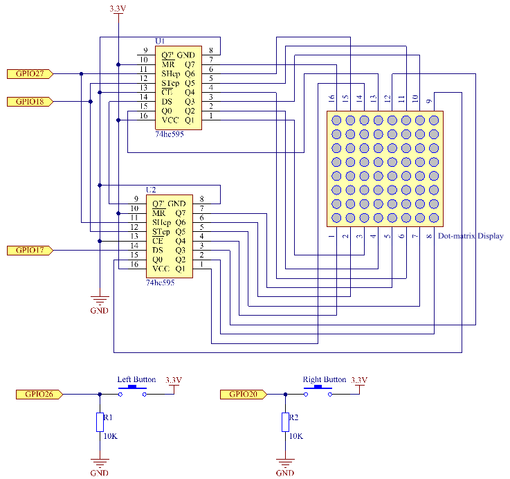

.. _3.1.14_py_pi5:

3.1.2 GAME– Not Not
~~~~~~~~~~~~~~~~~~~~

Introduction
--------------------

In this lesson, we will make an interesting game device, and we call it \"Not Not\".

During the game, the dot matrix will refresh an arrow randomly. What you need to do is to press the button in the opposite direction of the arrow within a limited time. If the time is up, or if the button in the same direction as the arrow is pressed, you are out.

This game can really practice your reverse thinking, and now shall we have a try?

Required Components
------------------------------

In this project, we need the following components. 

.. image:: ../python_pi5/img/3.1.14_game_not_not_list.png
    :width: 800
    :align: center

Schematic Diagram
-----------------------

============ ======== ======== ===
T-Board Name physical wiringPi BCM
GPIO17       Pin 11   0        17
GPIO18       Pin 12   1        18
GPIO27       Pin 13   2        27
GPIO20       Pin 38   28       20
GPIO26       Pin 37   25       26
============ ======== ======== ===

Experimental Procedures
-----------------------

**Step 1:** Build the circuit.

.. image:: ../python_pi5/img/3.1.14_game_not_not_circuit.png

**Step 2:** Open the code file.

.. raw:: html

   <run></run>

.. code-block::

    cd ~/davinci-kit-for-raspberry-pi/python-pi5

**Step 3:** Run.

.. raw:: html

   <run></run>

.. code-block::

    sudo python3 3.1.14_MotionControl_zero.py

After starting the program, on the dot matrix appears an arrow pointing
to the right or the left. What you need to do is to press the button in
the opposite direction of the arrow within a limited time. Then
\"**√**\" appears on the dot matrix. If the time is up, or if the
button in the same direction as the arrow is pressed, you are out and
the dot matrix displays \"x\". You can also add 2 new buttons or replace
them with Joystick keys for up, down, left and right— 4 directions to
increase the difficulty of the game.

**Code**

.. note::

    You can **Modify/Reset/Copy/Run/Stop** the code below. But before that, you need to go to  source code path like ``davinci-kit-for-raspberry-pi/python-pi5``. After modifying the code, you can run it directly to see the effect.

.. raw:: html

    <run></run>

.. code-block:: python

   #!/usr/bin/env python3
   from gpiozero import OutputDevice, Button
   import time
   import threading
   import random

   # GPIO pins for the 74HC595 shift register
   SDI = OutputDevice(17)   # Serial Data Input
   RCLK = OutputDevice(18)  # Register Clock
   SRCLK = OutputDevice(27) # Shift Register Clock

   # GPIO pins for buttons
   AButtonPin = Button(20)  # Button A
   BButtonPin = Button(26)  # Button B

   # Game variables initialization
   timerPlay = 0
   timerCheck = 0
   waypoint = "NULL"
   stage = "NULL"

   # Arrow glyphs for LED matrix display
   arrow = {
       "right": [0xFF, 0xEF, 0xDF, 0x81, 0xDF, 0xEF, 0xFF, 0xFF],
       "left": [0xFF, 0xF7, 0xFB, 0x81, 0xFB, 0xF7, 0xFF, 0xFF]
   }

   # Feedback glyphs for correct/wrong answers
   check = {
       "wrong": [0xFF, 0xBB, 0xD7, 0xEF, 0xD7, 0xBB, 0xFF, 0xFF],
       "right": [0xFF, 0xFF, 0xF7, 0xEB, 0xDF, 0xBF, 0xFF, 0xFF]
   }

   def hc595_shift(dat):
       """ Shift data to the 74HC595 shift register. """
       for i in range(8):
           SDI.value = 0x80 & (dat << i)
           SRCLK.on()
           SRCLK.off()

   def display(glyphCode):
       """ Display a glyph on the LED matrix. """
       for i in range(0, 8):
           hc595_shift(glyphCode[i])
           hc595_shift(0x80 >> i)
           RCLK.on()
           RCLK.off()

   def creatGlyph():
       """ Create a new glyph for the game and start the play timer. """
       global waypoint, stage, timerPlay
       waypoint = random.choice(list(arrow.keys()))
       stage = "PLAY"
       timerPlay = threading.Timer(2.0, timeOut)
       timerPlay.start()

   def checkPoint(inputKey):
       """ Check player's input and update game state. """
       global waypoint, stage, timerCheck
       if inputKey == "empty" or inputKey == waypoint:
           waypoint = "wrong"
       else:
           waypoint = "right"
       timerPlay.cancel()
       stage = "CHECK"
       timerCheck = threading.Timer(1.0, creatGlyph)
       timerCheck.start()

   def timeOut():
       """ Handle game timeout scenario. """
       checkPoint("empty")

   def getKey():
       """ Detect button press and trigger checkpoint. """
       if AButtonPin.is_pressed and not BButtonPin.is_pressed:
           checkPoint("right")
       elif not AButtonPin.is_pressed and BButtonPin.is_pressed:
           checkPoint("left")

   def main():
       """ Main game loop. """
       creatGlyph()
       while True:
           if stage == "PLAY":
               display(arrow[waypoint])
               getKey()
           elif stage == "CHECK":
               display(check[waypoint])

   def destroy():
       """ Clean up resources on program exit. """
       global timerPlay, timerCheck
       timerPlay.cancel()  # Cancel the play timer
       timerCheck.cancel()  # Cancel the checkpoint timer

   # Run the game, handle KeyboardInterrupt for clean exit
   try:
       main()
   except KeyboardInterrupt:
       destroy()

**Code Explanation**

Based on **1.1.6 LED Dot Matrix**, this lesson adds **2** buttons to make an amusing game device. So, if you are not very familiar with the dot matrix, please refer to :ref:`1.1.6_py_pi5`.

#. The code begins by importing necessary libraries. ``gpiozero`` is used for interacting with GPIO pins like buttons and output devices. ``time`` allows for adding delays, ``threading`` enables running multiple tasks concurrently, and ``random`` is useful for introducing randomness in the project.

   .. code-block:: python

       #!/usr/bin/env python3
       from gpiozero import OutputDevice, Button
       import time
       import threading
       import random

#. Initializes GPIO pins for the shift register (``SDI``, ``RCLK``, ``SRCLK``) and buttons (``AButtonPin``, ``BButtonPin``). The shift register is used to control multiple LEDs with fewer GPIO pins, which is crucial for the LED matrix display.

   .. code-block:: python

       # GPIO pins for the 74HC595 shift register
       SDI = OutputDevice(17)   # Serial Data Input
       RCLK = OutputDevice(18)  # Register Clock
       SRCLK = OutputDevice(27) # Shift Register Clock

       # GPIO pins for buttons
       AButtonPin = Button(20)  # Button A
       BButtonPin = Button(26)  # Button B

#. Initializes variables used in the game logic, such as timers and game state indicators.

   .. code-block:: python

       # Game variables initialization
       timerPlay = 0
       timerCheck = 0
       waypoint = "NULL"
       stage = "NULL"

#. Defines binary patterns for displaying arrows and feedback (right/wrong) on the LED matrix. Each array element represents a row of the LED matrix, where ``1`` and ``0`` correspond to an LED being on or off, respectively.

   .. code-block:: python

       # Arrow glyphs for LED matrix display
       arrow = {
           "right": [0xFF, 0xEF, 0xDF, 0x81, 0xDF, 0xEF, 0xFF, 0xFF],
           "left": [0xFF, 0xF7, 0xFB, 0x81, 0xFB, 0xF7, 0xFF, 0xFF]
       }

       # Feedback glyphs for correct/wrong answers
       check = {
           "wrong": [0xFF, 0xBB, 0xD7, 0xEF, 0xD7, 0xBB, 0xFF, 0xFF],
           "right": [0xFF, 0xFF, 0xF7, 0xEB, 0xDF, 0xBF, 0xFF, 0xFF]
       }

#. This function shifts a byte of data to the 74HC595 shift register. It iterates over each bit of the ``dat`` byte, setting the ``SDI`` pin high or low accordingly, and toggles the ``SRCLK`` pin to shift the bit into the register.

   .. code-block:: python

       def hc595_shift(dat):
           """ Shift data to the 74HC595 shift register. """
           for i in range(8):
               SDI.value = 0x80 & (dat << i)
               SRCLK.on()
               SRCLK.off()

#. This function displays a glyph on the LED matrix. It sends each row of the glyph (represented by ``glyphCode``) and the row's address to the shift register using ``hc595_shift``, then toggles the ``RCLK`` pin to update the display.

   .. code-block:: python

       def display(glyphCode):
           """ Display a glyph on the LED matrix. """
           for i in range(0, 8):
               hc595_shift(glyphCode[i])
               hc595_shift(0x80 >> i)
               RCLK.on()
               RCLK.off()

#. This function randomly selects a glyph from the ``arrow`` dictionary, starts the play timer, and sets the game stage to "PLAY". The ``threading.Timer`` is used for timing control in the game.

   .. code-block:: python

       def creatGlyph():
           """ Create a new glyph for the game and start the play timer. """
           global waypoint, stage, timerPlay
           waypoint = random.choice(list(arrow.keys()))
           stage = "PLAY"
           timerPlay = threading.Timer(2.0, timeOut)
           timerPlay.start()

#. This function checks the player's input against the current glyph. If the input is correct, it sets the waypoint to "right", otherwise to "wrong". It then cancels the current play timer and starts a new timer for the next glyph.

   .. code-block:: python

       def checkPoint(inputKey):
           """ Check player's input and update game state. """
           global waypoint, stage, timerCheck
           if inputKey == "empty" or inputKey == waypoint:
               waypoint = "wrong"
           else:
               waypoint = "right"
           timerPlay.cancel()
           stage = "CHECK"
           timerCheck = threading.Timer(1.0, creatGlyph)
           timerCheck.start()

#. This function is called when the game times out. It invokes ``checkPoint`` with "empty" to indicate no button was pressed in time.

   .. code-block:: python

       def timeOut():
           """ Handle game timeout scenario. """
           checkPoint("empty")

#. This function checks the state of the buttons. If ``AButtonPin`` is pressed (and ``BButtonPin`` is not), it calls ``checkPoint`` with "right". If ``BButtonPin`` is pressed (and ``AButtonPin`` is not), it calls ``checkPoint`` with "left".

   .. code-block:: python

       def getKey():
           """ Detect button press and trigger checkpoint. """
           if AButtonPin.is_pressed and not BButtonPin.is_pressed:
               checkPoint("right")
           elif not AButtonPin.is_pressed and BButtonPin.is_pressed:
               checkPoint("left")

#. The ``main`` function controls the game flow. It starts by creating a glyph, then continuously checks the game stage. If in "PLAY" stage, it displays the current glyph and checks for button presses. In "CHECK" stage, it displays the feedback based on the player's action.

   .. code-block:: python

       def main():
           """ Main game loop. """
           creatGlyph()
           while True:
               if stage == "PLAY":
                   display(arrow[waypoint])
                   getKey()
               elif stage == "CHECK":
                   display(check[waypoint])

#. This function cancels any running timers when the program exits, ensuring a clean shutdown.

   .. code-block:: python

       def destroy():
           """ Clean up resources on program exit. """
           global timerPlay, timerCheck
           timerPlay.cancel()  # Cancel the play timer
           timerCheck.cancel()  # Cancel the checkpoint timer

#. The game is run in a ``try`` block. If a ``KeyboardInterrupt`` (like pressing Ctrl+C) occurs, it catches the exception and calls ``destroy`` to clean up before exiting.

   .. code-block:: python

       # Run the game, handle KeyboardInterrupt for clean exit
       try:
           main()
       except KeyboardInterrupt:
           destroy()

