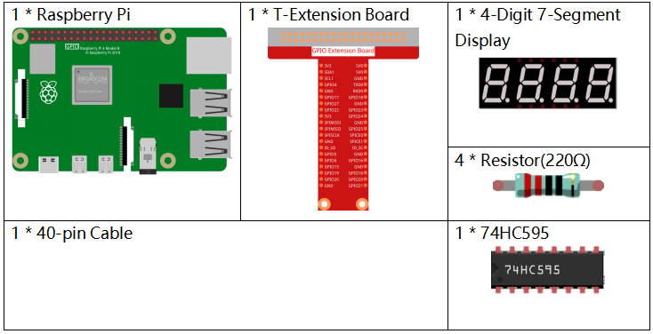
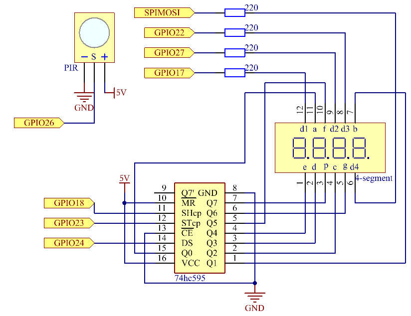
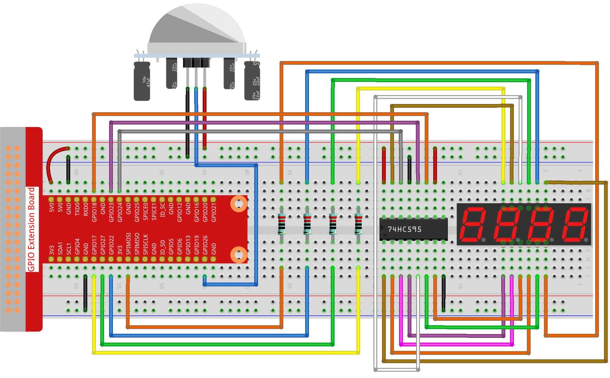

.. note::

    こんにちは、SunFounderのRaspberry Pi & Arduino & ESP32愛好家コミュニティへようこそ！Facebook上でRaspberry Pi、Arduino、ESP32についてもっと深く掘り下げ、他の愛好家と交流しましょう。

    **参加する理由は？**

    - **エキスパートサポート**：コミュニティやチームの助けを借りて、販売後の問題や技術的な課題を解決します。
    - **学び＆共有**：ヒントやチュートリアルを交換してスキルを向上させましょう。
    - **独占的なプレビュー**：新製品の発表や先行プレビューに早期アクセスしましょう。
    - **特別割引**：最新製品の独占割引をお楽しみください。
    - **祭りのプロモーションとギフト**：ギフトや祝日のプロモーションに参加しましょう。

    👉 私たちと一緒に探索し、創造する準備はできていますか？[|link_sf_facebook|]をクリックして今すぐ参加しましょう！

.. _py_pi5_counting_device:

3.1.1 カウンティングデバイス
=========================================

はじめに
-----------------

ここでは、PIRセンサーと4桁のセグメントディスプレイからなる、数値表示カウンターシステムを作成します。PIRが通行人を検出すると、4桁のセグメントディスプレイに表示される数値が1つ増えます。このカウンターを使用して、通路を通過する人数をカウントできます。

必要なコンポーネント
------------------------------

このプロジェクトでは、以下のコンポーネントが必要です。

.. image:: ../python_pi5/img/4.1.7_counting_device_list_2.png
    :align: center

回路図
----------------------

実験手順
-----------------------------

**ステップ 1**: 回路を組み立てます。

**ステップ 2**: コードのフォルダに移動します。

.. raw:: html

   <run></run>

.. code-block::

    cd ~/raphael-kit/python-pi5

**ステップ 3**: 実行可能ファイルを実行します。

.. raw:: html

   <run></run>

.. code-block::

    sudo python3 3.1.1_CountingDevice_zero.py

コードを実行すると、PIRが通行人を検出すると、4桁のセグメントディスプレイに表示される数値が1つ増えます。

PIRモジュールには2つのポテンショメータがあります。1つは感度を調整するためのもので、もう1つは検出距離を調整するためのものです。PIRモジュールをより良く動作させるには、これらのポテンショメータを両方とも反時計回りにまわす必要があります。

.. image:: ../python_pi5/img/4.1.7_PIR_TTE.png
    :width: 400
    :align: center

**コード**

.. note::
    以下のコードを **変更/リセット/コピー/実行/停止** することができます。ただし、その前に ``raphael-kit/python-pi5`` のソースコードパスに移動する必要があります。コードを変更した後、効果を確認するために直接実行できます。

.. raw:: html

    <run></run>

.. code-block:: python

   #!/usr/bin/env python3
   from gpiozero import OutputDevice, MotionSensor

   # GPIO 26に接続されたPIRモーションセンサーを初期化
   pir = MotionSensor(26)

   # シフトレジスタのピンを初期化
   SDI = OutputDevice(24)    # シリアルデータ入力
   RCLK = OutputDevice(23)   # レジスタクロック入力
   SRCLK = OutputDevice(18)  # シフトレジスタクロック入力

   # 7セグメントディスプレイのピンを初期化
   placePin = [OutputDevice(pin) for pin in (10, 22, 27, 17)]

   # 7セグメントディスプレイに表示する数字のコードを定義
   number = (0xc0, 0xf9, 0xa4, 0xb0, 0x99, 0x92, 0x82, 0xf8, 0x80, 0x90)

   # 表示される数値のカウンター
   counter = 0

   def clearDisplay():
       # すべてのセグメントをオフにしてディスプレイをクリア
       for _ in range(8):
           SDI.on()
           SRCLK.on()
           SRCLK.off()
       RCLK.on()
       RCLK.off()

   def hc595_shift(data):
       # データを74HC595シフトレジスタにシフト
       for i in range(8):
           SDI.value = 0x80 & (data << i)
           SRCLK.on()
           SRCLK.off()
       RCLK.on()
       RCLK.off()

   def pickDigit(digit):
       # 7セグメントディスプレイの特定の桁をアクティブ化
       for pin in placePin:
           pin.off()
       placePin[digit].on()

   def display():
       # 現在のカウンター値でディスプレイを更新
       global counter
       clearDisplay()
       pickDigit(0)
       hc595_shift(number[counter % 10])

       clearDisplay()
       pickDigit(1)
       hc595_shift(number[counter % 100//10])

       clearDisplay()
       pickDigit(2)
       hc595_shift(number[counter % 1000//100])

       clearDisplay()
       pickDigit(3)
       hc595_shift(number[counter % 10000//1000])

   def loop():
       # ディスプレイを連続的に更新し、モーションを確認するメインループ
       global counter
       currentState = 0
       lastState = 0
       while True:
           display()
           currentState = 1 if pir.motion_detected else 0
           if currentState == 1 and lastState == 0:
               counter += 1
           lastState = currentState

   try:
       loop()
   except KeyboardInterrupt:
       # スクリプトが中断されたときにすべてのピンをオフにする
       SDI.off()
       SRCLK.off()
       RCLK.off()
       pass

**コードの説明**

#. この行では、 ``gpiozero`` ライブラリから ``OutputDevice`` と ``MotionSensor`` クラスをインポートします。 ``OutputDevice`` はLED、モーター、または出力として制御したい任意のデバイスを指します。 ``MotionSensor`` は通常、動きを検出するために使用されるPIR（受動赤外線）センサーです。

   .. code-block:: python

       #!/usr/bin/env python3
       from gpiozero import OutputDevice, MotionSensor

#. GPIOピン26に接続されたPIRモーションセンサーを初期化します。

   .. code-block:: python

       # GPIO 26にPIRモーションセンサーを初期化
       pir = MotionSensor(26)

#. シフトレジスタのシリアルデータ入力（SDI）、レジスタクロック入力（RCLK）、シフトレジスタクロック入力（SRCLK）に接続されたGPIOピンを初期化します。

   .. code-block:: python

       # シフトレジスタピンを初期化
       SDI = OutputDevice(24)    # シリアルデータ入力
       RCLK = OutputDevice(23)   # レジスタクロック入力
       SRCLK = OutputDevice(18)  # シフトレジスタクロック入力

#. 7セグメント表示の各桁用のピンを初期化し、0-9の数字を表示するためのバイナリコードを定義します。

   .. code-block:: python

       # 7セグメント表示用ピンを初期化
       placePin = [OutputDevice(pin) for pin in (10, 22, 27, 17)]

       # 7セグメント表示の数字コードを定義
       number = (0xc0, 0xf9, 0xa4, 0xb0, 0x99, 0x92, 0x82, 0xf8, 0x80, 0x90)

#. 次の数字を表示する前にすべてのセグメントをオフに設定して、7セグメント表示をクリアします。

   .. code-block:: python

       def clearDisplay():
           # すべてのセグメントをオフに設定して表示をクリアする
           for _ in range(8):
               SDI.on()
               SRCLK.on()
               SRCLK.off()
           RCLK.on()
           RCLK.off()

#. 74HC595シフトレジスタに1バイトのデータをシフトし、表示セグメントを制御します。

   .. code-block:: python

       def hc595_shift(data):
           # 74HC595シフトレジスタにデータをシフトする
           for i in range(8):
               SDI.value = 0x80 & (data << i)
               SRCLK.on()
               SRCLK.off()
           RCLK.on()
           RCLK.off()

#. 7セグメント表示のどの桁をアクティブにするかを選択します。各桁は別々のGPIOピンによって制御されます。

   .. code-block:: python

       def pickDigit(digit):
           # 7セグメント表示の特定の桁をアクティブにする
           for pin in placePin:
               pin.off()
           placePin[digit].on()

#. 最初に単位の桁の表示を開始し、次に十の桁の表示をアクティブにします。その後、百と千の桁の表示を順に行います。この高速なアクティベーションの連続は、連続した4桁の表示の錯覚を作り出します。

   .. code-block:: python

       def display():
           # 現在のカウンター値で表示を更新する
           global counter
           clearDisplay()
           pickDigit(0)
           hc595_shift(number[counter % 10])

           clearDisplay()
           pickDigit(1)
           hc595_shift(number[counter % 100//10])

           clearDisplay()
           pickDigit(2)
           hc595_shift(number[counter % 1000//100])

           clearDisplay()
           pickDigit(3)
           hc595_shift(number[counter % 10000//1000])

#. メインループを定義し、表示を継続的に更新し、PIRセンサーの状態をチェックします。動きが検出されると、カウンターが増加します。

   .. code-block:: python

       def loop():
           # 表示を更新し、動きをチェックするメインループ
           global counter
           currentState = 0
           lastState = 0
           while True:
               display()
               currentState = 1 if pir.motion_detected else 0
               if currentState == 1 and lastState == 0:
                   counter += 1
               lastState = currentState

#. メインループを実行し、キーボードコマンド（Ctrl+C）で中断できるようにします。クリーンな終了のためにすべてのピンをオフにします。

   .. code-block:: python

       try:
           loop()
       except KeyboardInterrupt:
           # スクリプトが中断されたときにすべてのピンをオフにする
           SDI.off()
           SRCLK.off()
           RCLK.off()
           pass
