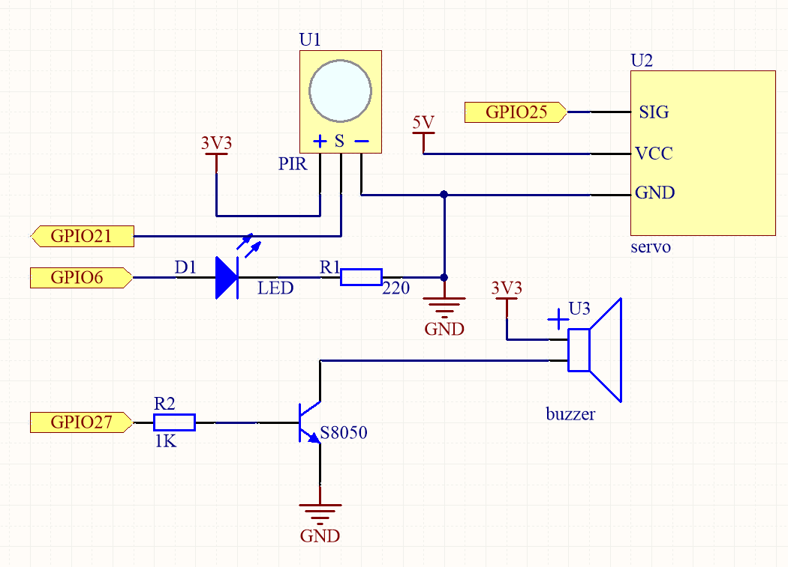
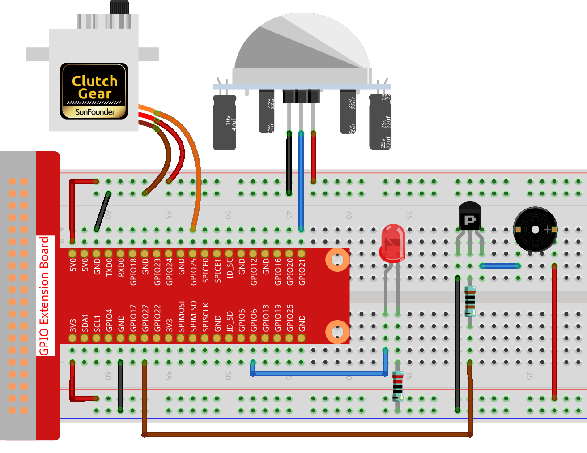
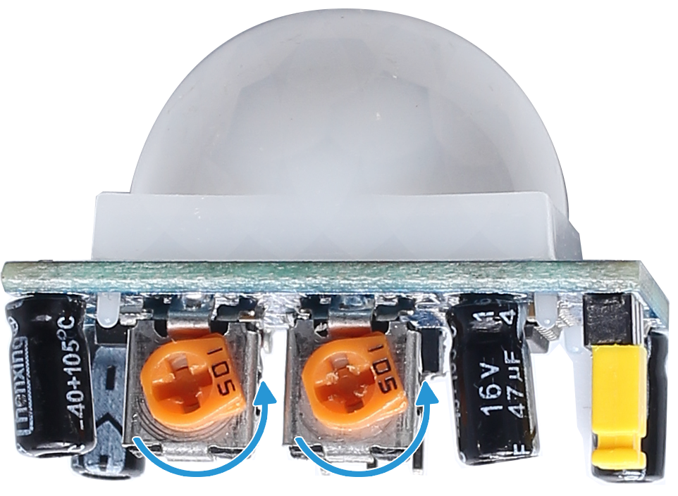

.. note::

    Hallo und willkommen in der SunFounder Raspberry Pi & Arduino & ESP32 Enthusiasten-Gemeinschaft auf Facebook! Tauchen Sie tiefer ein in die Welt von Raspberry Pi, Arduino und ESP32 mit anderen Enthusiasten.

    **Warum beitreten?**

    - **Expertenunterstützung**: Lösen Sie Nachverkaufsprobleme und technische Herausforderungen mit Hilfe unserer Gemeinschaft und unseres Teams.
    - **Lernen & Teilen**: Tauschen Sie Tipps und Anleitungen aus, um Ihre Fähigkeiten zu verbessern.
    - **Exklusive Vorschauen**: Erhalten Sie frühzeitigen Zugang zu neuen Produktankündigungen und exklusiven Einblicken.
    - **Spezialrabatte**: Genießen Sie exklusive Rabatte auf unsere neuesten Produkte.
    - **Festliche Aktionen und Gewinnspiele**: Nehmen Sie an Gewinnspielen und Feiertagsaktionen teil.

    👉 Sind Sie bereit, mit uns zu erkunden und zu erschaffen? Klicken Sie auf [|link_sf_facebook|] und treten Sie heute bei!

.. _py_pi5_welcome:

3.1.2 Willkommen
=====================================

Einführung
-------------

In diesem Projekt werden wir PIR-Sensoren verwenden, um die Bewegung von Fußgängern zu erfassen. Dabei setzen wir Servomotoren, LEDs und einen Summer ein, um die Funktion der Sensortür eines Convenience-Stores zu simulieren. Erscheint ein Fußgänger im Erfassungsbereich des PIR-Sensors, wird das Anzeigelicht aktiviert, die Tür öffnet sich und der Summer spielt die Eingangsglocke.

Benötigte Komponenten
------------------------------

Für dieses Projekt benötigen wir folgende Komponenten.

.. image:: ../python_pi5/img/4.1.8_welcome_list.png
    :width: 800
    :align: center

Schaltplan
-------------------

============ ======== ======== ===
T-Board Name physisch wiringPi BCM
GPIO18       Pin 12   1        18
GPIO17       Pin 11   0        17
GPIO27       Pin 13   2        27
GPIO22       Pin 15   3        22
============ ======== ======== ===

Experimentelle Verfahren
-------------------------

**Schritt 1:** Bauen Sie den Schaltkreis.

**Schritt 2:** Wechseln Sie das Verzeichnis.

.. raw:: html

   <run></run>

.. code-block::

    cd ~/davinci-kit-for-raspberry-pi/python-pi5

**Schritt 3:** Ausführen.

.. raw:: html

   <run></run>

.. code-block::

    sudo python3 3.1.2_Welcome_zero.py

Nachdem der Code ausgeführt wurde, öffnet sich automatisch die Tür (simuliert durch den Servo), das Anzeigelicht schaltet sich ein und die Türklingelmusik wird abgespielt, wenn der PIR-Sensor jemanden erfasst. Nachdem die Türklingelmusik abgespielt wurde, schließt das System automatisch die Tür und schaltet das Anzeigelicht aus, um auf das nächste Vorbeigehen zu warten.

Am PIR-Modul befinden sich zwei Potentiometer: eines zur Einstellung der Empfindlichkeit und das andere zur Einstellung der Erfassungsentfernung. Um das PIR-Modul optimal zu nutzen, sollten Sie beide gegen den Uhrzeigersinn bis zum Anschlag drehen.

.. warning::

    Wenn die Fehlermeldung ``RuntimeError: Cannot determine SOC peripheral base address`` angezeigt wird, lesen Sie bitte :ref:`faq_soc`

**Code**

.. note::
    Sie können den untenstehenden Code **modifizieren/zurücksetzen/kopieren/ausführen/stoppen**. Bevor Sie dies tun, sollten Sie jedoch zum Quellcodepfad wie ``raphael-kit/python-pi5`` wechseln. Nachdem Sie den Code geändert haben, können Sie ihn direkt ausführen, um das Ergebnis zu sehen.

.. raw:: html

    <run></run>

.. code-block:: python

   #!/usr/bin/env python3

   from gpiozero import LED, MotionSensor, Servo, TonalBuzzer
   import time

   # GPIO-Pin-Setup für LED, Bewegungssensor (PIR) und Summer
   ledPin = LED(6)
   pirPin = MotionSensor(21)
   buzPin = TonalBuzzer(27)

   # Servomotor-Pulsbreitenkorrekturfaktor und -berechnung
   myCorrection = 0.45
   maxPW = (2.0 + myCorrection) / 1000  # Maximale Pulsbreite
   minPW = (1.0 - myCorrection) / 1000  # Minimale Pulsbreite

   # Initialisierung des Servos mit angepassten Pulsbreiten
   servoPin = Servo(25, min_pulse_width=minPW, max_pulse_width=maxPW)

   # Musikalische Melodie für den Summer, mit Noten und Dauern
   tune = [('C#4', 0.2), ('D4', 0.2), (None, 0.2),
           ('Eb4', 0.2), ('E4', 0.2), (None, 0.6),
           ('F#4', 0.2), ('G4', 0.2), (None, 0.6),
           ('Eb4', 0.2), ('E4', 0.2), (None, 0.2),
           ('F#4', 0.2), ('G4', 0.2), (None, 0.2),
           ('C4', 0.2), ('B4', 0.2), (None, 0.2),
           ('F#4', 0.2), ('G4', 0.2), (None, 0.2),
           ('B4', 0.2), ('Bb4', 0.5), (None, 0.6),
           ('A4', 0.2), ('G4', 0.2), ('E4', 0.2), 
           ('D4', 0.2), ('E4', 0.2)]

   def setAngle(angle):
       """
       Bewegt den Servo auf einen bestimmten Winkel.
       :param angle: Winkel in Grad (0-180).
       """
       value = float(angle / 180)  # Winkel in Servo-Wert umrechnen
       servoPin.value = value      # Servoposition setzen
       time.sleep(0.001)           # Kurze Verzögerung für Servobewegung

   def doorbell():
       """
       Spielt eine musikalische Melodie mit dem Summer.
       """
       for note, duration in tune:
           buzPin.play(note)       # Note abspielen
           time.sleep(float(duration))  # Dauer der Note
       buzPin.stop()               # Summer nach dem Spielen der Melodie anhalten

   def closedoor():
       # LED ausschalten und Servo bewegen, um Tür zu schließen
       ledPin.off()
       for i in range(180, -1, -1):
           setAngle(i)             # Servo von 180 auf 0 Grad bewegen
           time.sleep(0.001)       # Kurze Verzögerung für gleichmäßige Bewegung
       time.sleep(1)               # Warten nach dem Schließen der Tür

   def opendoor():
       # LED einschalten, Tür öffnen (Servo bewegen), Melodie abspielen, Tür schließen
       ledPin.on()
       for i in range(0, 181):
           setAngle(i)             # Servo von 0 auf 180 Grad bewegen
           time.sleep(0.001)       # Kurze Verzögerung für gleichmäßige Bewegung
       time.sleep(1)               # Warten vor dem Spielen der Melodie
       doorbell()                  # Türklingelmelodie abspielen
       closedoor()                 # Tür nach der Melodie schließen

   def loop():
       # Hauptschleife zur Bewegungserkennung und Türbedienung
       while True:
           if pirPin.motion_detected:
               opendoor()               # Tür öffnen, wenn Bewegung erkannt wird
           time.sleep(0.1)              # Kurze Verzögerung in der Schleife

   try:
       loop()
   except KeyboardInterrupt:
       # GPIO bei Benutzerunterbrechung aufräumen (z. B. Strg+C)
       buzPin.stop()
       ledPin.off()

**Code-Erklärung**

#. Das Skript beginnt mit dem Import der notwendigen Module. Die Bibliothek ``gpiozero`` wird verwendet, um mit der LED, dem Bewegungssensor, dem Servomotor und dem tonalen Summer zu interagieren. Das Modul ``time`` wird für zeitbezogene Funktionen eingesetzt.

   .. code-block:: python

       #!/usr/bin/env python3
       from gpiozero import LED, MotionSensor, Servo, TonalBuzzer
       import time

#. Initialisiert die LED, den PIR-Bewegungssensor und den tonalen Summer an ihren jeweiligen GPIO-Pins.

   .. code-block:: python

       # GPIO-Pin-Setup für LED, Bewegungssensor (PIR) und Summer
       ledPin = LED(6)
       pirPin = MotionSensor(21)
       buzPin = TonalBuzzer(27)

#. Berechnet die maximalen und minimalen Pulsbreiten für den Servomotor unter Berücksichtigung eines Korrekturfaktors zur Feinabstimmung.

   .. code-block:: python

       # Servomotor-Pulsbreitenkorrekturfaktor und -berechnung
       myCorrection = 0.45
       maxPW = (2.0 + myCorrection) / 1000  # Maximale Pulsbreite
       minPW = (1.0 - myCorrection) / 1000  # Minimale Pulsbreite

#. Initialisiert den Servomotor am GPIO-Pin 25 mit den angepassten Pulsbreiten für eine genaue Positionierung.

   .. code-block:: python

       # Initialisierung des Servos mit angepassten Pulsbreiten
       servoPin = Servo(25, min_pulse_width=minPW, max_pulse_width=maxPW)

#. Die Melodie wird als Abfolge von Noten (Frequenz) und Dauern (Sekunden) definiert. 

   .. code-block:: python

       # Musikalische Melodie für den Summer, mit Noten und Dauern
       tune = [('C#4', 0.2), ('D4', 0.2), (None, 0.2),
               ('Eb4', 0.2), ('E4', 0.2), (None, 0.6),
               ('F#4', 0.2), ('G4', 0.2), (None, 0.6),
               ('Eb4', 0.2), ('E4', 0.2), (None, 0.2),
               ('F#4', 0.2), ('G4', 0.2), (None, 0.2),
               ('C4', 0.2), ('B4', 0.2), (None, 0.2),
               ('F#4', 0.2), ('G4', 0.2), (None, 0.2),
               ('B4', 0.2), ('Bb4', 0.5), (None, 0.6),
               ('A4', 0.2), ('G4', 0.2), ('E4', 0.2), 
               ('D4', 0.2), ('E4', 0.2)]

#. Funktion zum Bewegen des Servos auf einen bestimmten Winkel. Wandelt den Winkel in einen Wert zwischen 0 und 1 für den Servo um.

   .. code-block:: python

       def setAngle(angle):
           """
           Bewegt den Servo auf einen bestimmten Winkel.
           :param angle: Winkel in Grad (0-180).
           """
           value = float(angle / 180)  # Winkel in Servo-Wert umrechnen
           servoPin.value = value      # Servoposition setzen
           time.sleep(0.001)           # Kurze Verzögerung für Servobewegung

#. Funktion zum Abspielen einer musikalischen Melodie mit dem Summer. Durchläuft die Liste ``tune`` und spielt jede Note für ihre angegebene Dauer ab.

   .. code-block:: python

       def doorbell():
           """
           Spielt eine musikalische Melodie mit dem Summer.
           """
           for note, duration in tune:
               buzPin.play(note)       # Note abspielen
               time.sleep(float(duration))  # Dauer der Note
           buzPin.stop()               # Summer nach dem Spielen der Melodie anhalten

#. Funktionen zum Öffnen und Schließen der Tür mit dem Servomotor. Die Funktion ``opendoor`` schaltet die LED ein, öffnet die Tür, spielt die Melodie und schließt dann die Tür.

   .. code-block:: python

       def closedoor():
           # LED ausschalten und Servo bewegen, um Tür zu schließen
           ledPin.off()
           for i in range(180, -1, -1):
               setAngle(i)             # Servo von 180 auf 0 Grad bewegen
               time.sleep(0.001)       # Kurze Verzögerung für gleichmäßige Bewegung
           time.sleep(1)               # Warten nach dem Schließen der Tür

       def opendoor():
           # LED einschalten, Tür öffnen (Servo bewegen), Melodie abspielen, Tür schließen
           ledPin.on()
           for i in range(0, 181):
               setAngle(i)             # Servo von 0 auf 180 Grad bewegen
               time.sleep(0.001)       # Kurze Verzögerung für gleichmäßige Bewegung
           time.sleep(1)               # Warten vor dem Spielen der Melodie
           doorbell()                  # Türklingelmelodie abspielen
           closedoor()                 # Tür nach der Melodie schließen

#. Hauptschleife, die ständig auf Bewegungserkennung prüft. Bei erkannter Bewegung wird die Funktion ``opendoor`` ausgelöst.

   .. code-block:: python

       def loop():
           # Hauptschleife zur Bewegungserkennung und Türbedienung
           while True:
               if pirPin.motion_detected:
                   opendoor()               # Tür öffnen, wenn Bewegung erkannt wird
               time.sleep(0.1)              # Kurze Verzögerung in der Schleife

#. Führt die Hauptschleife aus und stellt sicher, dass das Skript mit einem Tastaturbefehl (Strg+C) gestoppt werden kann, wobei der Summer und die LED für einen sauberen Ausstieg ausgeschaltet werden.

   .. code-block:: python

       try:
           loop()
       except KeyboardInterrupt:
           # GPIO bei Benutzerunterbrechung aufräumen (z. B. Strg+C)
           buzPin.stop()
           ledPin.off()
