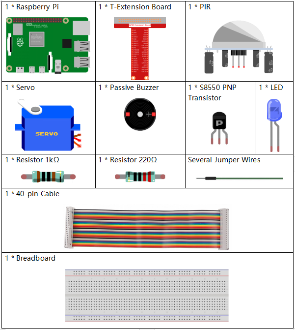

.. note::

    こんにちは、SunFounderのRaspberry Pi & Arduino & ESP32愛好家コミュニティへようこそ！Facebook上でRaspberry Pi、Arduino、ESP32についてもっと深く掘り下げ、他の愛好家と交流しましょう。

    **参加する理由は？**

    - **エキスパートサポート**：コミュニティやチームの助けを借りて、販売後の問題や技術的な課題を解決します。
    - **学び＆共有**：ヒントやチュートリアルを交換してスキルを向上させましょう。
    - **独占的なプレビュー**：新製品の発表や先行プレビューに早期アクセスしましょう。
    - **特別割引**：最新製品の独占割引をお楽しみください。
    - **祭りのプロモーションとギフト**：ギフトや祝日のプロモーションに参加しましょう。

    👉 私たちと一緒に探索し、創造する準備はできていますか？[|link_sf_facebook|]をクリックして今すぐ参加しましょう！

.. _py_pi5_welcome:

3.1.2 ようこそ
=====================================

はじめに
-------------

このプロジェクトでは、歩行者の動きを検出するためにPIRを使用し、
センサー付きコンビニエンスストアの扉の動作を模倣するためにサーボ、LED、ブザーを使用します。歩行者がPIRの感知範囲内に現れると、インジケーターライトが点灯し、扉が開き、ブザーが開店ベルを演奏します。

必要なコンポーネント
------------------------------

このプロジェクトでは、以下のコンポーネントが必要です。

回路図
-------------------

.. image:: ../python_pi5/img/4.1.8_welcome_schematic.png
   :align: center

実験手順
-------------------------

**ステップ 1:** 回路を組み立てます。

.. image:: ../python_pi5/img/4.1.8_welcome_circuit.png
    :align: center

**ステップ 2:** ディレクトリを変更します。

.. raw:: html

   <run></run>

.. code-block::

    cd ~/raphael-kit/python-pi5

**ステップ 3:** 実行します。

.. raw:: html

   <run></run>

.. code-block::

    sudo python3 3.1.2_Welcome_zero.py

コードが実行されると、PIRセンサーが通行人を検出した場合、扉は自動的に開き（サーボで模倣）、インジケーターライトが点灯し、開店ベルの音楽が再生されます。ドアベルの音楽が再生された後、システムは自動的に扉を閉じ、インジケーターライトを消灯し、次回の通行人を待機します。

PIRモジュールには2つのポテンショメータがあります。1つは感度を調整するためのもので、もう1つは検出距離を調整するためのものです。PIRモジュールをより良く動作させるには、これらのポテンショメータを両方とも反時計回りにまわす必要があります。

.. image:: ../python_pi5/img/4.1.8_PIR_TTE.png
    :width: 400
    :align: center

.. warning::

    エラー メッセージ ``RuntimeError: Cannot determine SOC peripheral base address`` が表示された場合は、 :ref:`faq_soc` を参照してください。

**コード**

.. note::
    以下のコードを **変更/リセット/コピー/実行/停止** することができます。ただし、その前に ``raphael-kit/python-pi5`` のソースコードパスに移動する必要があります。コードを変更した後、効果を確認するために直接実行できます。

.. raw:: html

    <run></run>

.. code-block:: python

   #!/usr/bin/env python3

   from gpiozero import LED, MotionSensor, Servo, TonalBuzzer
   import time

   # LED、モーションセンサー（PIR）、ブザーのためのGPIOピン設定
   ledPin = LED(6)
   pirPin = MotionSensor(21)
   buzPin = TonalBuzzer(27)

   # サーボモーターパルス幅補正ファクターと計算
   myCorrection = 0.45
   maxPW = (2.0 + myCorrection) / 1000  # 最大パルス幅
   minPW = (1.0 - myCorrection) / 1000  # 最小パルス幅

   # サーボをカスタムパルス幅で初期化
   servoPin = Servo(25, min_pulse_width=minPW, max_pulse_width=maxPW)

   # ブザーの音楽のチューン、音符と持続時間が含まれています
   tune = [('C#4', 0.2), ('D4', 0.2), (None, 0.2),
           ('Eb4', 0.2), ('E4', 0.2), (None, 0.6),
           ('F#4', 0.2), ('G4', 0.2), (None, 0.6),
           ('Eb4', 0.2), ('E4', 0.2), (None, 0.2),
           ('F#4', 0.2), ('G4', 0.2), (None, 0.2),
           ('C4', 0.2), ('B4', 0.2), (None, 0.2),
           ('F#4', 0.2), ('G4', 0.2), (None, 0.2),
           ('B4', 0.2), ('Bb4', 0.5), (None, 0.6),
           ('A4', 0.2), ('G4', 0.2), ('E4', 0.2), 
           ('D4', 0.2), ('E4', 0.2)]

   def setAngle(angle):
       """
       サーボを指定した角度に移動します。
       :param angle: 角度（0-180）。
       """
       value = float(angle / 180)  # 角度をサーボの値に変換
       servoPin.value = value      # サーボの位置を設定
       time.sleep(0.001)           # サーボの動作のための短い遅延

   def doorbell():
       """
       ブザーを使用して音楽を演奏します。
       """
       for note, duration in tune:
           buzPin.play(note)       # 音符を演奏
           time.sleep(float(duration))  # 音符の持続時間
       buzPin.stop()               # チューン再生後にブザーを停止

   def closedoor():
       # LEDをオフにし、サーボを使ってドアを閉めます
       ledPin.off()
       for i in range(180, -1, -1):
           setAngle(i)             # サーボを180度から0度まで移動
           time.sleep(0.001)       # スムーズな動作のための短い遅延
       time.sleep(1)               # ドアを閉めた後の待機

   def opendoor():
       # LEDをオンにし、ドアを開ける（サーボを移動）、チューンを演奏し、ドアを閉じる
       ledPin.on()
       for i in range(0, 181):
           setAngle(i)             # サーボを0から180度まで移動
           time.sleep(0.001)       # スムーズな動作のための短い遅延
       time.sleep(1)               # チューンを演奏する前の待機
       doorbell()                  # ドアベルのチューンを演奏
       closedoor()                 # チューン演奏後にドアを閉じる

   def loop():
       # モーションを確認し、ドアを操作するためのメインループ
       while True:
           if pirPin.motion_detected:
               opendoor()               # モーションが検出された場合はドアを開く
           time.sleep(0.1)              # ループ内の短い遅延

   try:
       loop()
   except KeyboardInterrupt:
       # ユーザーの割り込み（たとえば、Ctrl+C）でGPIOをクリーンアップ
       buzPin.stop()
       ledPin.off()

**代码解释**

#. 脚本は必要なモジュールをインポートすることから始まります。 ``gpiozero`` ライブラリは、LED、モーションセンサー、サーボモーター、音楽ブザーとのインターフェースを提供するために使用されます。 ``time`` モジュールはタイミング関連の機能を処理するために使用されます。

   .. code-block:: python

       #!/usr/bin/env python3
       from gpiozero import LED, MotionSensor, Servo, TonalBuzzer
       import time

#. LED、PIRモーションセンサー、音楽ブザーをそれぞれのGPIOピンに初期化します。

   .. code-block:: python

       # LED、モーションセンサー（PIR）、ブザーのためのGPIOピン設定
       ledPin = LED(6)
       pirPin = MotionSensor(21)
       buzPin = TonalBuzzer(27)

#. サーボモーターの最大および最小パルス幅を計算し、微調整のための補正ファクターを組み込みます。

   .. code-block:: python

       # サーボモーターパルス幅補正ファクターと計算
       myCorrection = 0.45
       maxPW = (2.0 + myCorrection) / 1000  # 最大パルス幅
       minPW = (1.0 - myCorrection) / 1000  # 最小パルス幅

#. サーボモーターを正確な位置に配置するためにカスタムパルス幅を使用してGPIOピン25上で初期化します。

   .. code-block:: python

       # サーボをカスタムパルス幅で初期化
       servoPin = Servo(25, min_pulse_width=minPW, max_pulse_width=maxPW)

#. ブザーで演奏するための音楽チューンを、音符（周波数）と持続時間（秒）のシーケンスとして定義します。

   .. code-block:: python

       # ブザーの音楽のチューン、音符と持続時間が含まれています
       tune = [('C#4', 0.2), ('D4', 0.2), (None, 0.2),
               ('Eb4', 0.2), ('E4', 0.2), (None, 0.6),
               ('F#4', 0.2), ('G4', 0.2), (None, 0.6),
               ('Eb4', 0.2), ('E4', 0.2), (None, 0.2),
               ('F#4', 0.2), ('G4', 0.2), (None, 0.2),
               ('C4', 0.2), ('B4', 0.2), (None, 0.2),
               ('F#4', 0.2), ('G4', 0.2), (None, 0.2),
               ('B4', 0.2), ('Bb4', 0.5), (None, 0.6),
               ('A4', 0.2), ('G4', 0.2), ('E4', 0.2), 
               ('D4', 0.2), ('E4', 0.2)]

#. 指定された角度にサーボを移動するための関数。角度をサーボの値に変換します。

   .. code-block:: python

       def setAngle(angle):
           """
           サーボを指定した角度に移動します。
           :param angle: 角度（0-180）。
           """
           value = float(angle / 180)  # 角度をサーボの値に変換
           servoPin.value = value      # サーボの位置を設定
           time.sleep(0.001)           # サーボの動作のための短い遅延

#. ブザーを使用して音楽を演奏するための関数。 ``tune`` リスト内を繰り返し、各音符を指定された持続時間で演奏します。

   .. code-block:: python

       def doorbell():
           """
           ブザーを使用して音楽を演奏します。
           """
           for note, duration in tune:
               buzPin.play(note)       # 音符を演奏
               time.sleep(float(duration))  # 音符の持続時間
           buzPin.stop()               # チューン再生後にブザーを停止

#. サーボモーターを使用してドアを開閉するための関数。 ``opendoor`` 関数はLEDを点灯させ、ドアを開け、音楽を演奏し、その後ドアを閉じます。

   .. code-block:: python

       def closedoor():
           # LEDをオフにし、サーボを使ってドアを閉めます
           ledPin.off()
           for i in range(180, -1, -1):
               setAngle(i)             # サーボを180度から0度まで移動
               time.sleep(0.001)       # スムーズな動作のための短い遅延
           time.sleep(1)               # ドアを閉めた後の待機

       def opendoor():
           # LEDをオンにし、ドアを開ける（サーボを移動）、チューンを演奏し、ドアを閉じる
           ledPin.on()
           for i in range(0, 181):
               setAngle(i)             # サーボを0から180度まで移動
               time.sleep(0.001)       # スムーズな動作のための短い遅延
           time.sleep(1)               # チューンを演奏する前の待機
           doorbell()                  # ドアベルのチューンを演奏
           closedoor()                 # チューン演奏後にドアを閉じる

#. モーション検出を常にチェックするメインループ。モーションが検出された場合、 ``opendoor`` 関数がトリガーされます。

   .. code-block:: python

       def loop():
           # モーションを確認し、ドアを操作するためのメインループ
           while True:
               if pirPin.motion_detected:
                   opendoor()               # モーションが検出された場合はドアを開く
               time.sleep(0.1)              # ループ内の短い遅延

#. メインループを実行し、スクリプトをキーボードコマンド（Ctrl+C）で停止できるようにし、クリーンな終了のためにブザーとLEDをオフにします。

   .. code-block:: python

       try:
           loop()
       except KeyboardInterrupt:
           # ユーザーの割り込み（たとえば、Ctrl+C）でGPIOをクリーンアップ
           buzPin.stop()
           ledPin.off()
