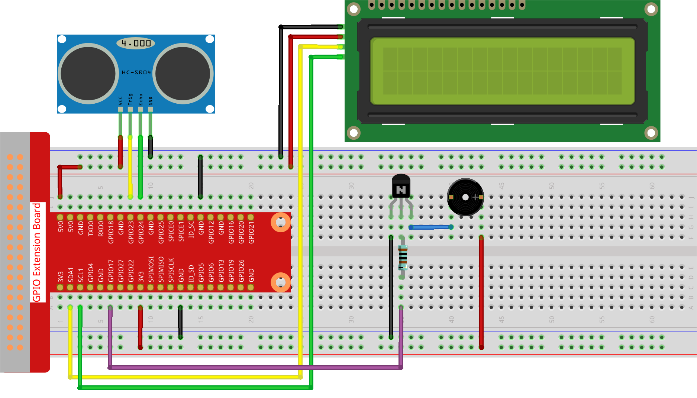

.. note::

    こんにちは、SunFounderのRaspberry Pi & Arduino & ESP32愛好家コミュニティへようこそ！Facebook上でRaspberry Pi、Arduino、ESP32についてもっと深く掘り下げ、他の愛好家と交流しましょう。

    **参加する理由は？**

    - **エキスパートサポート**：コミュニティやチームの助けを借りて、販売後の問題や技術的な課題を解決します。
    - **学び＆共有**：ヒントやチュートリアルを交換してスキルを向上させましょう。
    - **独占的なプレビュー**：新製品の発表や先行プレビューに早期アクセスしましょう。
    - **特別割引**：最新製品の独占割引をお楽しみください。
    - **祭りのプロモーションとギフト**：ギフトや祝日のプロモーションに参加しましょう。

    👉 私たちと一緒に探索し、創造する準備はできていますか？[|link_sf_facebook|]をクリックして今すぐ参加しましょう！

.. _py_pi5_alarm:

3.1.3 リバースアラーム
======================================

はじめに
-------------

このプロジェクトでは、LCD、ブザー、超音波センサーを使用して、リバースアシストシステムを作成します。これをリモートコントロール車に取り付けて、車をガレージにバックさせる実際のプロセスをシミュレートできます。

必要な部品
------------------------------

このプロジェクトには、以下の部品が必要です。

.. image:: ../python_pi5/img/4.1.9_reversing_alarm_list.png
    :width: 800
    :align: center

回路図
--------------------

超音波センサーは、障害物との距離をコードの形でLCDに表示します。同時に、超音波センサーは異なる距離値に応じてブザーから警告音を出力します。

.. image:: ../python_pi5/img/4.1.9_reversing_alarm_schematic.png
   :align: center

実験手順
------------------------

**ステップ1:** 回路を組み立てます。

**ステップ2:** ディレクトリを変更します。

.. raw:: html

   <run></run>

.. code-block::

    cd ~/raphael-kit/python-pi5

**ステップ3:** 実行します。

.. raw:: html

   <run></run>

.. code-block::

    sudo python3 3.1.3_ReversingAlarm_zero.py

このコードを実行すると、超音波センサーモジュールが障害物までの距離を検出し、その距離情報をLCD1602に表示し、同時にブザーから距離に応じて周波数が変化する警告音が鳴ります。

.. note::

    * ``FileNotFoundError: [Errno 2] No such file or directory: '/dev/i2c-1'`` エラーが発生した場合は、I2Cを有効にするために :ref:`i2c_config` を参照してください。
    * ``ModuleNotFoundError: No module named 'smbus2'`` エラーが表示された場合は、``sudo pip3 install smbus2`` を実行してください。
    * エラー ``OSError: [Errno 121] Remote I/O error`` が表示された場合、モジュールの接続が誤っているか、モジュールが壊れていることを意味します。
    * コードと配線は正常ですが、LCDにコンテンツが表示されない場合は、バックのポテンショメーターを回してコントラストを増加させることができます。

**コード**

.. note::
    以下のコードを **変更/リセット/コピー/実行/停止** することができます。ただし、変更する前に ``raphael-kit/python-pi5`` のようなソースコードのパスに移動する必要があります。コードを変更した後、効果を確認するために直接実行できます。

.. raw:: html

    <run></run>

.. code-block:: python

    #!/usr/bin/env python3
    import LCD1602
    import time
    from gpiozero import DistanceSensor, Buzzer

    # GPIOピンとともに超音波センサーを初期化します
    sensor = DistanceSensor(echo=24, trigger=23)  # EchoピンはGPIO 24、TriggerピンはGPIO 23です

    # GPIOピン17に接続されたブザーを初期化します
    buzzer = Buzzer(17)

    def lcdsetup():
        # I2Cアドレスとバックライトを有効にしてLCDを初期化します
        LCD1602.init(0x27, 1)  # 0x27はLCDのI2Cアドレスです
        LCD1602.clear()  # LCDディスプレイをクリアします
        # LCDに起動メッセージを表示します
        LCD1602.write(0, 0, '超音波センサー起動中')
        LCD1602.write(1, 1, 'SunFounder製')
        time.sleep(2)  # 2秒待機します

    def distance():
        # センサーによって測定された距離を計算して返します
        dis = sensor.distance * 100  # 距離をセンチメートルに変換します
        print('距離: {:.2f} cm'.format(dis))  # 小数点以下2桁の距離を表示します
        time.sleep(0.3)  # 次の測定まで0.3秒待機します
        return dis

    def loop():
        # 距離を連続して測定し、LCDとブザーを更新します
        while True:
            dis = distance()  # 現在の距離を取得します
            # 距離に基づいて距離を表示し、アラートを処理します
            if dis > 400:  # 距離が範囲外かどうかをチェックします
                LCD1602.clear()
                LCD1602.write(0, 0, 'エラー')
                LCD1602.write(3, 1, '範囲外')
                time.sleep(0.5)
            else:
                # LCDに現在の距離を表示します
                LCD1602.clear()
                LCD1602.write(0, 0, '距離:')
                LCD1602.write(5, 1, str(round(dis, 2)) + ' cm')
                # 距離に基づいてブザーの周波数を調整します
                if dis >= 50:
                    time.sleep(0.5)
                elif 20 < dis < 50:
                    # 中距離：中程度のブザー周波数
                    for _ in range(2):
                        buzzer.on()
                        time.sleep(0.05)
                        buzzer.off()
                        time.sleep(0.2)
                elif dis <= 20:
                    # 近距離：高いブザー周波数
                    for _ in range(5):
                        buzzer.on()
                        time.sleep(0.05)
                        buzzer.off()
                        time.sleep(0.05)

    try:
        lcdsetup()  # LCDディスプレイをセットアップ
        loop()      # 測定ループを開始
    except KeyboardInterrupt:
        # ユーザーによる割り込み（例：Ctrl+C）でブザーをオフにしてLCDをクリアします
        buzzer.off()
        LCD1602.clear()

**コードの説明**

#. このスクリプトでは、さまざまなライブラリを機能に活用しています。 ``LCD1602`` ライブラリはLCDディスプレイを管理し、 ``time`` は時間に関連する機能を提供します。 ``gpiozero`` ライブラリは、Raspberry PiのGPIOピン操作に必要であり、特にDistanceSensorとBuzzerの操作に使用されます。

   .. code-block:: python

       #!/usr/bin/env python3
       import LCD1602
       import time
       from gpiozero import DistanceSensor, Buzzer

#. 超音波センサーは、エコーとトリガーピンがそれぞれGPIOピン24と23に接続されてセットアップされています。さらに、ブザーはGPIOピン17に接続されています。

   .. code-block:: python

       # GPIOピンで超音波センサーを初期化
       sensor = DistanceSensor(echo=24, trigger=23)  # エコーピンはGPIO 24、トリガーピンはGPIO 23です

       # GPIOピン17に接続されたブザーを初期化
       buzzer = Buzzer(17)

#. LCDディスプレイの初期化では、クリアしてから起動メッセージを表示する手順が含まれています。

   .. code-block:: python

       def lcdsetup():
           # I2Cアドレスとバックライトを有効にしてLCDを初期化
           LCD1602.init(0x27, 1)  # 0x27はLCDのI2Cアドレスです
           LCD1602.clear()  # LCDディスプレイをクリア
           # LCD上に起動メッセージを表示
           LCD1602.write(0, 0, 'Ultrasonic Starting')
           LCD1602.write(1, 1, 'By SunFounder')
           time.sleep(2)  # 2秒待機

#. ``distance`` 関数は超音波センサーによって測定された距離を計算し、センチメートル単位で値を返します。

   .. code-block:: python

       def distance():
           # センサーによって測定された距離を計算して返す
           dis = sensor.distance * 100  # 距離をセンチメートルに変換
           print('Distance: {:.2f} cm'.format(dis))  # 距離を小数点以下2桁で表示
           time.sleep(0.3)  # 次の測定前に0.3秒待機
           return dis

#. メインループは距離を連続的に測定し、LCDとブザーの両方を更新します。測定された距離に基づいて異なる距離範囲を処理し、エラーメッセージを表示したり、測定された距離に基づいてブザーの周波数を変更したりします。

   .. code-block:: python

       def loop():
           # 距離を連続的に測定し、LCDとブザーを更新
           while True:
               dis = distance()  # 現在の距離を取得
               # 距離に基づいてアラートを表示し、処理
               if dis > 400:  # 距離が範囲外かどうかをチェック
                   LCD1602.clear()
                   LCD1602.write(0, 0, 'Error')
                   LCD1602.write(3, 1, 'Out of range')
                   time.sleep(0.5)
               else:
                   # LCD上に現在の距離を表示
                   LCD1602.clear()
                   LCD1602.write(0, 0, 'Distance is')
                   LCD1602.write(5, 1, str(round(dis, 2)) + ' cm')
                   # 距離に基づいてブザーの周波数を調整
                   if dis >= 50:
                       time.sleep(0.5)
                   elif 20 < dis < 50:
                       # 中距離：中程度のブザーの周波数
                       for _ in range(2):
                           buzzer.on()
                           time.sleep(0.05)
                           buzzer.off()
                           time.sleep(0.2)
                   elif dis <= 20:
                       # 近距離：高いブザーの周波数
                       for _ in range(5):
                           buzzer.on()
                           time.sleep(0.05)
                           buzzer.off()
                           time.sleep(0.05)

#. 実行時、スクリプトはLCDをセットアップし、メインループに入ります。キーボードコマンド（Ctrl+C）で割り込みが発生すると、ブザーがオフになり、LCDがクリアされます。

   .. code-block:: python

       try:
           lcdsetup()  # LCDディスプレイのセットアップ
           loop()      # 測定ループの開始
       except KeyboardInterrupt:
           # ユーザー割り込み（Ctrl+Cなど）でブザーをオフにし、LCDをクリア
           buzzer.off()
           LCD1602.clear()
