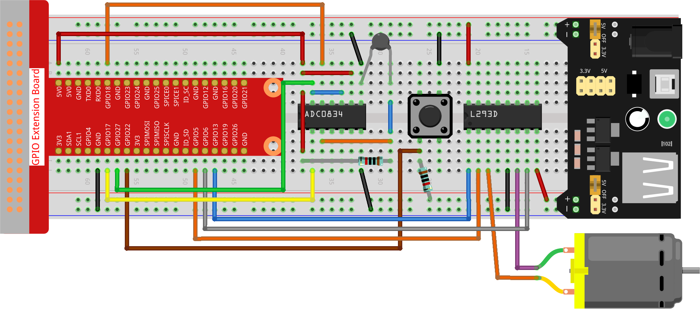

.. note::

    Hello, welcome to the SunFounder Raspberry Pi & Arduino & ESP32 Enthusiasts Community on Facebook! Dive deeper into Raspberry Pi, Arduino, and ESP32 with fellow enthusiasts.

    **Why Join?**

    - **Expert Support**: Solve post-sale issues and technical challenges with help from our community and team.
    - **Learn & Share**: Exchange tips and tutorials to enhance your skills.
    - **Exclusive Previews**: Get early access to new product announcements and sneak peeks.
    - **Special Discounts**: Enjoy exclusive discounts on our newest products.
    - **Festive Promotions and Giveaways**: Take part in giveaways and holiday promotions.

    👉 Ready to explore and create with us? Click [|link_sf_facebook|] and join today!

.. _py_pi5_fan:

3.1.4 Smart Fan
=========================

Introduction
-----------------

In this project, we will use motors, buttons and thermistors to make a
manual + automatic smart fan whose wind speed is adjustable.

Required Components
------------------------------

In this project, we need the following components.

.. image:: ../python_pi5/img/4.1.10_smart_fan_list.png
    :width: 800
    :align: center

.. It's definitely convenient to buy a whole kit, here's the link: 

.. .. list-table::
..     :widths: 20 20 20
..     :header-rows: 1

..     *   - Name	
..         - ITEMS IN THIS KIT
..         - LINK
..     *   - Raphael Kit
..         - 337
..         - |link_Raphael_kit|

.. You can also buy them separately from the links below.

.. .. list-table::
..     :widths: 30 20
..     :header-rows: 1

..     *   - COMPONENT INTRODUCTION
..         - PURCHASE LINK

..     *   - :ref:`gpio_extension_board`
..         - |link_gpio_board_buy|
..     *   - :ref:`breadboard`
..         - |link_breadboard_buy|
..     *   - :ref:`wires`
..         - |link_wires_buy|
..     *   - :ref:`resistor`
..         - |link_resistor_buy|
..     *   - :ref:`power_module`
..         - \-
..     *   - :ref:`thermistor`
..         - |link_thermistor_buy|
..     *   - :ref:`l293d`
..         - \-
..     *   - :ref:`adc0834`
..         - \-
..     *   - :ref:`button`
..         - |link_button_buy|
..     *   - :ref:`motor`
..         - |link_motor_buy|

Schematic Diagram
------------------------

============ ======== ======== ===
T-Board Name physical wiringPi BCM
GPIO17       Pin 11   0        17
GPIO18       Pin 12   1        18
GPIO27       Pin 13   2        27
GPIO22       Pin 15   3        22
GPIO5        Pin 29   21       5
GPIO6        Pin 31   22       6
GPIO13       Pin 33   23       13
============ ======== ======== ===

.. image:: ../python_pi5/img/4.1.10_smart_fan_schematic.png
   :align: center

Experimental Procedures
-----------------------------

**Step 1:** Build the circuit.

.. note::
    The power module can apply a 9V battery with the 9V Battery
    Buckle in the kit. Insert the jumper cap of the power module into the 5V
    bus strips of the breadboard.

.. image:: ../python_pi5/img/4.1.10_smart_fan_battery.jpeg
   :align: center

**Step 2**: Get into the folder of the code.

.. raw:: html

   <run></run>

.. code-block:: 

    cd ~/davinci-kit-for-raspberry-pi/python-pi5

**Step 3**: Run.

.. raw:: html

   <run></run>

.. code-block:: 

    sudo python3 3.1.4_SmartFan.py

As the code runs, start the fan by pressing the button. Every time you
press, 1 speed grade is adjusted up or down. There are **5** kinds of
speed grades: **0~4**. When set to the 4\ :sup:`th` speed grade and you
press the button, the fan stops working with a **0** wind speed.

Once the temperature goes up or down for more than 2℃, the speed
automatically gets 1-grade faster or slower.

Code
--------

.. note::
    You can **Modify/Reset/Copy/Run/Stop** the code below. But before that, you need to go to  source code path like ``raphael-kit/python-pi5``. After modifying the code, you can run it directly to see the effect.

.. raw:: html

    <run></run>

.. code-block:: python

   #!/usr/bin/env python3

   from gpiozero import Motor, Button
   from time import sleep
   import ADC0834
   import math

   # Initialize GPIO pins for the button and motor control
   BtnPin = Button(22)
   motor = Motor(forward=5, backward=6, enable=13)

   # Initialize the ADC0834 module for temperature sensing
   ADC0834.setup()

   # Initialize variables to track the motor speed level and temperatures
   level = 0
   currentTemp = 0
   markTemp = 0

   def temperature():
       """
       Reads and calculates the current temperature from the sensor.
       Returns:
           float: The current temperature in Celsius.
       """
       # Read analog value from the ADC0834 module
       analogVal = ADC0834.getResult()
       # Convert analog value to voltage and then to resistance
       Vr = 5 * float(analogVal) / 255
       Rt = 10000 * Vr / (5 - Vr)
       # Calculate temperature in Celsius
       temp = 1 / (((math.log(Rt / 10000)) / 3950) + (1 / (273.15 + 25)))
       Cel = temp - 273.15
       return Cel

   def motor_run(level):
       """
       Adjusts the motor speed based on the specified level.
       Args:
           level (int): Desired motor speed level.
       Returns:
           int: Adjusted motor speed level.
       """
       # Stop the motor if the level is 0
       if level == 0:
           motor.stop()
           return 0
       # Cap the level at 4 for maximum speed
       if level >= 4:
           level = 4
       # Set the motor speed
       motor.forward(speed=float(level / 4))
       return level

   def changeLevel():
       """
       Changes the motor speed level when the button is pressed and updates the reference temperature.
       """
       global level, currentTemp, markTemp
       print("Button pressed")
       # Cycle through levels 0-4
       level = (level + 1) % 5
       # Update the reference temperature
       markTemp = currentTemp

   # Bind the button press event to changeLevel function
   BtnPin.when_pressed = changeLevel

   def main():
       """
       Main function to continuously monitor and respond to temperature changes.
       """
       global level, currentTemp, markTemp
       # Set initial reference temperature
       markTemp = temperature()
       while True:
           # Continuously read current temperature
           currentTemp = temperature()
           # Adjust motor level based on temperature difference
           if level != 0:
               if currentTemp - markTemp <= -2:
                   level -= 1
                   markTemp = currentTemp
               elif currentTemp - markTemp >= 2:
                   if level < 4:
                       level += 1
                   markTemp = currentTemp
           # Run the motor at the adjusted level
           level = motor_run(level)

   # Run the main function and handle KeyboardInterrupt
   try:
       main()
   except KeyboardInterrupt:
       # Stop the motor when the script is interrupted
       motor.stop()

Code Explanation
---------------------

#. Imports classes for managing a motor and a button, and the sleep function for introducing pauses. Additionally, it imports the ADC0834 library for temperature sensing and the math library for mathematical calculations.

   .. code-block:: python

       #!/usr/bin/env python3

       from gpiozero import Motor, Button
       from time import sleep
       import ADC0834
       import math

#. Sets up the button on GPIO pin 22 and configures the motor with specific GPIO pins for control. Initializes the ADC0834 module for temperature measurement. Also, initializes variables to monitor the motor speed level and temperatures.

   .. code-block:: python

       # Initialize GPIO pins for the button and motor control
       BtnPin = Button(22)
       motor = Motor(forward=5, backward=6, enable=13)

       # Initialize the ADC0834 module for temperature sensing
       ADC0834.setup()

       # Initialize variables to track the motor speed level and temperatures
       level = 0
       currentTemp = 0
       markTemp = 0

#. Defines a function to read and calculate the temperature from the sensor, converting the readout to Celsius.

   .. code-block:: python

       def temperature():
           """
           Reads and calculates the current temperature from the sensor.
           Returns:
               float: The current temperature in Celsius.
           """
           # Read analog value from the ADC0834 module
           analogVal = ADC0834.getResult()
           # Convert analog value to voltage and then to resistance
           Vr = 5 * float(analogVal) / 255
           Rt = 10000 * Vr / (5 - Vr)
           # Calculate temperature in Celsius
           temp = 1 / (((math.log(Rt / 10000)) / 3950) + (1 / (273.15 + 25)))
           Cel = temp - 273.15
           return Cel

#. Introduces a function to adjust the motor speed according to the specified level.

   .. code-block:: python

       def motor_run(level):
           """
           Adjusts the motor speed based on the specified level.
           Args:
               level (int): Desired motor speed level.
           Returns:
               int: Adjusted motor speed level.
           """
           # Stop the motor if the level is 0
           if level == 0:
               motor.stop()
               return 0
           # Cap the level at 4 for maximum speed
           if level >= 4:
               level = 4
           # Set the motor speed
           motor.forward(speed=float(level / 4))
           return level

#. Implements a function to change the motor speed level manually using a button, and binds this function to the button's press event.

   .. code-block:: python

       def changeLevel():
           """
           Changes the motor speed level when the button is pressed and updates the reference temperature.
           """
           global level, currentTemp, markTemp
           print("Button pressed")
           # Cycle through levels 0-4
           level = (level + 1) % 5
           # Update the reference temperature
           markTemp = currentTemp

       # Bind the button press event to changeLevel function
       BtnPin.when_pressed = changeLevel

#. The main function, designed to continually adjust the motor speed in response to temperature fluctuations, remains to be implemented.

   .. code-block:: python

       def main():
           """
           Main function to continuously monitor and respond to temperature changes.
           """
           global level, currentTemp, markTemp
           # Set initial reference temperature
           markTemp = temperature()
           while True:
               # Continuously read current temperature
               currentTemp = temperature()
               # Adjust motor level based on temperature difference
               if level != 0:
                   if currentTemp - markTemp <= -2:
                       level -= 1
                       markTemp = currentTemp
                   elif currentTemp - markTemp >= 2:
                       if level < 4:
                           level += 1
                       markTemp = currentTemp
               # Run the motor at the adjusted level
               level = motor_run(level)

#. Runs the main function and ensures the motor stops if the script is interrupted.

   .. code-block:: python

       # Run the main function and handle KeyboardInterrupt
       try:
           main()
       except KeyboardInterrupt:
           # Stop the motor when the script is interrupted
           motor.stop()

