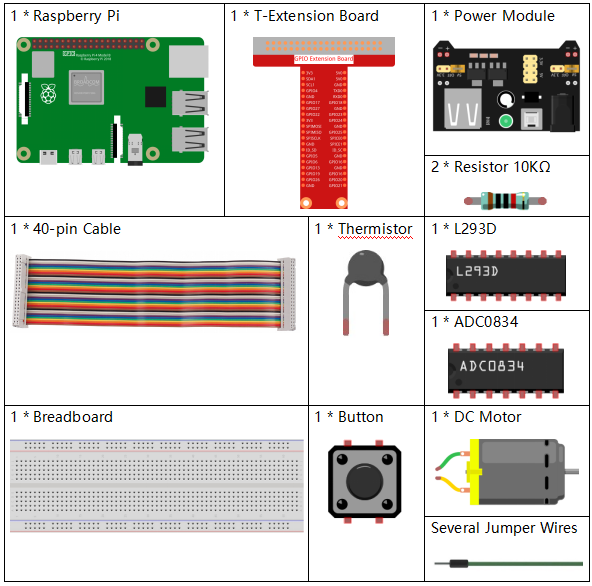

.. note::

    Hallo und willkommen in der SunFounder Raspberry Pi & Arduino & ESP32 Enthusiasten-Gemeinschaft auf Facebook! Tauchen Sie tiefer ein in die Welt von Raspberry Pi, Arduino und ESP32 mit anderen Enthusiasten.

    **Warum beitreten?**

    - **Expertenunterstützung**: Lösen Sie Nachverkaufsprobleme und technische Herausforderungen mit Hilfe unserer Gemeinschaft und unseres Teams.
    - **Lernen & Teilen**: Tauschen Sie Tipps und Anleitungen aus, um Ihre Fähigkeiten zu verbessern.
    - **Exklusive Vorschauen**: Erhalten Sie frühzeitigen Zugang zu neuen Produktankündigungen und exklusiven Einblicken.
    - **Spezialrabatte**: Genießen Sie exklusive Rabatte auf unsere neuesten Produkte.
    - **Festliche Aktionen und Gewinnspiele**: Nehmen Sie an Gewinnspielen und Feiertagsaktionen teil.

    👉 Sind Sie bereit, mit uns zu erkunden und zu erschaffen? Klicken Sie auf [|link_sf_facebook|] und treten Sie heute bei!

.. _py_pi5_fan:

3.1.4 Intelligenter Ventilator
=================================

Einführung
-----------------

In diesem Projekt werden wir Motoren, Tasten und Thermistoren verwenden, um einen manuellen + automatischen intelligenten Ventilator zu bauen, dessen Windgeschwindigkeit einstellbar ist.

Benötigte Komponenten
------------------------------

Für dieses Projekt benötigen wir folgende Komponenten.

Schaltplan
------------------------

============ ======== ======== ===
T-Board Name physisch wiringPi BCM
GPIO17       Pin 11   0        17
GPIO18       Pin 12   1        18
GPIO27       Pin 13   2        27
GPIO22       Pin 15   3        22
GPIO5        Pin 29   21       5
GPIO6        Pin 31   22       6
GPIO13       Pin 33   23       13
============ ======== ======== ===

.. image:: ../python_pi5/img/4.1.10_smart_fan_schematic.png
   :align: center

Experimentelle Verfahren
-----------------------------

**Schritt 1:** Bauen Sie den Schaltkreis.

.. note::
    Das Powermodul kann mit dem 9V-Batterieclip im Kit eine 9V-Batterie verwenden. Stecken Sie den Jumper des Powermoduls in die 5V-Steckleisten des Steckbretts.

.. image:: ../python_pi5/img/4.1.10_smart_fan_battery.jpeg
   :align: center

**Schritt 2**: Wechseln Sie in den Ordner des Codes.

.. raw:: html

   <run></run>

.. code-block:: 

    cd ~/davinci-kit-for-raspberry-pi/python-pi5

**Schritt 3**: Ausführen.

.. raw:: html

   <run></run>

.. code-block:: 

    sudo python3 3.1.4_SmartFan_zero.py

Wenn der Code ausgeführt wird, starten Sie den Ventilator, indem Sie die Taste drücken. Jedes Mal, wenn Sie drücken, wird die Geschwindigkeitsstufe um 1 erhöht oder verringert. Es gibt **5** Geschwindigkeitsstufen: **0~4**. Wenn Sie auf die 4. Stufe eingestellt sind und die Taste drücken, stoppt der Ventilator und zeigt eine Windgeschwindigkeit von **0** an.

Steigt oder fällt die Temperatur um mehr als 2℃, wird die Geschwindigkeit automatisch um 1 Stufe schneller oder langsamer eingestellt.

Code
--------

.. note::
    Sie können den untenstehenden Code **modifizieren/zurücksetzen/kopieren/ausführen/stoppen**. Bevor Sie dies tun, sollten Sie jedoch zum Quellcodepfad wie ``raphael-kit/python-pi5`` wechseln. Nachdem Sie den Code geändert haben, können Sie ihn direkt ausführen, um das Ergebnis zu sehen.

.. raw:: html

    <run></run>

.. code-block:: python

   #!/usr/bin/env python3

   from gpiozero import Motor, Button
   from time import sleep
   import ADC0834
   import math

   # Initialisierung der GPIO-Pins für die Taste und die Motorsteuerung
   BtnPin = Button(22)
   motor = Motor(forward=5, backward=6, enable=13)

   # Initialisierung des ADC0834-Moduls für die Temperaturmessung
   ADC0834.setup()

   # Initialisierung von Variablen zur Überwachung der Motordrehzahl und Temperaturen
   level = 0
   currentTemp = 0
   markTemp = 0

   def temperature():
       """
       Liest und berechnet die aktuelle Temperatur vom Sensor.
       Rückgabe:
           float: Die aktuelle Temperatur in Celsius.
       """
       # Analogwert vom ADC0834-Modul lesen
       analogVal = ADC0834.getResult()
       # Analogwert in Spannung und dann in Widerstand umwandeln
       Vr = 5 * float(analogVal) / 255
       Rt = 10000 * Vr / (5 - Vr)
       # Temperatur in Celsius berechnen
       temp = 1 / (((math.log(Rt / 10000)) / 3950) + (1 / (273.15 + 25)))
       Cel = temp - 273.15
       return Cel

   def motor_run(level):
       """
       Passt die Motorgeschwindigkeit an das angegebene Niveau an.
       Argumente:
           level (int): Gewünschtes Motorgeschwindigkeitsniveau.
       Rückgabe:
           int: Angepasstes Motorgeschwindigkeitsniveau.
       """
       # Motor stoppen, wenn das Niveau 0 ist
       if level == 0:
           motor.stop()
           return 0
       # Niveau auf 4 begrenzen für maximale Geschwindigkeit
       if level >= 4:
           level = 4
       # Motorgeschwindigkeit einstellen
       motor.forward(speed=float(level / 4))
       return level

   def changeLevel():
       """
       Ändert das Motorgeschwindigkeitsniveau, wenn die Taste gedrückt wird, und aktualisiert die Referenztemperatur.
       """
       global level, currentTemp, markTemp
       print("Taste gedrückt")
       # Durch die Niveaus 0-4 zyklisch wechseln
       level = (level + 1) % 5
       # Referenztemperatur aktualisieren
       markTemp = currentTemp

   # Die Taste mit der Funktion changeLevel verbinden
   BtnPin.when_pressed = changeLevel

   def main():
       """
       Hauptfunktion zur kontinuierlichen Überwachung und Reaktion auf Temperaturänderungen.
       """
       global level, currentTemp, markTemp
       # Anfängliche Referenztemperatur setzen
       markTemp = temperature()
       while True:
           # Aktuelle Temperatur kontinuierlich lesen
           currentTemp = temperature()
           # Motorniveau anhand der Temperaturdifferenz anpassen
           if level != 0:
               if currentTemp - markTemp <= -2:
                   level -= 1
                   markTemp = currentTemp
               elif currentTemp - markTemp >= 2:
                   if level < 4:
                       level += 1
                   markTemp = currentTemp
           # Motor auf angepasstem Niveau betreiben
           level = motor_run(level)

   # Die Hauptfunktion ausführen und auf KeyboardInterrupt reagieren
   try:
       main()
   except KeyboardInterrupt:
       # Motor stoppen, wenn das Skript unterbrochen wird
       motor.stop()

Code-Erklärung
---------------------

#. Importiert Klassen zur Steuerung eines Motors und einer Taste sowie die Sleep-Funktion für Pausen. Außerdem wird die ADC0834-Bibliothek für die Temperaturmessung und die Math-Bibliothek für mathematische Berechnungen importiert.

   .. code-block:: python

       #!/usr/bin/env python3

       from gpiozero import Motor, Button
       from time import sleep
       import ADC0834
       import math

#. Richtet die Taste an GPIO-Pin 22 ein und konfiguriert den Motor mit spezifischen GPIO-Pins zur Steuerung. Initialisiert das ADC0834-Modul zur Temperaturmessung. Außerdem werden Variablen initialisiert, um die Motordrehzahl und Temperaturen zu überwachen.

   .. code-block:: python

       # Initialisierung der GPIO-Pins für die Taste und die Motorsteuerung
       BtnPin = Button(22)
       motor = Motor(forward=5, backward=6, enable=13)

       # Initialisierung des ADC0834-Moduls für die Temperaturmessung
       ADC0834.setup()

       # Initialisierung von Variablen zur Überwachung der Motordrehzahl und Temperaturen
       level = 0
       currentTemp = 0
       markTemp = 0

#. Definiert eine Funktion zur Ablesung und Berechnung der Temperatur vom Sensor, die den Messwert in Celsius umwandelt.

   .. code-block:: python

       def temperature():
           """
           Liest und berechnet die aktuelle Temperatur vom Sensor.
           Rückgabe:
               float: Die aktuelle Temperatur in Celsius.
           """
           # Analogwert vom ADC0834-Modul lesen
           analogVal = ADC0834.getResult()
           # Analogwert in Spannung und dann in Widerstand umwandeln
           Vr = 5 * float(analogVal) / 255
           Rt = 10000 * Vr / (5 - Vr)
           # Temperatur in Celsius berechnen
           temp = 1 / (((math.log(Rt / 10000)) / 3950) + (1 / (273.15 + 25)))
           Cel = temp - 273.15
           return Cel

#. Führt eine Funktion ein, um die Motorgeschwindigkeit entsprechend dem angegebenen Niveau anzupassen.

   .. code-block:: python

       def motor_run(level):
           """
           Passt die Motorgeschwindigkeit an das angegebene Niveau an.
           Argumente:
               level (int): Gewünschtes Motorgeschwindigkeitsniveau.
           Rückgabe:
               int: Angepasstes Motorgeschwindigkeitsniveau.
           """
           # Motor stoppen, wenn das Niveau 0 ist
           if level == 0:
               motor.stop()
               return 0
           # Niveau auf 4 begrenzen für maximale Geschwindigkeit
           if level >= 4:
               level = 4
           # Motorgeschwindigkeit einstellen
           motor.forward(speed=float(level / 4))
           return level

#. Implementiert eine Funktion, um das Motorgeschwindigkeitsniveau manuell mithilfe einer Taste zu ändern und bindet diese Funktion an das Drücken der Taste.

   .. code-block:: python

       def changeLevel():
           """
           Ändert das Motorgeschwindigkeitsniveau, wenn die Taste gedrückt wird, und aktualisiert die Referenztemperatur.
           """
           global level, currentTemp, markTemp
           print("Taste gedrückt")
           # Durch die Niveaus 0-4 zyklisch wechseln
           level = (level + 1) % 5
           # Referenztemperatur aktualisieren
           markTemp = currentTemp

       # Die Taste mit der Funktion changeLevel verbinden
       BtnPin.when_pressed = changeLevel

#. Die Hauptfunktion, die entwickelt wurde, um die Motorgeschwindigkeit kontinuierlich in Reaktion auf Temperaturschwankungen anzupassen, muss noch implementiert werden.

   .. code-block:: python

       def main():
           """
           Hauptfunktion zur kontinuierlichen Überwachung und Reaktion auf Temperaturänderungen.
           """
           global level, currentTemp, markTemp
           # Anfängliche Referenztemperatur setzen
           markTemp = temperature()
           while True:
               # Aktuelle Temperatur kontinuierlich lesen
               currentTemp = temperature()
               # Motorniveau anhand der Temperaturdifferenz anpassen
               if level != 0:
                   if currentTemp - markTemp <= -2:
                       level -= 1
                       markTemp = currentTemp
                   elif currentTemp - markTemp >= 2:
                       if level < 4:
                           level += 1
                       markTemp = currentTemp
               # Motor auf angepasstem Niveau betreiben
               level = motor_run(level)

#. Führt die Hauptfunktion aus und stellt sicher, dass der Motor stoppt, wenn das Skript unterbrochen wird.

   .. code-block:: python

       # Die Hauptfunktion ausführen und auf KeyboardInterrupt reagieren
       try:
           main()
       except KeyboardInterrupt:
           # Motor stoppen, wenn das Skript unterbrochen wird
           motor.stop()

