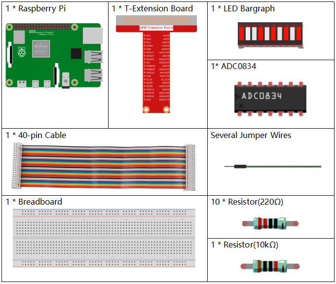
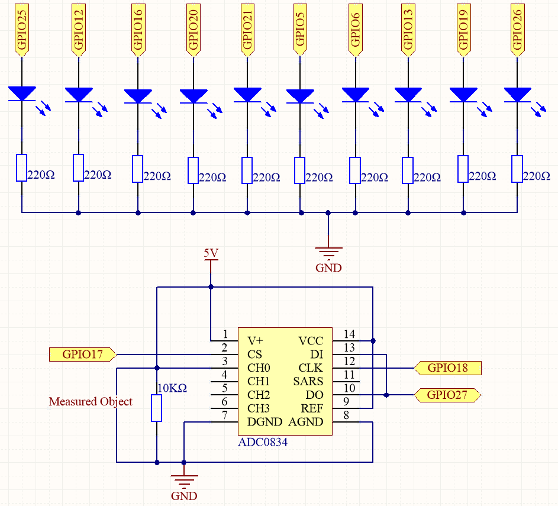
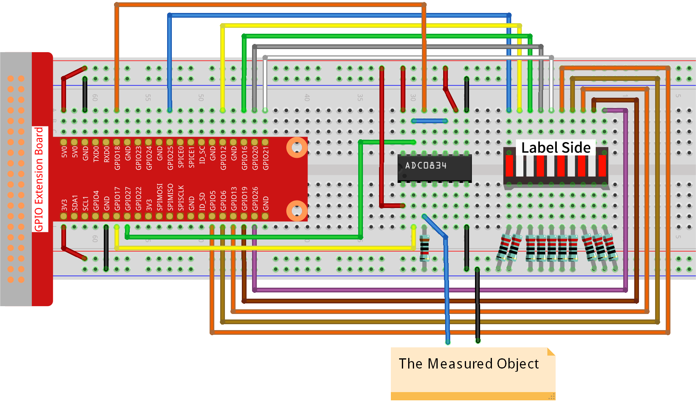

.. note::

    Ciao e benvenuto nella SunFounder Raspberry Pi & Arduino & ESP32 Enthusiasts Community su Facebook! Approfondisci l’utilizzo di Raspberry Pi, Arduino ed ESP32 con altri appassionati.

    **Perché unirsi a noi?**

    - **Supporto Esperto**: Risolvi problemi post-vendita e sfide tecniche con l’aiuto della nostra comunità e del nostro team.
    - **Impara e Condividi**: Scambia consigli e tutorial per migliorare le tue abilità.
    - **Anteprime Esclusive**: Accedi anticipatamente agli annunci di nuovi prodotti e alle anteprime.
    - **Sconti Speciali**: Godi di sconti esclusivi sui nostri ultimi prodotti.
    - **Promozioni Festive e Giveaway**: Partecipa a giveaway e promozioni durante le festività.

    👉 Pronto a esplorare e creare con noi? Clicca su [|link_sf_facebook|] e unisciti oggi!

.. _py_pi5_btr_indicator:

3.1.5 Indicatore di Batteria
===============================

Introduzione
---------------

In questo progetto, creeremo un dispositivo indicatore di batteria che 
potrà visualizzare visivamente il livello di carica della batteria su un 
Bargraph LED.

Componenti Necessari
----------------------

Per questo progetto, abbiamo bisogno dei seguenti componenti.

.. È sicuramente conveniente acquistare un kit completo; ecco il link:

.. .. list-table::
..     :widths: 20 20 20
..     :header-rows: 1

..     *   - Nome
..         - COMPONENTI IN QUESTO KIT
..         - LINK
..     *   - Raphael Kit
..         - 337
..         - |link_Raphael_kit|

.. Puoi anche acquistare i componenti singolarmente dai link qui sotto.

.. .. list-table::
..     :widths: 30 20
..     :header-rows: 1

..     *   - INTRODUZIONE AI COMPONENTI
..         - LINK PER L’ACQUISTO

..     *   - :ref:`gpio_extension_board`
..         - |link_gpio_board_buy|
..     *   - :ref:`breadboard`
..         - |link_breadboard_buy|
..     *   - :ref:`wires`
..         - |link_wires_buy|
..     *   - :ref:`resistor`
..         - |link_resistor_buy|
..     *   - :ref:`bar_graph`
..         - \-
..     *   - :ref:`adc0834`
..         - \-

Schema Elettrico
-----------------

============ ======== ======== ===
T-Board Name physical wiringPi BCM
GPIO17       Pin 11   0        17
GPIO18       Pin 12   1        18
GPIO27       Pin 13   2        27
GPIO25       Pin 22   6        25
GPIO12       Pin 32   26       12
GPIO16       Pin 36   27       16
GPIO20       Pin 38   28       20
GPIO21       Pin 40   29       21
GPIO5        Pin 29   21       5
GPIO6        Pin 31   22       6
GPIO13       Pin 33   23       13
GPIO19       Pin 35   24       19
GPIO26       Pin 37   25       26
============ ======== ======== ===

Procedure Sperimentali
------------------------

**Passo 1:** Costruisci il circuito.

**Passo 2:** Accedi alla cartella del codice.

.. raw:: html

   <run></run>

.. code-block::

    cd ~/raphael-kit/python-pi5

**Passo 3:** Esegui il file eseguibile.

.. raw:: html

   <run></run>

.. code-block::

    sudo python3 3.1.5_BatteryIndicator_zero.py

Dopo aver avviato il programma, collega separatamente un filo di uscita al 3° 
pin dell’ADC0834 e al GND, quindi connettili ai due poli di una batteria. 
Potrai vedere l’accensione del LED corrispondente sul Bargraph LED che 
visualizza il livello di carica (intervallo di misura: 0-5V).

.. warning::

    Se appare l’errore ``RuntimeError: Cannot determine SOC peripheral base address``, fai riferimento a :ref:`faq_soc`

**Codice**

.. note::
    Puoi **Modificare/Ripristinare/Copiare/Eseguire/Interrompere** il codice qui sotto. Prima di tutto, però, accedi al percorso del codice sorgente come ``raphael-kit/python-pi5``. Dopo aver modificato il codice, puoi eseguirlo direttamente per vedere l’effetto.

.. raw:: html

    <run></run>

.. code-block:: python

   #!/usr/bin/env python3
   from gpiozero import LED
   import ADC0834
   import time

   # Elenco dei pin GPIO a cui sono collegati i LED
   ledPins = [25, 12, 16, 20, 21, 5, 6, 13, 19, 26]
   # Inizializza gli oggetti LED per ciascun pin nella lista
   leds = [LED(pin) for pin in ledPins]

   # Configura il modulo ADC0834
   ADC0834.setup()

   def LedBarGraph(value):
       # Spegne tutti i LED
       for i in range(10):
           leds[i].off()
       # Accende i LED fino al valore specificato
       for i in range(value):
           leds[i].on()

   try:
       # Ciclo principale per aggiornare continuamente il Bargraph LED
       while True:
           # Legge il valore analogico dall'ADC0834
           analogVal = ADC0834.getResult()
           # Converte il valore analogico nel livello del Bargraph LED
           LedBarGraph(int(analogVal/25))
   except KeyboardInterrupt: 
       # Spegne tutti i LED quando il programma viene interrotto
       for i in range(10):
           leds[i].off()

**Spiegazione del Codice**

#. Questa sezione importa le librerie necessarie. ``gpiozero`` serve per controllare i LED, ``ADC0834`` per interfacciarsi con il modulo ADC, e ``time`` per operazioni temporali.

   .. code-block:: python

       #!/usr/bin/env python3
       from gpiozero import LED
       import ADC0834
       import time

#. Definisce i pin GPIO a cui sono collegati i LED e inizializza un array di oggetti LED per ciascun pin, permettendo di controllare facilmente ogni LED nell'array.

   .. code-block:: python

       # Elenco dei pin GPIO a cui sono collegati i LED
       ledPins = [25, 12, 16, 20, 21, 5, 6, 13, 19, 26]
       # Inizializza gli oggetti LED per ciascun pin nella lista
       leds = [LED(pin) for pin in ledPins]

#. Inizializza il modulo ADC0834 per la conversione analogico-digitale.

   .. code-block:: python

       # Configura il modulo ADC0834
       ADC0834.setup()

#. Questa funzione spegne tutti i LED e accende un numero di LED basato sul valore di input, creando effettivamente una rappresentazione grafica a barre.

   .. code-block:: python

       def LedBarGraph(value):
           # Spegne tutti i LED
           for i in range(10):
               leds[i].off()
           # Accende i LED fino al valore specificato
           for i in range(value):
               leds[i].on()

#. Legge continuamente il valore analogico dall'ADC0834 e aggiorna il Bargraph LED in base a questo valore. Il valore analogico è scalato su un intervallo di 0-10 per i 10 LED.

   .. code-block:: python

       try:
           # Ciclo principale per aggiornare continuamente il Bargraph LED
           while True:
               # Legge il valore analogico dall'ADC0834
               analogVal = ADC0834.getResult()
               # Converte il valore analogico nel livello del Bargraph LED
               LedBarGraph(int(analogVal/25))

#. Assicura che tutti i LED siano spenti quando il programma viene interrotto (ad esempio, premendo Ctrl+C).

   .. code-block:: python

       except KeyboardInterrupt: 
           # Spegne tutti i LED quando il programma viene interrotto
           for i in range(10):
               leds[i].off()