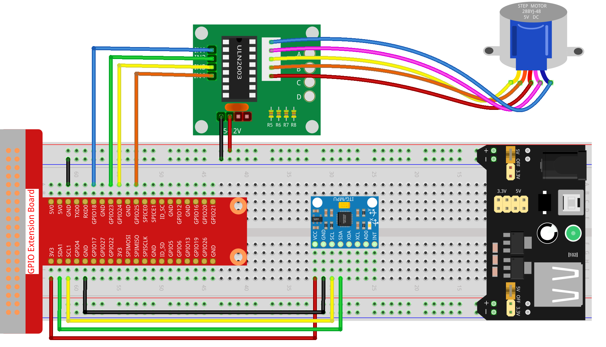

.. _3.1.6_py_pi5:

3.1.6 Bewegungssteuerung
~~~~~~~~~~~~~~~~~~~~~~~~~~~~~~~~~~~~~~~~~~~~~~

Einführung
-----------------

In dieser Lektion werden wir ein einfaches Bewegungserkennungs- und -steuerungsgerät erstellen. Der MPU6050 wird als Sensor und der Schrittmotor als gesteuertes Gerät verwendet. Mit dem MPU6050, der am Handschuh befestigt ist, können Sie den Schrittmotor durch Drehen Ihres Handgelenks steuern.

Benötigte Komponenten
------------------------------

Für dieses Projekt benötigen wir die folgenden Komponenten. 

.. image:: ../python_pi5/img/3.1.6_motion_list.png
    :width: 800
    :align: center

Schaltplan
--------------------------

============ ======== ======== ===
T-Karte Name physisch wiringPi BCM
GPIO18       Pin 12   1        18
GPIO23       Pin 16   4        23
GPIO24       Pin 18   5        24
GPIO25       Pin 22   6        25
SDA1         Pin 3             
SCL1         Pin 5             
============ ======== ======== ===

.. image:: ../python_pi5/img/3.1.6_motion_schematic.png
   :align: center

Versuchsdurchführung
-----------------------

**Schritt 1:** Bauen Sie die Schaltung auf.

**Schritt 2:** Öffnen Sie die Code-Datei.

.. raw:: html

   <run></run>

.. code-block::

    cd ~/davinci-kit-for-raspberry-pi/python-pi5

**Schritt 3:** Ausführen.

.. raw:: html

   <run></run>

.. code-block::

    sudo python3 3.1.6_MotionControl_zero.py

Während der Code ausgeführt wird, wenn der Neigungswinkel des **MPU6050** auf der
`Y <https://cn.bing.com/dict/search?q=Y&FORM=BDVSP6&mkt=zh-cn>`__\ **-**\ `Achse <https://cn.bing.com/dict/search?q=axis&FORM=BDVSP6&mkt=zh-cn>`__
größer als **45** ℃ ist, rotiert der Schrittmotor gegen den Uhrzeigersinn; wenn er weniger als **-45** ℃ beträgt, rotiert der Schrittmotor im Uhrzeigersinn.

**Code**

.. note::

    Sie können den unten stehenden Code **Ändern/Zurücksetzen/Kopieren/Ausführen/Stoppen**. Bevor Sie das tun, müssen Sie zum Quellcodepfad wie ``davinci-kit-for-raspberry-pi/python-pi5`` gehen. Nachdem Sie den Code geändert haben, können Sie ihn direkt ausführen, um die Wirkung zu sehen.

.. raw:: html

    <run></run>

.. code-block:: python

   #!/usr/bin/env python3
   from gpiozero import OutputDevice
   import smbus
   import math
   import time

   # Initialisierung der Leistungsverwaltungsregister für MPU6050
   power_mgmt_1 = 0x6b
   power_mgmt_2 = 0x6c

   # Einrichten der I2C-Kommunikation mit MPU6050
   bus = smbus.SMBus(1)  # SMBus initialisieren
   address = 0x68        # I2C-Adresse des MPU6050
   bus.write_byte_data(address, power_mgmt_1, 0)  # MPU6050 aufwecken

   # Initialisieren der Motorpins zu den GPIO-Pins 18, 23, 24, 25
   motorPin = [OutputDevice(pin) for pin in (18, 23, 24, 25)]

   # Setzen der Motor-Drehgeschwindigkeitsparameter
   rolePerMinute = 15
   stepsPerRevolution = 2048
   # Berechnen der Verzögerung zwischen Schritten für die gewünschte U/min
   stepSpeed = (60 / rolePerMinute) / stepsPerRevolution

   # Einzelnes Byte von der angegebenen I2C-Adresse lesen
   def read_byte(adr):
       return bus.read_byte_data(address, adr)

   # Wort (2 Bytes) von der angegebenen I2C-Adresse lesen
   def read_word(adr):
       high = bus.read_byte_data(address, adr)
       low = bus.read_byte_data(address, adr + 1)
       val = (high << 8) + low
       return val

   # Wort in 2's-Komplement-Form lesen
   def read_word_2c(adr):
       val = read_word(adr)
       if val >= 0x8000:
           return -((65535 - val) + 1)
       else:
           return val

   # Euklidischer Abstand zwischen zwei Punkten berechnen
   def dist(a, b):
       return math.sqrt((a * a) + (b * b))

   # Y-Achsenrotation berechnen
   def get_y_rotation(x, y, z):
       radians = math.atan2(x, dist(y, z))
       return -math.degrees(radians)

   # X-Achsenrotation berechnen
   def get_x_rotation(x, y, z):
       radians = math.atan2(y, dist(x, z))
       return math.degrees(radians)

   # Neigungswinkel von MPU6050 abrufen
   def mpu6050():
       accel_xout = read_word_2c(0x3b)
       accel_yout = read_word_2c(0x3d)
       accel_zout = read_word_2c(0x3f)
       accel_xout_scaled = accel_xout / 16384.0
       accel_yout_scaled = accel_yout / 16384.0
       accel_zout_scaled = accel_zout / 16384.0
       angle = get_y_rotation(accel_xout_scaled, accel_yout_scaled, accel_zout_scaled)
       return angle

   # Steuerung der Schrittmotor-Drehung
   def rotary(direction):
       if direction == 'c':
           # Sequenz für die Drehung im Uhrzeigersinn
           for j in range(4):
               for i in range(4):
                   if 0x99 >> j & (0x08 >> i):
                       motorPin[i].on()
                   else:
                       motorPin[i].off()
                   time.sleep(stepSpeed)
       elif direction == 'a':
           # Sequenz für die Drehung gegen den Uhrzeigersinn
           for j in range(4):
               for i in range(4):
                   if 0x99 << j & (0x08 >> i):
                       motorPin[i].on()
                   else:
                       motorPin[i].off()
                   time.sleep(stepSpeed)

   # Hauptschleife zum kontinuierlichen Lesen des Neigungswinkels und Steuern des Motors
   try:
       while True:
           angle = mpu6050()
           if angle >= 45:
               rotary('a')  # Gegen den Uhrzeigersinn für positiven Neigungswinkel drehen
           elif angle <= -45:
               rotary('c')  # Im Uhrzeigersinn für negativen Neigungswinkel drehen
   except KeyboardInterrupt:
       # Alle Motorpins bei Tastaturunterbrechung ausschalten
       for pin in motorPin:
           pin.off()

**Code-Erklärung**

#. Das Skript beginnt mit dem Importieren erforderlicher Bibliotheken. ``gpiozero`` wird für die Steuerung der GPIO-Pins verwendet, ``smbus`` für die I2C-Kommunikation, ``math`` für mathematische Operationen und ``time`` für Verzögerungen.

   .. code-block:: python

       #!/usr/bin/env python3
       from gpiozero import OutputDevice
       import smbus
       import math
       import time

#. Richten Sie die I2C-Kommunikation mit dem MPU6050-Sensor ein. ``power_mgmt_1`` und ``power_mgmt_2`` sind Register zur Verwaltung der Stromversorgung des Sensors. Der Sensor wird durch Schreiben in ``power_mgmt_1`` "aufgeweckt".

   .. code-block:: python

       # Initialisieren der Leistungsverwaltungsregister für MPU6050
       power_mgmt_1 = 0x6b
       power_mgmt_2 = 0x6c

       # Richten Sie die I2C-Kommunikation mit MPU6050 ein
       bus = smbus.SMBus(1)  # Initialisieren Sie SMBus
       address = 0x68        # I2C-Adresse von MPU6050
       bus.write_byte_data(address, power_mgmt_1, 0)  # Wecken Sie MPU6050 auf

#. Initialisiert die GPIO-Pins (18, 23, 24, 25) auf dem Raspberry Pi zur Steuerung des Schrittmotors. Jeder Pin ist mit einer Spule im Motor verbunden.

   .. code-block:: python

       # Initialisieren Sie Motorpins für GPIO-Pins 18, 23, 24, 25
       motorPin = [OutputDevice(pin) for pin in (18, 23, 24, 25)]

#. Legt die Umdrehungen pro Minute (RPM) des Motors und die Anzahl der Schritte pro Umdrehung fest. ``stepSpeed`` berechnet die Verzögerung zwischen Schritten, um die gewünschte RPM zu erreichen und einen reibungslosen Motorbetrieb sicherzustellen.

   .. code-block:: python

       # Setzen Sie Parameter für die Motordrehzahl
       rolePerMinute = 15
       stepsPerRevolution = 2048
       # Berechnen Sie die Verzögerung zwischen den Schritten für die gewünschte RPM
       stepSpeed = (60 / rolePerMinute) / stepsPerRevolution

#. Diese Funktionen werden für die I2C-Kommunikation verwendet. ``read_byte`` liest ein einzelnes Byte von einer bestimmten Adresse, während ``read_word`` zwei Bytes (ein Wort) von der Adresse liest und sie mit bitweisen Operationen (``<<`` und ``+``) zu einem einzelnen Wert kombiniert.

   .. code-block:: python

       # Lesen Sie ein einzelnes Byte von der angegebenen I2C-Adresse
       def read_byte(adr):
           return bus.read_byte_data(address, adr)

       # Lesen Sie ein Wort (2 Bytes) von der angegebenen I2C-Adresse
       def read_word(adr):
           high = bus.read_byte_data(address, adr)
           low = bus.read_byte_data(address, adr + 1)
           val = (high << 8) + low
           return val

#. Diese Funktion konvertiert das gelesene Wort in eine 2's-Komplement-Form, die nützlich ist, um Vorzeichenwerte aus Sensordaten zu interpretieren. Diese Umwandlung ist notwendig, um negative Sensormessungen zu verarbeiten.

   .. code-block:: python

       # Lesen eines Wortes in 2's-Komplement-Form
       def read_word_2c(adr):
           val = read_word(adr)
           if val >= 0x8000:
               return -((65535 - val) + 1)
           else:
               return val

#. ``dist`` berechnet die euklidische Entfernung zwischen zwei Punkten, die in den Rotationsberechnungen verwendet wird. ``get_y_rotation`` und ``get_x_rotation`` berechnen die Rotationswinkel entlang der Y- bzw. X-Achse, indem sie die ``atan2``-Funktion aus der ``math``-Bibliothek verwenden und das Ergebnis in Grad umrechnen.

   .. code-block:: python

       # Berechnen der euklidischen Entfernung zwischen zwei Punkten
       def dist(a, b):
           return math.sqrt((a * a) + (b * b))

       # Berechnen der Y-Achsenrotation
       def get_y_rotation(x, y, z):
           radians = math.atan2(x, dist(y, z))
           return -math.degrees(radians)

       # Berechnen der X-Achsenrotation
       def get_x_rotation(x, y, z):
           radians = math.atan2(y, dist(x, z))
           return math.degrees(radians)

#. Diese Funktion liest die Beschleunigungsdaten vom MPU6050-Sensor, skaliert die Messungen und berechnet den Neigungswinkel mithilfe der Funktion ``get_y_rotation``. Die Funktion ``read_word_2c`` liest Sensordaten in 2's-Komplement-Form, um negative Werte zu verarbeiten.

   .. code-block:: python

       # Holen Sie sich den Neigungswinkel von MPU6050
       def mpu6050():
           accel_xout = read_word_2c(0x3b)
           accel_yout = read_word_2c(0x3d)
           accel_zout = read_word_2c(0x3f)
           accel_xout_scaled = accel_xout / 16384.0
           accel_yout_scaled = accel_yout / 16384.0
           accel_zout_scaled = accel_zout / 16384.0
           angle = get_y_rotation(accel_xout_scaled, accel_yout_scaled, accel_zout_scaled)
           return angle

#. Die Funktion ``rotary`` steuert die Rotation des Schrittmotors. Sie führt eine Schrittsequenz für die Uhrzeiger- oder gegen den Uhrzeigersinn-Drehung basierend auf dem ``direction``-Parameter aus. Die Sequenz beinhaltet das Ein- oder Ausschalten bestimmter Motorpins in einem Muster.

   .. code-block:: python

       # Steuern Sie die Rotation des Schrittmotors
       def rotary(direction):
           if direction == 'c':
               # Sequenz für die Uhrzeigersinn-Drehung
               for j in range(4):
                   for i in range(4):
                       if 0x99 >> j & (0x08 >> i):
                           motorPin[i].on()
                       else:
                           motorPin[i].off()
                       time.sleep(stepSpeed)
           elif direction == 'a':
               # Sequenz für die gegen den Uhrzeigersinn-Drehung
               for j in range(4):
                   for i in range(4):
                       if 0x99 << j & (0x08 >> i):
                           motorPin[i].on()
                       else:
                           motorPin[i].off()
                       time.sleep(stepSpeed)

#. Die Hauptschleife liest kontinuierlich den Neigungswinkel aus dem MPU6050-Sensor und steuert die Rotationsrichtung des Motors basierend auf dem Winkel. Wenn das Programm unterbrochen wird (z. B. durch eine Tastaturunterbrechung), schaltet es alle Motorpins aus, um die Sicherheit zu gewährleisten.

   .. code-block:: python

       # Hauptschleife zum kontinuierlichen Lesen des Neigungswinkels und zur Steuerung des Motors
       try:
           while True:
               angle = mpu6050()
               if angle >= 45:
                   rotary('a')  # Gegen den Uhrzeigersinn für positiven Neigungswinkel drehen
               elif angle <= -45:
                   rotary('c')  # Im Uhrzeigersinn für negativen Neigungswinkel drehen
       except KeyboardInterrupt:
           # Schalten Sie bei Tastaturunterbrechung alle Motorpins aus
           for pin in motorPin:
               pin.off()
