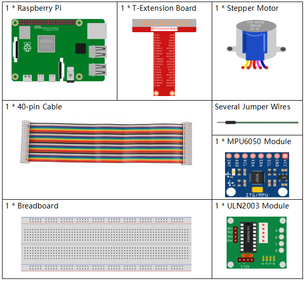

.. _3.1.6_py_pi5:

3.1.6 Motion Control
~~~~~~~~~~~~~~~~~~~~

Introduction
-----------------

In this lesson, we will make a simple motion sensing and controlling
device. The MPU6050 is used as a sensor and the stepper motor as a
controlled device. With the MPU6050 mounted on the glove, you can
control the stepper motor by rotating your wrist.

Required Components
------------------------------

In this project, we need the following components. 

Schematic Diagram
--------------------------

============ ======== ======== ===
T-Board Name physical wiringPi BCM
GPIO18       Pin 12   1        18
GPIO23       Pin 16   4        23
GPIO24       Pin 18   5        24
GPIO25       Pin 22   6        25
SDA1         Pin 3             
SCL1         Pin 5             
============ ======== ======== ===

.. image:: ../python_pi5/img/3.1.6_motion_schematic.png
   :align: center

Experimental Procedures
-----------------------

**Step 1:** Build the circuit.

.. image:: ../python_pi5/img/3.1.6_motion_control_circuit.png

**Step 2:** Open the code file.

.. raw:: html

   <run></run>

.. code-block::

    cd ~/davinci-kit-for-raspberry-pi/python-pi5

**Step 3:** Run.

.. raw:: html

   <run></run>

.. code-block::

    sudo python3 3.1.6_MotionControl_zero.py

As the code runs, if the tilt angle of **mpu6050** on the
`Y <https://cn.bing.com/dict/search?q=Y&FORM=BDVSP6&mkt=zh-cn>`__\ **-**\ `axis <https://cn.bing.com/dict/search?q=axis&FORM=BDVSP6&mkt=zh-cn>`__
is larger than **45** ℃, the stepper motor rotates anticlockwise; if less than **-45** ℃, the stepper motor rotates clockwise.

**Code**

.. note::

    You can **Modify/Reset/Copy/Run/Stop** the code below. But before that, you need to go to  source code path like ``davinci-kit-for-raspberry-pi/python-pi5``. After modifying the code, you can run it directly to see the effect.

.. raw:: html

    <run></run>

.. code-block:: python

   #!/usr/bin/env python3
   from gpiozero import OutputDevice
   import smbus
   import math
   import time

   # Initialize power management registers for MPU6050
   power_mgmt_1 = 0x6b
   power_mgmt_2 = 0x6c

   # Set up I2C communication with MPU6050
   bus = smbus.SMBus(1)  # Initialize SMBus
   address = 0x68        # MPU6050 I2C address
   bus.write_byte_data(address, power_mgmt_1, 0)  # Wake up MPU6050

   # Initialize motor pins to GPIO pins 18, 23, 24, 25
   motorPin = [OutputDevice(pin) for pin in (18, 23, 24, 25)]

   # Set motor rotation speed parameters
   rolePerMinute = 15
   stepsPerRevolution = 2048
   # Calculate delay between steps for desired RPM
   stepSpeed = (60 / rolePerMinute) / stepsPerRevolution

   # Read a single byte from the specified I2C address
   def read_byte(adr):
       return bus.read_byte_data(address, adr)

   # Read a word (2 bytes) from the specified I2C address
   def read_word(adr):
       high = bus.read_byte_data(address, adr)
       low = bus.read_byte_data(address, adr + 1)
       val = (high << 8) + low
       return val

   # Read a word in 2's complement form
   def read_word_2c(adr):
       val = read_word(adr)
       if val >= 0x8000:
           return -((65535 - val) + 1)
       else:
           return val

   # Calculate Euclidean distance between two points
   def dist(a, b):
       return math.sqrt((a * a) + (b * b))

   # Calculate Y-axis rotation
   def get_y_rotation(x, y, z):
       radians = math.atan2(x, dist(y, z))
       return -math.degrees(radians)

   # Calculate X-axis rotation
   def get_x_rotation(x, y, z):
       radians = math.atan2(y, dist(x, z))
       return math.degrees(radians)

   # Get tilt angle from MPU6050
   def mpu6050():
       accel_xout = read_word_2c(0x3b)
       accel_yout = read_word_2c(0x3d)
       accel_zout = read_word_2c(0x3f)
       accel_xout_scaled = accel_xout / 16384.0
       accel_yout_scaled = accel_yout / 16384.0
       accel_zout_scaled = accel_zout / 16384.0
       angle = get_y_rotation(accel_xout_scaled, accel_yout_scaled, accel_zout_scaled)
       return angle

   # Control stepper motor rotation
   def rotary(direction):
       if direction == 'c':
           # Clockwise rotation sequence
           for j in range(4):
               for i in range(4):
                   if 0x99 >> j & (0x08 >> i):
                       motorPin[i].on()
                   else:
                       motorPin[i].off()
                   time.sleep(stepSpeed)
       elif direction == 'a':
           # Anti-clockwise rotation sequence
           for j in range(4):
               for i in range(4):
                   if 0x99 << j & (0x08 >> i):
                       motorPin[i].on()
                   else:
                       motorPin[i].off()
                   time.sleep(stepSpeed)

   # Main loop for continuously reading tilt angle and controlling motor
   try:
       while True:
           angle = mpu6050()
           if angle >= 45:
               rotary('a')  # Rotate anti-clockwise for positive tilt
           elif angle <= -45:
               rotary('c')  # Rotate clockwise for negative tilt
   except KeyboardInterrupt:
       # Turn off all motor pins on keyboard interrupt
       for pin in motorPin:
           pin.off()

**Code Explanation**

#. The script begins by importing necessary libraries. ``gpiozero`` for controlling the GPIO pins, ``smbus`` for I2C communication, ``math`` for mathematical operations, and ``time`` for delays.

   .. code-block:: python

       #!/usr/bin/env python3
       from gpiozero import OutputDevice
       import smbus
       import math
       import time

#. Sets up I2C communication with the MPU6050 sensor. ``power_mgmt_1`` and ``power_mgmt_2`` are registers for managing the sensor's power. The sensor is "woken up" by writing to ``power_mgmt_1``.

   .. code-block:: python

       # Initialize power management registers for MPU6050
       power_mgmt_1 = 0x6b
       power_mgmt_2 = 0x6c

       # Set up I2C communication with MPU6050
       bus = smbus.SMBus(1)  # Initialize SMBus
       address = 0x68        # MPU6050 I2C address
       bus.write_byte_data(address, power_mgmt_1, 0)  # Wake up MPU6050

#. Initializes the GPIO pins (18, 23, 24, 25) on the Raspberry Pi to control the stepper motor. Each pin is associated with a coil in the motor.

   .. code-block:: python

       # Initialize motor pins to GPIO pins 18, 23, 24, 25
       motorPin = [OutputDevice(pin) for pin in (18, 23, 24, 25)]

#. Sets the motor's rotations per minute (RPM) and the number of steps per revolution. ``stepSpeed`` calculates the delay between steps to achieve the desired RPM, ensuring smooth motor operation.

   .. code-block:: python

       # Set motor rotation speed parameters
       rolePerMinute = 15
       stepsPerRevolution = 2048
       # Calculate delay between steps for desired RPM
       stepSpeed = (60 / rolePerMinute) / stepsPerRevolution

#. These functions are used for I2C communication. ``read_byte`` reads a single byte from a given address, while ``read_word`` reads two bytes (a word), combining them into a single value using bitwise operations (``<<`` and ``+``).

   .. code-block:: python

       # Read a single byte from the specified I2C address
       def read_byte(adr):
           return bus.read_byte_data(address, adr)

       # Read a word (2 bytes) from the specified I2C address
       def read_word(adr):
           high = bus.read_byte_data(address, adr)
           low = bus.read_byte_data(address, adr + 1)
           val = (high << 8) + low
           return val

#. This function converts the read word into a 2's complement form, which is useful for interpreting signed values from sensor data. This conversion is necessary for handling negative sensor readings.

   .. code-block:: python

       # Read a word in 2's complement form
       def read_word_2c(adr):
           val = read_word(adr)
           if val >= 0x8000:
               return -((65535 - val) + 1)
           else:
               return val

#. ``dist`` calculates the Euclidean distance between two points, used in the rotation calculations. ``get_y_rotation`` and ``get_x_rotation`` calculate the rotational angles along the Y and X axes, respectively, using the ``atan2`` function from the ``math`` library and converting the result to degrees.

   .. code-block:: python

       # Calculate Euclidean distance between two points
       def dist(a, b):
           return math.sqrt((a * a) + (b * b))

       # Calculate Y-axis rotation
       def get_y_rotation(x, y, z):
           radians = math.atan2(x, dist(y, z))
           return -math.degrees(radians)

       # Calculate X-axis rotation
       def get_x_rotation(x, y, z):
           radians = math.atan2(y, dist(x, z))
           return math.degrees(radians)

#. This function reads the accelerometer data from the MPU6050 sensor, scales the readings, and calculates the tilt angle using the ``get_y_rotation`` function. The function ``read_word_2c`` reads sensor data in 2's complement form to handle negative values.

   .. code-block:: python

       # Get tilt angle from MPU6050
       def mpu6050():
           accel_xout = read_word_2c(0x3b)
           accel_yout = read_word_2c(0x3d)
           accel_zout = read_word_2c(0x3f)
           accel_xout_scaled = accel_xout / 16384.0
           accel_yout_scaled = accel_yout / 16384.0
           accel_zout_scaled = accel_zout / 16384.0
           angle = get_y_rotation(accel_xout_scaled, accel_yout_scaled, accel_zout_scaled)
           return angle

#. The ``rotary`` function controls the stepper motor rotation. It executes a stepping sequence for either clockwise or anti-clockwise rotation, based on the ``direction`` parameter. The sequence involves turning specific motor pins on or off in a pattern.

   .. code-block:: python

       # Control stepper motor rotation
       def rotary(direction):
           if direction == 'c':
               # Clockwise rotation sequence
               for j in range(4):
                   for i in range(4):
                       if 0x99 >> j & (0x08 >> i):
                           motorPin[i].on()
                       else:
                           motorPin[i].off()
                       time.sleep(stepSpeed)
           elif direction == 'a':
               # Anti-clockwise rotation sequence
               for j in range(4):
                   for i in range(4):
                       if 0x99 << j & (0x08 >> i):
                           motorPin[i].on()
                       else:
                           motorPin[i].off()
                       time.sleep(stepSpeed)

#. The main loop continuously reads the tilt angle from the MPU6050 sensor and controls the motor's rotation direction based on the angle. If the program is interrupted (e.g., through a keyboard interrupt), it turns off all motor pins for safety.

   .. code-block:: python

       # Main loop for continuously reading tilt angle and controlling motor
       try:
           while True:
               angle = mpu6050()
               if angle >= 45:
                   rotary('a')  # Rotate anti-clockwise for positive tilt
               elif angle <= -45:
                   rotary('c')  # Rotate clockwise for negative tilt
       except KeyboardInterrupt:
           # Turn off all motor pins on keyboard interrupt
           for pin in motorPin:
               pin.off()

