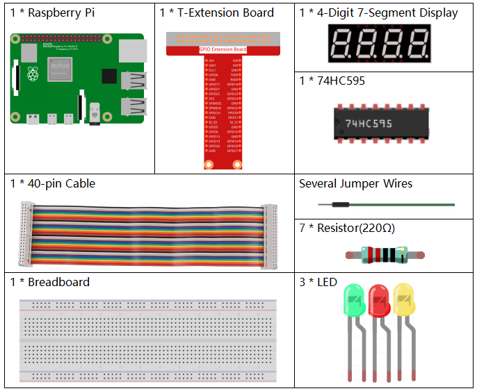
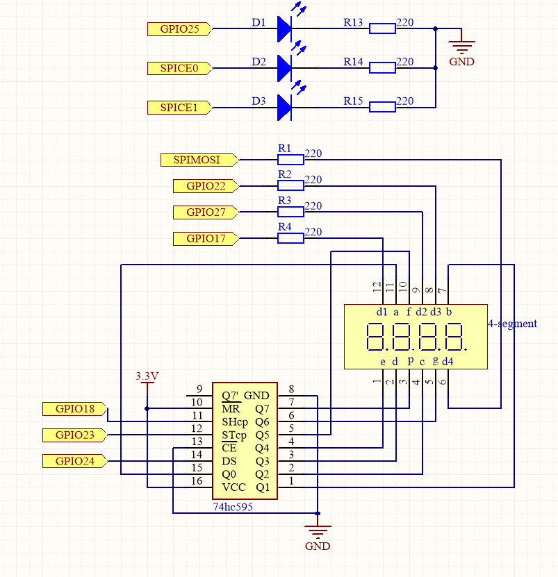
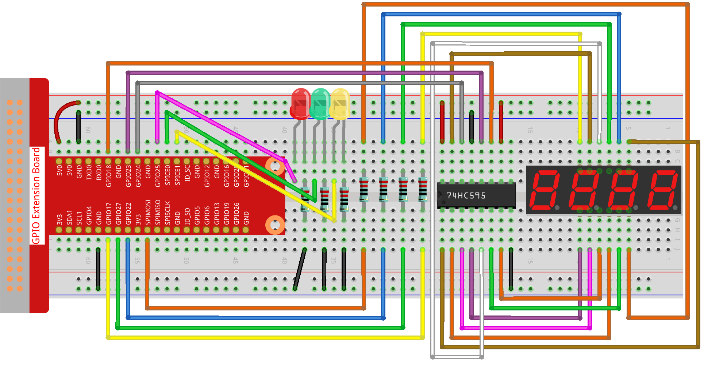

.. note::

    Hello, welcome to the SunFounder Raspberry Pi & Arduino & ESP32 Enthusiasts Community on Facebook! Dive deeper into Raspberry Pi, Arduino, and ESP32 with fellow enthusiasts.

    **Why Join?**

    - **Expert Support**: Solve post-sale issues and technical challenges with help from our community and team.
    - **Learn & Share**: Exchange tips and tutorials to enhance your skills.
    - **Exclusive Previews**: Get early access to new product announcements and sneak peeks.
    - **Special Discounts**: Enjoy exclusive discounts on our newest products.
    - **Festive Promotions and Giveaways**: Take part in giveaways and holiday promotions.

    👉 Ready to explore and create with us? Click [|link_sf_facebook|] and join today!

.. _py_pi5_traffic:

3.1.7 Traffic Light
========================

Introduction
---------------

In this project, we will use LED lights of three colors to realize the
change of traffic lights and a four-digit 7-segment display will be used
to display the timing of each traffic state.

Required Components
------------------------------

In this project, we need the following components.

.. It's definitely convenient to buy a whole kit, here's the link: 

.. .. list-table::
..     :widths: 20 20 20
..     :header-rows: 1

..     *   - Name	
..         - ITEMS IN THIS KIT
..         - LINK
..     *   - Raphael Kit
..         - 337
..         - |link_Raphael_kit|

.. You can also buy them separately from the links below.

.. .. list-table::
..     :widths: 30 20
..     :header-rows: 1

..     *   - COMPONENT INTRODUCTION
..         - PURCHASE LINK

..     *   - :ref:`gpio_extension_board`
..         - |link_gpio_board_buy|
..     *   - :ref:`breadboard`
..         - |link_breadboard_buy|
..     *   - :ref:`wires`
..         - |link_wires_buy|
..     *   - :ref:`resistor`
..         - |link_resistor_buy|
..     *   - :ref:`led`
..         - |link_led_buy|
..     *   - :ref:`4_digit`
..         - \-
..     *   - :ref:`74hc595`
..         - |link_74hc595_buy|

Schematic Diagram
--------------------

============ ======== ======== ===
T-Board Name physical wiringPi BCM
GPIO17       Pin 11   0        17
GPIO27       Pin 13   2        27
GPIO22       Pin 15   3        22
SPIMOSI      Pin 19   12       10
GPIO18       Pin 12   1        18
GPIO23       Pin 16   4        23
GPIO24       Pin 18   5        24
GPIO25       Pin 22   6        25
SPICE0       Pin 24   10       8
SPICE1       Pin 26   11       7
============ ======== ======== ===

Experimental Procedures
------------------------

**Step 1:** Build the circuit.

**Step 2:** Change directory.

.. raw:: html

   <run></run>

.. code-block::

    cd ~/raphael-kit/python-pi5

**Step 3:** Run.

.. raw:: html

   <run></run>

.. code-block::

    sudo python3 3.1.7_TrafficLight_zero.py

As the code runs, LEDs will simulate the color changing of traffic
lights. Firstly, the red LED lights up for 60s, then the green LED
lights up for 30s; next, the yellow LED lights up for 5s. After that,
the red LED lights up for 60s once again. In this way, this series of
actions will be executed repeatedly. Meanwhile, the 4-digit 7-segment
display displays the countdown time continuously.

Code
----------

.. note::
    You can **Modify/Reset/Copy/Run/Stop** the code below. But before that, you need to go to  source code path like ``raphael-kit/python-pi5``. After modifying the code, you can run it directly to see the effect.

.. raw:: html

    <run></run>

.. code-block:: python

   #!/usr/bin/env python3

   from gpiozero import OutputDevice, LED
   import threading

   # Setup GPIO pins for 74HC595 shift register
   SDI = OutputDevice(24)   # Serial Data Input
   RCLK = OutputDevice(23)  # Register Clock
   SRCLK = OutputDevice(18) # Shift Register Clock

   # Setup GPIO pins for digit selection on 7-segment display
   placePin = [OutputDevice(pin) for pin in (10, 22, 27, 17)]

   # Segment codes for numbers 0-9 on 7-segment display
   number = (0xc0, 0xf9, 0xa4, 0xb0, 0x99, 0x92, 0x82, 0xf8, 0x80, 0x90)

   # Setup GPIO pins for traffic light LEDs
   ledPinR = LED(25) # Red LED
   ledPinG = LED(8)  # Green LED
   ledPinY = LED(7)  # Yellow LED

   # Duration settings for traffic lights
   greenLight = 30
   yellowLight = 5
   redLight = 60

   # Traffic light color names
   lightColor = ("Red", "Green", "Yellow")

   # Initialize state variables
   colorState = 0
   counter = 60
   timer1 = None

   def setup():
       """ Initialize the traffic light system and start the timer. """
       global timer1
       timer1 = threading.Timer(1.0, timer)
       timer1.start()

   def clearDisplay():
       """ Clear the 7-segment display. """
       for _ in range(8):
           SDI.on()
           SRCLK.on()
           SRCLK.off()
       RCLK.on()
       RCLK.off()

   def hc595_shift(data):
       """ Shift data to the 74HC595 shift register for digit display. """
       for i in range(8):
           SDI.value = 0x80 & (data << i)
           SRCLK.on()
           SRCLK.off()
       RCLK.on()
       RCLK.off()

   def pickDigit(digit):
       """ Select a specific digit to display on the 7-segment display. """
       for pin in placePin:
           pin.off()
       placePin[digit].on()

   def timer():
       """ Handle the timing for traffic light changes. """
       global counter, colorState, timer1
       timer1 = threading.Timer(1.0, timer)
       timer1.start()
       counter -= 1
       if counter == 0:
           counter = [greenLight, yellowLight, redLight][colorState]
           colorState = (colorState + 1) % 3
       print(f"counter : {counter}    color: {lightColor[colorState]}")

   def lightup():
       """ Update the traffic light LED based on the current state. """
       global colorState
       ledPinR.off()
       ledPinG.off()
       ledPinY.off()
       [ledPinR, ledPinG, ledPinY][colorState].on()

   def display():
       """ Display the current counter value on the 7-segment display. """
       global counter

       for i in range(4):
           digit = counter // (10 ** (3 - i)) % 10
           if i == 0 and digit == 0:
               continue
           clearDisplay()
           pickDigit(3 - i)
           hc595_shift(number[digit])

   def loop():
       """ Main loop to continuously update display and lights. """
       while True:
           display()
           lightup()

   def destroy():
       """ Clean up resources when the script is terminated. """
       global timer1
       timer1.cancel()
       ledPinR.off()
       ledPinG.off()
       ledPinY.off()

   try:
       setup()
       loop()
   except KeyboardInterrupt:
       destroy()

Code Explanation
--------------------

#. Imports the ``OutputDevice`` and ``LED`` classes from the gpiozero library, enabling control of general output devices and specifically LEDs. Imports Python's threading module, which will be used for creating and handling threads for concurrent execution.

   .. code-block:: python

       #!/usr/bin/env python3
       from gpiozero import OutputDevice, LED
       import threading

#. Initializes GPIO pins connected to the shift register's Serial Data Input (SDI), Register Clock Input (RCLK), and Shift Register Clock Input (SRCLK).

   .. code-block:: python

       # Setup GPIO pins for 74HC595 shift register
       SDI = OutputDevice(24)   # Serial Data Input
       RCLK = OutputDevice(23)  # Register Clock
       SRCLK = OutputDevice(18) # Shift Register Clock

#. Initializes the pins for each digit of the 7-segment display and defines the binary codes for displaying numbers 0-9.

   .. code-block:: python

       # Setup GPIO pins for digit selection on 7-segment display
       placePin = [OutputDevice(pin) for pin in (10, 22, 27, 17)]

       # Segment codes for numbers 0-9 on 7-segment display
       number = (0xc0, 0xf9, 0xa4, 0xb0, 0x99, 0x92, 0x82, 0xf8, 0x80, 0x90)

#. Initializes GPIO pins for the Red, Green, and Yellow LEDs used in the traffic light simulation. Sets the duration (in seconds) for each color state in the traffic light system. Defines the names of the traffic light colors for reference.

   .. code-block:: python

       # Setup GPIO pins for traffic light LEDs
       ledPinR = LED(25) # Red LED
       ledPinG = LED(8)  # Green LED
       ledPinY = LED(7)  # Yellow LED

       # Duration settings for traffic lights
       greenLight = 30
       yellowLight = 5
       redLight = 60

       # Traffic light color names
       lightColor = ("Red", "Green", "Yellow")       

#. Initializes variables for tracking the current color state, a counter for timing, and a placeholder for a timer object.

   .. code-block:: python

       # Initialize state variables
       colorState = 0
       counter = 60
       timer1 = None

#. Initializes the traffic light system and starts the timer thread.

   .. code-block:: python

       def setup():
           """ Initialize the traffic light system and start the timer. """
           global timer1
           timer1 = threading.Timer(1.0, timer)
           timer1.start()

#. Functions to control the 7-segment display. ``clearDisplay`` turns off all segments, ``hc595_shift`` shifts data into the shift register, and ``pickDigit`` activates a specific digit on the display.

   .. code-block:: python

       def clearDisplay():
           """ Clear the 7-segment display. """
           for _ in range(8):
               SDI.on()
               SRCLK.on()
               SRCLK.off()
           RCLK.on()
           RCLK.off()

       def hc595_shift(data):
           """ Shift data to the 74HC595 shift register for digit display. """
           for i in range(8):
               SDI.value = 0x80 & (data << i)
               SRCLK.on()
               SRCLK.off()
           RCLK.on()
           RCLK.off()

       def pickDigit(digit):
           """ Select a specific digit to display on the 7-segment display. """
           for pin in placePin:
               pin.off()
           placePin[digit].on()

#. Manages the timing for traffic light changes and updates the counter and color state.

   .. code-block:: python

       def timer():
           """ Handle the timing for traffic light changes. """
           global counter, colorState, timer1
           timer1 = threading.Timer(1.0, timer)
           timer1.start()
           counter -= 1
           if counter == 0:
               counter = [greenLight, yellowLight, redLight][colorState]
               colorState = (colorState + 1) % 3
           print(f"counter : {counter}    color: {lightColor[colorState]}")

#. Updates the state of the traffic light LEDs based on the current color state.

   .. code-block:: python

       def lightup():
           """ Update the traffic light LED based on the current state. """
           global colorState
           ledPinR.off()
           ledPinG.off()
           ledPinY.off()
           [ledPinR, ledPinG, ledPinY][colorState].on()

#. Calculates the digit to be displayed on each segment of the 7-segment display and updates it accordingly.

   .. code-block:: python

       def display():
           """ Display the current counter value on the 7-segment display. """
           global counter

           for i in range(4):
               digit = counter // (10 ** (3 - i)) % 10
               if i == 0 and digit == 0:
                   continue
               clearDisplay()
               pickDigit(3 - i)
               hc595_shift(number[digit])

#. The main loop that continuously updates the display and the traffic light LEDs.

   .. code-block:: python

       def loop():
           """ Main loop to continuously update display and lights. """
           while True:
               display()
               lightup()

#. Cleans up resources when the script is terminated, such as turning off LEDs and stopping the timer thread.

   .. code-block:: python

       def destroy():
           """ Clean up resources when the script is terminated. """
           global timer1
           timer1.cancel()
           ledPinR.off()
           ledPinG.off()
           ledPinY.off()

